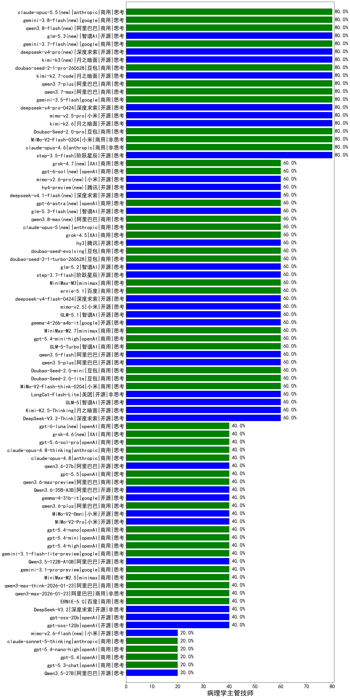

|类别|机构|大模型|【病理学主管技师】准确率|平均耗时|平均消耗token|花费/千次（元）|排名（准确率）|
|---|---|-----|-------------------|-------|-----------|-----------|-----------|
|开源|小米|mimo-v2.5-pro|80.0%|12s|955|15.6|1|
|商用|豆包|Doubao-Seed-2.0-pro|80.0%|231s|1057|15.5|2|
|开源|深度求索|deepseek-v4-pro-0424|80.0%|82s|2033|48.0|3|
|商用|google|gemini-3.5-flash|80.0%|10s|1652|100.4|4|
|商用|阿里巴巴|qwen3.7-max|80.0%|26s|1207|41.7|5|
|商用|阿里巴巴|qwen3.7-plus|80.0%|29s|1441|11.1|6|
|开源|月之暗面|kimi-k2.7-code|80.0%|43s|2006|52.8|7|
|商用|豆包|doubao-seed-2-1-pro-260628|80.0%|246s|9157|272.2|8|
|开源|月之暗面|kimi-k3(new)|80.0%|39s|846|73.2|9|
|开源|月之暗面|kimi-k2.6|80.0%|222s|3161|84.0|10|
|商用|google|gemini-3.7-flash(new)|80.0%|33s|963|23.8|11|
|开源|智谱AI|glm-5.3(new)|80.0%|50s|1715|46.5|12|
|商用|阿里巴巴|qwen3.8-flash(new)|80.0%|43s|656|1.5|13|
|开源|深度求索|deepseek-v4-pro(new)|80.0%|55s|1728|44.1|14|
|商用|google|gemini-3.8-flash(new)|80.0%|43s|847|41.5|15|
|商用|豆包|doubao-seed-2-1-pro-260915(new)|80.0%|62s|1819|52.0|16|
|商用|anthropic|claude-opus-4.6|80.0%|10s|535|79.9|17|
|商用|anthropic|claude-opus-5.5(new)|80.0%|15s|663|81.8|18|
|开源|阶跃星辰|step-3.5-flash|80.0%|18s|1379|2.8|19|
|商用|小米|MiMo-V2-Flash-0204|80.0%|365s|500|0.9|20|
|开源|智谱AI|glm-5.3-flash(new)|60.0%|31s|1098|2.9|21|
|开源|小米|mimo-v2.6-pro(new)|60.0%|143s|1134|6.6|22|
|开源|深度求索|deepseek-v4-flash-0424|60.0%|29s|1008|2.0|23|
|商用|百度|ernie-5.1|60.0%|35s|1207|20.8|24|
|商用|XAI|grok-4.7(new)|60.0%|67s|5337|187.6|25|
|商用|minimax|MiniMax-M3|60.0%|21s|582|6.8|26|
|商用|openAI|gpt-6-sol(new)|60.0%|200s|386|22.3|27|
|开源|阶跃星辰|step-3.7-flash|60.0%|25s|1549|12.1|28|
|商用|豆包|doubao-seed-2-1-turbo-260628|60.0%|393s|9374|139.3|29|
|开源|智谱AI|glm-5.2|60.0%|44s|1641|44.4|30|
|开源|腾讯|hy4-preview(new)|60.0%|91s|5882|104.9|31|
|商用|豆包|doubao-seed-evolving|60.0%|572s|12022|358.1|32|
|开源|腾讯|hy3|60.0%|56s|231|0.7|33|
|商用|XAI|grok-4.5|60.0%|139s|3085|122.1|34|
|商用|anthropic|claude-opus-5(new)|60.0%|15s|709|110.5|35|
|商用|阿里巴巴|qwen3.8-max(new)|60.0%|39s|1696|58.4|36|
|开源|深度求索|deepseek-v4.1-flash(new)|60.0%|7s|1322|10.0|37|
|商用|openAI|gpt-6-astra(new)|60.0%|11s|289|77.3|38|
|开源|小米|mimo-v2.5|60.0%|12s|1188|13.1|39|
|商用|豆包|doubao-seed-2-1-lite-260915(new)|60.0%|98s|1401|3.6|40|
|商用|minimax|MiniMax-M2.7|60.0%|49s|1888|15.2|41|
|开源|月之暗面|Kimi-K2.5-Thinking|60.0%|567s|2739|56.4|42|
|开源|阿里巴巴|qwen3.5-plus|60.0%|29s|2184|10.2|43|
|商用|豆包|Doubao-Seed-2.0-mini|60.0%|348s|1672|3.1|44|
|商用|智谱AI|GLM-5-Turbo|60.0%|25s|1445|30.6|45|
|商用|豆包|Doubao-Seed-2.0-lite|60.0%|154s|805|2.6|46|
|商用|openAI|gpt-5.4-mini-high|60.0%|139s|1672|50.4|47|
|商用|小米|MiMo-V2-Flash-think-0204|60.0%|1148s|2475|5.1|48|
|开源|美团|LongCat-Flash-Lite|60.0%|362s|377|0.0|49|
|开源|智谱AI|GLM-5|60.0%|62s|2023|35.5|50|
|开源|阿里巴巴|qwen3.5-flash|60.0%|332s|2979|5.8|51|
|开源|深度求索|DeepSeek-V3.2-Think|60.0%|149s|1470|4.3|52|
|开源|google|gemma-4-26b-a4b-it|60.0%|83s|490|1.2|53|
|开源|智谱AI|GLM-5.1|60.0%|174s|1533|35.6|54|
|商用|阿里巴巴|qwen3-max-think-2026-01-23|40.0%|290s|3956|39.0|55|
|开源|阿里巴巴|Qwen3.5-122B-A10B|40.0%|351s|2841|17.8|56|
|商用|minimax|MiniMax-M2.5|40.0%|26s|1056|8.3|57|
|商用|openAI|gpt-6-luna(new)|40.0%|170s|364|1.0|58|
|商用|阿里巴巴|qwen3-max-2026-01-23|40.0%|12s|463|4.0|59|
|商用|百度|ERNIE-5.0|40.0%|327s|4407|104.7|60|
|开源|深度求索|DeepSeek-V3.2|40.0%|14s|277|0.8|61|
|商用|XAI|grok-4.6(new)|40.0%|25s|1087|38.1|62|
|商用|google|gemini-3.1-pro-preview|40.0%|39s|2459|204.6|63|
|商用|阿里巴巴|qwen3.6-max-preview|40.0%|56s|1578|82.0|64|
|商用|google|gemini-3.1-flash-lite-preview|40.0%|2s|307|2.6|65|
|商用|openAI|gpt-5.6-sol-pro|40.0%|15s|3348|260.0|66|
|商用|anthropic|claude-opus-4.8|40.0%|12s|470|68.7|67|
|开源|openAI|gpt-oss-20b|40.0%|8s|1166|1.2|68|
|开源|google|gemma-4-31b-it|40.0%|75s|397|1.0|69|
|商用|openAI|gpt-5.5|40.0%|11s|613|113.8|70|
|开源|阿里巴巴|qwen3.6-27b|40.0%|33s|1540|26.6|71|
|商用|阿里巴巴|qwen3.6-plus|40.0%|22s|1553|17.9|72|
|开源|小米|MiMo-V2-Omni|40.0%|11s|1507|17.5|73|
|开源|小米|MiMo-V2-Pro|40.0%|139s|917|14.8|74|
|开源|openAI|gpt-oss-120b|40.0%|193s|612|1.6|75|
|商用|openAI|gpt-5.4-nano|40.0%|16s|198|1.1|76|
|商用|anthropic|claude-opus-4.8-thinking|40.0%|12s|842|133.8|77|
|商用|openAI|gpt-5.4-mini|40.0%|2s|166|3.0|78|
|商用|openAI|gpt-5.4-high|40.0%|28s|1555|155.8|79|
|开源|阿里巴巴|Qwen3.6-35B-A3B|40.0%|113s|1792|18.7|80|
|开源|阿里巴巴|Qwen3.5-27B|20.0%|239s|3057|14.4|81|
|开源|小米|mimo-v2.6-flash(new)|20.0%|30s|712|1.3|82|
|商用|openAI|gpt-5.4|20.0%|5s|207|14.2|83|
|商用|anthropic|claude-sonnet-5-thinking|20.0%|14s|859|54.7|84|
|商用|openAI|gpt-5.3-chat|20.0%|5s|355|27.5|85|
|商用|openAI|gpt-5.4-nano-high|20.0%|11s|751|5.9|86|

