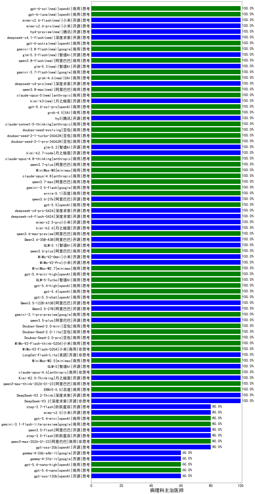

|类别|机构|大模型|【病理科主治医师】准确率|平均耗时|平均消耗token|花费/千次（元）|排名（准确率）|
|---|---|-----|-------------------|-------|-----------|-----------|-----------|
|商用|openAI|gpt-5.4-mini-high|100.0%|164s|435|10.9|1|
|开源|深度求索|deepseek-v4-pro-0424|100.0%|20s|676|15.3|2|
|商用|anthropic|claude-opus-4.8-thinking(new)|100.0%|16s|748|113.4|3|
|商用|阿里巴巴|qwen3.7-plus(new)|100.0%|19s|1017|7.7|4|
|商用|minimax|MiniMax-M3(new)|100.0%|19s|579|6.7|5|
|商用|anthropic|claude-opus-4.8(new)|100.0%|9s|628|92.4|6|
|商用|阿里巴巴|qwen3.7-max|100.0%|18s|838|28.3|7|
|商用|google|gemini-3.5-flash|100.0%|7s|1017|59.8|8|
|商用|百度|ernie-5.1|100.0%|24s|776|13.0|9|
|开源|阿里巴巴|qwen3.6-27b|100.0%|34s|1565|27.0|10|
|商用|openAI|gpt-5.5|100.0%|5s|313|47.3|11|
|开源|深度求索|deepseek-v4-flash-0424|100.0%|17s|460|0.8|12|
|商用|openAI|gpt-5.4-high|100.0%|7s|418|34.6|13|
|开源|小米|mimo-v2.5-pro|100.0%|13s|1015|16.7|14|
|开源|月之暗面|kimi-k2.6|100.0%|35s|986|25.1|15|
|商用|阿里巴巴|qwen3.6-max-preview|100.0%|38s|1488|76.7|16|
|开源|阿里巴巴|Qwen3.6-35B-A3B|100.0%|462s|1585|16.4|17|
|开源|智谱AI|GLM-5.1|100.0%|150s|990|22.4|18|
|商用|阿里巴巴|qwen3.6-plus|100.0%|43s|1513|17.4|19|
|开源|小米|MiMo-V2-Omni|100.0%|478s|1022|10.6|20|
|开源|小米|MiMo-V2-Pro|100.0%|150s|967|15.7|21|
|商用|minimax|MiniMax-M2.7|100.0%|24s|931|7.1|22|
|开源|月之暗面|kimi-k2.7-code(new)|100.0%|17s|601|14.7|23|
|开源|智谱AI|glm-5.2(new)|100.0%|28s|1146|30.4|24|
|商用|豆包|doubao-seed-2-1-pro-260628(new)|100.0%|301s|4869|143.3|25|
|商用|豆包|doubao-seed-2-1-turbo-260628(new)|100.0%|151s|4575|67.3|26|
|开源|小米|mimo-v2.6-pro(new)|100.0%|20s|721|4.1|27|
|开源|腾讯|hy4-preview(new)|100.0%|23s|1127|19.2|28|
|开源|深度求索|deepseek-v4.1-flash(new)|100.0%|8s|391|2.5|29|
|商用|openAI|gpt-6-astra(new)|100.0%|8s|263|62.6|30|
|商用|google|gemini-3.8-flash(new)|100.0%|18s|561|26.0|31|
|开源|智谱AI|glm-5.3-flash(new)|100.0%|24s|882|2.3|32|
|商用|阿里巴巴|qwen3.8-flash(new)|100.0%|25s|739|1.7|33|
|开源|智谱AI|glm-5.3(new)|100.0%|30s|874|22.8|34|
|商用|google|gemini-3.7-flash(new)|100.0%|4s|625|14.7|35|
|商用|XAI|grok-4.6(new)|100.0%|18s|957|32.4|36|
|开源|深度求索|deepseek-v4-pro(new)|100.0%|47s|500|10.7|37|
|商用|阿里巴巴|qwen3.8-max(new)|100.0%|61s|1470|50.1|38|
|商用|anthropic|claude-opus-5(new)|100.0%|14s|681|101.7|39|
|开源|月之暗面|kimi-k3(new)|100.0%|20s|441|32.0|40|
|商用|openAI|gpt-5.6-sol-pro(new)|100.0%|47s|2882|200.0|41|
|商用|XAI|grok-4.5(new)|100.0%|166s|961|32.5|42|
|开源|腾讯|hy3(new)|100.0%|43s|218|0.6|43|
|商用|anthropic|claude-sonnet-5-thinking(new)|100.0%|16s|772|47.1|44|
|商用|豆包|doubao-seed-evolving(new)|100.0%|145s|4843|142.5|45|
|商用|智谱AI|GLM-5-Turbo|100.0%|18s|1050|21.8|46|
|开源|小米|mimo-v2.6-flash(new)|100.0%|24s|616|1.1|47|
|商用|openAI|gpt-5.4|100.0%|4s|309|23.2|48|
|商用|openAI|gpt-5.3-chat|100.0%|50s|403|30.5|49|
|商用|minimax|MiniMax-M2.5|100.0%|22s|1049|8.1|50|
|开源|智谱AI|GLM-5|100.0%|51s|1291|22.2|51|
|商用|anthropic|claude-opus-4.6|100.0%|12s|673|100.1|52|
|商用|openAI|gpt-5.2-high|100.0%|7s|315|22.2|53|
|开源|月之暗面|Kimi-K2.5-Thinking|100.0%|310s|1377|27.7|54|
|商用|阿里巴巴|qwen3-max-think-2026-01-23|100.0%|220s|2219|21.5|55|
|商用|openAI|gpt-5.2-medium|100.0%|8s|293|20.0|56|
|商用|小米|MiMo-V2-Flash-0204|100.0%|65s|505|0.9|57|
|商用|百度|ERNIE-5.0|100.0%|146s|1375|31.8|58|
|开源|美团|LongCat-Flash-Thinking-2601|100.0%|98s|1567|0.0|59|
|商用|google|gemini-3-flash-preview|100.0%|91s|825|16.1|60|
|商用|阿里巴巴|qwen3-max-preview-think|100.0%|194s|1907|44.2|61|
|商用|minimax|MiniMax-M2.1|100.0%|82s|1100|8.6|62|
|开源|智谱AI|GLM-4.7|100.0%|39s|1455|19.5|63|
|开源|美团|LongCat-Flash-Lite|100.0%|259s|383|0.0|64|
|商用|小米|MiMo-V2-Flash-think-0204|100.0%|361s|1532|3.1|65|
|商用|腾讯|hunyuan-2.0-thinking-20251109|100.0%|14s|693|2.6|66|
|商用|豆包|Doubao-Seed-2.0-pro|100.0%|156s|759|10.6|67|
|开源|深度求索|DeepSeek-V3.2|100.0%|13s|434|1.2|68|
|开源|深度求索|DeepSeek-V3.2-Think|100.0%|156s|849|2.5|69|
|开源|阿里巴巴|qwen3-next-80b-a3b-thinking|100.0%|56s|2319|9.0|70|
|商用|腾讯|hunyuan-2.0-instruct-20251111|100.0%|5s|361|0.6|71|
|开源|阿里巴巴|Qwen3.5-122B-A10B|100.0%|65s|1755|10.8|72|
|开源|阿里巴巴|Qwen3.5-27B|100.0%|250s|1798|8.3|73|
|商用|豆包|doubao-seed-1-8-251215|100.0%|22s|568|3.7|74|
|商用|openAI|gpt-5.2|100.0%|5s|247|15.4|75|
|商用|阿里巴巴|qwen-plus-2025-12-01|100.0%|19s|738|1.4|76|
|商用|google|gemini-3.1-pro-preview|100.0%|76s|1064|84.8|77|
|开源|阿里巴巴|qwen3.5-plus|100.0%|22s|1542|7.1|78|
|商用|豆包|Doubao-Seed-2.0-mini|100.0%|257s|1334|2.5|79|
|商用|豆包|Doubao-Seed-2.0-lite|100.0%|133s|732|2.3|80|
|开源|Mistral|mistral-large-2512|80.0%|12s|531|4.8|81|
|商用|阿里巴巴|qwen-plus-think-2025-12-01|80.0%|48s|2056|15.8|82|
|开源|小米|MiMo-V2-Flash|80.0%|9s|450|0.0|83|
|商用|阿里巴巴|qwen3-max-2026-01-23|80.0%|14s|458|3.9|84|
|开源|小米|MiMo-V2-Flash-think|80.0%|139s|1724|0.0|85|
|开源|阿里巴巴|qwen3.5-flash|80.0%|145s|2362|4.6|86|
|商用|openAI|gpt-5.4-mini|80.0%|28s|249|5.1|87|
|开源|openAI|gpt-oss-20b|80.0%|13s|1173|1.2|88|
|商用|google|gemini-3.1-flash-lite-preview|80.0%|2s|363|3.1|89|
|开源|小米|mimo-v2.5|80.0%|9s|983|10.1|90|
|开源|阶跃星辰|step-3.5-flash|80.0%|11s|1056|2.1|91|
|开源|阶跃星辰|step-3.7-flash(new)|80.0%|22s|1547|12.0|92|
|开源|google|gemma-4-26b-a4b-it|60.0%|67s|565|1.4|93|
|开源|google|gemma-4-31b-it|60.0%|459s|540|1.3|94|
|开源|智谱AI|GLM-4.7-Flash|60.0%|2152s|2431|0.0|95|
|开源|Mistral|Ministral-3-8B-Instruct-2512|60.0%|15s|503|0.5|96|
|开源|Mistral|Ministral-3-14B-Instruct-2512|60.0%|15s|597|0.9|97|
|商用|openAI|gpt-5.4-nano-high|60.0%|16s|521|3.8|98|
|商用|openAI|gpt-5.4-nano|60.0%|4s|314|2.0|99|
|开源|openAI|gpt-oss-120b|60.0%|9s|666|1.8|100|
|开源|Mistral|Ministral-3-3B-Instruct-2512|40.0%|15s|810|0.6|101|

