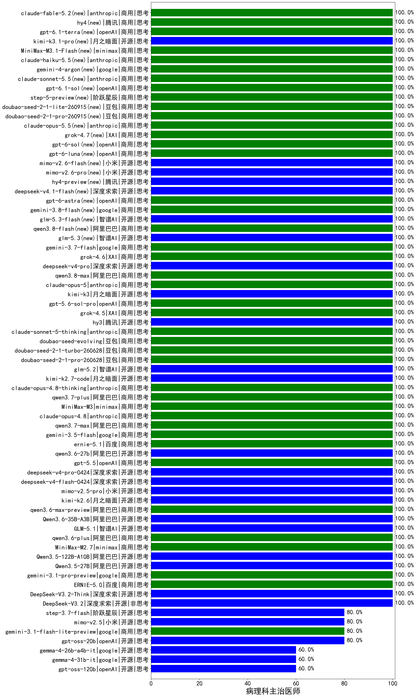

|类别|机构|大模型|【病理科主治医师】准确率|平均耗时|平均消耗token|花费/千次（元）|排名（准确率）|
|---|---|-----|-------------------|-------|-----------|-----------|-----------|
|开源|腾讯|hy3|100.0%|43s|218|0.6|1|
|商用|google|gemini-3.8-flash(new)|100.0%|18s|561|26.0|2|
|商用|豆包|doubao-seed-evolving|100.0%|145s|4843|142.5|3|
|商用|anthropic|claude-sonnet-5-thinking|100.0%|16s|772|47.1|4|
|开源|月之暗面|kimi-k3.1-pro(new)|100.0%|25s|940|55.5|5|
|商用|XAI|grok-4.5|100.0%|166s|961|32.5|6|
|商用|openAI|gpt-5.6-sol-pro|100.0%|47s|2882|200.0|7|
|开源|月之暗面|kimi-k3|100.0%|20s|441|32.0|8|
|商用|anthropic|claude-opus-5|100.0%|14s|681|101.7|9|
|商用|阿里巴巴|qwen3.8-max|100.0%|61s|1470|50.1|10|
|开源|深度求索|deepseek-v4-pro|100.0%|47s|500|10.7|11|
|商用|XAI|grok-4.6|100.0%|18s|957|32.4|12|
|商用|google|gemini-3.7-flash|100.0%|4s|625|14.7|13|
|开源|智谱AI|glm-5.3(new)|100.0%|30s|874|22.8|14|
|商用|阿里巴巴|qwen3.8-flash(new)|100.0%|25s|739|1.7|15|
|开源|智谱AI|glm-5.3-flash(new)|100.0%|24s|882|2.3|16|
|商用|openAI|gpt-6-astra(new)|100.0%|8s|263|62.6|17|
|商用|minimax|MiniMax-M3.1-Flash(new)|100.0%|15s|622|1.7|18|
|开源|深度求索|deepseek-v4.1-flash(new)|100.0%|8s|391|2.5|19|
|开源|腾讯|hy4-preview(new)|100.0%|23s|1127|19.2|20|
|开源|小米|mimo-v2.6-pro(new)|100.0%|20s|721|4.1|21|
|开源|小米|mimo-v2.6-flash(new)|100.0%|24s|616|1.1|22|
|商用|openAI|gpt-6-luna(new)|100.0%|174s|258|0.6|23|
|商用|openAI|gpt-6-sol(new)|100.0%|97s|192|7.6|24|
|商用|XAI|grok-4.7(new)|100.0%|16s|2343|61.6|25|
|商用|anthropic|claude-opus-5.5(new)|100.0%|18s|667|79.2|26|
|商用|豆包|doubao-seed-2-1-pro-260915(new)|100.0%|27s|765|20.2|27|
|商用|豆包|doubao-seed-2-1-lite-260915(new)|100.0%|11s|571|1.4|28|
|商用|阶跃星辰|step-5-preview(new)|100.0%|10s|731|13.5|29|
|商用|openAI|gpt-6.1-sol(new)|100.0%|5s|218|9.4|30|
|商用|anthropic|claude-sonnet-5.5(new)|100.0%|6s|486|27.4|31|
|商用|google|gemini-4-argon(new)|100.0%|24s|459|52.1|32|
|商用|豆包|doubao-seed-2-1-turbo-260628|100.0%|151s|4575|67.3|33|
|商用|豆包|doubao-seed-2-1-pro-260628|100.0%|301s|4869|143.3|34|
|开源|智谱AI|glm-5.2|100.0%|28s|1146|30.4|35|
|开源|月之暗面|kimi-k2.7-code|100.0%|17s|601|14.7|36|
|开源|深度求索|DeepSeek-V3.2|100.0%|13s|434|1.2|37|
|开源|深度求索|DeepSeek-V3.2-Think|100.0%|156s|849|2.5|38|
|商用|百度|ERNIE-5.0|100.0%|146s|1375|31.8|39|
|商用|google|gemini-3.1-pro-preview|100.0%|76s|1064|84.8|40|
|开源|阿里巴巴|Qwen3.5-27B|100.0%|250s|1798|8.3|41|
|开源|阿里巴巴|Qwen3.5-122B-A10B|100.0%|65s|1755|10.8|42|
|商用|腾讯|hy4-flash(new)|100.0%|62s|657|1.2|43|
|商用|minimax|MiniMax-M2.7|100.0%|24s|931|7.1|44|
|商用|阿里巴巴|qwen3.6-plus|100.0%|43s|1513|17.4|45|
|商用|google|gemini-4-carbon(new)|100.0%|21s|780|97.1|46|
|商用|anthropic|claude-fable-5.2(new)|100.0%|24s|466|102.2|47|
|开源|智谱AI|GLM-5.1|100.0%|150s|990|22.4|48|
|开源|阿里巴巴|Qwen3.6-35B-A3B|100.0%|462s|1585|16.4|49|
|商用|阿里巴巴|qwen3.6-max-preview|100.0%|38s|1488|76.7|50|
|开源|月之暗面|kimi-k2.6|100.0%|35s|986|25.1|51|
|商用|腾讯|hy4(new)|100.0%|27s|1186|20.3|52|
|开源|小米|mimo-v2.5-pro|100.0%|13s|1015|16.7|53|
|开源|深度求索|deepseek-v4-flash-0424|100.0%|17s|460|0.8|54|
|开源|深度求索|deepseek-v4-pro-0424|100.0%|20s|676|15.3|55|
|商用|openAI|gpt-5.5|100.0%|5s|313|47.3|56|
|开源|阿里巴巴|qwen3.6-27b|100.0%|34s|1565|27.0|57|
|商用|百度|ernie-5.1|100.0%|24s|776|13.0|58|
|商用|google|gemini-3.5-flash|100.0%|7s|1017|59.8|59|
|商用|阿里巴巴|qwen3.7-max|100.0%|18s|838|28.3|60|
|商用|anthropic|claude-opus-4.8|100.0%|9s|628|92.4|61|
|商用|minimax|MiniMax-M3|100.0%|19s|579|6.7|62|
|商用|阿里巴巴|qwen3.7-plus|100.0%|19s|1017|7.7|63|
|商用|openAI|gpt-6.1-terra(new)|100.0%|5s|214|4.5|64|
|商用|anthropic|claude-opus-4.8-thinking|100.0%|16s|748|113.4|65|
|商用|anthropic|claude-haiku-5.5(new)|100.0%|6s|654|1.9|66|
|商用|阿里巴巴|qwen4-max(new)|80.0%|24s|1050|29.7|67|
|开源|openAI|gpt-oss-20b|80.0%|13s|1173|1.2|68|
|开源|阶跃星辰|step-3.7-flash|80.0%|22s|1547|12.0|69|
|开源|小米|mimo-v2.5|80.0%|9s|983|10.1|70|
|商用|google|gemini-3.1-flash-lite-preview|80.0%|2s|363|3.1|71|
|开源|google|gemma-4-26b-a4b-it|60.0%|67s|565|1.4|72|
|开源|google|gemma-4-31b-it|60.0%|459s|540|1.3|73|
|开源|openAI|gpt-oss-120b|60.0%|9s|666|1.8|74|

