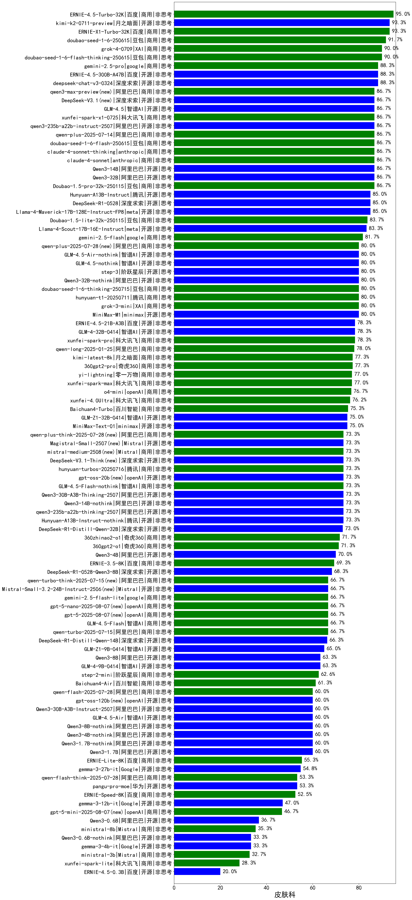

|类别|机构|大模型|【皮肤科】准确率|平均耗时|平均消耗token|花费/千次（元）|排名（准确率）|
|---|---|-----|-------------------|-------|-----------|-----------|-----------|
|开源|阿里巴巴|Qwen3-235B-A22B-nothink|96.7%|23s|488|4.2|1|
|商用|百度|ERNIE-4.5-Turbo-32K|95.0%|21s|522|1.5|2|
|商用|百度|ERNIE-X1-Turbo-32K|93.3%|57s|1329|5.1|3|
|开源|月之暗面|kimi-k2-0711-preview(new)|93.3%|33s|577|8.4|4|
|商用|腾讯|hunyuan-turbos-20250604|91.7%|135s|430|0.7|5|
|商用|豆包|doubao-seed-1-6-250615|91.7%|117s|469|3.0|6|
|商用|豆包|doubao-seed-1-6-flash-thinking-250615|90.0%|5s|528|0.6|7|
|商用|XAI|grok-4-0709|90.0%|102s|1233|126.7|8|
|开源|腾讯|hunyuan-large|89.0%|13s|354|3.6|9|
|开源|深度求索|deepseek-chat-v3-0324|88.3%|106s|314|2.1|10|
|开源|百度|ERNIE-4.5-300B-A47B|88.3%|18s|336|2.2|11|
|商用|google|gemini-2.5-pro|88.3%|37s|2200|154.6|12|
|商用|anthropic|claude-4-sonnet-thinking|86.7%|48s|1286|128.5|13|
|开源|阿里巴巴|Qwen3-14B|86.7%|47s|1717|3.3|14|
|商用|阿里巴巴|qwen-plus-think-2025-04-28|86.7%|201s|1690|13.0|15|
|商用|豆包|doubao-seed-1-6-flash-250615|86.7%|3s|303|0.4|16|
|商用|豆包|Doubao-1.5-pro-32k-250115|86.7%|11s|364|0.6|17|
|开源|阿里巴巴|Qwen3-32B|86.7%|65s|1384|5.3|18|
|商用|科大讯飞|xunfei-spark-x1-0725(new)|86.7%|/|1118|13.4|19|
|开源|智谱AI|GLM-4.5(new)|86.7%|52s|1750|23.7|20|
|开源|阿里巴巴|qwen3-235b-a22b-instruct-2507(new)|86.7%|11s|459|3.2|21|
|商用|anthropic|claude-4-sonnet|86.7%|44s|588|52.6|22|
|商用|阿里巴巴|qwen-plus-2025-07-14(new)|86.7%|9s|463|0.8|23|
|开源|meta|Llama-4-Maverick-17B-128E-Instruct-FP8|85.0%|7s|509|2.0|24|
|开源|深度求索|DeepSeek-R1-0528|85.0%|215s|1606|24.9|25|
|开源|阿里巴巴|Qwen3-235B-A22B|85.0%|179s|1854|17.9|26|
|开源|腾讯|Hunyuan-A13B-Instruct|85.0%|40s|993|3.8|27|
|商用|豆包|Doubao-1.5-lite-32k-250115|83.7%|5s|183|0.1|28|
|商用|智谱AI|GLM-4-Plus|83.4%|15s|285|1.4|29|
|开源|meta|Llama-4-Scout-17B-16E-Instruct|83.3%|9s|558|1.1|30|
|商用|openAI|gpt-4.1|83.3%|10s|352|16.2|31|
|商用|阶跃星辰|step-r1-v-mini|81.7%|157s|1618|12.4|32|
|商用|google|gemini-2.5-flash|81.7%|10s|1645|28.6|33|
|商用|阿里巴巴|qwen2.5-max|80.7%|18s|457|3.8|34|
|商用|腾讯|hunyuan-standard|80.3%|/|/|/|35|
|开源|阶跃星辰|step-3(new)|80.0%|93s|1815|7.1|36|
|开源|智谱AI|GLM-4.5-nothink|80.0%|19s|631|8.0|37|
|开源|智谱AI|GLM-4.5-Air-nothink|80.0%|18s|798|4.4|38|
|商用|XAI|grok-3-mini|80.0%|222s|1105|3.9|39|
|开源|minimax|MiniMax-M1|80.0%|191s|1841|13.5|40|
|商用|豆包|doubao-seed-1-6-thinking-250715(new)|80.0%|16s|1018|7.6|41|
|商用|腾讯|hunyuan-t1-20250711(new)|80.0%|23s|1398|5.3|42|
|开源|阿里巴巴|Qwen3-32B-nothink|80.0%|136s|499|1.8|43|
|商用|智谱AI|GLM-Z1-AirX|80.0%|17s|1527|7.8|44|
|开源|阿里巴巴|qwq-32b|79.0%|42s|2223|13.0|45|
|开源|阿里巴巴|Qwen3-30B-A3B|78.3%|63s|1839|5.0|46|
|开源|百度|ERNIE-4.5-21B-A3B|78.3%|21s|302|0.0|47|
|开源|智谱AI|GLM-4-32B-0414|78.3%|12s|359|0.7|48|
|开源|阿里巴巴|qwen2.5-72b-instruct|78.3%|13s|296|2.9|49|
|商用|科大讯飞|xunfei-spark-pro|78.3%|/|/|/|50|
|商用|阿里巴巴|qwq-plus-2025-03-05|78.2%|54s|2165|8.5|51|
|商用|阿里巴巴|qwen-long-2025-01-25|78.0%|48s|340|0.6|52|
|商用|智谱AI|GLM-4-AirX|77.8%|9s|268|2.7|53|
|商用|奇虎360|360gpt2-pro|77.3%|12s|264|1.0|54|
|商用|月之暗面|kimi-latest-8k|77.3%|17s|506|6.1|55|
|商用|零一万物|yi-lightning|77.0%|/|/|/|56|
|商用|科大讯飞|xunfei-spark-max|77.0%|5s|123|3.7|57|
|商用|openAI|o4-mini|76.7%|32s|673|19.2|58|
|商用|阿里巴巴|qwen-turbo-think-2025-04-28|76.7%|89s|2187|6.4|59|
|商用|科大讯飞|xunfei-4.0Ultra|76.2%|5s|126|8.9|60|
|商用|智谱AI|GLM-4-Long|75.5%|12s|367|0.4|61|
|商用|百川智能|Baichuan4-Turbo|75.3%|/|/|/|62|
|开源|智谱AI|GLM-Z1-32B-0414|75.0%|200s|2054|8.0|63|
|开源|阿里巴巴|qwen2.5-32b-instruct|75.0%|9s|258|1.2|64|
|开源|minimax|MiniMax-Text-01|75.0%|15s|901|7.2|65|
|商用|openAI|chatgpt-4o-latest|74.3%|/|/|/|66|
|商用|商汤|SenseChat-5-1202|73.7%|/|/|/|67|
|开源|openAI|gpt-oss-20b(new)|73.3%|9s|1002|1.0|68|
|商用|智谱AI|GLM-Z1-Air|73.3%|43s|1393|0.7|69|
|商用|智谱AI|GLM-Z1-Flash|73.3%|21s|2040|0.0|70|
|开源|阿里巴巴|qwen3-235b-a22b-thinking-2507(new)|73.3%|64s|2329|45.2|71|
|开源|阿里巴巴|Qwen3-14B-nothink|73.3%|18s|535|0.9|72|
|商用|智谱AI|GLM-4.5-Flash-nothink|73.3%|16s|804|0.0|73|
|开源|腾讯|Hunyuan-A13B-Instruct-nothink(new)|73.3%|112s|342|1.1|74|
|开源|阿里巴巴|Qwen3-30B-A3B-Thinking-2507(new)|73.3%|62s|2265|6.2|75|
|开源|深度求索|DeepSeek-R1-Distill-Qwen-32B|73.0%|39s|710|0.9|76|
|商用|奇虎360|360zhinao2-o1|71.7%|/|/|/|77|
|开源|阿里巴巴|qwen2.5-14b-instruct|71.3%|11s|249|0.6|78|
|商用|奇虎360|360gpt2-o1|71.3%|17s|328|13.8|79|
|开源|阿里巴巴|Qwen3-4B|70.0%|34s|1629|4.7|80|
|商用|openAI|gpt-4.1-mini|70.0%|8s|413|4.0|81|
|商用|奇虎360|360gpt-turbo|69.7%|/|/|/|82|
|商用|百度|ERNIE-3.5-8K|69.3%|20s|305|0.5|83|
|开源|深度求索|DeepSeek-R1-0528-Qwen3-8B|68.3%|275s|1473|0.0|84|
|开源|上海人工智能实验室|internlm2_5-7b-chat|67.0%|/|/|/|85|
|开源|阿里巴巴|Qwen3-30B-A3B-nothink|66.7%|16s|485|1.2|86|
|商用|智谱AI|GLM-4.5-Flash(new)|66.7%|24s|1315|0.0|87|
|商用|google|gemini-2.5-flash-lite-preview-06-17|66.7%|2s|496|1.3|88|
|商用|openAI|gpt-5-nano-2025-08-07(new)|66.7%|19s|1766|4.9|89|
|商用|openAI|gpt-5-2025-08-07(new)|66.7%|36s|278|14.7|90|
|商用|阿里巴巴|qwen-turbo-2025-07-15(new)|66.7%|6s|350|0.2|91|
|开源|深度求索|DeepSeek-R1-Distill-Qwen-14B|66.3%|/|/|/|92|
|商用|智谱AI|GLM-Z1-FlashX|65.0%|33s|1519|0.2|93|
|开源|智谱AI|GLM-Z1-9B-0414|65.0%|147s|2551|0.0|94|
|开源|Mistral|Mistral-Small-3.1-24B-Instruct-2503|65.0%|/|/|/|95|
|开源|阿里巴巴|qwen2.5-7b-instruct|64.7%|5s|241|0.2|96|
|开源|阿里巴巴|Qwen3-8B|63.3%|155s|4229|0.0|97|
|开源|智谱AI|GLM-4-9B-0414|63.3%|10s|414|0.0|98|
|商用|阶跃星辰|step-2-mini|62.6%|7s|327|0.6|99|
|商用|OpenAI|gpt-4o-mini|61.3%|/|/|/|100|
|商用|百川智能|Baichuan4-Air|61.3%|/|/|/|101|
|开源|openAI|gpt-oss-120b(new)|60.0%|5s|686|1.9|102|
|开源|阿里巴巴|Qwen3-30B-A3B-Instruct-2507(new)|60.0%|6s|612|1.7|103|
|开源|智谱AI|GLM-4.5-Air(new)|60.0%|29s|1458|8.4|104|
|开源|阿里巴巴|Qwen3-1.7B|60.0%|33s|2110|6.1|105|
|开源|阿里巴巴|Qwen3-4B-nothink|60.0%|19s|450|1.1|106|
|开源|阿里巴巴|Qwen3-1.7B-nothink|60.0%|8s|458|1.2|107|
|开源|阿里巴巴|Qwen3-8B-nothink|60.0%|70s|522|0.0|108|
|商用|智谱AI|GLM-4-FlashX|57.7%|10s|297|0.0|109|
|开源|智谱AI|GLM-Z1-Rumination-32B-0414|55.6%|24s|1175|3.1|110|
|商用|百度|ERNIE-Lite-8K|55.3%|/|/|/|111|
|商用|Mistral|mistral-large|55.0%|/|/|/|112|
|开源|Google|gemma-3-27b-it|54.8%|/|/|/|113|
|开源|华为|pangu-pro-moe|53.3%|81s|1452|5.6|114|
|商用|百度|ERNIE-Speed-8K|52.5%|/|/|/|115|
|商用|Mistral|mistral-small|52.3%|/|/|/|116|
|开源|阿里巴巴|qwen2.5-3b-instruct|51.3%|6s|300|0.2|117|
|开源|Google|gemma-3-12b-it|47.0%|/|/|/|118|
|商用|openAI|gpt-5-mini-2025-08-07(new)|46.7%|104s|926|12.3|119|
|开源|微软|phi-4|45.0%|/|/|/|120|
|开源|阿里巴巴|qwen2.5-1.5b-instruct|42.0%|5s|149|0.0|121|
|开源|阿里巴巴|Qwen3-0.6B|36.7%|14s|1135|3.2|122|
|商用|Mistral|ministral-8b|35.3%|/|/|/|123|
|开源|Google|gemma-3-4b-it|33.3%|/|/|/|124|
|开源|阿里巴巴|Qwen3-0.6B-nothink|33.3%|8s|249|0.5|125|
|商用|Mistral|ministral-3b|32.7%|/|/|/|126|
|商用|百度|ERNIE-Tiny-8K|31.7%|/|/|/|127|
|开源|阿里巴巴|qwen2.5-0.5b-instruct|29.0%|5s|260|0.0|128|
|商用|科大讯飞|xunfei-spark-lite|28.3%|/|/|/|129|
|开源|百度|ERNIE-4.5-0.3B|20.0%|22s|384|0.0|130|

