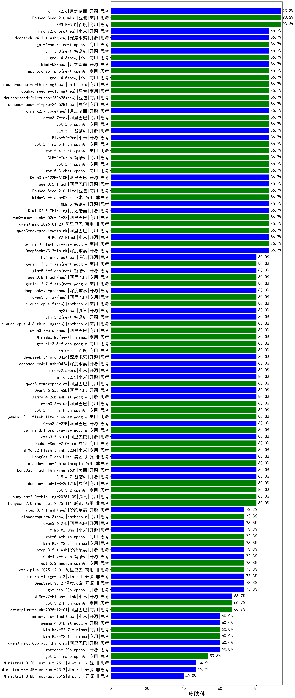

|类别|机构|大模型|【皮肤科】准确率|平均耗时|平均消耗token|花费/千次（元）|排名（准确率）|
|---|---|-----|-------------------|-------|-----------|-----------|-----------|
|商用|豆包|Doubao-Seed-2.0-mini|93.3%|313s|1770|3.3|1|
|商用|百度|ERNIE-5.0|93.3%|116s|1607|37.5|2|
|开源|月之暗面|kimi-k2.6|93.3%|78s|1360|35.3|3|
|商用|豆包|Doubao-Seed-2.0-lite|86.7%|177s|781|2.5|4|
|商用|豆包|doubao-seed-2-1-pro-260628(new)|86.7%|171s|6206|183.6|5|
|商用|阿里巴巴|qwen3-max-2026-01-23|86.7%|83s|534|4.8|6|
|商用|阿里巴巴|qwen3-max-think-2026-01-23|86.7%|190s|3890|38.3|7|
|开源|月之暗面|kimi-k2.7-code(new)|86.7%|32s|1148|29.6|8|
|开源|智谱AI|GLM-5|86.7%|68s|1655|28.8|9|
|商用|小米|MiMo-V2-Flash-0204|86.7%|279s|531|1.0|10|
|商用|阿里巴巴|qwen3.7-max|86.7%|23s|898|30.6|11|
|商用|openAI|gpt-5.4-mini|86.7%|13s|238|5.1|12|
|商用|阿里巴巴|qwen3-max-preview-think|86.7%|114s|2206|51.5|13|
|开源|阿里巴巴|qwen3.5-flash|86.7%|212s|2799|5.5|14|
|商用|openAI|gpt-5.5|86.7%|11s|443|76.8|15|
|开源|阿里巴巴|Qwen3.5-122B-A10B|86.7%|168s|2369|14.8|16|
|商用|openAI|gpt-5.3-chat|86.7%|20s|359|27.3|17|
|商用|openAI|gpt-5.4|86.7%|14s|276|20.8|18|
|商用|智谱AI|GLM-5-Turbo|86.7%|26s|1151|24.1|19|
|商用|openAI|gpt-5.4-nano-high|86.7%|25s|511|3.8|20|
|开源|小米|MiMo-V2-Pro|86.7%|141s|1066|17.9|21|
|商用|豆包|doubao-seed-2-1-turbo-260628(new)|86.7%|195s|7507|111.3|22|
|开源|月之暗面|Kimi-K2.5-Thinking|86.7%|442s|2139|43.8|23|
|商用|豆包|doubao-seed-evolving(new)|86.7%|256s|6732|199.4|24|
|开源|月之暗面|kimi-k3(new)|86.7%|25s|490|37.4|25|
|开源|深度求索|deepseek-v4.1-flash(new)|86.7%|8s|948|7.0|26|
|开源|深度求索|DeepSeek-V3.2-Think|86.7%|31s|922|2.7|27|
|商用|openAI|gpt-6-astra(new)|86.7%|12s|298|78.5|28|
|开源|智谱AI|glm-5.3(new)|86.7%|66s|1181|31.5|29|
|商用|XAI|grok-4.6(new)|86.7%|168s|2142|82.3|30|
|商用|anthropic|claude-sonnet-5-thinking(new)|86.7%|12s|805|50.2|31|
|开源|智谱AI|GLM-5.1|86.7%|160s|1197|27.5|32|
|商用|openAI|gpt-5.6-sol-pro(new)|86.7%|15s|3003|213.1|33|
|开源|小米|MiMo-V2-Flash|86.7%|13s|442|0.0|34|
|商用|XAI|grok-4.5(new)|86.7%|148s|1313|47.5|35|
|商用|google|gemini-3-flash-preview|86.7%|61s|923|18.3|36|
|商用|anthropic|claude-opus-4.8-thinking(new)|80.0%|17s|659|100.0|37|
|开源|智谱AI|glm-5.3-flash(new)|80.0%|108s|1267|3.4|38|
|开源|阿里巴巴|Qwen3.6-35B-A3B|80.0%|105s|1669|17.4|39|
|开源|腾讯|hy3(new)|80.0%|61s|222|0.7|40|
|商用|阿里巴巴|qwen3.6-max-preview|80.0%|50s|1555|80.7|41|
|开源|小米|mimo-v2.5|80.0%|19s|1358|15.5|42|
|开源|小米|mimo-v2.5-pro|80.0%|17s|1094|18.5|43|
|商用|google|gemini-3.8-flash(new)|80.0%|30s|641|30.5|44|
|开源|深度求索|deepseek-v4-flash-0424|80.0%|47s|1206|2.3|45|
|开源|深度求索|deepseek-v4-pro-0424|80.0%|39s|951|22.0|46|
|商用|阿里巴巴|qwen3.8-flash(new)|80.0%|114s|1062|2.6|47|
|商用|阿里巴巴|qwen3.7-plus(new)|80.0%|22s|1052|8.0|48|
|开源|google|gemma-4-26b-a4b-it|80.0%|48s|545|1.4|49|
|商用|google|gemini-3.7-flash(new)|80.0%|5s|682|16.3|50|
|开源|智谱AI|glm-5.2(new)|80.0%|59s|1513|40.8|51|
|商用|google|gemini-3.5-flash|80.0%|7s|1212|72.4|52|
|开源|深度求索|deepseek-v4-pro(new)|80.0%|27s|1072|26.3|53|
|商用|阿里巴巴|qwen3.8-max(new)|80.0%|18s|792|25.9|54|
|商用|anthropic|claude-opus-5(new)|80.0%|13s|662|100.5|55|
|商用|minimax|MiniMax-M3(new)|80.0%|21s|561|6.5|56|
|商用|百度|ernie-5.1|80.0%|26s|1003|17.1|57|
|开源|腾讯|hy4-preview(new)|80.0%|176s|2517|44.3|58|
|开源|美团|LongCat-Flash-Lite|80.0%|80s|445|0.0|59|
|开源|阿里巴巴|qwen3.5-plus|80.0%|33s|2471|11.6|60|
|商用|openAI|gpt-5.2|80.0%|4s|199|11.7|61|
|商用|豆包|doubao-seed-1-8-251215|80.0%|28s|725|5.0|62|
|开源|智谱AI|GLM-4.7|80.0%|43s|1775|24.1|63|
|开源|美团|LongCat-Flash-Thinking-2601|80.0%|186s|2302|0.0|64|
|商用|阿里巴巴|qwen3.6-plus|80.0%|34s|1482|17.1|65|
|商用|anthropic|claude-opus-4.6|80.0%|16s|637|95.8|66|
|商用|腾讯|hunyuan-2.0-instruct-20251111|80.0%|21s|402|0.7|67|
|商用|小米|MiMo-V2-Flash-think-0204|80.0%|984s|1922|3.9|68|
|商用|豆包|Doubao-Seed-2.0-pro|80.0%|257s|1194|17.7|69|
|商用|腾讯|hunyuan-2.0-thinking-20251109|80.0%|19s|690|2.6|70|
|商用|google|gemini-3.1-pro-preview|80.0%|32s|1377|112.0|71|
|开源|阿里巴巴|Qwen3.5-27B|80.0%|274s|2942|13.8|72|
|商用|google|gemini-3.1-flash-lite-preview|80.0%|14s|359|3.1|73|
|商用|openAI|gpt-5.4-mini-high|80.0%|14s|727|20.5|74|
|开源|阿里巴巴|qwen3.6-27b|73.3%|25s|1584|27.4|75|
|开源|小米|MiMo-V2-Omni|73.3%|192s|1367|15.6|76|
|商用|阿里巴巴|qwen-plus-2025-12-01|73.3%|22s|854|1.6|77|
|商用|openAI|gpt-5.2-medium|73.3%|6s|320|23.8|78|
|开源|深度求索|DeepSeek-V3.2|73.3%|96s|345|1.0|79|
|开源|Mistral|mistral-large-2512|73.3%|14s|516|4.8|80|
|开源|智谱AI|GLM-4.7-Flash|73.3%|665s|2067|0.0|81|
|开源|openAI|gpt-oss-20b|73.3%|9s|1002|1.0|82|
|商用|openAI|gpt-5.4-high|73.3%|10s|560|50.7|83|
|商用|minimax|MiniMax-M2.5|73.3%|18s|1009|7.8|84|
|开源|阶跃星辰|step-3.7-flash(new)|73.3%|20s|1945|15.2|85|
|商用|anthropic|claude-opus-4.8(new)|73.3%|8s|531|77.6|86|
|开源|阶跃星辰|step-3.5-flash|73.3%|17s|1808|3.7|87|
|开源|小米|MiMo-V2-Flash-think|66.7%|24s|1980|0.0|88|
|商用|openAI|gpt-5.2-high|66.7%|12s|496|41.3|89|
|商用|阿里巴巴|qwen-plus-think-2025-12-01|66.7%|57s|2345|18.2|90|
|开源|阿里巴巴|qwen3-next-80b-a3b-thinking|60.0%|96s|2967|11.6|91|
|开源|google|gemma-4-31b-it|60.0%|60s|489|1.2|92|
|商用|minimax|MiniMax-M2.1|60.0%|73s|1092|8.5|93|
|商用|minimax|MiniMax-M2.7|60.0%|31s|1231|9.7|94|
|开源|openAI|gpt-oss-120b|60.0%|5s|686|1.9|95|
|商用|openAI|gpt-5.4-nano|53.3%|13s|234|1.4|96|
|开源|Mistral|Ministral-3-3B-Instruct-2512|46.7%|10s|618|0.4|97|
|开源|Mistral|Ministral-3-14B-Instruct-2512|46.7%|13s|574|0.8|98|
|开源|Mistral|Ministral-3-8B-Instruct-2512|40.0%|14s|911|1.0|99|

