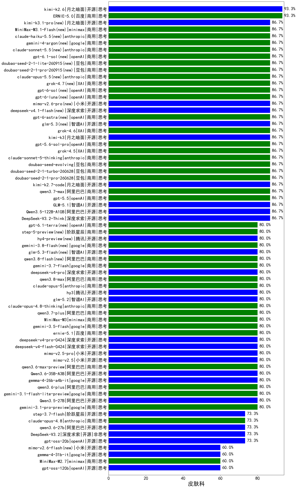

|类别|机构|大模型|【皮肤科】准确率|平均耗时|平均消耗token|花费/千次（元）|排名（准确率）|
|---|---|-----|-------------------|-------|-----------|-----------|-----------|
|开源|月之暗面|kimi-k2.6|93.3%|78s|1360|35.3|1|
|商用|百度|ERNIE-5.0|93.3%|116s|1607|37.5|2|
|开源|月之暗面|kimi-k2.7-code|86.7%|32s|1148|29.6|3|
|商用|openAI|gpt-6-luna(new)|86.7%|152s|431|1.2|4|
|商用|openAI|gpt-5.5|86.7%|11s|443|76.8|5|
|开源|深度求索|deepseek-v4.1-flash(new)|86.7%|8s|948|7.0|6|
|商用|openAI|gpt-6-astra(new)|86.7%|12s|298|78.5|7|
|商用|阿里巴巴|qwen3.7-max|86.7%|23s|898|30.6|8|
|开源|智谱AI|glm-5.3(new)|86.7%|66s|1181|31.5|9|
|商用|豆包|doubao-seed-2-1-turbo-260628|86.7%|195s|7507|111.3|10|
|商用|openAI|gpt-6-sol(new)|86.7%|109s|258|12.9|11|
|商用|豆包|doubao-seed-2-1-pro-260628|86.7%|171s|6206|183.6|12|
|商用|豆包|doubao-seed-evolving|86.7%|256s|6732|199.4|13|
|商用|anthropic|claude-sonnet-5-thinking|86.7%|12s|805|50.2|14|
|商用|XAI|grok-4.5|86.7%|148s|1313|47.5|15|
|商用|openAI|gpt-5.6-sol-pro|86.7%|15s|3003|213.1|16|
|商用|XAI|grok-4.6|86.7%|168s|2142|82.3|17|
|开源|小米|mimo-v2.6-pro(new)|86.7%|49s|745|4.2|18|
|商用|XAI|grok-4.7(new)|86.7%|58s|4768|163.6|19|
|商用|anthropic|claude-opus-5.5(new)|86.7%|16s|630|75.7|20|
|开源|月之暗面|kimi-k3.1-pro(new)|86.7%|36s|1042|62.9|21|
|开源|深度求索|DeepSeek-V3.2-Think|86.7%|31s|922|2.7|22|
|商用|minimax|MiniMax-M3.1-Flash(new)|86.7%|15s|803|2.4|23|
|商用|anthropic|claude-haiku-5.5(new)|86.7%|13s|747|2.3|24|
|开源|阿里巴巴|Qwen3.5-122B-A10B|86.7%|168s|2369|14.8|25|
|商用|google|gemini-4-argon(new)|86.7%|22s|475|55.3|26|
|商用|anthropic|claude-sonnet-5.5(new)|86.7%|13s|520|30.1|27|
|商用|openAI|gpt-6.1-sol(new)|86.7%|251s|264|13.3|28|
|商用|豆包|doubao-seed-2-1-lite-260915(new)|86.7%|27s|1177|3.0|29|
|开源|智谱AI|GLM-5.1|86.7%|160s|1197|27.5|30|
|商用|豆包|doubao-seed-2-1-pro-260915(new)|86.7%|72s|1334|37.4|31|
|开源|月之暗面|kimi-k3|86.7%|25s|490|37.4|32|
|商用|阿里巴巴|qwen3.8-flash(new)|80.0%|114s|1062|2.6|33|
|开源|智谱AI|glm-5.3-flash(new)|80.0%|108s|1267|3.4|34|
|商用|google|gemini-3.7-flash|80.0%|5s|682|16.3|35|
|商用|google|gemini-3.8-flash(new)|80.0%|30s|641|30.5|36|
|商用|阶跃星辰|step-5-preview(new)|80.0%|31s|1633|31.7|37|
|开源|深度求索|deepseek-v4-pro|80.0%|27s|1072|26.3|38|
|开源|腾讯|hy4-preview(new)|80.0%|176s|2517|44.3|39|
|商用|阿里巴巴|qwen3.8-max|80.0%|18s|792|25.9|40|
|商用|anthropic|claude-opus-5|80.0%|13s|662|100.5|41|
|商用|openAI|gpt-6.1-terra(new)|80.0%|5s|328|8.9|42|
|开源|腾讯|hy3|80.0%|61s|222|0.7|43|
|开源|深度求索|deepseek-v4-pro-0424|80.0%|39s|951|22.0|44|
|商用|google|gemini-3.1-pro-preview|80.0%|32s|1377|112.0|45|
|开源|阿里巴巴|Qwen3.5-27B|80.0%|274s|2942|13.8|46|
|商用|google|gemini-3.1-flash-lite-preview|80.0%|14s|359|3.1|47|
|商用|阿里巴巴|qwen3.6-plus|80.0%|34s|1482|17.1|48|
|开源|google|gemma-4-26b-a4b-it|80.0%|48s|545|1.4|49|
|开源|阿里巴巴|Qwen3.6-35B-A3B|80.0%|105s|1669|17.4|50|
|商用|阿里巴巴|qwen3.6-max-preview|80.0%|50s|1555|80.7|51|
|开源|小米|mimo-v2.5|80.0%|19s|1358|15.5|52|
|开源|小米|mimo-v2.5-pro|80.0%|17s|1094|18.5|53|
|开源|深度求索|deepseek-v4-flash-0424|80.0%|47s|1206|2.3|54|
|商用|百度|ernie-5.1|80.0%|26s|1003|17.1|55|
|商用|google|gemini-3.5-flash|80.0%|7s|1212|72.4|56|
|商用|minimax|MiniMax-M3|80.0%|21s|561|6.5|57|
|商用|阿里巴巴|qwen3.7-plus|80.0%|22s|1052|8.0|58|
|商用|anthropic|claude-opus-4.8-thinking|80.0%|17s|659|100.0|59|
|开源|智谱AI|glm-5.2|80.0%|59s|1513|40.8|60|
|开源|openAI|gpt-oss-20b|73.3%|9s|1002|1.0|61|
|开源|阿里巴巴|qwen3.6-27b|73.3%|25s|1584|27.4|62|
|商用|anthropic|claude-opus-4.8|73.3%|8s|531|77.6|63|
|开源|阶跃星辰|step-3.7-flash|73.3%|20s|1945|15.2|64|
|开源|深度求索|DeepSeek-V3.2|73.3%|96s|345|1.0|65|
|开源|小米|mimo-v2.6-flash(new)|60.0%|36s|1187|2.3|66|
|开源|google|gemma-4-31b-it|60.0%|60s|489|1.2|67|
|商用|minimax|MiniMax-M2.7|60.0%|31s|1231|9.7|68|
|开源|openAI|gpt-oss-120b|60.0%|5s|686|1.9|69|

