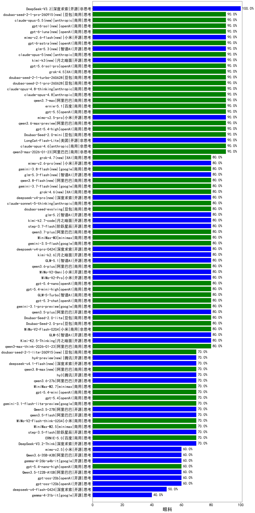

|类别|机构|大模型|【眼科】准确率|平均耗时|平均消耗token|花费/千次（元）|排名（准确率）|
|---|---|-----|-------------------|-------|-----------|-----------|-----------|
|开源|深度求索|DeepSeek-V3.2|100.0%|125s|691|2.0|1|
|开源|小米|mimo-v2.5-pro|90.0%|39s|1723|31.5|2|
|开源|月之暗面|kimi-k3(new)|90.0%|30s|586|45.8|3|
|商用|openAI|gpt-5.4-high|90.0%|17s|680|62.4|4|
|商用|XAI|grok-4.5|90.0%|111s|1393|50.5|5|
|开源|智谱AI|glm-5.3(new)|90.0%|71s|2798|76.5|6|
|商用|阿里巴巴|qwen3.6-max-preview|90.0%|61s|1912|99.2|7|
|商用|anthropic|claude-opus-5(new)|90.0%|13s|696|104.3|8|
|商用|openAI|gpt-5.5|90.0%|9s|502|87.8|9|
|商用|百度|ernie-5.1|90.0%|38s|1436|24.7|10|
|开源|小米|mimo-v2.6-flash(new)|90.0%|109s|4805|9.5|11|
|商用|阿里巴巴|qwen3.7-max|90.0%|31s|1803|62.7|12|
|商用|anthropic|claude-opus-4.8|90.0%|11s|610|89.3|13|
|商用|anthropic|claude-opus-4.8-thinking|90.0%|11s|765|116.4|14|
|商用|豆包|doubao-seed-2-1-pro-260628|90.0%|281s|10066|298.9|15|
|商用|豆包|doubao-seed-2-1-turbo-260628|90.0%|312s|8525|126.4|16|
|商用|openAI|gpt-6-astra(new)|90.0%|12s|280|70.0|17|
|商用|openAI|gpt-5.6-sol-pro|90.0%|19s|3362|255.4|18|
|开源|美团|LongCat-Flash-Lite|90.0%|300s|615|0.0|19|
|商用|豆包|Doubao-Seed-2.0-mini|90.0%|234s|2656|5.1|20|
|商用|openAI|gpt-6-sol(new)|90.0%|281s|285|14.3|21|
|商用|豆包|doubao-seed-2-1-pro-260915(new)|90.0%|68s|1028|27.8|22|
|商用|anthropic|claude-opus-5.5(new)|90.0%|57s|725|87.3|23|
|商用|anthropic|claude-opus-4.6|90.0%|16s|691|103.4|24|
|商用|阿里巴巴|qwen3-max-2026-01-23|90.0%|67s|567|5.0|25|
|商用|openAI|gpt-6-luna(new)|90.0%|235s|519|1.5|26|
|商用|阿里巴巴|qwen3-max-think-2026-01-23|80.0%|126s|3197|31.3|27|
|开源|深度求索|deepseek-v4-pro-0424|80.0%|74s|1391|32.4|28|
|开源|智谱AI|GLM-5|80.0%|107s|3004|52.9|29|
|商用|XAI|grok-4.7(new)|80.0%|64s|4432|149.1|30|
|商用|google|gemini-3.5-flash|80.0%|11s|1724|104.0|31|
|开源|月之暗面|Kimi-K2.5-Thinking|80.0%|250s|3374|69.5|32|
|商用|阿里巴巴|qwen3.7-plus|80.0%|59s|3191|25.0|33|
|商用|minimax|MiniMax-M3|80.0%|23s|638|7.6|34|
|开源|月之暗面|kimi-k2.6|80.0%|159s|2653|70.0|35|
|开源|阶跃星辰|step-3.7-flash|80.0%|50s|4504|35.9|36|
|开源|月之暗面|kimi-k2.7-code|80.0%|37s|1461|37.8|37|
|开源|智谱AI|glm-5.2|80.0%|53s|2435|66.4|38|
|商用|豆包|doubao-seed-evolving|80.0%|251s|11949|355.4|39|
|商用|anthropic|claude-sonnet-5-thinking|80.0%|14s|734|44.4|40|
|开源|深度求索|deepseek-v4-pro(new)|80.0%|45s|1564|39.4|41|
|开源|阿里巴巴|qwen3.5-plus|80.0%|49s|4057|19.1|42|
|商用|google|gemini-3.1-pro-preview|80.0%|36s|1609|127.5|43|
|商用|阿里巴巴|qwen3.8-flash(new)|80.0%|34s|2061|5.3|44|
|开源|小米|mimo-v2.6-pro(new)|80.0%|80s|3205|19.0|45|
|商用|openAI|gpt-5.3-chat|80.0%|7s|470|37.4|46|
|商用|豆包|Doubao-Seed-2.0-lite|80.0%|293s|1278|4.2|47|
|商用|豆包|Doubao-Seed-2.0-pro|80.0%|298s|1412|20.9|48|
|商用|智谱AI|GLM-5-Turbo|80.0%|59s|2706|58.1|49|
|商用|google|gemini-3.8-flash(new)|80.0%|16s|1140|56.1|50|
|商用|openAI|gpt-5.4-mini-high|80.0%|45s|799|22.5|51|
|商用|openAI|gpt-5.4-nano|80.0%|55s|257|1.5|52|
|开源|小米|MiMo-V2-Pro|80.0%|505s|1431|25.4|53|
|开源|小米|MiMo-V2-Omni|80.0%|15s|2187|26.9|54|
|商用|阿里巴巴|qwen3.6-plus|80.0%|33s|2133|24.7|55|
|商用|小米|MiMo-V2-Flash-0204|80.0%|275s|1223|2.4|56|
|商用|google|gemini-3.7-flash(new)|80.0%|27s|1106|27.2|57|
|开源|智谱AI|GLM-5.1|80.0%|146s|1909|44.3|58|
|商用|XAI|grok-4.6(new)|80.0%|34s|1640|60.9|59|
|开源|智谱AI|glm-5.3-flash(new)|80.0%|88s|3546|9.7|60|
|商用|阿里巴巴|qwen3.8-max(new)|70.0%|92s|4177|147.3|61|
|开源|深度求索|deepseek-v4.1-flash(new)|70.0%|45s|2829|22.0|62|
|开源|腾讯|hy4-preview(new)|70.0%|89s|5701|101.5|63|
|商用|豆包|doubao-seed-2-1-lite-260915(new)|70.0%|31s|1344|3.4|64|
|开源|腾讯|hy3|70.0%|84s|283|0.9|65|
|开源|阿里巴巴|qwen3.6-27b|70.0%|33s|2071|35.9|66|
|开源|深度求索|DeepSeek-V3.2-Think|70.0%|194s|2303|6.8|67|
|商用|百度|ERNIE-5.0|70.0%|235s|2904|68.3|68|
|开源|阶跃星辰|step-3.5-flash|70.0%|35s|5358|11.1|69|
|商用|minimax|MiniMax-M2.5|70.0%|69s|3059|25.0|70|
|商用|小米|MiMo-V2-Flash-think-0204|70.0%|717s|2803|5.7|71|
|开源|阿里巴巴|qwen3.5-flash|70.0%|336s|4619|9.1|72|
|开源|阿里巴巴|Qwen3.5-27B|70.0%|401s|4046|19.0|73|
|商用|google|gemini-3.1-flash-lite-preview|70.0%|9s|423|3.7|74|
|商用|openAI|gpt-5.4|70.0%|16s|318|24.6|75|
|商用|openAI|gpt-5.4-mini|70.0%|10s|295|6.6|76|
|商用|minimax|MiniMax-M2.7|70.0%|41s|1740|13.9|77|
|商用|openAI|gpt-5.4-nano-high|60.0%|76s|1002|8.0|78|
|开源|阿里巴巴|Qwen3.5-122B-A10B|60.0%|256s|4191|26.3|79|
|开源|google|gemma-4-26b-a4b-it|60.0%|38s|653|1.6|80|
|开源|阿里巴巴|Qwen3.6-35B-A3B|60.0%|64s|2278|23.8|81|
|开源|小米|mimo-v2.5|60.0%|50s|3284|42.2|82|
|开源|openAI|gpt-oss-20b|60.0%|9s|1174|1.2|83|
|开源|openAI|gpt-oss-120b|60.0%|24s|1070|3.1|84|
|开源|深度求索|deepseek-v4-flash-0424|50.0%|70s|1240|2.4|85|
|开源|google|gemma-4-31b-it|40.0%|122s|580|1.4|86|

