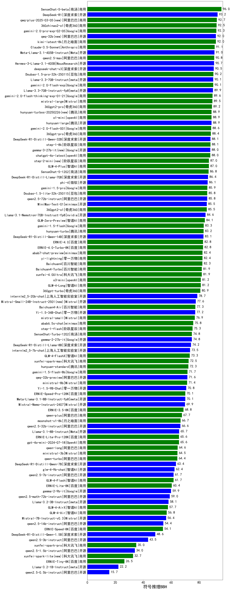

|类别|机构|大模型|【符号推理BBH】准确率|平均耗时|平均消耗token|花费/千次（元）|排名（准确率）|
|---|---|-----|-------------------|-------|-----------|-----------|-----------|
|商用|anthropic|claude-4-sonnet-thinking|95.6%|/|/|/|1|
|商用|豆包|doubao-seed-1-6-250615|94.2%|/|/|/|2|
|商用|anthropic|claude-4-sonnet|94.1%|/|/|/|3|
|开源|深度求索|deepseek-chat-v3-0324|92.6%|/|/|/|4|
|商用|百度|ERNIE-4.5-Turbo-32K|92.2%|/|/|/|5|
|开源|阿里巴巴|Qwen3-32B|91.8%|/|/|/|6|
|开源|深度求索|DeepSeek-R1-0528|91.3%|/|/|/|7|
|开源|百度|ERNIE-4.5-300B-A47B|91.1%|/|/|/|8|
|商用|google|gemini-2.5-pro|91.1%|/|/|/|9|
|开源|深度求索|DeepSeek-V3.1(new)|90.7%|/|/|/|10|
|开源|智谱AI|GLM-4.5-nothink|90.4%|/|/|/|11|
|商用|豆包|Doubao-1.5-pro-32k-250115|90.2%|/|/|/|12|
|商用|奇虎360|360zhinao2-o1|89.9%|/|/|/|13|
|商用|openAI|o4-mini|89.6%|/|/|/|14|
|开源|腾讯|Hunyuan-A13B-Instruct|89.6%|/|/|/|15|
|商用|阿里巴巴|qwen3-max-preview(new)|89.6%|/|/|/|16|
|商用|奇虎360|360gpt2-pro|89.2%|/|/|/|17|
|商用|百度|ERNIE-X1-Turbo-32K|89.0%|/|/|/|18|
|开源|meta|Llama-4-Maverick-17B-128E-Instruct-FP8|88.6%|/|/|/|19|
|商用|阿里巴巴|qwen-plus-2025-07-28(new)|88.6%|/|/|/|20|
|开源|月之暗面|kimi-k2-0711-preview|88.6%|/|/|/|21|
|商用|openAI|gpt-5-mini-2025-08-07(new)|88.2%|/|/|/|22|
|开源|智谱AI|GLM-4-32B-0414|88.2%|/|/|/|23|
|开源|深度求索|DeepSeek-R1-Distill-Qwen-32B|88.2%|/|/|/|24|
|商用|腾讯|hunyuan-turbos-20250716|88.2%|/|/|/|25|
|商用|腾讯|hunyuan-t1-20250711|88.0%|/|/|/|26|
|开源|阿里巴巴|qwen3-235b-a22b-instruct-2507|88.0%|/|/|/|27|
|开源|Google|gemma-3-27b-it|88.0%|/|/|/|28|
|开源|豆包|Seed-OSS-36B-Instruct(new)|87.8%|/|/|/|29|
|开源|智谱AI|GLM-Z1-32B-0414|87.7%|/|/|/|30|
|开源|阿里巴巴|Qwen3-14B|87.7%|/|/|/|31|
|商用|豆包|doubao-seed-1-6-thinking-250715|87.7%|/|/|/|32|
|开源|minimax|MiniMax-M1|87.3%|/|/|/|33|
|开源|华为|pangu-pro-moe|87.3%|/|/|/|34|
|开源|阿里巴巴|Qwen3-4B|87.1%|/|/|/|35|
|商用|阶跃星辰|step-2-mini|87.0%|/|/|/|36|
|商用|月之暗面|kimi-latest-8k|86.8%|/|/|/|37|
|商用|阿里巴巴|qwen-turbo-think-2025-07-15(new)|86.5%|/|/|/|38|
|开源|智谱AI|GLM-4.5-Air-nothink|86.5%|/|/|/|39|
|商用|科大讯飞|xunfei-4.0Ultra|86.4%|/|/|/|40|
|商用|阿里巴巴|qwen-turbo-2025-07-15|86.2%|/|/|/|41|
|商用|智谱AI|GLM-4.5-Flash-nothink|86.2%|/|/|/|42|
|商用|Mistral|mistral-medium-2508(new)|86.1%|/|/|/|43|
|开源|阿里巴巴|Qwen3-30B-A3B-Instruct-2507|86.1%|/|/|/|44|
|商用|google|gemini-2.5-flash-lite|86.1%|/|/|/|45|
|商用|豆包|Doubao-1.5-lite-32k-250115|85.8%|/|/|/|46|
|开源|minimax|MiniMax-Text-01|85.5%|/|/|/|47|
|商用|奇虎360|360gpt2-o1|85.5%|/|/|/|48|
|商用|豆包|doubao-seed-1-6-flash-thinking-250615|85.3%|/|/|/|49|
|开源|智谱AI|GLM-Z1-9B-0414|85.0%|/|/|/|50|
|开源|深度求索|DeepSeek-V3.1-Think(new)|85.0%|/|/|/|51|
|商用|阿里巴巴|qwen-flash-2025-07-28|84.9%|/|/|/|52|
|开源|智谱AI|GLM-4.5|84.6%|/|/|/|53|
|开源|腾讯|Hunyuan-A13B-Instruct-nothink|84.4%|/|/|/|54|
|商用|openAI|gpt-5-2025-08-07(new)|84.3%|/|/|/|55|
|商用|科大讯飞|xunfei-spark-x1-0725|84.0%|/|/|/|56|
|开源|Google|gemma-3-12b-it|83.8%|/|/|/|57|
|开源|Mistral|Mistral-Small-3.2-24B-Instruct-2506(new)|83.7%|/|/|/|58|
|开源|阶跃星辰|step-3|83.7%|/|/|/|59|
|开源|深度求索|DeepSeek-R1-Distill-Qwen-14B|83.1%|/|/|/|60|
|商用|google|gemini-2.5-flash|83.0%|/|/|/|61|
|商用|豆包|doubao-seed-1-6-flash-250615|82.8%|/|/|/|62|
|商用|阿里巴巴|qwen-plus-think-2025-07-28(new)|82.4%|/|/|/|63|
|开源|智谱AI|GLM-4.5-Air|82.1%|/|/|/|64|
|商用|百川智能|Baichuan4-Turbo|81.9%|/|/|/|65|
|商用|零一万物|yi-lightning|81.7%|/|/|/|66|
|开源|阿里巴巴|Qwen3-8B|81.6%|/|/|/|67|
|开源|阿里巴巴|Qwen3-32B-nothink|81.3%|/|/|/|68|
|开源|阿里巴巴|Qwen3-14B-nothink|80.7%|/|/|/|69|
|商用|openAI|gpt-5-nano-2025-08-07(new)|80.4%|/|/|/|70|
|开源|百度|ERNIE-4.5-21B-A3B|80.4%|/|/|/|71|
|开源|阿里巴巴|qwen3-235b-a22b-thinking-2507|80.3%|/|/|/|72|
|商用|智谱AI|GLM-4.5-Flash|80.2%|/|/|/|73|
|开源|深度求索|DeepSeek-R1-0528-Qwen3-8B|80.0%|/|/|/|74|
|开源|openAI|gpt-oss-120b(new)|79.7%|/|/|/|75|
|开源|openAI|gpt-oss-20b(new)|79.1%|/|/|/|76|
|商用|阿里巴巴|qwen-flash-think-2025-07-28|78.7%|/|/|/|77|
|开源|阿里巴巴|Qwen3-8B-nothink|77.6%|/|/|/|78|
|开源|Mistral|Magistral-Small-2507(new)|77.5%|/|/|/|79|
|开源|阿里巴巴|Qwen3-4B-nothink|77.5%|/|/|/|80|
|商用|百川智能|Baichuan4-Air|77.3%|/|/|/|81|
|开源|阿里巴巴|Qwen3-30B-A3B-Thinking-2507|76.6%|/|/|/|82|
|商用|XAI|grok-3-mini|74.5%|/|/|/|83|
|开源|智谱AI|GLM-4-9B-0414|73.3%|/|/|/|84|
|开源|Google|gemma-3-4b-it|72.3%|/|/|/|85|
|商用|科大讯飞|xunfei-spark-max|72.0%|/|/|/|86|
|商用|百度|ERNIE-3.5-8K|71.8%|/|/|/|87|
|商用|Mistral|ministral-8b|71.4%|/|/|/|88|
|开源|阿里巴巴|Qwen3-1.7B|70.7%|/|/|/|89|
|商用|阿里巴巴|qwen-long-2025-01-25|65.6%|/|/|/|90|
|商用|Mistral|ministral-3b|64.0%|/|/|/|91|
|开源|meta|Llama-4-Scout-17B-16E-Instruct|63.0%|/|/|/|92|
|商用|百度|ERNIE-Lite-8K|60.4%|/|/|/|93|
|开源|阿里巴巴|Qwen3-1.7B-nothink|59.9%|/|/|/|94|
|商用|百度|ERNIE-Speed-8K|56.7%|/|/|/|95|
|开源|阿里巴巴|Qwen3-0.6B|54.2%|/|/|/|96|
|商用|XAI|grok-4-0709|39.3%|/|/|/|97|
|开源|阿里巴巴|Qwen3-0.6B-nothink|37.3%|/|/|/|98|
|商用|科大讯飞|xunfei-spark-pro|35.9%|/|/|/|99|
|开源|百度|ERNIE-4.5-0.3B|33.5%|/|/|/|100|
|商用|科大讯飞|xunfei-spark-lite|32.7%|/|/|/|101|

