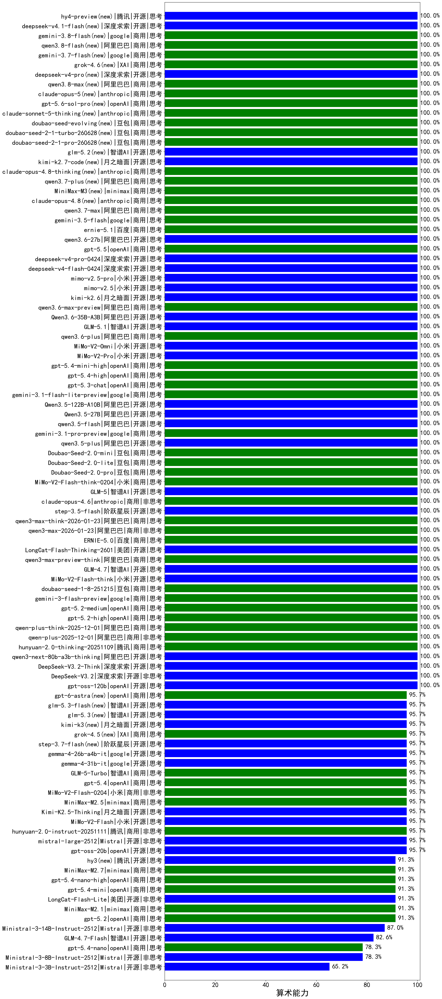

|类别|机构|大模型|【算术能力】准确率|平均耗时|平均消耗token|花费/千次（元）|排名（准确率）|
|---|---|-----|-------------------|-------|-----------|-----------|-----------|
|开源|openAI|gpt-oss-120b|100.0%|14s|379|1.1|1|
|商用|minimax|MiniMax-M3(new)|100.0%|16s|636|8.2|2|
|开源|月之暗面|kimi-k2.7-code(new)|100.0%|10s|360|9.0|3|
|开源|智谱AI|glm-5.2(new)|100.0%|57s|1038|28.3|4|
|商用|openAI|gpt-5.4-mini-high|100.0%|9s|241|6.7|5|
|商用|豆包|doubao-seed-2-1-pro-260628(new)|100.0%|134s|3011|88.5|6|
|商用|豆包|doubao-seed-2-1-turbo-260628(new)|100.0%|41s|1824|26.5|7|
|商用|openAI|gpt-5.4-high|100.0%|14s|212|19.4|8|
|商用|豆包|doubao-seed-evolving(new)|100.0%|86s|3076|90.5|9|
|商用|openAI|gpt-5.3-chat|100.0%|53s|232|20.0|10|
|商用|google|gemini-3.1-flash-lite-preview|100.0%|15s|104|0.8|11|
|开源|阿里巴巴|Qwen3.5-122B-A10B|100.0%|165s|3547|22.5|12|
|开源|阿里巴巴|Qwen3.5-27B|100.0%|179s|4005|19.1|13|
|开源|阿里巴巴|qwen3.5-flash|100.0%|118s|2374|4.7|14|
|商用|google|gemini-3.1-pro-preview|100.0%|36s|1025|85.2|15|
|开源|阿里巴巴|qwen3.5-plus|100.0%|59s|4994|23.8|16|
|商用|豆包|Doubao-Seed-2.0-mini|100.0%|118s|531|0.9|17|
|商用|anthropic|claude-opus-4.8-thinking(new)|100.0%|5s|274|42.2|18|
|开源|小米|MiMo-V2-Pro|100.0%|690s|1327|24.0|19|
|开源|小米|MiMo-V2-Omni|100.0%|575s|1612|19.4|20|
|开源|深度求索|deepseek-v4-flash-0424|100.0%|29s|533|1.0|21|
|商用|阿里巴巴|qwen3.7-max|100.0%|31s|643|22.2|22|
|商用|google|gemini-3.5-flash|100.0%|7s|1114|68.6|23|
|商用|百度|ernie-5.1|100.0%|20s|671|11.7|24|
|开源|阿里巴巴|qwen3.6-27b|100.0%|43s|2656|47.2|25|
|商用|openAI|gpt-5.5|100.0%|25s|132|22.0|26|
|开源|深度求索|deepseek-v4-pro-0424|100.0%|27s|474|11.0|27|
|开源|小米|mimo-v2.5-pro|100.0%|17s|739|11.6|28|
|商用|阿里巴巴|qwen3.6-plus|100.0%|33s|1471|17.3|29|
|开源|小米|mimo-v2.5|100.0%|25s|1879|23.2|30|
|开源|月之暗面|kimi-k2.6|100.0%|132s|1501|39.9|31|
|商用|阿里巴巴|qwen3.6-max-preview|100.0%|36s|1168|61.3|32|
|开源|阿里巴巴|Qwen3.6-35B-A3B|100.0%|153s|2112|22.4|33|
|开源|智谱AI|GLM-5.1|100.0%|69s|1436|33.9|34|
|商用|阿里巴巴|qwen3.7-plus(new)|100.0%|15s|717|5.5|35|
|商用|豆包|Doubao-Seed-2.0-lite|100.0%|88s|478|1.5|36|
|商用|豆包|Doubao-Seed-2.0-pro|100.0%|130s|588|8.4|37|
|商用|小米|MiMo-V2-Flash-think-0204|100.0%|858s|5413|11.3|38|
|开源|深度求索|deepseek-v4-pro(new)|100.0%|559s|790|19.4|39|
|开源|深度求索|DeepSeek-V3.2|100.0%|135s|236|0.7|40|
|开源|深度求索|DeepSeek-V3.2-Think|100.0%|26s|807|2.4|41|
|开源|阿里巴巴|qwen3-next-80b-a3b-thinking|100.0%|107s|1109|4.3|42|
|商用|google|gemini-3.8-flash(new)|100.0%|17s|531|26.6|43|
|商用|阿里巴巴|qwen3.8-flash(new)|100.0%|36s|360|0.8|44|
|商用|google|gemini-3.7-flash(new)|100.0%|4s|620|15.6|45|
|商用|腾讯|hunyuan-2.0-thinking-20251109|100.0%|9s|860|3.4|46|
|商用|XAI|grok-4.6(new)|100.0%|38s|942|33.1|47|
|商用|阿里巴巴|qwen-plus-2025-12-01|100.0%|13s|502|1.0|48|
|商用|阿里巴巴|qwen-plus-think-2025-12-01|100.0%|24s|1200|9.3|49|
|商用|openAI|gpt-5.2-high|100.0%|4s|242|21.2|50|
|商用|openAI|gpt-5.2-medium|100.0%|7s|205|17.6|51|
|商用|google|gemini-3-flash-preview|100.0%|15s|930|19.3|52|
|商用|anthropic|claude-sonnet-5-thinking(new)|100.0%|10s|331|20.8|53|
|商用|豆包|doubao-seed-1-8-251215|100.0%|15s|327|2.1|54|
|开源|小米|MiMo-V2-Flash-think|100.0%|79s|4964|0.0|55|
|商用|阿里巴巴|qwen3-max-2026-01-23|100.0%|5s|162|1.3|56|
|商用|openAI|gpt-5.6-sol-pro(new)|100.0%|6s|2005|109.9|57|
|开源|智谱AI|GLM-5|100.0%|67s|1823|32.4|58|
|商用|anthropic|claude-opus-4.6|100.0%|5s|232|34.6|59|
|开源|阶跃星辰|step-3.5-flash|100.0%|21s|1374|2.8|60|
|开源|智谱AI|GLM-4.7|100.0%|35s|1638|22.6|61|
|商用|阿里巴巴|qwen3-max-think-2026-01-23|100.0%|352s|2126|21.0|62|
|商用|百度|ERNIE-5.0|100.0%|371s|4152|99.1|63|
|开源|美团|LongCat-Flash-Thinking-2601|100.0%|206s|2752|0.0|64|
|商用|anthropic|claude-opus-5(new)|100.0%|6s|330|51.9|65|
|商用|阿里巴巴|qwen3-max-preview-think|100.0%|29s|1038|24.2|66|
|商用|阿里巴巴|qwen3.8-max(new)|100.0%|14s|349|10.7|67|
|商用|anthropic|claude-opus-4.8(new)|100.0%|4s|185|26.6|68|
|开源|月之暗面|kimi-k3(new)|95.7%|23s|412|32.4|69|
|开源|智谱AI|glm-5.3(new)|95.7%|22s|564|15.0|70|
|开源|智谱AI|glm-5.3-flash(new)|95.7%|27s|481|1.3|71|
|开源|阶跃星辰|step-3.7-flash(new)|95.7%|7s|608|4.7|72|
|商用|XAI|grok-4.5(new)|95.7%|74s|973|34.4|73|
|商用|智谱AI|GLM-5-Turbo|95.7%|18s|875|18.7|74|
|开源|google|gemma-4-26b-a4b-it|95.7%|6s|164|0.4|75|
|商用|小米|MiMo-V2-Flash-0204|95.7%|196s|236|0.4|76|
|开源|Mistral|mistral-large-2512|95.7%|7s|292|2.9|77|
|商用|腾讯|hunyuan-2.0-instruct-20251111|95.7%|9s|380|0.7|78|
|开源|小米|MiMo-V2-Flash|95.7%|52s|202|0.0|79|
|开源|月之暗面|Kimi-K2.5-Thinking|95.7%|326s|1985|41.1|80|
|开源|google|gemma-4-31b-it|95.7%|13s|138|0.3|81|
|商用|minimax|MiniMax-M2.5|95.7%|26s|1271|10.3|82|
|商用|openAI|gpt-5.4|95.7%|2s|79|5.5|83|
|开源|openAI|gpt-oss-20b|95.7%|74s|871|1.0|84|
|商用|openAI|gpt-6-astra(new)|95.7%|12s|89|22.1|85|
|开源|腾讯|hy3(new)|91.3%|34s|152|0.5|86|
|开源|美团|LongCat-Flash-Lite|91.3%|250s|366|0.0|87|
|商用|openAI|gpt-5.4-mini|91.3%|54s|78|1.6|88|
|商用|minimax|MiniMax-M2.1|91.3%|38s|1699|13.8|89|
|商用|openAI|gpt-5.2|91.3%|3s|83|5.4|90|
|商用|openAI|gpt-5.4-nano-high|91.3%|112s|329|2.6|91|
|商用|minimax|MiniMax-M2.7|91.3%|92s|5231|43.5|92|
|开源|Mistral|Ministral-3-14B-Instruct-2512|87.0%|14s|206|0.3|93|
|开源|智谱AI|GLM-4.7-Flash|82.6%|1985s|1230|0.0|94|
|商用|openAI|gpt-5.4-nano|78.3%|3s|96|0.6|95|
|开源|Mistral|Ministral-3-8B-Instruct-2512|78.3%|12s|286|0.3|96|
|开源|Mistral|Ministral-3-3B-Instruct-2512|65.2%|11s|280|0.2|97|

