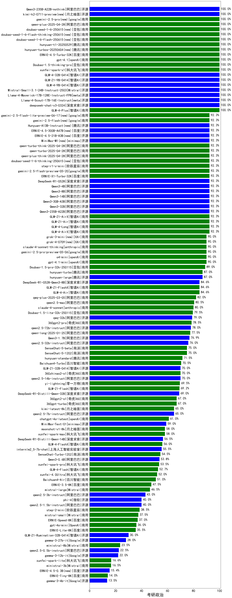

|类别|机构|大模型|【考研政治】准确率|平均耗时|平均消耗token|花费/千次（元）|排名（准确率）|
|---|---|-----|-------------------|-------|-----------|-----------|-----------|
|商用|openAI|gpt-5.1-medium(new)|100.0%|203s|639|40.0|1|
|开源|阿里巴巴|qwen3-235b-a22b-instruct-2507|100.0%|12s|516|3.7|2|
|商用|豆包|doubao-seed-1-6-flash-250615|100.0%|5s|345|0.4|3|
|商用|豆包|doubao-seed-1-6-flash-thinking-250615|100.0%|9s|527|0.6|4|
|商用|豆包|doubao-seed-1-6-250615|100.0%|129s|478|3.0|5|
|开源|深度求索|DeepSeek-V3.2-Exp-Think(new)|100.0%|54s|1274|3.8|6|
|商用|google|gemini-2.5-pro|100.0%|42s|2030|142.4|7|
|开源|月之暗面|kimi-k2-0711-preview|100.0%|29s|523|7.5|8|
|商用|腾讯|hunyuan-t1-20250711|100.0%|19s|1146|4.3|9|
|开源|深度求索|DeepSeek-V3.2-Exp(new)|100.0%|40s|321|0.9|10|
|商用|豆包|doubao-seed-1-6-thinking-250715|100.0%|22s|1159|8.8|11|
|商用|百度|ERNIE-4.5-Turbo-32K|100.0%|22s|533|1.6|12|
|商用|百川智能|Baichuan4-Air|100.0%|/|/|/|13|
|商用|阿里巴巴|qwen3-max-preview|100.0%|10s|512|11.0|14|
|商用|阿里巴巴|qwen-plus-2025-07-28|100.0%|11s|530|1.0|15|
|开源|阿里巴巴|Qwen3-32B-nothink|100.0%|18s|548|2.0|16|
|开源|阿里巴巴|Qwen3-30B-A3B-Instruct-2507|100.0%|5s|598|1.6|17|
|开源|阶跃星辰|step-3|100.0%|102s|2024|7.9|18|
|开源|智谱AI|GLM-4.5-Air-nothink|100.0%|19s|1105|6.3|19|
|商用|智谱AI|GLM-4.5-Flash-nothink|100.0%|19s|1024|0.0|20|
|商用|腾讯|hunyuan-turbos-20250926(new)|100.0%|16s|652|1.2|21|
|商用|阿里巴巴|qwen-flash-2025-07-28|100.0%|9s|624|0.8|22|
|商用|豆包|doubao-seed-1-6-lite-251015(new)|100.0%|20s|867|1.9|23|
|商用|百川智能|Baichuan4-Turbo|100.0%|/|/|/|24|
|商用|豆包|Doubao-1.5-lite-32k-250115|100.0%|8s|312|0.2|25|
|商用|360|360zhinao2-o1|100.0%|/|/|/|26|
|开源|google|gemma-3-27b-it|100.0%|/|/|/|27|
|商用|豆包|doubao-seed-1-6-251015(new)|100.0%|7s|713|5.0|28|
|开源|google|gemma-3-4b-it|100.0%|/|/|/|29|
|开源|google|gemma-3-12b-it|100.0%|/|/|/|30|
|开源|智谱AI|GLM-4-9B-0414|100.0%|10s|632|0.0|31|
|开源|阿里巴巴|Qwen3-8B|92.3%|144s|3315|0.0|32|
|开源|阿里巴巴|Qwen3-32B|92.3%|200s|1456|5.6|33|
|开源|阿里巴巴|Qwen3-14B|92.3%|163s|3136|6.2|34|
|商用|百度|ERNIE-X1-Turbo-32K|92.3%|34s|805|3.0|35|
|开源|百度|ERNIE-4.5-21B-A3B|92.3%|68s|404|0.0|36|
|开源|minimax|MiniMax-M1|92.3%|136s|2965|20.5|37|
|商用|google|gemini-2.5-flash|92.3%|9s|1426|24.6|38|
|开源|腾讯|Hunyuan-A13B-Instruct|92.3%|53s|732|2.7|39|
|开源|百度|ERNIE-4.5-300B-A47B|92.3%|29s|368|2.5|40|
|开源|深度求索|DeepSeek-R1-0528|92.3%|130s|1451|22.4|41|
|开源|阿里巴巴|Qwen3-4B|92.3%|112s|1443|4.1|42|
|开源|阿里巴巴|Qwen3-30B-A3B-Thinking-2507|90.0%|52s|1917|5.2|43|
|商用|anthropic|claude-4-sonnet-thinking|90.0%|50s|1181|116.9|44|
|商用|openAI|o4-mini|90.0%|15s|649|18.4|45|
|商用|XAI|grok-3-mini|90.0%|261s|1005|3.5|46|
|商用|XAI|grok-4-0709|90.0%|186s|1001|101.6|47|
|开源|深度求索|DeepSeek-R1-0528-Qwen3-8B|84.6%|304s|1392|0.0|48|
|商用|阿里巴巴|qwen-turbo-think-2025-07-15|80.0%|/|2381|6.9|49|
|开源|豆包|Seed-OSS-36B-Instruct|80.0%|127s|2073|8.1|50|
|开源|智谱AI|GLM-4.6(new)|80.0%|52s|2220|30.3|51|
|商用|Mistral|mistral-medium-2508|80.0%|22s|525|6.6|52|
|开源|minimax|MiniMax-M2(new)|80.0%|41s|1310|10.4|53|
|商用|google|gemini-2.5-flash-lite|80.0%|2s|520|1.4|54|
|开源|深度求索|DeepSeek-V3.1-Think|80.0%|86s|1669|19.5|55|
|开源|深度求索|DeepSeek-V3.1|80.0%|23s|441|4.8|56|
|开源|阿里巴巴|qwen3-next-80b-a3b-instruct|80.0%|8s|657|2.4|57|
|开源|月之暗面|Kimi-K2-Thinking(new)|80.0%|72s|1369|21.1|58|
|商用|阿里巴巴|qwen-flash-think-2025-07-28|80.0%|26s|2765|4.1|59|
|商用|openAI|gpt-5.1(new)|80.0%|537s|323|17.6|60|
|商用|openAI|gpt-5-nano-2025-08-07|80.0%|36s|2217|6.2|61|
|商用|阿里巴巴|qwen-plus-think-2025-07-28|80.0%|/|1863|14.4|62|
|商用|阿里巴巴|qwen-long-2025-01-25|80.0%|69s|390|0.7|63|
|商用|科大讯飞|xunfei-spark-x1-0725|80.0%|/|1095|13.1|64|
|开源|腾讯|Hunyuan-A13B-Instruct-nothink|80.0%|20s|498|1.8|65|
|开源|meta|Llama-4-Scout-17B-16E-Instruct|80.0%|39s|574|1.1|66|
|开源|智谱AI|GLM-4.5-nothink|80.0%|17s|644|8.2|67|
|开源|智谱AI|GLM-4.5|80.0%|69s|1754|23.8|68|
|开源|智谱AI|GLM-4.5-Air|80.0%|25s|1359|7.8|69|
|商用|智谱AI|GLM-4.5-Flash|80.0%|28s|1541|0.0|70|
|开源|阿里巴巴|Qwen3-14B-nothink|80.0%|17s|516|0.9|71|
|开源|meta|Llama-4-Maverick-17B-128E-Instruct-FP8|80.0%|69s|683|2.7|72|
|开源|阿里巴巴|Qwen3-8B-nothink|80.0%|161s|606|0.0|73|
|开源|阿里巴巴|Qwen3-4B-nothink|80.0%|13s|453|1.2|74|
|商用|anthropic|claude-4-sonnet|80.0%|41s|602|54.0|75|
|商用|阿里巴巴|qwen-turbo-2025-07-15|80.0%|10s|404|0.2|76|
|开源|阿里巴巴|qwen3-235b-a22b-thinking-2507|80.0%|48s|2116|41.0|77|
|开源|阿里巴巴|Qwen3-1.7B|76.9%|137s|2887|8.4|78|
|开源|minimax|MiniMax-Text-01|60.0%|17s|914|3.9|79|
|商用|openAI|gpt-5-2025-08-07|60.0%|37s|356|20.7|80|
|开源|Mistral|Mistral-Small-3.2-24B-Instruct-2506|60.0%|26s|520|1.0|81|
|开源|Mistral|Magistral-Small-2507|60.0%|65s|5388|57.9|82|
|开源|openAI|gpt-oss-120b|60.0%|3s|786|2.2|83|
|开源|openAI|gpt-oss-20b|60.0%|9s|976|1.0|84|
|开源|阿里巴巴|Qwen3-1.7B-nothink|60.0%|10s|482|1.2|85|
|开源|阿里巴巴|Qwen3-0.6B|53.8%|63s|1452|4.1|86|
|商用|openAI|gpt-5-mini-2025-08-07|40.0%|27s|955|12.8|87|
|开源|阿里巴巴|Qwen3-0.6B-nothink|20.0%|9s|280|0.6|88|
|开源|百度|ERNIE-4.5-0.3B|15.4%|29s|449|0.0|89|
|商用|百度|ERNIE-Lite-8K|/%|/|/|/|90|

