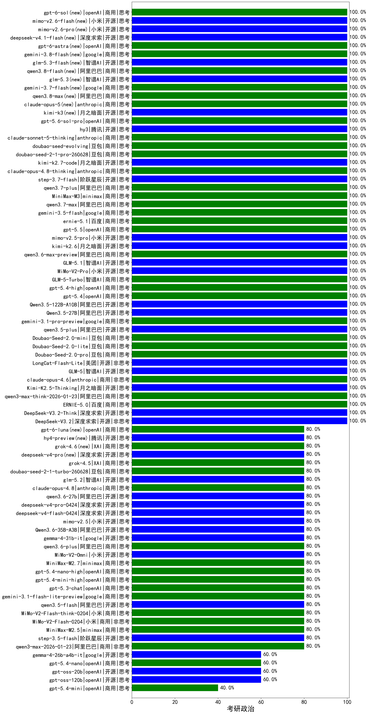

|类别|机构|大模型|【考研政治】准确率|平均耗时|平均消耗token|花费/千次（元）|排名（准确率）|
|---|---|-----|-------------------|-------|-----------|-----------|-----------|
|商用|智谱AI|GLM-5-Turbo|100.0%|18s|1242|26.2|1|
|商用|豆包|Doubao-Seed-2.0-lite|100.0%|151s|772|2.4|2|
|商用|阿里巴巴|qwen3.7-max|100.0%|37s|1042|35.8|3|
|商用|google|gemini-3.5-flash|100.0%|11s|1408|85.1|4|
|商用|百度|ernie-5.1|100.0%|28s|1083|18.6|5|
|商用|openAI|gpt-5.5|100.0%|8s|448|79.0|6|
|开源|小米|mimo-v2.5-pro|100.0%|16s|1172|20.2|7|
|开源|月之暗面|kimi-k2.6|100.0%|54s|1362|35.4|8|
|商用|阿里巴巴|qwen3.6-max-preview|100.0%|52s|1712|89.2|9|
|开源|智谱AI|GLM-5.1|100.0%|271s|2139|50.1|10|
|开源|小米|MiMo-V2-Pro|100.0%|15s|1141|19.6|11|
|商用|openAI|gpt-5.4-high|100.0%|10s|572|52.5|12|
|商用|openAI|gpt-5.4|100.0%|7s|341|28.3|13|
|开源|阿里巴巴|Qwen3.5-122B-A10B|100.0%|122s|2687|16.8|14|
|开源|阿里巴巴|Qwen3.5-27B|100.0%|349s|3029|14.2|15|
|商用|google|gemini-3.1-pro-preview|100.0%|48s|1790|147.7|16|
|开源|阿里巴巴|qwen3.5-plus|100.0%|26s|2335|10.9|17|
|商用|minimax|MiniMax-M3(new)|100.0%|39s|1104|15.6|18|
|商用|阿里巴巴|qwen3.7-plus(new)|100.0%|23s|1173|9.0|19|
|开源|阶跃星辰|step-3.7-flash(new)|100.0%|19s|2433|19.2|20|
|商用|anthropic|claude-opus-5(new)|100.0%|23s|800|125.1|21|
|商用|google|gemini-3.8-flash(new)|100.0%|50s|712|34.5|22|
|开源|智谱AI|glm-5.3-flash(new)|100.0%|35s|1670|4.5|23|
|商用|阿里巴巴|qwen3.8-flash(new)|100.0%|20s|949|2.3|24|
|开源|智谱AI|glm-5.3(new)|100.0%|36s|1026|27.2|25|
|商用|google|gemini-3.7-flash(new)|100.0%|5s|859|21.1|26|
|商用|阿里巴巴|qwen3.8-max(new)|100.0%|22s|970|32.3|27|
|开源|月之暗面|kimi-k3(new)|100.0%|35s|699|58.3|28|
|商用|anthropic|claude-opus-4.8-thinking(new)|100.0%|13s|901|142.9|29|
|商用|openAI|gpt-5.6-sol-pro(new)|100.0%|12s|3379|268.0|30|
|开源|腾讯|hy3(new)|100.0%|35s|231|0.7|31|
|商用|anthropic|claude-sonnet-5-thinking(new)|100.0%|14s|913|57.9|32|
|商用|豆包|doubao-seed-evolving(new)|100.0%|135s|5755|170.1|33|
|商用|豆包|doubao-seed-2-1-pro-260628(new)|100.0%|157s|4047|118.8|34|
|开源|月之暗面|kimi-k2.7-code(new)|100.0%|14s|561|13.8|35|
|商用|豆包|Doubao-Seed-2.0-mini|100.0%|288s|1896|3.6|36|
|商用|openAI|gpt-6-astra(new)|100.0%|16s|337|94.0|37|
|商用|豆包|Doubao-Seed-2.0-pro|100.0%|231s|977|14.2|38|
|开源|小米|MiMo-V2-Flash|100.0%|24s|482|0.0|39|
|开源|月之暗面|Kimi-K2.5-Thinking|100.0%|261s|1704|34.6|40|
|商用|阿里巴巴|qwen3-max-think-2026-01-23|100.0%|173s|3533|34.8|41|
|商用|google|gemini-3-flash-preview|100.0%|12s|1202|24.4|42|
|商用|豆包|doubao-seed-1-8-251215|100.0%|25s|708|4.9|43|
|商用|百度|ERNIE-5.0|100.0%|80s|1494|34.8|44|
|商用|腾讯|hunyuan-2.0-thinking-20251109|100.0%|10s|1120|4.3|45|
|商用|腾讯|hunyuan-2.0-instruct-20251111|100.0%|3s|414|0.7|46|
|商用|anthropic|claude-opus-4.6|100.0%|11s|654|99.6|47|
|开源|智谱AI|GLM-5|100.0%|73s|1830|32.0|48|
|开源|深度求索|DeepSeek-V3.2-Think|100.0%|39s|1155|3.4|49|
|开源|美团|LongCat-Flash-Lite|100.0%|116s|520|0.0|50|
|开源|深度求索|DeepSeek-V3.2|100.0%|101s|377|1.1|51|
|商用|openAI|gpt-5.2-medium|100.0%|10s|501|42.3|52|
|开源|智谱AI|glm-5.2(new)|80.0%|39s|1470|39.7|53|
|开源|小米|MiMo-V2-Flash-think|80.0%|18s|1702|0.0|54|
|商用|anthropic|claude-opus-4.8(new)|80.0%|10s|674|103.1|55|
|开源|智谱AI|GLM-4.7|80.0%|55s|2025|27.6|56|
|商用|阿里巴巴|qwen-plus-2025-12-01|80.0%|19s|739|1.4|57|
|商用|openAI|gpt-5.2-high|80.0%|12s|530|45.2|58|
|商用|豆包|doubao-seed-2-1-turbo-260628(new)|80.0%|141s|6738|99.8|59|
|商用|阿里巴巴|qwen-plus-think-2025-12-01|80.0%|46s|1872|14.5|60|
|商用|阿里巴巴|qwen3-max-preview-think|80.0%|211s|2293|53.7|61|
|商用|openAI|gpt-5.2|80.0%|10s|268|19.2|62|
|商用|XAI|grok-4.5(new)|80.0%|45s|1212|43.3|63|
|开源|深度求索|deepseek-v4-pro(new)|80.0%|254s|1139|28.2|64|
|商用|XAI|grok-4.6(new)|80.0%|131s|1235|44.3|65|
|开源|Mistral|mistral-large-2512|80.0%|14s|627|6.0|66|
|开源|阿里巴巴|qwen3-next-80b-a3b-thinking|80.0%|127s|2906|11.4|67|
|商用|minimax|MiniMax-M2.1|80.0%|101s|1377|10.9|68|
|开源|智谱AI|GLM-4.7-Flash|80.0%|1401s|4436|0.0|69|
|开源|阿里巴巴|qwen3.6-27b|80.0%|31s|1985|34.7|70|
|商用|openAI|gpt-5.3-chat|80.0%|24s|446|36.4|71|
|商用|google|gemini-3.1-flash-lite-preview|80.0%|6s|419|3.8|72|
|商用|minimax|MiniMax-M2.5|80.0%|20s|1017|7.9|73|
|开源|阿里巴巴|qwen3.5-flash|80.0%|245s|3698|7.3|74|
|商用|openAI|gpt-5.4-mini-high|80.0%|97s|635|17.8|75|
|商用|小米|MiMo-V2-Flash-think-0204|80.0%|1182s|2370|4.9|76|
|商用|openAI|gpt-5.4-nano-high|80.0%|14s|673|5.3|77|
|商用|minimax|MiniMax-M2.7|80.0%|38s|1530|12.2|78|
|开源|小米|MiMo-V2-Omni|80.0%|518s|1483|17.3|79|
|商用|阿里巴巴|qwen3.6-plus|80.0%|44s|2015|23.5|80|
|开源|google|gemma-4-31b-it|80.0%|72s|600|1.5|81|
|商用|小米|MiMo-V2-Flash-0204|80.0%|251s|555|1.0|82|
|开源|阿里巴巴|Qwen3.6-35B-A3B|80.0%|118s|2757|29.1|83|
|商用|阿里巴巴|qwen3-max-2026-01-23|80.0%|124s|554|5.0|84|
|开源|小米|mimo-v2.5|80.0%|14s|1150|12.6|85|
|开源|美团|LongCat-Flash-Thinking-2601|80.0%|137s|1730|0.0|86|
|开源|深度求索|deepseek-v4-flash-0424|80.0%|32s|1236|2.4|87|
|开源|深度求索|deepseek-v4-pro-0424|80.0%|35s|977|22.7|88|
|开源|阶跃星辰|step-3.5-flash|80.0%|18s|1953|4.0|89|
|开源|Mistral|Ministral-3-14B-Instruct-2512|60.0%|16s|593|0.8|90|
|商用|openAI|gpt-5.4-nano|60.0%|146s|361|2.5|91|
|开源|Mistral|Ministral-3-8B-Instruct-2512|60.0%|14s|604|0.6|92|
|开源|Mistral|Ministral-3-3B-Instruct-2512|60.0%|14s|931|0.7|93|
|开源|openAI|gpt-oss-20b|60.0%|9s|976|1.0|94|
|开源|google|gemma-4-26b-a4b-it|60.0%|95s|671|1.7|95|
|开源|openAI|gpt-oss-120b|60.0%|3s|786|2.2|96|
|商用|openAI|gpt-5.4-mini|40.0%|14s|279|6.5|97|

