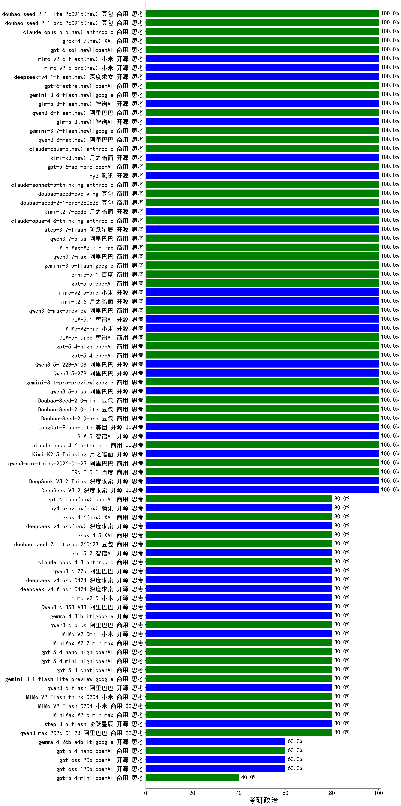

|类别|机构|大模型|【考研政治】准确率|平均耗时|平均消耗token|花费/千次（元）|排名（准确率）|
|---|---|-----|-------------------|-------|-----------|-----------|-----------|
|开源|小米|mimo-v2.5-pro|100.0%|16s|1172|20.2|1|
|开源|阶跃星辰|step-3.7-flash|100.0%|19s|2433|19.2|2|
|开源|腾讯|hy3|100.0%|35s|231|0.7|3|
|商用|anthropic|claude-sonnet-5-thinking|100.0%|14s|913|57.9|4|
|商用|豆包|doubao-seed-evolving|100.0%|135s|5755|170.1|5|
|商用|豆包|doubao-seed-2-1-pro-260628|100.0%|157s|4047|118.8|6|
|开源|月之暗面|kimi-k2.7-code|100.0%|14s|561|13.8|7|
|商用|anthropic|claude-opus-4.8-thinking|100.0%|13s|901|142.9|8|
|商用|阿里巴巴|qwen3.7-plus|100.0%|23s|1173|9.0|9|
|开源|智谱AI|GLM-5.1|100.0%|271s|2139|50.1|10|
|商用|minimax|MiniMax-M3|100.0%|39s|1104|15.6|11|
|商用|阿里巴巴|qwen3.7-max|100.0%|37s|1042|35.8|12|
|商用|google|gemini-3.5-flash|100.0%|11s|1408|85.1|13|
|商用|百度|ernie-5.1|100.0%|28s|1083|18.6|14|
|商用|openAI|gpt-5.5|100.0%|8s|448|79.0|15|
|开源|月之暗面|kimi-k2.6|100.0%|54s|1362|35.4|16|
|商用|openAI|gpt-5.6-sol-pro|100.0%|12s|3379|268.0|17|
|开源|月之暗面|kimi-k3(new)|100.0%|35s|699|58.3|18|
|商用|anthropic|claude-opus-5(new)|100.0%|23s|800|125.1|19|
|商用|阿里巴巴|qwen3.8-max(new)|100.0%|22s|970|32.3|20|
|商用|google|gemini-3.7-flash(new)|100.0%|5s|859|21.1|21|
|开源|智谱AI|glm-5.3(new)|100.0%|36s|1026|27.2|22|
|商用|阿里巴巴|qwen3.8-flash(new)|100.0%|20s|949|2.3|23|
|开源|智谱AI|glm-5.3-flash(new)|100.0%|35s|1670|4.5|24|
|商用|google|gemini-3.8-flash(new)|100.0%|50s|712|34.5|25|
|商用|openAI|gpt-6-astra(new)|100.0%|16s|337|94.0|26|
|开源|深度求索|deepseek-v4.1-flash(new)|100.0%|7s|591|4.2|27|
|开源|小米|mimo-v2.6-pro(new)|100.0%|33s|940|5.4|28|
|开源|小米|mimo-v2.6-flash(new)|100.0%|33s|762|1.5|29|
|商用|openAI|gpt-6-sol(new)|100.0%|388s|260|13.4|30|
|商用|XAI|grok-4.7(new)|100.0%|64s|3847|125.0|31|
|商用|anthropic|claude-opus-5.5(new)|100.0%|133s|674|82.2|32|
|商用|豆包|doubao-seed-2-1-pro-260915(new)|100.0%|27s|887|24.0|33|
|商用|阿里巴巴|qwen3.6-max-preview|100.0%|52s|1712|89.2|34|
|商用|豆包|doubao-seed-2-1-lite-260915(new)|100.0%|74s|608|1.5|35|
|开源|阿里巴巴|Qwen3.5-27B|100.0%|349s|3029|14.2|36|
|商用|anthropic|claude-opus-4.6|100.0%|11s|654|99.6|37|
|商用|豆包|Doubao-Seed-2.0-mini|100.0%|288s|1896|3.6|38|
|商用|豆包|Doubao-Seed-2.0-lite|100.0%|151s|772|2.4|39|
|商用|豆包|Doubao-Seed-2.0-pro|100.0%|231s|977|14.2|40|
|开源|阿里巴巴|Qwen3.5-122B-A10B|100.0%|122s|2687|16.8|41|
|商用|openAI|gpt-5.4|100.0%|7s|341|28.3|42|
|商用|openAI|gpt-5.4-high|100.0%|10s|572|52.5|43|
|商用|智谱AI|GLM-5-Turbo|100.0%|18s|1242|26.2|44|
|开源|美团|LongCat-Flash-Lite|100.0%|116s|520|0.0|45|
|开源|阿里巴巴|qwen3.5-plus|100.0%|26s|2335|10.9|46|
|开源|智谱AI|GLM-5|100.0%|73s|1830|32.0|47|
|商用|google|gemini-3.1-pro-preview|100.0%|48s|1790|147.7|48|
|开源|月之暗面|Kimi-K2.5-Thinking|100.0%|261s|1704|34.6|49|
|商用|阿里巴巴|qwen3-max-think-2026-01-23|100.0%|173s|3533|34.8|50|
|开源|小米|MiMo-V2-Pro|100.0%|15s|1141|19.6|51|
|商用|百度|ERNIE-5.0|100.0%|80s|1494|34.8|52|
|开源|深度求索|DeepSeek-V3.2-Think|100.0%|39s|1155|3.4|53|
|开源|深度求索|DeepSeek-V3.2|100.0%|101s|377|1.1|54|
|开源|阶跃星辰|step-3.5-flash|80.0%|18s|1953|4.0|55|
|开源|腾讯|hy4-preview(new)|80.0%|30s|1645|28.7|56|
|商用|小米|MiMo-V2-Flash-0204|80.0%|251s|555|1.0|57|
|商用|openAI|gpt-6-luna(new)|80.0%|369s|412|1.2|58|
|商用|阿里巴巴|qwen3-max-2026-01-23|80.0%|124s|554|5.0|59|
|商用|小米|MiMo-V2-Flash-think-0204|80.0%|1182s|2370|4.9|60|
|商用|XAI|grok-4.6(new)|80.0%|131s|1235|44.3|61|
|开源|深度求索|deepseek-v4-pro(new)|80.0%|254s|1139|28.2|62|
|商用|minimax|MiniMax-M2.5|80.0%|20s|1017|7.9|63|
|商用|阿里巴巴|qwen3.6-plus|80.0%|44s|2015|23.5|64|
|商用|XAI|grok-4.5|80.0%|45s|1212|43.3|65|
|开源|阿里巴巴|qwen3.5-flash|80.0%|245s|3698|7.3|66|
|开源|小米|MiMo-V2-Omni|80.0%|518s|1483|17.3|67|
|开源|阿里巴巴|Qwen3.6-35B-A3B|80.0%|118s|2757|29.1|68|
|商用|minimax|MiniMax-M2.7|80.0%|38s|1530|12.2|69|
|开源|小米|mimo-v2.5|80.0%|14s|1150|12.6|70|
|开源|深度求索|deepseek-v4-flash-0424|80.0%|32s|1236|2.4|71|
|开源|深度求索|deepseek-v4-pro-0424|80.0%|35s|977|22.7|72|
|商用|openAI|gpt-5.4-nano-high|80.0%|14s|673|5.3|73|
|开源|阿里巴巴|qwen3.6-27b|80.0%|31s|1985|34.7|74|
|商用|openAI|gpt-5.4-mini-high|80.0%|97s|635|17.8|75|
|商用|anthropic|claude-opus-4.8|80.0%|10s|674|103.1|76|
|商用|openAI|gpt-5.3-chat|80.0%|24s|446|36.4|77|
|商用|google|gemini-3.1-flash-lite-preview|80.0%|6s|419|3.8|78|
|开源|智谱AI|glm-5.2|80.0%|39s|1470|39.7|79|
|商用|豆包|doubao-seed-2-1-turbo-260628|80.0%|141s|6738|99.8|80|
|开源|google|gemma-4-31b-it|80.0%|72s|600|1.5|81|
|商用|openAI|gpt-5.4-nano|60.0%|146s|361|2.5|82|
|开源|openAI|gpt-oss-20b|60.0%|9s|976|1.0|83|
|开源|google|gemma-4-26b-a4b-it|60.0%|95s|671|1.7|84|
|开源|openAI|gpt-oss-120b|60.0%|3s|786|2.2|85|
|商用|openAI|gpt-5.4-mini|40.0%|14s|279|6.5|86|

