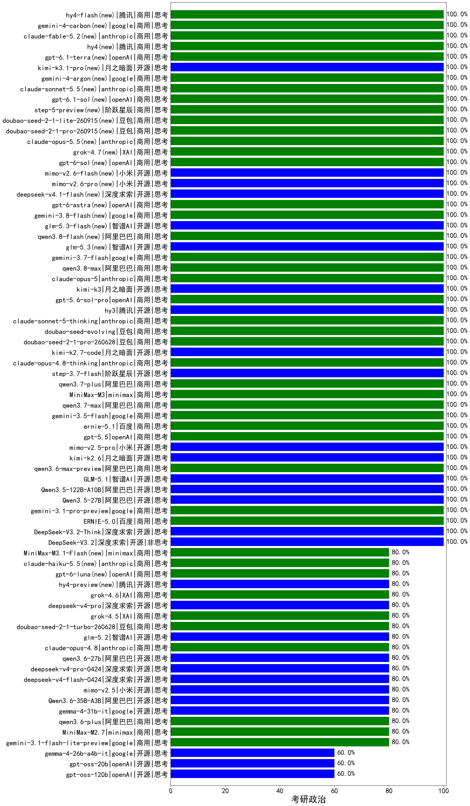

|类别|机构|大模型|【考研政治】准确率|平均耗时|平均消耗token|花费/千次（元）|排名（准确率）|
|---|---|-----|-------------------|-------|-----------|-----------|-----------|
|商用|anthropic|claude-sonnet-5-thinking|100.0%|14s|913|57.9|1|
|开源|小米|mimo-v2.6-flash(new)|100.0%|33s|762|1.5|2|
|开源|腾讯|hy3|100.0%|35s|231|0.7|3|
|商用|openAI|gpt-5.6-sol-pro|100.0%|12s|3379|268.0|4|
|开源|月之暗面|kimi-k3|100.0%|35s|699|58.3|5|
|商用|anthropic|claude-opus-5|100.0%|23s|800|125.1|6|
|商用|阿里巴巴|qwen3.8-max|100.0%|22s|970|32.3|7|
|商用|google|gemini-3.7-flash|100.0%|5s|859|21.1|8|
|开源|智谱AI|glm-5.3(new)|100.0%|36s|1026|27.2|9|
|商用|阿里巴巴|qwen3.8-flash(new)|100.0%|20s|949|2.3|10|
|开源|智谱AI|glm-5.3-flash(new)|100.0%|35s|1670|4.5|11|
|商用|google|gemini-3.8-flash(new)|100.0%|50s|712|34.5|12|
|商用|openAI|gpt-6-astra(new)|100.0%|16s|337|94.0|13|
|开源|深度求索|deepseek-v4.1-flash(new)|100.0%|7s|591|4.2|14|
|开源|小米|mimo-v2.6-pro(new)|100.0%|33s|940|5.4|15|
|商用|openAI|gpt-6-sol(new)|100.0%|388s|260|13.4|16|
|商用|豆包|doubao-seed-2-1-pro-260628|100.0%|157s|4047|118.8|17|
|商用|XAI|grok-4.7(new)|100.0%|64s|3847|125.0|18|
|商用|anthropic|claude-opus-5.5(new)|100.0%|133s|674|82.2|19|
|商用|豆包|doubao-seed-2-1-pro-260915(new)|100.0%|27s|887|24.0|20|
|商用|豆包|doubao-seed-2-1-lite-260915(new)|100.0%|74s|608|1.5|21|
|商用|阶跃星辰|step-5-preview(new)|100.0%|46s|1026|19.6|22|
|商用|openAI|gpt-6.1-sol(new)|100.0%|5s|286|15.2|23|
|商用|anthropic|claude-sonnet-5.5(new)|100.0%|7s|705|43.3|24|
|商用|google|gemini-4-argon(new)|100.0%|41s|705|88.2|25|
|开源|月之暗面|kimi-k3.1-pro(new)|100.0%|37s|1110|67.5|26|
|商用|openAI|gpt-6.1-terra(new)|100.0%|5s|310|8.5|27|
|商用|腾讯|hy4(new)|100.0%|60s|2998|53.0|28|
|商用|anthropic|claude-fable-5.2(new)|100.0%|22s|527|123.2|29|
|商用|google|gemini-4-carbon(new)|100.0%|22s|1022|132.5|30|
|商用|豆包|doubao-seed-evolving|100.0%|135s|5755|170.1|31|
|商用|腾讯|hy4-flash(new)|100.0%|7s|898|1.7|32|
|商用|google|gemini-3.5-flash|100.0%|11s|1408|85.1|33|
|开源|阿里巴巴|Qwen3.5-27B|100.0%|349s|3029|14.2|34|
|开源|小米|mimo-v2.5-pro|100.0%|16s|1172|20.2|35|
|开源|月之暗面|kimi-k2.6|100.0%|54s|1362|35.4|36|
|开源|阿里巴巴|Qwen3.5-122B-A10B|100.0%|122s|2687|16.8|37|
|商用|openAI|gpt-5.5|100.0%|8s|448|79.0|38|
|商用|百度|ernie-5.1|100.0%|28s|1083|18.6|39|
|开源|智谱AI|GLM-5.1|100.0%|271s|2139|50.1|40|
|商用|阿里巴巴|qwen3.6-max-preview|100.0%|52s|1712|89.2|41|
|商用|阿里巴巴|qwen3.7-max|100.0%|37s|1042|35.8|42|
|商用|google|gemini-3.1-pro-preview|100.0%|48s|1790|147.7|43|
|商用|minimax|MiniMax-M3|100.0%|39s|1104|15.6|44|
|商用|阿里巴巴|qwen3.7-plus|100.0%|23s|1173|9.0|45|
|商用|百度|ERNIE-5.0|100.0%|80s|1494|34.8|46|
|开源|阶跃星辰|step-3.7-flash|100.0%|19s|2433|19.2|47|
|开源|深度求索|DeepSeek-V3.2-Think|100.0%|39s|1155|3.4|48|
|商用|anthropic|claude-opus-4.8-thinking|100.0%|13s|901|142.9|49|
|开源|深度求索|DeepSeek-V3.2|100.0%|101s|377|1.1|50|
|开源|月之暗面|kimi-k2.7-code|100.0%|14s|561|13.8|51|
|商用|minimax|MiniMax-M2.7|80.0%|38s|1530|12.2|52|
|商用|阿里巴巴|qwen3.6-plus|80.0%|44s|2015|23.5|53|
|开源|智谱AI|glm-5.2|80.0%|39s|1470|39.7|54|
|商用|google|gemini-3.1-flash-lite-preview|80.0%|6s|419|3.8|55|
|商用|anthropic|claude-haiku-5.5(new)|80.0%|6s|980|3.1|56|
|商用|minimax|MiniMax-M3.1-Flash(new)|80.0%|11s|831|2.5|57|
|开源|google|gemma-4-31b-it|80.0%|72s|600|1.5|58|
|开源|腾讯|hy4-preview(new)|80.0%|30s|1645|28.7|59|
|开源|阿里巴巴|Qwen3.6-35B-A3B|80.0%|118s|2757|29.1|60|
|商用|openAI|gpt-6-luna(new)|80.0%|369s|412|1.2|61|
|开源|小米|mimo-v2.5|80.0%|14s|1150|12.6|62|
|开源|深度求索|deepseek-v4-flash-0424|80.0%|32s|1236|2.4|63|
|开源|深度求索|deepseek-v4-pro-0424|80.0%|35s|977|22.7|64|
|开源|阿里巴巴|qwen3.6-27b|80.0%|31s|1985|34.7|65|
|商用|XAI|grok-4.6|80.0%|131s|1235|44.3|66|
|开源|深度求索|deepseek-v4-pro|80.0%|254s|1139|28.2|67|
|商用|anthropic|claude-opus-4.8|80.0%|10s|674|103.1|68|
|商用|XAI|grok-4.5|80.0%|45s|1212|43.3|69|
|商用|豆包|doubao-seed-2-1-turbo-260628|80.0%|141s|6738|99.8|70|
|开源|google|gemma-4-26b-a4b-it|60.0%|95s|671|1.7|71|
|开源|openAI|gpt-oss-20b|60.0%|9s|976|1.0|72|
|开源|openAI|gpt-oss-120b|60.0%|3s|786|2.2|73|

