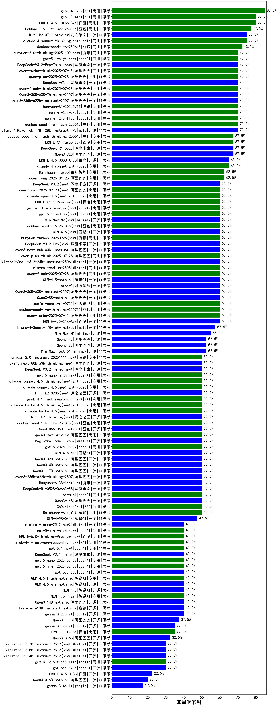

|类别|机构|大模型|【耳鼻咽喉科】准确率|平均耗时|平均消耗token|花费/千次（元）|排名（准确率）|
|---|---|-----|-------------------|-------|-----------|-----------|-----------|
|商用|豆包|Doubao-1.5-pro-32k-250115|86.0%|10s|342|0.6|1|
|商用|豆包|Doubao-1.5-lite-32k-250115|85.0%|5s|171|0.1|2|
|商用|XAI|grok-4-0709|85.0%|244s|1388|144.0|3|
|商用|科大讯飞|xunfei-spark-max|81.5%|4s|122|3.7|4|
|商用|百度|ERNIE-4.5-Turbo-32K|80.0%|21s|529|1.6|5|
|商用|XAI|grok-3-mini|80.0%|211s|996|3.5|6|
|商用|腾讯|hunyuan-turbos-20250716(new)|80.0%|10s|520|0.9|7|
|商用|科大讯飞|xunfei-4.0Ultra|77.3%|5s|115|8.1|8|
|商用|科大讯飞|xunfei-spark-pro|75.5%|/|/|/|9|
|开源|月之暗面|kimi-k2-0711-preview|75.0%|29s|504|7.3|10|
|商用|anthropic|claude-4-sonnet-thinking|75.0%|47s|1113|110.5|11|
|商用|阿里巴巴|qwen-long-2025-01-25|73.5%|7s|326|0.6|12|
|开源|meta|Llama-4-Maverick-17B-128E-Instruct-FP8|72.5%|7s|519|2.0|13|
|商用|豆包|doubao-seed-1-6-250615|72.5%|126s|436|2.8|14|
|商用|商汤|SenseChat-5-1202|71.0%|/|/|/|15|
|商用|阿里巴巴|qwq-plus-2025-03-05|70.5%|67s|2687|10.6|16|
|商用|百川智能|Baichuan4-Turbo|70.5%|/|/|/|17|
|商用|豆包|doubao-seed-1-6-flash-250615|70.0%|4s|275|0.3|18|
|商用|月之暗面|kimi-latest-8k|70.0%|15s|491|5.9|19|
|商用|奇虎360|360gpt2-pro|70.0%|9s|234|0.9|20|
|商用|腾讯|hunyuan-t1-20250711|70.0%|23s|1395|5.3|21|
|商用|google|gemini-2.5-pro|70.0%|45s|2399|169.6|22|
|商用|google|gemini-2.5-flash|70.0%|10s|1754|30.7|23|
|商用|阿里巴巴|qwen-plus-2025-07-14|70.0%|10s|422|0.8|24|
|开源|阿里巴巴|Qwen3-30B-A3B-Thinking-2507(new)|70.0%|58s|2436|6.7|25|
|开源|阿里巴巴|qwen3-235b-a22b-instruct-2507(new)|70.0%|12s|460|3.3|26|
|开源|深度求索|DeepSeek-V3.1(new)|70.0%|20s|285|3.0|27|
|商用|阿里巴巴|qwen-flash-think-2025-07-28(new)|70.0%|28s|3048|4.5|28|
|开源|阿里巴巴|qwq-32b|69.0%|50s|2644|15.6|29|
|开源|深度求索|DeepSeek-R1-0528|67.5%|241s|1875|29.3|30|
|商用|百度|ERNIE-X1-Turbo-32K|67.5%|113s|2267|8.9|31|
|开源|阿里巴巴|Qwen3-32B|67.5%|28s|1020|3.9|32|
|商用|豆包|doubao-seed-1-6-flash-thinking-250615|67.5%|6s|498|0.6|33|
|开源|深度求索|DeepSeek-R1-Distill-Qwen-32B|66.0%|40s|762|1.0|34|
|商用|零一万物|yi-lightning|65.5%|/|/|/|35|
|开源|百度|ERNIE-4.5-300B-A47B|65.0%|24s|317|2.1|36|
|商用|anthropic|claude-4-sonnet|65.0%|40s|571|51.6|37|
|开源|minimax|MiniMax-Text-01|63.5%|13s|894|7.2|38|
|商用|百度|ERNIE-3.5-8K|63.0%|17s|335|0.6|39|
|商用|奇虎360|360zhinao2-o1|62.5%|/|/|/|40|
|开源|智谱AI|GLM-Z1-32B-0414|62.5%|185s|2670|10.5|41|
|开源|深度求索|deepseek-chat-v3-0324|62.5%|84s|300|2.1|42|
|开源|深度求索|DeepSeek-R1-Distill-Qwen-14B|61.0%|/|/|/|43|
|商用|奇虎360|360gpt2-o1|60.5%|14s|295|12.1|44|
|商用|阶跃星辰|step-2-mini|60.1%|9s|312|0.6|45|
|商用|阿里巴巴|qwen-turbo-2025-07-15|60.0%|9s|356|0.2|46|
|商用|科大讯飞|xunfei-spark-x1-0725(new)|60.0%|/|802|9.6|47|
|商用|豆包|doubao-seed-1-6-thinking-250715(new)|60.0%|32s|1457|11.2|48|
|开源|百度|ERNIE-4.5-21B-A3B|60.0%|35s|306|0.0|49|
|开源|阿里巴巴|Qwen3-8B-nothink|60.0%|20s|482|0.0|50|
|商用|阿里巴巴|qwen-flash-2025-07-28(new)|60.0%|5s|460|0.6|51|
|开源|阶跃星辰|step-3(new)|60.0%|80s|1574|6.1|52|
|开源|智谱AI|GLM-4.5-nothink|60.0%|19s|693|9.0|53|
|开源|阿里巴巴|Qwen3-30B-A3B-Instruct-2507(new)|60.0%|4s|475|1.3|54|
|商用|百川智能|Baichuan4-Air|59.0%|/|/|/|55|
|开源|minimax|MiniMax-M1|57.5%|184s|2409|18.0|56|
|开源|meta|Llama-4-Scout-17B-16E-Instruct|57.5%|8s|517|1.0|57|
|商用|Mistral|mistral-large|56.0%|/|/|/|58|
|开源|智谱AI|GLM-4-32B-0414|55.0%|13s|369|0.7|59|
|开源|阿里巴巴|Qwen3-8B|52.5%|144s|4389|0.0|60|
|开源|阿里巴巴|Qwen3-4B|52.5%|21s|1601|4.6|61|
|商用|百度|ERNIE-Speed-8K|50.5%|/|/|/|62|
|开源|阿里巴巴|Qwen3-14B|50.0%|29s|1606|3.1|63|
|开源|阿里巴巴|Qwen3-32B-nothink|50.0%|26s|456|1.6|64|
|商用|openAI|gpt-5-2025-08-07(new)|50.0%|23s|284|16.0|65|
|商用|智谱AI|GLM-Z1-Flash|50.0%|26s|2042|0.0|66|
|开源|阿里巴巴|Qwen3-4B-nothink|50.0%|14s|421|1.1|67|
|开源|华为|pangu-pro-moe|50.0%|79s|1486|5.7|68|
|开源|腾讯|Hunyuan-A13B-Instruct|50.0%|44s|1019|3.9|69|
|商用|openAI|o4-mini|50.0%|33s|780|22.8|70|
|开源|深度求索|DeepSeek-R1-0528-Qwen3-8B|50.0%|239s|1517|0.0|71|
|开源|智谱AI|GLM-4.5-Air(new)|50.0%|30s|1591|9.2|72|
|开源|阿里巴巴|Qwen3-1.7B-nothink|50.0%|13s|396|1.0|73|
|开源|阿里巴巴|qwen3-235b-a22b-thinking-2507(new)|50.0%|139s|3510|69.0|74|
|开源|智谱AI|GLM-4-9B-0414|47.5%|12s|451|0.0|75|
|开源|Google|gemma-3-27b-it|46.0%|/|/|/|76|
|商用|Mistral|mistral-small|45.5%|/|/|/|77|
|商用|百度|ERNIE-Lite-8K|45.5%|/|/|/|78|
|开源|Google|gemma-3-12b-it|44.5%|/|/|/|79|
|开源|openAI|gpt-oss-20b(new)|40.0%|5s|1047|1.1|80|
|开源|深度求索|DeepSeek-V3.1-Think(new)|40.0%|50s|933|10.7|81|
|商用|openAI|gpt-5-mini-2025-08-07(new)|40.0%|117s|724|9.5|82|
|开源|腾讯|Hunyuan-A13B-Instruct-nothink|40.0%|184s|378|1.3|83|
|开源|智谱AI|GLM-4.5(new)|40.0%|88s|2117|29.0|84|
|商用|智谱AI|GLM-4.5-Flash-nothink|40.0%|23s|955|0.0|85|
|开源|智谱AI|GLM-Z1-9B-0414|40.0%|148s|3237|0.0|86|
|商用|openAI|gpt-5-nano-2025-08-07(new)|40.0%|21s|1857|5.2|87|
|开源|智谱AI|GLM-4.5-Air-nothink|40.0%|13s|956|5.4|88|
|开源|阿里巴巴|Qwen3-14B-nothink|40.0%|9s|461|0.8|89|
|商用|智谱AI|GLM-4.5-Flash(new)|40.0%|20s|1232|0.0|90|
|开源|阿里巴巴|Qwen3-1.7B|37.5%|19s|1917|5.6|91|
|开源|Mistral|Mistral-Small-3.1-24B-Instruct-2503|35.0%|/|/|/|92|
|开源|Google|gemma-3-4b-it|33.5%|/|/|/|93|
|商用|Mistral|ministral-8b|32.5%|/|/|/|94|
|开源|阿里巴巴|Qwen3-0.6B|32.5%|6s|1140|3.2|95|
|商用|google|gemini-2.5-flash-lite(new)|30.0%|2s|440|1.1|96|
|开源|openAI|gpt-oss-120b(new)|30.0%|119s|645|1.8|97|
|商用|科大讯飞|xunfei-spark-lite|29.7%|/|/|/|98|
|商用|Mistral|ministral-3b|25.5%|/|/|/|99|
|商用|百度|ERNIE-Tiny-8K|25.0%|/|/|/|100|
|开源|百度|ERNIE-4.5-0.3B|22.5%|33s|367|0.0|101|
|开源|阿里巴巴|Qwen3-0.6B-nothink|20.0%|11s|215|0.5|102|

