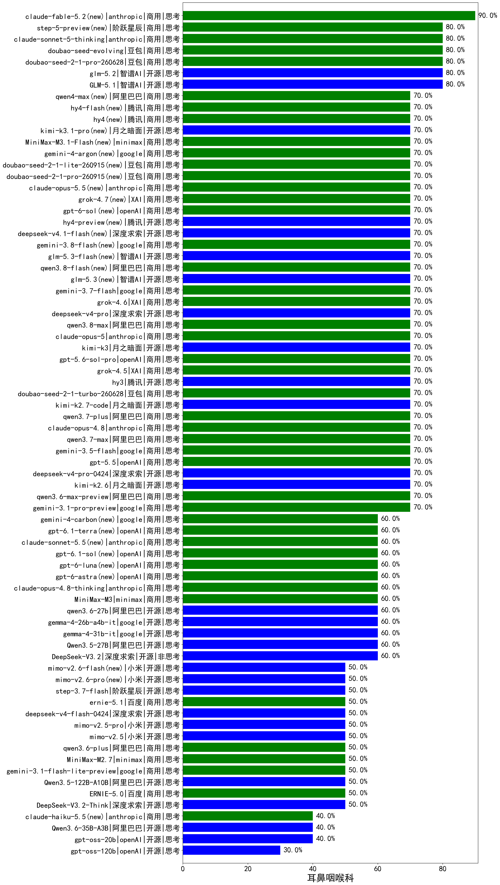

|类别|机构|大模型|【耳鼻咽喉科】准确率|平均耗时|平均消耗token|花费/千次（元）|排名（准确率）|
|---|---|-----|-------------------|-------|-----------|-----------|-----------|
|商用|anthropic|claude-fable-5.2(new)|90.0%|15s|589|144.3|1|
|商用|anthropic|claude-sonnet-5-thinking|80.0%|16s|787|50.0|2|
|商用|阶跃星辰|step-5-preview(new)|80.0%|32s|2169|42.6|3|
|商用|豆包|doubao-seed-evolving|80.0%|212s|8534|253.7|4|
|开源|智谱AI|glm-5.2|80.0%|42s|1906|52.0|5|
|开源|智谱AI|GLM-5.1|80.0%|151s|1533|35.7|6|
|商用|豆包|doubao-seed-2-1-pro-260628|80.0%|237s|8332|247.7|7|
|商用|google|gemini-4-argon(new)|70.0%|17s|381|43.5|8|
|商用|google|gemini-3.7-flash|70.0%|8s|862|21.4|9|
|商用|豆包|doubao-seed-2-1-turbo-260628|70.0%|171s|6762|100.3|10|
|商用|腾讯|hy4(new)|70.0%|115s|5979|106.7|11|
|开源|腾讯|hy3|70.0%|98s|209|0.6|12|
|商用|XAI|grok-4.5|70.0%|116s|1534|57.2|13|
|商用|openAI|gpt-5.6-sol-pro|70.0%|58s|3259|254.3|14|
|开源|月之暗面|kimi-k3|70.0%|205s|446|33.8|15|
|商用|anthropic|claude-opus-5|70.0%|19s|699|109.9|16|
|商用|阿里巴巴|qwen3.8-max|70.0%|13s|473|14.6|17|
|开源|深度求索|deepseek-v4-pro|70.0%|66s|609|14.0|18|
|商用|XAI|grok-4.6|70.0%|24s|1358|49.8|19|
|开源|智谱AI|glm-5.3(new)|70.0%|45s|1722|46.9|20|
|商用|豆包|doubao-seed-2-1-lite-260915(new)|70.0%|62s|1517|3.9|21|
|商用|阿里巴巴|qwen3.8-flash(new)|70.0%|12s|581|1.4|22|
|开源|智谱AI|glm-5.3-flash(new)|70.0%|54s|1858|5.1|23|
|开源|月之暗面|kimi-k3.1-pro(new)|70.0%|39s|1396|87.5|24|
|开源|深度求索|deepseek-v4.1-flash(new)|70.0%|14s|1350|10.3|25|
|开源|腾讯|hy4-preview(new)|70.0%|76s|3272|58.0|26|
|商用|minimax|MiniMax-M3.1-Flash(new)|70.0%|35s|961|3.1|27|
|商用|openAI|gpt-6-sol(new)|70.0%|277s|225|11.4|28|
|商用|XAI|grok-4.7(new)|70.0%|46s|2787|80.8|29|
|商用|anthropic|claude-opus-5.5(new)|70.0%|71s|711|89.2|30|
|商用|豆包|doubao-seed-2-1-pro-260915(new)|70.0%|37s|1051|29.2|31|
|商用|google|gemini-3.8-flash(new)|70.0%|28s|775|38.2|32|
|商用|腾讯|hy4-flash(new)|70.0%|9s|1356|2.6|33|
|开源|月之暗面|kimi-k2.7-code|70.0%|59s|1079|28.0|34|
|商用|阿里巴巴|qwen3.7-max|70.0%|20s|965|33.3|35|
|商用|google|gemini-3.1-pro-preview|70.0%|32s|1501|123.6|36|
|开源|深度求索|deepseek-v4-pro-0424|70.0%|17s|582|13.3|37|
|商用|openAI|gpt-5.5|70.0%|7s|417|73.8|38|
|商用|阿里巴巴|qwen3.6-max-preview|70.0%|56s|1678|87.8|39|
|商用|google|gemini-3.5-flash|70.0%|11s|1463|89.0|40|
|商用|anthropic|claude-opus-4.8|70.0%|9s|494|73.8|41|
|商用|阿里巴巴|qwen3.7-plus|70.0%|19s|944|7.2|42|
|开源|月之暗面|kimi-k2.6|70.0%|106s|1560|41.0|43|
|开源|google|gemma-4-26b-a4b-it|60.0%|56s|540|1.4|44|
|商用|openAI|gpt-6-luna(new)|60.0%|122s|477|1.5|45|
|商用|anthropic|claude-sonnet-5.5(new)|60.0%|9s|497|29.7|46|
|开源|google|gemma-4-31b-it|60.0%|20s|488|1.2|47|
|商用|anthropic|claude-opus-4.8-thinking|60.0%|10s|698|109.6|48|
|开源|阿里巴巴|Qwen3.5-27B|60.0%|442s|4846|23.0|49|
|商用|openAI|gpt-6.1-sol(new)|60.0%|7s|202|9.8|50|
|商用|openAI|gpt-6.1-terra(new)|60.0%|5s|247|6.5|51|
|商用|openAI|gpt-6-astra(new)|60.0%|12s|239|61.8|52|
|开源|阿里巴巴|qwen3.6-27b|60.0%|28s|1679|29.3|53|
|商用|minimax|MiniMax-M3|60.0%|19s|526|6.0|54|
|开源|深度求索|DeepSeek-V3.2|60.0%|76s|273|0.8|55|
|商用|google|gemini-4-carbon(new)|60.0%|19s|1031|134.6|56|
|商用|百度|ERNIE-5.0|50.0%|316s|2034|47.9|57|
|商用|google|gemini-3.1-flash-lite-preview|50.0%|23s|363|3.3|58|
|开源|深度求索|DeepSeek-V3.2-Think|50.0%|105s|1085|3.2|59|
|开源|阿里巴巴|Qwen3.5-122B-A10B|50.0%|297s|4148|26.2|60|
|开源|小米|mimo-v2.6-pro(new)|50.0%|224s|1893|11.2|61|
|商用|minimax|MiniMax-M2.7|50.0%|32s|1292|10.3|62|
|商用|阿里巴巴|qwen3.6-plus|50.0%|33s|1496|17.3|63|
|开源|小米|mimo-v2.6-flash(new)|50.0%|41s|1379|2.7|64|
|开源|小米|mimo-v2.5|50.0%|25s|1635|19.5|65|
|开源|小米|mimo-v2.5-pro|50.0%|27s|1469|26.6|66|
|开源|深度求索|deepseek-v4-flash-0424|50.0%|26s|803|1.6|67|
|商用|百度|ernie-5.1|50.0%|18s|718|12.2|68|
|开源|阶跃星辰|step-3.7-flash|50.0%|40s|3064|24.4|69|
|开源|阿里巴巴|Qwen3.6-35B-A3B|40.0%|111s|1673|17.5|70|
|商用|anthropic|claude-haiku-5.5(new)|40.0%|25s|677|2.1|71|
|开源|openAI|gpt-oss-20b|40.0%|5s|1047|1.1|72|
|开源|openAI|gpt-oss-120b|30.0%|119s|645|1.8|73|

