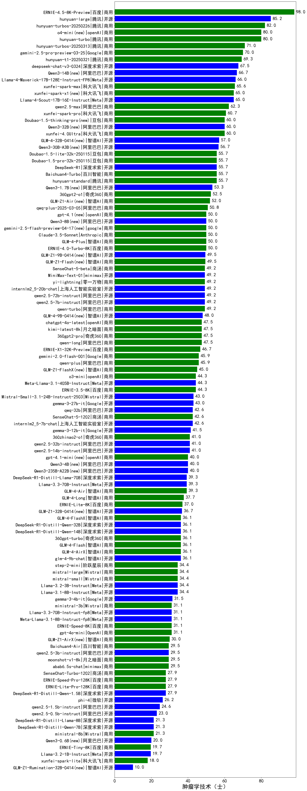

|类别|机构|大模型|【肿瘤学技术（士）】准确率|平均耗时|平均消耗token|花费/千次（元）|排名（准确率）|
|---|---|-----|-------------------|-------|-----------|-----------|-----------|
|商用|豆包|doubao-seed-1-6-thinking-250715|100.0%|27s|1094|8.3|1|
|开源|月之暗面|kimi-k2-0905(new)|100.0%|117s|422|5.7|2|
|商用|腾讯|hunyuan-2.0-instruct-20251111(new)|100.0%|7s|499|0.9|3|
|商用|阿里巴巴|qwen-plus-2025-07-28|100.0%|13s|412|0.7|4|
|商用|阿里巴巴|qwen3-max-2025-09-23(new)|100.0%|213s|421|8.9|5|
|商用|百度|ERNIE-4.5-Turbo-32K|90.0%|23s|607|1.8|6|
|开源|深度求索|DeepSeek-V3.2-Exp(new)|80.0%|453s|306|0.9|7|
|开源|阿里巴巴|qwen3-next-80b-a3b-instruct|80.0%|10s|521|1.9|8|
|商用|阿里巴巴|qwen3-max-preview|80.0%|9s|432|9.1|9|
|商用|Mistral|mistral-medium-2508|80.0%|29s|472|5.9|10|
|开源|深度求索|DeepSeek-V3.1-Think|80.0%|70s|1263|14.7|11|
|开源|百度|ERNIE-4.5-300B-A47B|80.0%|11s|340|2.2|12|
|开源|深度求索|DeepSeek-V3.1|80.0%|17s|335|3.5|13|
|商用|阿里巴巴|qwen-flash-2025-07-28|80.0%|8s|417|0.5|14|
|商用|openAI|gpt-5-nano-2025-08-07|80.0%|31s|1488|4.1|15|
|商用|openAI|gpt-5-mini-2025-08-07|80.0%|19s|693|9.1|16|
|开源|openAI|gpt-oss-120b|80.0%|36s|440|1.1|17|
|商用|智谱AI|GLM-4.5-Flash|80.0%|31s|1944|0.0|18|
|开源|阿里巴巴|qwen3-235b-a22b-thinking-2507|80.0%|81s|3255|63.9|19|
|开源|深度求索|DeepSeek-V3.2-Exp-Think(new)|80.0%|483s|1127|3.3|20|
|开源|阶跃星辰|step-3|80.0%|112s|2225|8.7|21|
|开源|阿里巴巴|qwen3-235b-a22b-instruct-2507|80.0%|11s|466|3.3|22|
|商用|openAI|o4-mini|80.0%|38s|1154|34.8|23|
|开源|阿里巴巴|qwen3-next-80b-a3b-thinking(new)|80.0%|94s|4605|18.2|24|
|开源|深度求索|DeepSeek-V3.2-Think(new)|80.0%|197s|1665|4.9|25|
|开源|深度求索|DeepSeek-V3.2(new)|80.0%|112s|345|1.0|26|
|商用|openAI|gpt-5-nano-high(new)|80.0%|494s|3770|10.7|27|
|商用|openAI|gpt-5-mini-high(new)|80.0%|796s|1802|25.2|28|
|商用|百度|ERNIE-5.0-Thinking-Preview(new)|80.0%|161s|1982|46.5|29|
|商用|anthropic|claude-sonnet-4.5-thinking(new)|80.0%|18s|1155|115.4|30|
|商用|anthropic|claude-sonnet-4.5(new)|80.0%|14s|505|47.2|31|
|商用|google|gemini-3-pro-preview(new)|80.0%|47s|1481|121.6|32|
|商用|XAI|grok-4-1-fast-reasoning(new)|80.0%|104s|1289|4.1|33|
|商用|anthropic|claude-haiku-4.5(new)|80.0%|10s|546|16.8|34|
|开源|minimax|MiniMax-M2(new)|80.0%|27s|1760|14.2|35|
|商用|豆包|doubao-seed-1-6-251015(new)|80.0%|15s|749|5.3|36|
|商用|腾讯|hunyuan-turbos-20250926(new)|80.0%|12s|530|0.9|37|
|开源|阿里巴巴|Qwen3-14B|75.0%|33s|1304|2.5|38|
|商用|豆包|doubao-seed-1-6-250615|75.0%|168s|427|2.6|39|
|商用|XAI|grok-4-0709|70.0%|577s|1519|158.4|40|
|商用|anthropic|claude-4-sonnet|70.0%|46s|664|62.2|41|
|商用|阿里巴巴|qwen-long-2025-01-25|65.0%|7s|287|0.5|42|
|商用|豆包|doubao-seed-1-6-flash-thinking-250615|65.0%|5s|745|0.9|43|
|开源|豆包|Seed-OSS-36B-Instruct|60.0%|113s|2122|8.3|44|
|商用|openAI|gpt-5.1-medium(new)|60.0%|146s|381|22.3|45|
|开源|百度|ERNIE-4.5-21B-A3B|60.0%|56s|313|0.0|46|
|商用|阿里巴巴|qwen-turbo-think-2025-07-15|60.0%|/|2692|7.9|47|
|商用|豆包|doubao-seed-1-6-flash-250615|60.0%|2s|276|0.3|48|
|商用|阿里巴巴|qwen-turbo-2025-07-15|60.0%|8s|329|0.2|49|
|开源|智谱AI|GLM-4.6(new)|60.0%|58s|2295|31.4|50|
|商用|豆包|doubao-seed-1-6-lite-251015(new)|60.0%|27s|675|1.4|51|
|开源|月之暗面|Kimi-K2-Thinking(new)|60.0%|155s|1405|21.7|52|
|商用|anthropic|claude-haiku-4.5-thinking(new)|60.0%|107s|2201|75.9|53|
|商用|XAI|grok-3-mini|60.0%|153s|1185|4.2|54|
|开源|阿里巴巴|Qwen3-32B|60.0%|27s|1295|4.9|55|
|商用|openAI|gpt-5.1-high(new)|60.0%|30s|897|59.0|56|
|开源|meta|Llama-4-Maverick-17B-128E-Instruct-FP8|60.0%|10s|514|2.0|57|
|商用|百度|ERNIE-X1.1-Preview(new)|60.0%|168s|1143|4.4|58|
|商用|anthropic|claude-opus-4.5(new)|60.0%|18s|572|89.2|59|
|开源|Mistral|mistral-large-2512(new)|60.0%|13s|452|4.2|60|
|开源|Mistral|Ministral-3-14B-Instruct-2512(new)|60.0%|11s|373|0.5|61|
|商用|百川智能|Baichuan4-Turbo|60.0%|/|/|/|62|
|商用|阿里巴巴|qwen-flash-think-2025-07-28|60.0%|36s|3952|5.8|63|
|商用|腾讯|hunyuan-2.0-thinking-20251109(new)|60.0%|18s|1256|4.9|64|
|商用|openAI|gpt-5-2025-08-07|60.0%|15s|297|17.1|65|
|开源|智谱AI|GLM-4.5|60.0%|116s|1841|25.1|66|
|商用|腾讯|hunyuan-t1-20250711|60.0%|26s|1651|6.3|67|
|商用|科大讯飞|xunfei-spark-x1-0725|60.0%|/|1177|14.1|68|
|开源|阿里巴巴|Qwen3-8B-nothink|60.0%|18s|358|0.0|69|
|开源|阿里巴巴|Qwen3-32B-nothink|60.0%|18s|544|2.0|70|
|开源|智谱AI|GLM-4.5-Air|60.0%|39s|2256|13.2|71|
|商用|google|gemini-2.5-pro|60.0%|29s|2283|160.1|72|
|开源|openAI|gpt-oss-20b|60.0%|13s|1116|1.2|73|
|商用|google|gemini-2.5-flash|55.0%|11s|1949|34.0|74|
|开源|阿里巴巴|Qwen3-1.7B|55.0%|23s|1747|5.0|75|
|开源|minimax|MiniMax-Text-01|55.0%|12s|906|7.3|76|
|开源|meta|Llama-4-Scout-17B-16E-Instruct|55.0%|11s|533|1.1|77|
|商用|百度|ERNIE-X1-Turbo-32K|55.0%|150s|2777|10.9|78|
|开源|深度求索|DeepSeek-R1-0528|55.0%|254s|2290|35.7|79|
|商用|豆包|Doubao-1.5-lite-32k-250115|50.0%|3s|182|0.1|80|
|开源|智谱AI|GLM-4-9B-0414|50.0%|10s|437|0.0|81|
|商用|anthropic|claude-4-sonnet-thinking|50.0%|57s|1845|190.8|82|
|开源|月之暗面|kimi-k2-0711-preview|50.0%|27s|490|7.0|83|
|开源|阿里巴巴|Qwen3-8B|45.0%|604s|17502|0.0|84|
|商用|360|360zhinao2-o1|45.0%|/|/|/|85|
|开源|深度求索|DeepSeek-R1-0528-Qwen3-8B|45.0%|294s|2098|0.0|86|
|开源|阿里巴巴|Qwen3-14B-nothink|40.0%|12s|520|0.9|87|
|开源|阿里巴巴|Qwen3-0.6B-nothink|40.0%|24s|207|0.4|88|
|商用|XAI|grok-4-1-fast-non-reasoning(new)|40.0%|100s|573|1.5|89|
|开源|Mistral|Magistral-Small-2507|40.0%|107s|9445|102.1|90|
|开源|minimax|MiniMax-M1|40.0%|270s|4814|35.3|91|
|开源|阿里巴巴|Qwen3-4B|40.0%|24s|1714|4.9|92|
|开源|阿里巴巴|Qwen3-30B-A3B-Thinking-2507|40.0%|85s|3853|10.6|93|
|开源|Mistral|Mistral-Small-3.2-24B-Instruct-2506|40.0%|129s|425|0.8|94|
|商用|阿里巴巴|qwen-plus-think-2025-07-28|40.0%|/|4037|31.8|95|
|开源|智谱AI|GLM-4.5-nothink|40.0%|21s|565|7.2|96|
|商用|openAI|gpt-5.1(new)|40.0%|246s|201|9.5|97|
|开源|腾讯|Hunyuan-A13B-Instruct-nothink|40.0%|12s|327|1.1|98|
|开源|阿里巴巴|Qwen3-30B-A3B-Instruct-2507|40.0%|3s|427|1.1|99|
|商用|百川智能|Baichuan4-Air|35.0%|/|/|/|100|
|开源|腾讯|Hunyuan-A13B-Instruct|35.0%|86s|1305|5.0|101|
|开源|google|gemma-3-4b-it|35.0%|/|/|/|102|
|开源|google|gemma-3-27b-it|30.0%|/|/|/|103|
|开源|阿里巴巴|Qwen3-4B-nothink|20.0%|16s|412|1.0|104|
|开源|阿里巴巴|Qwen3-1.7B-nothink|20.0%|16s|445|1.1|105|
|开源|阿里巴巴|Qwen3-0.6B|20.0%|6s|1207|3.4|106|
|开源|智谱AI|GLM-4.5-Air-nothink|20.0%|14s|965|5.4|107|
|商用|百度|ERNIE-Lite-8K|20.0%|/|/|/|108|
|商用|智谱AI|GLM-4.5-Flash-nothink|20.0%|20s|1002|0.0|109|
|商用|google|gemini-2.5-flash-lite|20.0%|40s|13298|38.4|110|
|开源|Mistral|Ministral-3-8B-Instruct-2512(new)|20.0%|14s|474|0.5|111|
|开源|Mistral|Ministral-3-3B-Instruct-2512(new)|20.0%|13s|576|0.4|112|
|开源|百度|ERNIE-4.5-0.3B|10.0%|53s|343|0.0|113|
|开源|google|gemma-3-12b-it|5.0%|/|/|/|114|

