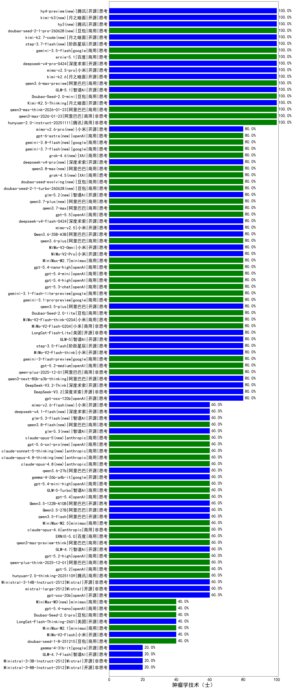

|类别|机构|大模型|【肿瘤学技术（士）】准确率|平均耗时|平均消耗token|花费/千次（元）|排名（准确率）|
|---|---|-----|-------------------|-------|-----------|-----------|-----------|
|开源|月之暗面|kimi-k2.6|100.0%|128s|1985|52.3|1|
|开源|月之暗面|kimi-k3(new)|100.0%|33s|763|64.9|2|
|商用|阿里巴巴|qwen3.6-max-preview|100.0%|51s|1436|74.5|3|
|开源|小米|mimo-v2.5-pro|100.0%|21s|1230|21.5|4|
|开源|深度求索|deepseek-v4-pro-0424|100.0%|45s|1330|31.2|5|
|商用|百度|ernie-5.1|100.0%|22s|774|13.1|6|
|商用|google|gemini-3.5-flash|100.0%|12s|1399|84.7|7|
|开源|阶跃星辰|step-3.7-flash|100.0%|15s|2055|16.2|8|
|开源|月之暗面|kimi-k2.7-code|100.0%|46s|1591|41.6|9|
|商用|豆包|doubao-seed-2-1-pro-260628|100.0%|229s|7938|235.6|10|
|开源|智谱AI|GLM-5.1|100.0%|265s|2059|48.3|11|
|商用|豆包|Doubao-Seed-2.0-mini|100.0%|365s|1583|3.0|12|
|开源|腾讯|hy3|100.0%|102s|211|0.6|13|
|开源|月之暗面|Kimi-K2.5-Thinking|100.0%|304s|1741|35.5|14|
|商用|阿里巴巴|qwen3-max-2026-01-23|100.0%|43s|395|3.4|15|
|商用|阿里巴巴|qwen3-max-think-2026-01-23|100.0%|141s|3586|35.3|16|
|开源|腾讯|hy4-preview(new)|100.0%|93s|3516|62.4|17|
|商用|阿里巴巴|qwen3.7-plus|80.0%|23s|1002|7.6|18|
|商用|openAI|gpt-6-sol(new)|80.0%|80s|276|15.0|19|
|开源|小米|mimo-v2.5|80.0%|12s|1181|13.1|20|
|商用|openAI|gpt-6-luna(new)|80.0%|122s|573|1.8|21|
|开源|深度求索|deepseek-v4-flash-0424|80.0%|60s|1033|2.0|22|
|开源|小米|mimo-v2.6-pro(new)|80.0%|29s|957|5.5|23|
|商用|openAI|gpt-5.5|80.0%|7s|370|64.4|24|
|商用|阿里巴巴|qwen3.7-max|80.0%|24s|1124|38.8|25|
|开源|深度求索|deepseek-v4-pro(new)|80.0%|356s|647|14.9|26|
|商用|阿里巴巴|qwen3.8-max(new)|80.0%|37s|1565|53.8|27|
|开源|智谱AI|glm-5.2|80.0%|51s|2281|62.4|28|
|商用|openAI|gpt-6-astra(new)|80.0%|10s|234|60.6|29|
|商用|豆包|doubao-seed-2-1-turbo-260628|80.0%|224s|12988|193.6|30|
|商用|豆包|doubao-seed-evolving|80.0%|174s|7000|207.5|31|
|商用|google|gemini-3.8-flash(new)|80.0%|18s|929|46.1|32|
|商用|google|gemini-3.7-flash(new)|80.0%|7s|829|20.4|33|
|商用|XAI|grok-4.5|80.0%|69s|1369|50.0|34|
|商用|XAI|grok-4.6(new)|80.0%|23s|1122|39.7|35|
|开源|阿里巴巴|Qwen3.6-35B-A3B|80.0%|117s|1713|17.9|36|
|开源|openAI|gpt-oss-120b|80.0%|36s|440|1.1|37|
|商用|google|gemini-3.1-pro-preview|80.0%|24s|1426|116.9|38|
|商用|openAI|gpt-5.4-mini|80.0%|71s|206|4.5|39|
|商用|豆包|Doubao-Seed-2.0-lite|80.0%|196s|859|2.8|40|
|开源|阿里巴巴|qwen3.5-plus|80.0%|36s|2541|11.9|41|
|商用|小米|MiMo-V2-Flash-0204|80.0%|353s|440|0.8|42|
|开源|美团|LongCat-Flash-Lite|80.0%|91s|365|0.0|43|
|商用|google|gemini-3.1-flash-lite-preview|80.0%|31s|300|2.6|44|
|商用|openAI|gpt-5.3-chat|80.0%|69s|297|22.6|45|
|开源|智谱AI|GLM-5|80.0%|58s|2051|36.0|46|
|商用|openAI|gpt-5.4-high|80.0%|16s|859|83.6|47|
|开源|阶跃星辰|step-3.5-flash|80.0%|23s|2211|4.5|48|
|商用|小米|MiMo-V2-Flash-think-0204|80.0%|1263s|2377|4.9|49|
|开源|深度求索|DeepSeek-V3.2-Think|80.0%|197s|1665|4.9|50|
|商用|openAI|gpt-5.4-nano-high|80.0%|12s|561|4.3|51|
|商用|minimax|MiniMax-M2.7|80.0%|42s|1556|12.5|52|
|开源|小米|MiMo-V2-Pro|80.0%|307s|927|15.1|53|
|开源|深度求索|DeepSeek-V3.2|80.0%|112s|345|1.0|54|
|开源|小米|MiMo-V2-Omni|80.0%|134s|1385|15.9|55|
|商用|阿里巴巴|qwen3.6-plus|80.0%|42s|1384|15.9|56|
|商用|百度|ERNIE-5.0|60.0%|187s|2480|58.5|57|
|开源|小米|mimo-v2.6-flash(new)|60.0%|250s|737|1.4|58|
|商用|anthropic|claude-opus-5(new)|60.0%|12s|606|93.8|59|
|商用|anthropic|claude-opus-4.6|60.0%|18s|489|73.1|60|
|开源|智谱AI|glm-5.3-flash(new)|60.0%|97s|3001|8.3|61|
|商用|阿里巴巴|qwen3.8-flash(new)|60.0%|72s|3146|8.3|62|
|开源|智谱AI|glm-5.3(new)|60.0%|267s|8666|241.2|63|
|商用|minimax|MiniMax-M2.5|60.0%|31s|1569|12.6|64|
|开源|深度求索|deepseek-v4.1-flash(new)|60.0%|40s|930|6.9|65|
|开源|google|gemma-4-26b-a4b-it|60.0%|20s|489|1.2|66|
|商用|openAI|gpt-5.4|60.0%|3s|228|17.3|67|
|商用|openAI|gpt-5.6-sol-pro|60.0%|15s|3092|235.6|68|
|开源|openAI|gpt-oss-20b|60.0%|13s|1116|1.2|69|
|商用|openAI|gpt-5.4-mini-high|60.0%|84s|927|27.2|70|
|开源|阿里巴巴|qwen3.6-27b|60.0%|26s|1545|26.8|71|
|商用|智谱AI|GLM-5-Turbo|60.0%|33s|1805|38.6|72|
|商用|anthropic|claude-opus-4.8|60.0%|10s|358|50.5|73|
|商用|XAI|grok-4.7(new)|60.0%|80s|6372|231.1|74|
|商用|anthropic|claude-opus-4.8-thinking|60.0%|22s|425|62.3|75|
|开源|阿里巴巴|Qwen3.5-122B-A10B|60.0%|337s|2865|18.0|76|
|开源|阿里巴巴|Qwen3.5-27B|60.0%|168s|3104|14.6|77|
|开源|阿里巴巴|qwen3.5-flash|60.0%|295s|2191|4.3|78|
|商用|anthropic|claude-sonnet-5-thinking|60.0%|13s|583|36.0|79|
|商用|minimax|MiniMax-M3|40.0%|26s|656|8.1|80|
|商用|openAI|gpt-5.4-nano|40.0%|3s|205|1.2|81|
|商用|豆包|Doubao-Seed-2.0-pro|40.0%|410s|1881|28.7|82|
|开源|google|gemma-4-31b-it|20.0%|82s|465|1.2|83|

