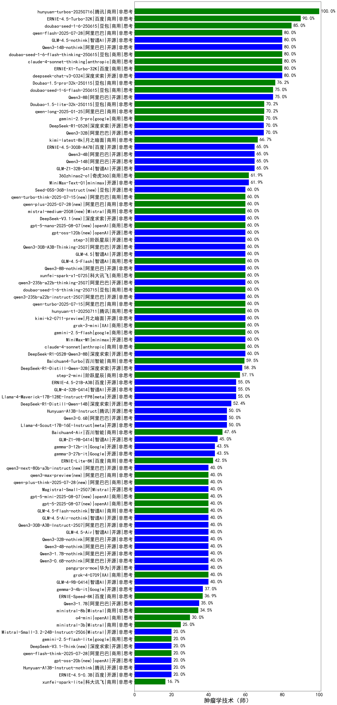

|类别|机构|大模型|【肿瘤学技术（师）】准确率|平均耗时|平均消耗token|花费/千次（元）|排名（准确率）|
|---|---|-----|-------------------|-------|-----------|-----------|-----------|
|商用|百度|ERNIE-4.5-Turbo-32K|90.0%|22s|542|1.6|1|
|商用|豆包|doubao-seed-1-6-250615|85.0%|108s|399|2.4|2|
|开源|智谱AI|GLM-4.5-nothink|80.0%|27s|1054|13.5|3|
|商用|豆包|Doubao-1.5-lite-32k-250115|80.0%|2s|177|0.1|4|
|商用|百度|ERNIE-X1-Turbo-32K|80.0%|134s|2844|11.2|5|
|开源|阿里巴巴|Qwen3-14B-nothink|80.0%|19s|601|1.0|6|
|商用|豆包|doubao-seed-1-6-flash-thinking-250615|80.0%|8s|459|0.5|7|
|商用|anthropic|claude-4-sonnet-thinking|80.0%|52s|1147|113.2|8|
|商用|阿里巴巴|qwen-flash-2025-07-28|80.0%|10s|625|0.8|9|
|商用|豆包|doubao-seed-1-6-flash-250615|75.0%|5s|367|0.4|10|
|开源|阿里巴巴|Qwen3-8B|75.0%|305s|10072|0.0|11|
|商用|google|gemini-2.5-pro|70.0%|35s|2578|182.3|12|
|开源|minimax|MiniMax-Text-01|70.0%|19s|922|7.4|13|
|开源|深度求索|DeepSeek-R1-0528|70.0%|269s|2352|36.8|14|
|开源|阿里巴巴|Qwen3-32B|70.0%|33s|1305|5.0|15|
|开源|阿里巴巴|Qwen3-4B|65.0%|23s|2062|6.0|16|
|商用|阿里巴巴|qwen-long-2025-01-25|65.0%|41s|450|0.7|17|
|开源|阿里巴巴|Qwen3-14B|65.0%|62s|2174|4.2|18|
|开源|百度|ERNIE-4.5-300B-A47B|65.0%|10s|286|1.8|19|
|开源|智谱AI|GLM-4.5|60.0%|95s|2507|33.9|20|
|商用|智谱AI|GLM-4.5-Flash|60.0%|42s|2434|0.0|21|
|开源|阿里巴巴|qwen3-235b-a22b-thinking-2507|60.0%|87s|3515|68.2|22|
|商用|豆包|doubao-seed-1-6-thinking-250715|60.0%|27s|1545|11.6|23|
|开源|阿里巴巴|qwen3-235b-a22b-instruct-2507|60.0%|15s|709|5.0|24|
|开源|阿里巴巴|Qwen3-30B-A3B-Thinking-2507|60.0%|88s|3589|9.9|25|
|开源|openAI|gpt-oss-120b|60.0%|3s|799|2.1|26|
|开源|阶跃星辰|step-3|60.0%|98s|1959|7.6|27|
|商用|腾讯|hunyuan-t1-20250711|60.0%|26s|1638|6.1|28|
|商用|openAI|gpt-5-nano-2025-08-07|60.0%|39s|2934|8.2|29|
|开源|深度求索|DeepSeek-V3.1|60.0%|20s|420|4.2|30|
|商用|Mistral|mistral-medium-2508|60.0%|102s|642|7.6|31|
|商用|阿里巴巴|qwen-plus-2025-07-28|60.0%|12s|527|0.9|32|
|商用|阿里巴巴|qwen-turbo-think-2025-07-15|60.0%|/|4049|11.8|33|
|开源|豆包|Seed-OSS-36B-Instruct|60.0%|86s|1833|7.1|34|
|开源|深度求索|DeepSeek-V3.2-Exp(new)|60.0%|33s|434|1.2|35|
|商用|腾讯|hunyuan-turbos-20250926(new)|60.0%|15s|699|1.2|36|
|开源|智谱AI|GLM-4.6(new)|60.0%|49s|2166|29.1|37|
|商用|openAI|gpt-5.1(new)|60.0%|105s|286|11.9|38|
|商用|阿里巴巴|qwen-turbo-2025-07-15|60.0%|8s|480|0.3|39|
|商用|科大讯飞|xunfei-spark-x1-0725|60.0%|/|900|10.8|40|
|开源|月之暗面|kimi-k2-0711-preview|60.0%|71s|698|10.2|41|
|商用|XAI|grok-3-mini|60.0%|145s|1135|4.0|42|
|商用|google|gemini-2.5-flash|60.0%|11s|1899|33.3|43|
|开源|深度求索|DeepSeek-R1-0528-Qwen3-8B|60.0%|188s|1505|0.0|44|
|商用|anthropic|claude-4-sonnet|60.0%|45s|554|48.8|45|
|开源|minimax|MiniMax-M1|60.0%|172s|2975|20.3|46|
|商用|百川智能|Baichuan4-Turbo|55.0%|/|/|/|47|
|商用|360|360zhinao2-o1|55.0%|/|/|/|48|
|开源|meta|Llama-4-Scout-17B-16E-Instruct|55.0%|10s|655|1.2|49|
|开源|meta|Llama-4-Maverick-17B-128E-Instruct-FP8|55.0%|8s|631|2.4|50|
|开源|百度|ERNIE-4.5-21B-A3B|50.0%|60s|299|0.0|51|
|开源|google|gemma-3-12b-it|50.0%|/|/|/|52|
|开源|阿里巴巴|Qwen3-0.6B|50.0%|5s|766|2.1|53|
|开源|腾讯|Hunyuan-A13B-Instruct|50.0%|34s|1130|4.3|54|
|商用|百川智能|Baichuan4-Air|45.0%|/|/|/|55|
|开源|google|gemma-3-4b-it|45.0%|/|/|/|56|
|开源|智谱AI|GLM-4.5-Air|40.0%|38s|2042|11.7|57|
|开源|智谱AI|GLM-4-9B-0414|40.0%|6s|418|0.0|58|
|商用|XAI|grok-4-0709|40.0%|401s|2891|306.4|59|
|商用|豆包|doubao-seed-1-6-lite-251015(new)|40.0%|50s|1218|2.6|60|
|商用|豆包|doubao-seed-1-6-251015(new)|40.0%|14s|922|6.4|61|
|开源|深度求索|DeepSeek-V3.2-Exp-Think(new)|40.0%|60s|1334|3.9|62|
|开源|阿里巴巴|qwen3-next-80b-a3b-instruct|40.0%|13s|706|2.5|63|
|商用|阿里巴巴|qwen3-max-preview|40.0%|12s|620|12.8|64|
|开源|阿里巴巴|Qwen3-0.6B-nothink|40.0%|11s|306|0.6|65|
|商用|阿里巴巴|qwen-plus-think-2025-07-28|40.0%|/|3239|25.1|66|
|开源|阿里巴巴|Qwen3-1.7B-nothink|40.0%|13s|546|1.3|67|
|开源|Mistral|Magistral-Small-2507|40.0%|550s|7202|77.2|68|
|开源|阿里巴巴|Qwen3-4B-nothink|40.0%|25s|540|1.3|69|
|商用|openAI|gpt-5.1-medium(new)|40.0%|62s|618|35.4|70|
|商用|智谱AI|GLM-4.5-Flash-nothink|40.0%|22s|1266|0.0|71|
|开源|阿里巴巴|Qwen3-30B-A3B-Instruct-2507|40.0%|7s|732|1.9|72|
|开源|阿里巴巴|Qwen3-32B-nothink|40.0%|22s|653|2.2|73|
|开源|智谱AI|GLM-4.5-Air-nothink|40.0%|15s|1096|6.0|74|
|商用|openAI|gpt-5-mini-2025-08-07|40.0%|20s|1086|14.0|75|
|商用|openAI|gpt-5-2025-08-07|40.0%|31s|459|25.1|76|
|开源|阿里巴巴|Qwen3-1.7B|35.0%|21s|2541|7.4|77|
|商用|百度|ERNIE-Lite-8K|30.0%|/|/|/|78|
|商用|openAI|o4-mini|30.0%|41s|1510|45.8|79|
|商用|google|gemini-2.5-flash-lite|20.0%|6s|1171|3.1|80|
|开源|google|gemma-3-27b-it|20.0%|/|/|/|81|
|开源|openAI|gpt-oss-20b|20.0%|9s|1340|1.4|82|
|开源|腾讯|Hunyuan-A13B-Instruct-nothink|20.0%|12s|397|1.2|83|
|开源|Mistral|Mistral-Small-3.2-24B-Instruct-2506|20.0%|121s|612|1.1|84|
|开源|阿里巴巴|Qwen3-8B-nothink|20.0%|159s|621|0.0|85|
|商用|阿里巴巴|qwen-flash-think-2025-07-28|20.0%|36s|3699|5.4|86|
|开源|minimax|MiniMax-M2(new)|20.0%|61s|2588|20.9|87|
|开源|月之暗面|Kimi-K2-Thinking(new)|20.0%|152s|2577|40.0|88|
|开源|百度|ERNIE-4.5-0.3B|20.0%|57s|326|0.0|89|
|开源|深度求索|DeepSeek-V3.1-Think|20.0%|64s|1231|13.9|90|

