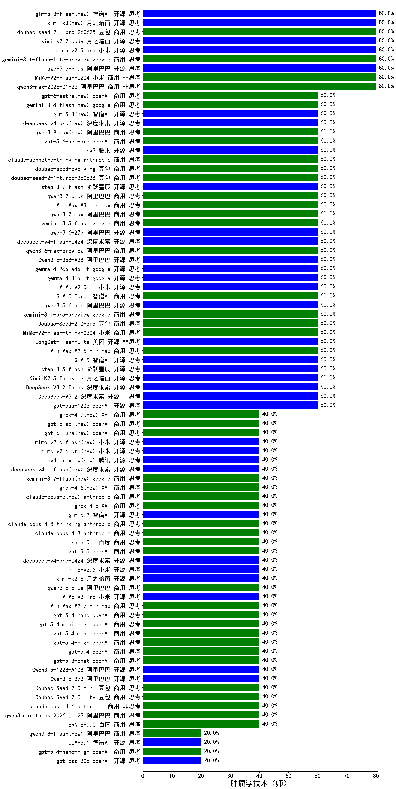

|类别|机构|大模型|【肿瘤学技术（师）】准确率|平均耗时|平均消耗token|花费/千次（元）|排名（准确率）|
|---|---|-----|-------------------|-------|-----------|-----------|-----------|
|商用|小米|MiMo-V2-Flash-0204|80.0%|555s|634|1.1|1|
|商用|阿里巴巴|qwen3-max-2026-01-23|80.0%|120s|619|5.3|2|
|商用|google|gemini-3.1-flash-lite-preview|80.0%|13s|464|3.9|3|
|开源|智谱AI|glm-5.3-flash(new)|80.0%|418s|2738|7.4|4|
|商用|阿里巴巴|qwen-plus-2025-12-01|80.0%|33s|1153|2.2|5|
|商用|豆包|doubao-seed-2-1-pro-260628(new)|80.0%|316s|11842|351.8|6|
|开源|月之暗面|kimi-k3(new)|80.0%|56s|1238|109.1|7|
|开源|阿里巴巴|qwen3.5-plus|80.0%|59s|4516|21.2|8|
|开源|小米|mimo-v2.5-pro|80.0%|30s|1925|35.4|9|
|开源|月之暗面|kimi-k2.7-code(new)|80.0%|43s|1876|48.5|10|
|商用|anthropic|claude-sonnet-5-thinking(new)|60.0%|22s|1576|101.1|11|
|开源|腾讯|hy3(new)|60.0%|31s|304|0.9|12|
|商用|google|gemini-3.1-pro-preview|60.0%|51s|2111|171.7|13|
|开源|阿里巴巴|qwen3.5-flash|60.0%|337s|5525|10.8|14|
|商用|豆包|Doubao-Seed-2.0-pro|60.0%|376s|1589|23.5|15|
|商用|豆包|doubao-seed-evolving(new)|60.0%|244s|11786|351.0|16|
|商用|小米|MiMo-V2-Flash-think-0204|60.0%|1120s|2419|4.9|17|
|商用|豆包|doubao-seed-2-1-turbo-260628(new)|60.0%|319s|14287|212.6|18|
|开源|openAI|gpt-oss-120b|60.0%|3s|799|2.1|19|
|商用|minimax|MiniMax-M2.5|60.0%|50s|2796|22.6|20|
|开源|阶跃星辰|step-3.7-flash(new)|60.0%|65s|5914|47.1|21|
|商用|阿里巴巴|qwen3.7-plus(new)|60.0%|21s|1067|7.9|22|
|商用|minimax|MiniMax-M3(new)|60.0%|23s|649|7.5|23|
|商用|阿里巴巴|qwen3.7-max|60.0%|43s|2009|69.7|24|
|开源|小米|MiMo-V2-Omni|60.0%|17s|1724|20.1|25|
|商用|google|gemini-3.5-flash|60.0%|9s|1618|95.9|26|
|开源|google|gemma-4-31b-it|60.0%|86s|582|1.4|27|
|开源|google|gemma-4-26b-a4b-it|60.0%|20s|713|1.8|28|
|开源|阿里巴巴|Qwen3.6-35B-A3B|60.0%|107s|2120|21.9|29|
|商用|阿里巴巴|qwen3.6-max-preview|60.0%|65s|2141|110.6|30|
|开源|阿里巴巴|qwen3.6-27b|60.0%|35s|2147|37.0|31|
|商用|智谱AI|GLM-5-Turbo|60.0%|42s|2169|45.9|32|
|开源|美团|LongCat-Flash-Lite|60.0%|300s|620|0.0|33|
|开源|深度求索|deepseek-v4-flash-0424|60.0%|65s|2491|4.9|34|
|开源|深度求索|DeepSeek-V3.2-Think|60.0%|200s|2230|6.6|35|
|开源|Mistral|Ministral-3-3B-Instruct-2512|60.0%|11s|919|0.7|36|
|商用|腾讯|hunyuan-2.0-instruct-20251111|60.0%|9s|571|1.0|37|
|商用|腾讯|hunyuan-2.0-thinking-20251109|60.0%|24s|1490|5.7|38|
|商用|google|gemini-3.8-flash(new)|60.0%|50s|834|38.9|39|
|商用|阿里巴巴|qwen-plus-think-2025-12-01|60.0%|121s|4268|33.3|40|
|开源|智谱AI|glm-5.3(new)|60.0%|215s|6722|185.9|41|
|开源|智谱AI|GLM-5|60.0%|91s|2574|44.8|42|
|商用|google|gemini-3-flash-preview|60.0%|14s|1640|32.9|43|
|商用|豆包|doubao-seed-1-8-251215|60.0%|38s|1107|7.8|44|
|商用|openAI|gpt-6-astra(new)|60.0%|22s|428|111.8|45|
|开源|深度求索|deepseek-v4-pro(new)|60.0%|82s|1542|38.3|46|
|商用|阿里巴巴|qwen3.8-max(new)|60.0%|48s|1980|67.7|47|
|商用|阿里巴巴|qwen3-max-preview-think|60.0%|296s|4318|101.5|48|
|开源|美团|LongCat-Flash-Thinking-2601|60.0%|220s|3429|0.0|49|
|商用|openAI|gpt-5.6-sol-pro(new)|60.0%|26s|4616|405.0|50|
|开源|月之暗面|Kimi-K2.5-Thinking|60.0%|873s|5635|116.5|51|
|开源|阶跃星辰|step-3.5-flash|60.0%|30s|3053|6.3|52|
|开源|深度求索|DeepSeek-V3.2|60.0%|110s|590|1.7|53|
|开源|深度求索|deepseek-v4.1-flash(new)|40.0%|20s|2039|15.5|54|
|开源|腾讯|hy4-preview(new)|40.0%|132s|8701|155.2|55|
|商用|openAI|gpt-5.5|40.0%|24s|1432|276.9|56|
|商用|百度|ernie-5.1|40.0%|35s|1417|24.0|57|
|开源|小米|mimo-v2.6-pro(new)|40.0%|80s|2632|15.4|58|
|开源|深度求索|deepseek-v4-pro-0424|40.0%|120s|2578|60.6|59|
|商用|anthropic|claude-opus-4.8(new)|40.0%|13s|546|72.6|60|
|开源|智谱AI|glm-5.2(new)|40.0%|91s|1990|53.4|61|
|商用|google|gemini-3.7-flash(new)|40.0%|6s|825|19.3|62|
|商用|XAI|grok-4.6(new)|40.0%|106s|4503|180.4|63|
|商用|anthropic|claude-opus-5(new)|40.0%|20s|766|111.2|64|
|商用|XAI|grok-4.5(new)|40.0%|103s|2562|98.9|65|
|商用|anthropic|claude-opus-4.8-thinking(new)|40.0%|11s|826|121.7|66|
|商用|openAI|gpt-5.4-mini-high|40.0%|135s|1929|57.2|67|
|开源|小米|mimo-v2.5|40.0%|28s|1771|20.8|68|
|商用|豆包|Doubao-Seed-2.0-mini|40.0%|552s|2436|4.6|69|
|开源|阿里巴巴|qwen3-next-80b-a3b-thinking|40.0%|191s|4909|19.3|70|
|开源|Mistral|mistral-large-2512|40.0%|15s|648|5.8|71|
|开源|Mistral|Ministral-3-8B-Instruct-2512|40.0%|5s|814|0.9|72|
|商用|openAI|gpt-5.2|40.0%|4s|267|14.7|73|
|商用|openAI|gpt-5.2-high|40.0%|16s|735|61.3|74|
|商用|openAI|gpt-5.2-medium|40.0%|11s|529|40.8|75|
|开源|小米|MiMo-V2-Flash-think|40.0%|28s|2510|0.0|76|
|开源|智谱AI|GLM-4.7|40.0%|129s|3273|44.6|77|
|商用|minimax|MiniMax-M2.1|40.0%|116s|2247|18.0|78|
|商用|百度|ERNIE-5.0|40.0%|201s|1968|45.5|79|
|商用|阿里巴巴|qwen3-max-think-2026-01-23|40.0%|179s|5343|52.5|80|
|开源|月之暗面|kimi-k2.6|40.0%|106s|2870|75.3|81|
|商用|豆包|Doubao-Seed-2.0-lite|40.0%|278s|1226|4.0|82|
|商用|anthropic|claude-opus-4.6|40.0%|12s|676|95.4|83|
|开源|阿里巴巴|Qwen3.5-27B|40.0%|431s|4518|21.2|84|
|商用|openAI|gpt-5.4-mini|40.0%|12s|319|6.5|85|
|商用|阿里巴巴|qwen3.6-plus|40.0%|50s|2385|27.5|86|
|开源|小米|MiMo-V2-Pro|40.0%|147s|1581|28.2|87|
|商用|minimax|MiniMax-M2.7|40.0%|45s|1718|13.6|88|
|开源|阿里巴巴|Qwen3.5-122B-A10B|40.0%|383s|3388|21.1|89|
|商用|openAI|gpt-5.4-nano|40.0%|12s|297|1.6|90|
|商用|openAI|gpt-5.4-high|40.0%|17s|1057|99.1|91|
|商用|openAI|gpt-5.4|40.0%|9s|292|18.8|92|
|商用|openAI|gpt-5.3-chat|40.0%|7s|487|36.1|93|
|开源|小米|mimo-v2.6-flash(new)|40.0%|101s|3033|5.9|94|
|开源|openAI|gpt-oss-20b|20.0%|9s|1340|1.4|95|
|开源|小米|MiMo-V2-Flash|20.0%|247s|529|0.0|96|
|商用|阿里巴巴|qwen3.8-flash(new)|20.0%|27s|1934|4.9|97|
|商用|openAI|gpt-5.4-nano-high|20.0%|19s|996|7.7|98|
|开源|智谱AI|GLM-4.7-Flash|20.0%|861s|5836|0.0|99|
|开源|Mistral|Ministral-3-14B-Instruct-2512|20.0%|8s|574|0.8|100|
|开源|智谱AI|GLM-5.1|20.0%|188s|2340|54.2|101|

