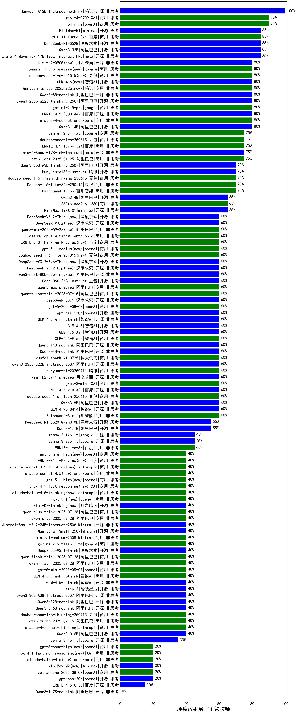

|类别|机构|大模型|【肿瘤放射治疗主管技师】准确率|平均耗时|平均消耗token|排名（准确率）|
|---|---|-----|-------------------|-------|-----------|------------|
|商用|openAI|o4-mini|90.0%|35s|906|1|
|商用|XAI|grok-4-0709(new)|90.0%|348s|2261|2|
|开源|腾讯|hunyuan-large|88.2%|9s|1124|3|
|开源|minimax|MiniMax-M1(new)|85.0%|225s|3472|4|
|开源|阿里巴巴|Qwen3-32B|85.0%|27s|998|5|
|开源|meta|Llama-4-Maverick-17B-128E-Instruct-FP8|85.0%|14s|499|6|
|商用|百度|ERNIE-X1-Turbo-32K|85.0%|92s|2198|7|
|开源|深度求索|DeepSeek-R1-0528|85.0%|253s|2380|8|
|商用|阿里巴巴|qwen-turbo-think-2025-04-28|85.0%|29s|2104|9|
|商用|豆包|doubao-seed-1-6-thinking-250615(new)|85.0%|299s|1415|10|
|商用|阿里巴巴|qwen2.5-max|82.4%|43s|493|11|
|商用|智谱AI|GLM-4-Plus|80.0%|11s|289|12|
|开源|深度求索|deepseek-chat-v3-0324|80.0%|27s|290|13|
|开源|阿里巴巴|Qwen3-14B|80.0%|29s|1707|14|
|商用|openAI|gpt-4.1-mini|80.0%|8s|367|15|
|开源|百度|ERNIE-4.5-300B-A47B(new)|80.0%|17s|305|16|
|商用|google|gemini-2.5-pro(new)|80.0%|44s|2405|17|
|商用|anthropic|claude-4-sonnet|80.0%|40s|490|18|
|商用|腾讯|hunyuan-standard|79.4%|/|/|19|
|商用|阿里巴巴|qwq-plus-2025-03-05|76.5%|72s|2631|20|
|商用|科大讯飞|xunfei-spark-max|76.5%|3s|136|21|
|商用|月之暗面|kimi-latest-8k|76.5%|28s|497|22|
|商用|阿里巴巴|qwen-plus-2025-04-28|75.0%|27s|504|23|
|商用|科大讯飞|xunfei-spark-x1|75.0%|53s|1590|24|
|开源|meta|Llama-4-Scout-17B-16E-Instruct|75.0%|101s|470|25|
|开源|阿里巴巴|Qwen3-235B-A22B|75.0%|87s|2377|26|
|开源|阿里巴巴|Qwen3-30B-A3B|75.0%|45s|2816|27|
|商用|阿里巴巴|qwen-plus-think-2025-04-28|75.0%|254s|3434|28|
|商用|豆包|doubao-seed-1-6-250615(new)|75.0%|143s|433|29|
|商用|百度|ERNIE-4.5-Turbo-32K|75.0%|22s|532|30|
|商用|腾讯|hunyuan-turbos-20250604(new)|75.0%|192s|585|31|
|商用|腾讯|hunyuan-t1-20250529|75.0%|108s|1256|32|
|商用|google|gemini-2.5-flash-lite-preview-06-17(new)|75.0%|5s|1566|33|
|商用|google|gemini-2.5-flash(new)|75.0%|9s|1737|34|
|商用|豆包|Doubao-1.5-pro-32k-250115|73.5%|7s|341|35|
|开源|阿里巴巴|qwq-32b|73.5%|67s|2769|36|
|商用|百川智能|Baichuan4-Turbo|73.5%|/|/|37|
|商用|奇虎360|360gpt2-pro|73.5%|25s|283|38|
|商用|豆包|Doubao-1.5-lite-32k-250115|70.6%|8s|344|39|
|商用|阿里巴巴|qwen-long-2025-01-25|70.6%|8s|403|40|
|商用|商汤|SenseChat-5-beta|70.6%|22s|347|41|
|商用|商汤|SenseChat-Turbo-1202|70.6%|/|/|42|
|商用|豆包|Doubao-1.5-thinking-pro|70.0%|355s|872|43|
|商用|智谱AI|GLM-Z1-AirX|70.0%|29s|2306|44|
|商用|智谱AI|GLM-4-AirX|70.0%|16s|321|45|
|商用|google|gemini-2.5-flash-preview-05-20|70.0%|67s|1670|46|
|商用|openAI|gpt-4.1|70.0%|9s|328|47|
|开源|腾讯|Hunyuan-A13B-Instruct(new)|70.0%|26s|881|48|
|商用|豆包|doubao-seed-1-6-flash-thinking-250615(new)|70.0%|6s|508|49|
|商用|google|gemini-2.5-pro-preview-05-06|70.0%|51s|3113|50|
|商用|阿里巴巴|qwen-turbo-2025-04-28|70.0%|6s|466|51|
|商用|奇虎360|360gpt2-o1|67.6%|18s|440|52|
|商用|科大讯飞|xunfei-spark-pro|67.6%|/|/|53|
|开源|上海人工智能实验室|internlm2_5-7b-chat|67.6%|/|/|54|
|开源|阿里巴巴|qwen2.5-72b-instruct|67.6%|30s|332|55|
|商用|智谱AI|GLM-4-Long|66.7%|22s|376|56|
|商用|阶跃星辰|step-r1-v-mini|65.0%|45s|1987|57|
|开源|阿里巴巴|Qwen3-4B|65.0%|22s|1203|58|
|开源|智谱AI|GLM-Z1-9B-0414|65.0%|74s|2842|59|
|商用|奇虎360|360gpt-turbo|64.7%|/|/|60|
|开源|深度求索|DeepSeek-R1-Distill-Qwen-32B|64.7%|21s|783|61|
|商用|零一万物|yi-lightning|64.7%|/|/|62|
|开源|Google|gemma-3-27b-it|62.5%|/|/|63|
|商用|奇虎360|360zhinao2-o1|61.8%|/|/|64|
|商用|商汤|SenseChat-5-1202|61.8%|/|/|65|
|开源|阿里巴巴|qwen2.5-14b-instruct|61.8%|2s|243|66|
|商用|openAI|chatgpt-4o-latest|61.8%|/|/|67|
|开源|minimax|MiniMax-Text-01|61.8%|14s|912|68|
|商用|科大讯飞|xunfei-4.0Ultra|60.0%|3s|117|69|
|商用|智谱AI|GLM-4-Air|60.0%|12s|330|70|
|商用|腾讯|hunyuan-turbo|60.0%|22s|1093|71|
|开源|百度|ERNIE-4.5-21B-A3B(new)|60.0%|56s|311|72|
|商用|XAI|grok-3-mini(new)|60.0%|133s|1000|73|
|商用|智谱AI|GLM-Z1-Air|60.0%|87s|2826|74|
|商用|豆包|doubao-seed-1-6-flash-250615(new)|60.0%|3s|308|75|
|开源|Mistral|Mistral-Small-3.1-24B-Instruct-2503|60.0%|/|/|76|
|开源|智谱AI|GLM-Z1-32B-0414|60.0%|121s|2602|77|
|开源|智谱AI|GLM-4-9B-0414|60.0%|12s|429|78|
|开源|阿里巴巴|Qwen3-8B|60.0%|175s|4733|79|
|商用|智谱AI|GLM-Z1-Flash|60.0%|22s|2477|80|
|商用|百川智能|Baichuan4-Air|58.8%|/|/|81|
|商用|Mistral|mistral-large|58.8%|/|/|82|
|开源|阿里巴巴|qwen2.5-32b-instruct|58.8%|34s|284|83|
|商用|百度|ERNIE-3.5-8K|58.8%|22s|328|84|
|开源|深度求索|DeepSeek-R1-Distill-Qwen-14B|58.8%|/|/|85|
|商用|阶跃星辰|step-2-mini|55.9%|108s|340|86|
|商用|智谱AI|GLM-4-FlashX|55.9%|26s|322|87|
|商用|智谱AI|GLM-4-Flash|55.9%|8s|316|88|
|商用|OpenAI|gpt-4o-mini|55.9%|/|/|89|
|开源|深度求索|DeepSeek-R1-0528-Qwen3-8B|55.0%|357s|1959|90|
|开源|阿里巴巴|Qwen3-1.7B|55.0%|27s|2980|91|
|商用|百度|ERNIE-Lite-8K|52.5%|/|/|92|
|开源|微软|phi-4|50.0%|/|/|93|
|商用|月之暗面|moonshot-v1-8k|50.0%|/|/|94|
|开源|阿里巴巴|qwen2.5-7b-instruct|50.0%|7s|208|95|
|开源|智谱AI|GLM-4-32B-0414|50.0%|13s|391|96|
|商用|智谱AI|GLM-Z1-FlashX|50.0%|69s|3674|97|
|开源|Google|gemma-3-12b-it|48.0%|/|/|98|
|商用|Mistral|mistral-small|47.1%|/|/|99|
|开源|智谱AI|GLM-Z1-Rumination-32B-0414|45.0%|29s|1376|100|
|开源|阿里巴巴|qwen2.5-3b-instruct|44.1%|8s|290|101|
|开源|Google|gemma-3-4b-it|42.0%|/|/|102|
|开源|阿里巴巴|qwen2.5-1.5b-instruct|41.2%|5s|157|103|
|商用|anthropic|claude-4-sonnet-thinking|40.0%|51s|1234|104|
|开源|阿里巴巴|Qwen3-0.6B|40.0%|7s|1196|105|
|商用|Mistral|ministral-8b|38.2%|/|/|106|
|商用|百度|ERNIE-Speed-8K|32.4%|/|/|107|
|开源|阿里巴巴|qwen2.5-0.5b-instruct|29.4%|10s|254|108|
|商用|科大讯飞|xunfei-spark-lite|20.6%|/|/|109|
|商用|百度|ERNIE-Tiny-8K|20.6%|/|/|110|
|开源|百度|ERNIE-4.5-0.3B(new)|20.0%|56s|373|111|
|商用|Mistral|ministral-3b|11.8%|/|/|112|

