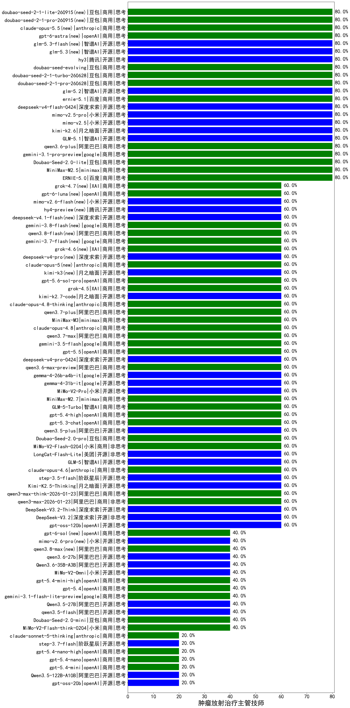

|类别|机构|大模型|【肿瘤放射治疗主管技师】准确率|平均耗时|平均消耗token|花费/千次（元）|排名（准确率）|
|---|---|-----|-------------------|-------|-----------|-----------|-----------|
|开源|小米|mimo-v2.5|80.0%|33s|2558|32.2|1|
|商用|google|gemini-3.1-pro-preview|80.0%|38s|2035|167.5|2|
|商用|openAI|gpt-6-astra(new)|80.0%|13s|318|84.6|3|
|开源|智谱AI|glm-5.3-flash(new)|80.0%|375s|1602|4.4|4|
|开源|智谱AI|glm-5.3(new)|80.0%|225s|14986|417.9|5|
|开源|腾讯|hy3|80.0%|57s|239|0.7|6|
|商用|豆包|doubao-seed-evolving|80.0%|249s|10816|321.6|7|
|商用|豆包|doubao-seed-2-1-turbo-260628|80.0%|431s|11015|163.8|8|
|商用|豆包|doubao-seed-2-1-pro-260628|80.0%|226s|9698|288.1|9|
|开源|智谱AI|glm-5.2|80.0%|62s|2264|61.7|10|
|商用|百度|ernie-5.1|80.0%|46s|1057|17.9|11|
|开源|深度求索|deepseek-v4-flash-0424|80.0%|50s|1562|3.0|12|
|开源|小米|mimo-v2.5-pro|80.0%|34s|2141|40.3|13|
|开源|月之暗面|kimi-k2.6|80.0%|106s|2731|72.1|14|
|开源|智谱AI|GLM-5.1|80.0%|186s|1646|38.1|15|
|商用|阿里巴巴|qwen3.6-plus|80.0%|27s|2058|23.9|16|
|商用|anthropic|claude-opus-5.5(new)|80.0%|16s|716|86.9|17|
|商用|豆包|Doubao-Seed-2.0-lite|80.0%|245s|1222|4.0|18|
|商用|minimax|MiniMax-M2.5|80.0%|26s|1312|10.3|19|
|商用|百度|ERNIE-5.0|80.0%|108s|2337|54.8|20|
|商用|阿里巴巴|qwen3.7-max|60.0%|33s|1598|55.5|21|
|开源|阶跃星辰|step-3.5-flash|60.0%|29s|3314|6.8|22|
|商用|XAI|grok-4.5|60.0%|71s|1560|57.7|23|
|商用|阿里巴巴|qwen3-max-2026-01-23|60.0%|14s|603|5.4|24|
|商用|阿里巴巴|qwen3-max-think-2026-01-23|60.0%|353s|3896|38.3|25|
|开源|月之暗面|Kimi-K2.5-Thinking|60.0%|443s|2617|53.6|26|
|开源|月之暗面|kimi-k2.7-code|60.0%|104s|1763|46.0|27|
|商用|anthropic|claude-opus-4.6|60.0%|19s|641|95.8|28|
|开源|月之暗面|kimi-k3(new)|60.0%|40s|989|86.4|29|
|商用|anthropic|claude-opus-4.8-thinking|60.0%|10s|615|91.3|30|
|商用|阿里巴巴|qwen3.7-plus|60.0%|33s|1777|13.7|31|
|商用|minimax|MiniMax-M3|60.0%|25s|685|8.4|32|
|商用|anthropic|claude-opus-4.8|60.0%|11s|490|69.5|33|
|商用|openAI|gpt-5.6-sol-pro|60.0%|98s|3132|228.4|34|
|商用|anthropic|claude-opus-5(new)|60.0%|13s|637|95.1|35|
|商用|google|gemini-3.5-flash|60.0%|10s|1859|112.8|36|
|开源|深度求索|deepseek-v4-pro(new)|60.0%|45s|1709|43.3|37|
|商用|XAI|grok-4.6(new)|60.0%|66s|1988|75.6|38|
|商用|google|gemini-3.7-flash(new)|60.0%|5s|729|17.4|39|
|商用|阿里巴巴|qwen3.8-flash(new)|60.0%|55s|4500|11.9|40|
|开源|深度求索|DeepSeek-V3.2-Think|60.0%|61s|1750|5.2|41|
|商用|google|gemini-3.8-flash(new)|60.0%|30s|950|46.4|42|
|开源|深度求索|DeepSeek-V3.2|60.0%|50s|484|1.4|43|
|开源|深度求索|deepseek-v4.1-flash(new)|60.0%|35s|4056|31.8|44|
|开源|腾讯|hy4-preview(new)|60.0%|109s|5832|103.9|45|
|开源|小米|mimo-v2.6-flash(new)|60.0%|37s|1186|2.3|46|
|商用|openAI|gpt-6-luna(new)|60.0%|470s|438|1.3|47|
|商用|XAI|grok-4.7(new)|60.0%|124s|9179|348.6|48|
|开源|阿里巴巴|qwen3.5-plus|60.0%|45s|3855|18.2|49|
|开源|openAI|gpt-oss-120b|60.0%|6s|681|1.8|50|
|开源|智谱AI|GLM-5|60.0%|84s|3212|56.7|51|
|开源|google|gemma-4-26b-a4b-it|60.0%|17s|503|1.2|52|
|商用|openAI|gpt-5.4-high|60.0%|19s|1137|111.0|53|
|商用|minimax|MiniMax-M2.7|60.0%|35s|1367|10.8|54|
|开源|小米|MiMo-V2-Pro|60.0%|23s|1602|29.1|55|
|商用|openAI|gpt-5.3-chat|60.0%|8s|507|41.4|56|
|商用|豆包|Doubao-Seed-2.0-pro|60.0%|273s|1291|19.1|57|
|开源|google|gemma-4-31b-it|60.0%|81s|515|1.3|58|
|商用|智谱AI|GLM-5-Turbo|60.0%|60s|1422|29.9|59|
|商用|阿里巴巴|qwen3.6-max-preview|60.0%|73s|1806|93.7|60|
|商用|小米|MiMo-V2-Flash-0204|60.0%|178s|888|1.7|61|
|开源|美团|LongCat-Flash-Lite|60.0%|59s|543|0.0|62|
|开源|深度求索|deepseek-v4-pro-0424|60.0%|63s|1497|35.0|63|
|商用|openAI|gpt-5.5|60.0%|10s|542|97.0|64|
|开源|阿里巴巴|Qwen3.5-27B|40.0%|471s|5682|26.9|65|
|商用|openAI|gpt-5.4-mini-high|40.0%|14s|1320|39.1|66|
|商用|google|gemini-3.1-flash-lite-preview|40.0%|21s|396|3.4|67|
|商用|openAI|gpt-6-sol(new)|40.0%|214s|351|19.2|68|
|开源|阿里巴巴|qwen3.5-flash|40.0%|256s|3834|7.5|69|
|商用|openAI|gpt-5.4|40.0%|4s|295|22.0|70|
|开源|小米|mimo-v2.6-pro(new)|40.0%|21s|1107|6.4|71|
|商用|阿里巴巴|qwen3.8-max(new)|40.0%|102s|4268|150.7|72|
|开源|阿里巴巴|qwen3.6-27b|40.0%|31s|1871|32.4|73|
|开源|小米|MiMo-V2-Omni|40.0%|512s|1404|16.0|74|
|商用|小米|MiMo-V2-Flash-think-0204|40.0%|420s|2943|6.0|75|
|开源|阿里巴巴|Qwen3.6-35B-A3B|40.0%|10s|1791|18.6|76|
|商用|豆包|Doubao-Seed-2.0-mini|40.0%|677s|2875|5.5|77|
|商用|openAI|gpt-5.4-mini|20.0%|53s|244|5.2|78|
|商用|openAI|gpt-5.4-nano|20.0%|12s|279|1.7|79|
|商用|openAI|gpt-5.4-nano-high|20.0%|21s|476|3.5|80|
|商用|anthropic|claude-sonnet-5-thinking|20.0%|15s|936|59.0|81|
|开源|阿里巴巴|Qwen3.5-122B-A10B|20.0%|398s|3923|24.6|82|
|开源|openAI|gpt-oss-20b|20.0%|13s|1472|1.6|83|
|开源|阶跃星辰|step-3.7-flash|20.0%|37s|5490|43.9|84|

