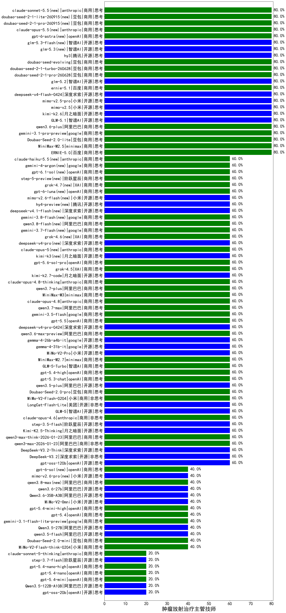

|类别|机构|大模型|【肿瘤放射治疗主管技师】准确率|平均耗时|平均消耗token|花费/千次（元）|排名（准确率）|
|---|---|-----|-------------------|-------|-----------|-----------|-----------|
|商用|豆包|doubao-seed-2-1-turbo-260628|80.0%|431s|11015|163.8|1|
|开源|小米|mimo-v2.5|80.0%|33s|2558|32.2|2|
|商用|anthropic|claude-sonnet-5.5(new)|80.0%|9s|735|44.8|3|
|商用|豆包|doubao-seed-2-1-lite-260915(new)|80.0%|40s|1629|4.2|4|
|商用|豆包|doubao-seed-2-1-pro-260915(new)|80.0%|38s|1054|28.7|5|
|商用|anthropic|claude-opus-5.5(new)|80.0%|16s|716|86.9|6|
|商用|openAI|gpt-6-astra(new)|80.0%|13s|318|84.6|7|
|开源|智谱AI|glm-5.3-flash(new)|80.0%|375s|1602|4.4|8|
|开源|智谱AI|glm-5.3(new)|80.0%|225s|14986|417.9|9|
|开源|腾讯|hy3|80.0%|57s|239|0.7|10|
|商用|豆包|doubao-seed-evolving|80.0%|249s|10816|321.6|11|
|商用|豆包|doubao-seed-2-1-pro-260628|80.0%|226s|9698|288.1|12|
|开源|智谱AI|glm-5.2|80.0%|62s|2264|61.7|13|
|商用|百度|ernie-5.1|80.0%|46s|1057|17.9|14|
|开源|深度求索|deepseek-v4-flash-0424|80.0%|50s|1562|3.0|15|
|开源|小米|mimo-v2.5-pro|80.0%|34s|2141|40.3|16|
|开源|月之暗面|kimi-k3.1-pro(new)|80.0%|96s|3094|201.8|17|
|开源|月之暗面|kimi-k2.6|80.0%|106s|2731|72.1|18|
|商用|阿里巴巴|qwen3.6-plus|80.0%|27s|2058|23.9|19|
|开源|智谱AI|GLM-5.1|80.0%|186s|1646|38.1|20|
|商用|百度|ERNIE-5.0|80.0%|108s|2337|54.8|21|
|商用|google|gemini-3.1-pro-preview|80.0%|38s|2035|167.5|22|
|开源|小米|mimo-v2.6-flash(new)|60.0%|37s|1186|2.3|23|
|开源|深度求索|deepseek-v4-pro|60.0%|45s|1709|43.3|24|
|商用|XAI|grok-4.6|60.0%|66s|1988|75.6|25|
|商用|google|gemini-3.7-flash|60.0%|5s|729|17.4|26|
|商用|阿里巴巴|qwen3.8-flash(new)|60.0%|55s|4500|11.9|27|
|商用|google|gemini-3.8-flash(new)|60.0%|30s|950|46.4|28|
|开源|深度求索|deepseek-v4.1-flash(new)|60.0%|35s|4056|31.8|29|
|开源|腾讯|hy4-preview(new)|60.0%|109s|5832|103.9|30|
|商用|XAI|grok-4.7(new)|60.0%|124s|9179|348.6|31|
|商用|openAI|gpt-6-luna(new)|60.0%|470s|438|1.3|32|
|商用|anthropic|claude-opus-5|60.0%|13s|637|95.1|33|
|开源|深度求索|DeepSeek-V3.2-Think|60.0%|61s|1750|5.2|34|
|商用|阶跃星辰|step-5-preview(new)|60.0%|101s|7035|139.6|35|
|商用|openAI|gpt-6.1-sol(new)|60.0%|6s|247|11.9|36|
|开源|深度求索|DeepSeek-V3.2|60.0%|50s|484|1.4|37|
|商用|google|gemini-4-argon(new)|60.0%|16s|784|97.5|38|
|商用|anthropic|claude-haiku-5.5(new)|60.0%|7s|980|3.1|39|
|商用|阿里巴巴|qwen3.6-max-preview|60.0%|73s|1806|93.7|40|
|开源|openAI|gpt-oss-120b|60.0%|6s|681|1.8|41|
|开源|月之暗面|kimi-k3|60.0%|40s|989|86.4|42|
|开源|月之暗面|kimi-k2.7-code|60.0%|104s|1763|46.0|43|
|开源|深度求索|deepseek-v4-pro-0424|60.0%|63s|1497|35.0|44|
|商用|openAI|gpt-5.5|60.0%|10s|542|97.0|45|
|商用|google|gemini-3.5-flash|60.0%|10s|1859|112.8|46|
|商用|阿里巴巴|qwen3.7-max|60.0%|33s|1598|55.5|47|
|商用|anthropic|claude-opus-4.8|60.0%|11s|490|69.5|48|
|商用|minimax|MiniMax-M3|60.0%|25s|685|8.4|49|
|商用|阿里巴巴|qwen3.7-plus|60.0%|33s|1777|13.7|50|
|商用|openAI|gpt-5.6-sol-pro|60.0%|98s|3132|228.4|51|
|商用|anthropic|claude-opus-4.8-thinking|60.0%|10s|615|91.3|52|
|开源|google|gemma-4-26b-a4b-it|60.0%|17s|503|1.2|53|
|开源|google|gemma-4-31b-it|60.0%|81s|515|1.3|54|
|商用|minimax|MiniMax-M2.7|60.0%|35s|1367|10.8|55|
|商用|XAI|grok-4.5|60.0%|71s|1560|57.7|56|
|开源|小米|mimo-v2.6-pro(new)|40.0%|21s|1107|6.4|57|
|开源|阿里巴巴|Qwen3.5-27B|40.0%|471s|5682|26.9|58|
|商用|openAI|gpt-6-sol(new)|40.0%|214s|351|19.2|59|
|商用|google|gemini-3.1-flash-lite-preview|40.0%|21s|396|3.4|60|
|开源|阿里巴巴|qwen3.6-27b|40.0%|31s|1871|32.4|61|
|开源|阿里巴巴|Qwen3.6-35B-A3B|40.0%|10s|1791|18.6|62|
|商用|minimax|MiniMax-M3.1-Flash(new)|40.0%|19s|1240|4.2|63|
|商用|阿里巴巴|qwen3.8-max|40.0%|102s|4268|150.7|64|
|开源|阶跃星辰|step-3.7-flash|20.0%|37s|5490|43.9|65|
|开源|阿里巴巴|Qwen3.5-122B-A10B|20.0%|398s|3923|24.6|66|
|开源|openAI|gpt-oss-20b|20.0%|13s|1472|1.6|67|
|商用|anthropic|claude-sonnet-5-thinking|20.0%|15s|936|59.0|68|

