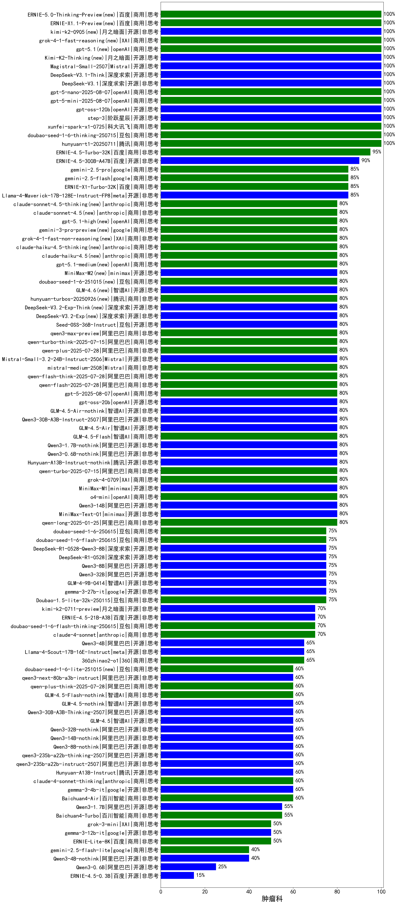

| 类别 | 大模型                         | 肿瘤科 | 排名 |
|-----|------------------------------|---------|----|
|商用|ERNIE-4.5-8K-Preview|96.0|1|
|商用|hunyuan-turbos-20250226|94.0|2|
|商用|ERNIE-4.5-Turbo-32K(new)|92.0|3|
|商用|hunyuan-turbo|89.0|4|
|开源|Qwen3-30B-A3B|86.7|5|
|商用|ERNIE-X1-Turbo-32K(new)|83.3|6|
|商用|Doubao-1.5-pro-32k-250115|83.0|7|
|商用|hunyuan-turbos-20250313|82.5|8|
|开源|Llama-4-Maverick-17B-128E-Instruct-FP8|81.0|9|
|开源|Meta-Llama-3.1-405B-Instruct|80.0|10|
|开源|hunyuan-large|80.0|11|
|商用|hunyuan-standard|80.0|12|
|商用|gemini-2.5-pro-preview-03-25|80.0|13|
|开源|Qwen3-14B|80.0|14|
|开源|Qwen3-8B|80.0|15|
|开源|Qwen3-235B-A22B|80.0|16|
|开源|Qwen3-32B|80.0|17|
|商用|o4-mini(new)|80.0|18|
|商用|gpt-4.1-mini(new)|80.0|19|
|商用|Doubao-1.5-thinking-pro(new)|80.0|20|
|商用|xunfei-spark-max|79.0|21|
|商用|xunfei-4.0Ultra|78.0|22|
|开源|DeepSeek-R1-0528(new)|76.7|23|
|开源|DeepSeek-R1-0528-Qwen3-8B(new)|76.7|24|
|开源|deepseek-chat-v3-0324|76.5|25|
|商用|qwq-plus-2025-03-05|76.5|26|
|商用|xunfei-spark-pro|75.0|27|
|开源|DeepSeek-R1|75.0|28|
|商用|xunfei-spark-x1(new)|75.0|29|
|商用|360gpt2-pro|75.0|30|
|开源|Llama-3.3-70B-Instruct|75.0|31|
|商用|hunyuan-t1-20250321|74.6|32|
|开源|qwq-32b|73.5|33|
|商用|gemini-2.5-flash-preview-04-17|73.3|34|
|商用|Doubao-1.5-lite-32k-250115|73.0|35|
|开源|qwen2.5-72b-instruct|72.0|36|
|开源|Llama-4-Scout-17B-16E-Instruct|72.0|37|
|商用|qwen2.5-max|72.0|38|
|开源|qwen2.5-32b-instruct|71.0|39|
|商用|gpt-4.1(new)|70.0|40|
|开源|GLM-Z1-32B-0414|70.0|41|
|商用|gemini-2.5-flash-preview-05-20(new)|70.0|42|
|商用|claude-4-sonnet(new)|70.0|43|
|商用|GLM-4-Air|70.0|44|
|商用|yi-lightning|70.0|45|
|开源|Llama-3.3-70B-Instruct-fp8|69.0|46|
|商用|kimi-latest-8k|69.0|47|
|开源|MiniMax-Text-01|69.0|48|
|商用|qwen-long|68.0|49|
|商用|qwen-plus|68.0|50|
|商用|GLM-4-AirX|68.0|51|
|商用|Baichuan4-Turbo|68.0|52|
|商用|GLM-4-Plus|68.0|53|
|商用|360zhinao2-o1|67.0|54|
|商用|SenseChat-5-beta|67.0|55|
|开源|DeepSeek-R1-Distill-Llama-70B|67.0|56|
|开源|Qwen3-4B|66.7|57|
|商用|GLM-Z1-AirX|66.7|58|
|商用|chatgpt-4o-latest|66.0|59|
|商用|360gpt2-o1|65.0|60|
|商用|qwen-turbo|64.0|61|
|开源|DeepSeek-R1-Distill-Qwen-32B|64.0|62|
|商用|SenseChat-Turbo-1202|63.0|63|
|开源|GLM-4-32B-0414|61.5|64|
|开源|internlm2_5-7b-chat|61.0|65|
|开源|qwen2.5-14b-instruct|61.0|66|
|商用|GLM-4-Long|60.0|67|
|商用|gemini-2.5-pro-preview-05-06(new)|60.0|68|
|商用|claude-4-sonnet-thinking(new)|60.0|69|
|商用|Claude-3.5-Sonnet|60.0|70|
|开源|gemma-3-27b-it|59.5|71|
|商用|360gpt-turbo|59.0|72|
|商用|moonshot-v1-8k|59.0|73|
|商用|gpt-4o-mini|59.0|74|
|商用|SenseChat-5-1202|59.0|75|
|开源|GLM-4-9B-0414|58.5|76|
|商用|ERNIE-3.5-8K|58.0|77|
|商用|GLM-Z1-Air|58.0|78|
|商用|step-2-mini|58.0|79|
|商用|mistral-large|57.0|80|
|开源|Qwen3-1.7B|56.7|81|
|开源|DeepSeek-R1-Distill-Qwen-14B|56.0|82|
|开源|qwen2.5-7b-instruct|55.0|83|
|商用|ERNIE-Lite-Pro-128K|55.0|84|
|开源|Mistral-Small-3.1-24B-Instruct-2503|54.5|85|
|商用|Baichuan4-Air|54.0|86|
|开源|GLM-Z1-Rumination-32B-0414|53.3|87|
|开源|GLM-Z1-9B-0414|52.5|88|
|商用|GLM-4-Flash|52.3|89|
|商用|GLM-Z1-Flash|51.5|90|
|商用|mistral-small|51.0|91|
|商用|GLM-4-FlashX|51.0|92|
|商用|ERNIE-Speed-Pro-128K|51.0|93|
|开源|phi-4|49.0|94|
|商用|GLM-Z1-FlashX|47.0|95|
|开源|qwen2.5-3b-instruct|46.0|96|
|开源|Llama-3.2-3B-Instruct|45.0|97|
|开源|gemma-3-12b-it|45.0|98|
|商用|ERNIE-Speed-8K|42.8|99|
|商用|ERNIE-Lite-8K|42.0|100|
|开源|Llama-3.1-8B-Instruct|41.0|101|
|开源|Meta-Llama-3.1-8B-Instruct-fp8|41.0|102|
|开源|qwen2.5-1.5b-instruct|37.0|103|
|商用|ERNIE-Tiny-8K|35.0|104|
|开源|DeepSeek-R1-Distill-Llama-8B|32.0|105|
|商用|ministral-8b|30.0|106|
|商用|ministral-3b|30.0|107|
|开源|qwen2.5-0.5b-instruct|29.0|108|
|开源|Llama-3.2-1B-Instruct|27.0|109|
|开源|DeepSeek-R1-Distill-Qwen-7B|27.0|110|
|开源|gemma-3-4b-it|27.0|111|
|开源|Qwen3-0.6B|26.7|112|
|商用|xunfei-spark-lite|19.0|113|

