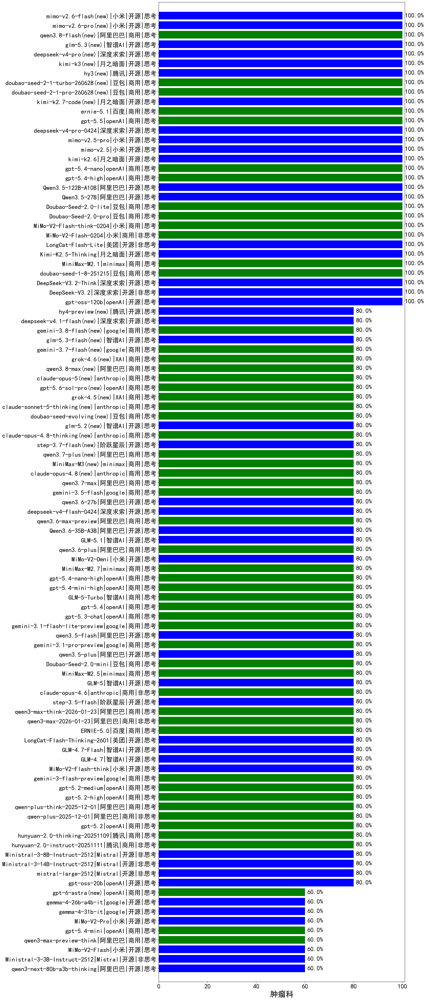

|类别|机构|大模型|【肿瘤科】准确率|平均耗时|平均消耗token|花费/千次（元）|排名（准确率）|
|---|---|-----|-------------------|-------|-----------|-----------|-----------|
|开源|openAI|gpt-oss-120b|100.0%|65s|609|1.5|1|
|开源|阿里巴巴|Qwen3.5-27B|100.0%|327s|2848|13.1|2|
|商用|openAI|gpt-5.4-high|100.0%|14s|829|74.6|3|
|商用|openAI|gpt-5.4-nano|100.0%|11s|309|1.7|4|
|开源|小米|mimo-v2.5|100.0%|61s|1819|21.3|5|
|开源|小米|mimo-v2.5-pro|100.0%|55s|1436|25.0|6|
|开源|深度求索|deepseek-v4-pro-0424|100.0%|106s|1984|46.3|7|
|商用|openAI|gpt-5.5|100.0%|16s|1026|190.4|8|
|商用|百度|ernie-5.1|100.0%|46s|958|15.7|9|
|开源|月之暗面|kimi-k2.7-code|100.0%|51s|2901|76.0|10|
|商用|豆包|doubao-seed-2-1-pro-260628|100.0%|222s|7209|212.5|11|
|商用|豆包|doubao-seed-2-1-turbo-260628|100.0%|201s|6346|93.3|12|
|开源|腾讯|hy3|100.0%|32s|351|1.1|13|
|开源|月之暗面|kimi-k3(new)|100.0%|35s|815|66.4|14|
|开源|深度求索|deepseek-v4-pro(new)|100.0%|43s|1695|42.4|15|
|开源|智谱AI|glm-5.3(new)|100.0%|153s|4243|116.4|16|
|商用|阿里巴巴|qwen3.8-flash(new)|100.0%|153s|1733|4.3|17|
|开源|小米|mimo-v2.6-pro(new)|100.0%|28s|1275|7.3|18|
|开源|小米|mimo-v2.6-flash(new)|100.0%|63s|1590|3.1|19|
|开源|阿里巴巴|Qwen3.5-122B-A10B|100.0%|390s|3582|22.2|20|
|开源|月之暗面|kimi-k2.6|100.0%|121s|3016|79.2|21|
|开源|深度求索|DeepSeek-V3.2|100.0%|153s|662|1.9|22|
|开源|深度求索|DeepSeek-V3.2-Think|100.0%|204s|1612|4.7|23|
|开源|月之暗面|Kimi-K2.5-Thinking|100.0%|171s|3783|77.5|24|
|商用|豆包|Doubao-Seed-2.0-lite|100.0%|150s|768|2.3|25|
|开源|美团|LongCat-Flash-Lite|100.0%|146s|769|0.0|26|
|商用|豆包|Doubao-Seed-2.0-pro|100.0%|182s|886|12.2|27|
|商用|小米|MiMo-V2-Flash-0204|100.0%|457s|654|1.2|28|
|商用|小米|MiMo-V2-Flash-think-0204|100.0%|864s|2191|4.4|29|
|开源|阿里巴巴|qwen3.5-flash|80.0%|188s|3645|7.1|30|
|商用|anthropic|claude-opus-4.6|80.0%|13s|787|112.7|31|
|商用|豆包|doubao-seed-evolving|80.0%|247s|8216|242.8|32|
|开源|智谱AI|GLM-5|80.0%|127s|2789|48.6|33|
|开源|阶跃星辰|step-3.5-flash|80.0%|27s|1974|4.0|34|
|开源|智谱AI|glm-5.2|80.0%|81s|3335|91.0|35|
|商用|minimax|MiniMax-M2.5|80.0%|41s|2013|16.0|36|
|商用|anthropic|claude-opus-4.8-thinking|80.0%|16s|806|116.0|37|
|商用|anthropic|claude-sonnet-5-thinking|80.0%|28s|1032|62.2|38|
|商用|openAI|gpt-5.6-sol-pro|80.0%|15s|3891|307.8|39|
|商用|XAI|grok-4.5|80.0%|59s|1814|67.4|40|
|商用|阿里巴巴|qwen3.7-plus|80.0%|33s|1773|13.4|41|
|商用|anthropic|claude-opus-5(new)|80.0%|13s|739|104.2|42|
|商用|阿里巴巴|qwen3.8-max(new)|80.0%|58s|2342|80.4|43|
|商用|阿里巴巴|qwen3-max-think-2026-01-23|80.0%|141s|3946|38.5|44|
|商用|XAI|grok-4.6(new)|80.0%|392s|1445|51.9|45|
|商用|google|gemini-3.7-flash(new)|80.0%|6s|761|17.4|46|
|商用|阿里巴巴|qwen3-max-2026-01-23|80.0%|35s|598|5.0|47|
|商用|百度|ERNIE-5.0|80.0%|125s|2682|62.4|48|
|开源|智谱AI|glm-5.3-flash(new)|80.0%|119s|1529|4.0|49|
|商用|google|gemini-3.8-flash(new)|80.0%|14s|848|39.3|50|
|开源|深度求索|deepseek-v4.1-flash(new)|80.0%|11s|1857|14.0|51|
|开源|腾讯|hy4-preview(new)|80.0%|89s|5527|98.0|52|
|开源|阶跃星辰|step-3.7-flash|80.0%|28s|3618|28.5|53|
|商用|minimax|MiniMax-M3|80.0%|29s|789|9.8|54|
|商用|google|gemini-3.1-pro-preview|80.0%|37s|2291|186.3|55|
|开源|小米|MiMo-V2-Omni|80.0%|126s|2136|25.7|56|
|商用|google|gemini-3.1-flash-lite-preview|80.0%|8s|483|4.0|57|
|商用|openAI|gpt-5.3-chat|80.0%|36s|435|30.4|58|
|商用|openAI|gpt-5.4|80.0%|5s|380|27.5|59|
|开源|阿里巴巴|qwen3.5-plus|80.0%|45s|3843|18.0|60|
|商用|智谱AI|GLM-5-Turbo|80.0%|46s|1294|26.5|61|
|商用|openAI|gpt-5.4-mini-high|80.0%|12s|725|19.1|62|
|商用|豆包|Doubao-Seed-2.0-mini|80.0%|121s|2867|5.5|63|
|商用|openAI|gpt-5.4-nano-high|80.0%|20s|508|3.4|64|
|商用|minimax|MiniMax-M2.7|80.0%|32s|1247|9.6|65|
|商用|anthropic|claude-opus-4.8|80.0%|13s|665|91.3|66|
|商用|XAI|grok-4.7(new)|80.0%|82s|6766|246.3|67|
|商用|阿里巴巴|qwen3.6-plus|80.0%|49s|1880|21.3|68|
|开源|智谱AI|GLM-5.1|80.0%|122s|1987|45.6|69|
|开源|阿里巴巴|Qwen3.6-35B-A3B|80.0%|117s|2082|21.4|70|
|商用|阿里巴巴|qwen3.6-max-preview|80.0%|59s|1922|98.3|71|
|开源|openAI|gpt-oss-20b|80.0%|5s|839|0.8|72|
|开源|深度求索|deepseek-v4-flash-0424|80.0%|63s|1011|1.9|73|
|开源|阿里巴巴|qwen3.6-27b|80.0%|36s|2009|34.3|74|
|商用|google|gemini-3.5-flash|80.0%|8s|1547|90.9|75|
|商用|阿里巴巴|qwen3.7-max|80.0%|35s|1732|59.4|76|
|开源|google|gemma-4-31b-it|60.0%|191s|636|1.5|77|
|开源|google|gemma-4-26b-a4b-it|60.0%|13s|693|1.7|78|
|商用|openAI|gpt-5.4-mini|60.0%|99s|349|7.2|79|
|商用|openAI|gpt-6-astra(new)|60.0%|11s|328|70.4|80|
|商用|openAI|gpt-6-luna(new)|60.0%|113s|299|0.6|81|
|商用|openAI|gpt-6-sol(new)|60.0%|239s|242|9.2|82|
|开源|小米|MiMo-V2-Pro|60.0%|146s|1204|20.1|83|

