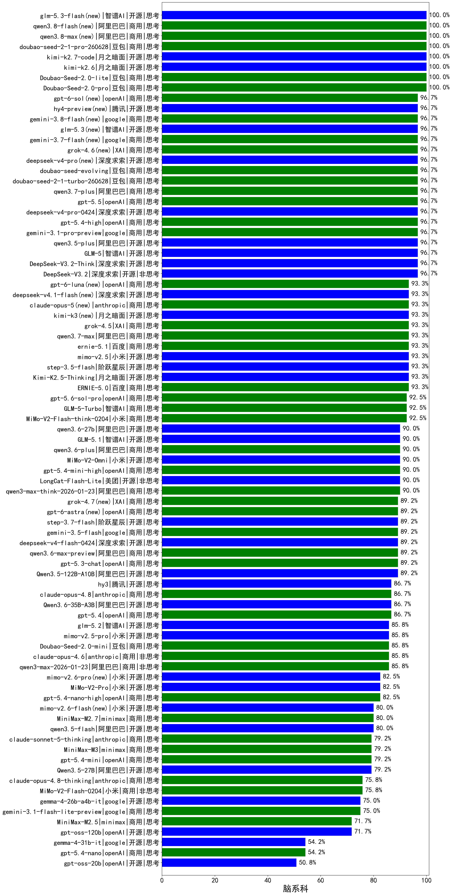

|类别|机构|大模型|【脑系科】准确率|平均耗时|平均消耗token|花费/千次（元）|排名（准确率）|
|---|---|-----|-------------------|-------|-----------|-----------|-----------|
|开源|月之暗面|kimi-k2.6|100.0%|105s|1752|45.1|1|
|商用|豆包|doubao-seed-2-1-pro-260628|100.0%|196s|6776|200.6|2|
|开源|智谱AI|glm-5.3-flash(new)|100.0%|76s|1319|3.5|3|
|商用|豆包|Doubao-Seed-2.0-lite|100.0%|197s|945|3.1|4|
|商用|豆包|Doubao-Seed-2.0-pro|100.0%|213s|979|14.2|5|
|商用|阿里巴巴|qwen3.8-flash(new)|100.0%|60s|1249|3.1|6|
|商用|阿里巴巴|qwen3.8-max(new)|100.0%|32s|1084|36.3|7|
|开源|月之暗面|kimi-k2.7-code|100.0%|27s|667|16.6|8|
|商用|豆包|doubao-seed-2-1-turbo-260628|96.7%|178s|7216|106.9|9|
|商用|豆包|doubao-seed-evolving|96.7%|185s|7264|215.2|10|
|商用|google|gemini-3.1-pro-preview|96.7%|39s|1690|138.6|11|
|开源|深度求索|deepseek-v4-pro(new)|96.7%|26s|759|17.8|12|
|商用|openAI|gpt-5.4-high|96.7%|12s|617|56.7|13|
|商用|XAI|grok-4.6(new)|96.7%|31s|1484|54.6|14|
|开源|智谱AI|glm-5.3(new)|96.7%|57s|1715|46.4|15|
|商用|阿里巴巴|qwen3.7-plus|96.7%|25s|1264|9.7|16|
|开源|深度求索|deepseek-v4-pro-0424|96.7%|32s|902|20.8|17|
|商用|openAI|gpt-5.5|96.7%|10s|475|83.8|18|
|商用|google|gemini-3.8-flash(new)|96.7%|21s|835|40.6|19|
|商用|google|gemini-3.7-flash(new)|96.7%|5s|788|19.1|20|
|开源|阿里巴巴|qwen3.5-plus|96.7%|33s|2712|12.7|21|
|开源|深度求索|DeepSeek-V3.2|96.7%|47s|389|1.1|22|
|开源|深度求索|DeepSeek-V3.2-Think|96.7%|116s|1237|3.6|23|
|开源|腾讯|hy4-preview(new)|96.7%|65s|3758|66.6|24|
|商用|openAI|gpt-6-sol(new)|96.7%|228s|247|12.2|25|
|开源|智谱AI|GLM-5|96.7%|86s|2158|37.8|26|
|开源|月之暗面|kimi-k3(new)|93.3%|44s|565|44.7|27|
|商用|百度|ERNIE-5.0|93.3%|127s|1990|46.6|28|
|开源|小米|mimo-v2.5|93.3%|23s|1363|15.5|29|
|开源|月之暗面|Kimi-K2.5-Thinking|93.3%|320s|1579|32.0|30|
|开源|阶跃星辰|step-3.5-flash|93.3%|19s|2077|4.3|31|
|商用|XAI|grok-4.5|93.3%|67s|1682|63.0|32|
|商用|百度|ernie-5.1|93.3%|35s|977|16.6|33|
|商用|anthropic|claude-opus-5(new)|93.3%|13s|784|121.0|34|
|商用|openAI|gpt-6-luna(new)|93.3%|218s|455|1.3|35|
|商用|阿里巴巴|qwen3.7-max|93.3%|26s|1182|40.7|36|
|开源|深度求索|deepseek-v4.1-flash(new)|93.3%|16s|1046|7.8|37|
|商用|openAI|gpt-5.6-sol-pro|92.5%|35s|3232|245.0|38|
|商用|智谱AI|GLM-5-Turbo|92.5%|74s|2240|48.1|39|
|商用|小米|MiMo-V2-Flash-think-0204|92.5%|680s|1975|4.0|40|
|商用|阿里巴巴|qwen3.6-plus|90.0%|45s|1717|19.9|41|
|开源|智谱AI|GLM-5.1|90.0%|155s|1865|43.4|42|
|商用|openAI|gpt-5.4-mini-high|90.0%|49s|974|28.3|43|
|商用|阿里巴巴|qwen3-max-think-2026-01-23|90.0%|177s|3496|34.4|44|
|开源|美团|LongCat-Flash-Lite|90.0%|202s|615|0.0|45|
|开源|阿里巴巴|qwen3.6-27b|90.0%|31s|1854|32.2|46|
|开源|小米|MiMo-V2-Omni|90.0%|179s|1524|17.7|47|
|商用|openAI|gpt-6-astra(new)|89.2%|11s|262|66.0|48|
|开源|阶跃星辰|step-3.7-flash|89.2%|27s|2270|17.9|49|
|商用|XAI|grok-4.7(new)|89.2%|70s|4574|155.4|50|
|商用|google|gemini-3.5-flash|89.2%|9s|1589|96.0|51|
|开源|深度求索|deepseek-v4-flash-0424|89.2%|29s|913|1.8|52|
|商用|阿里巴巴|qwen3.6-max-preview|89.2%|49s|1632|84.8|53|
|开源|阿里巴巴|Qwen3.5-122B-A10B|89.2%|301s|3072|19.2|54|
|商用|openAI|gpt-5.3-chat|89.2%|20s|444|35.7|55|
|商用|anthropic|claude-opus-4.8|86.7%|10s|598|88.4|56|
|开源|阿里巴巴|Qwen3.6-35B-A3B|86.7%|79s|1753|18.3|57|
|开源|腾讯|hy3|86.7%|47s|263|0.8|58|
|商用|openAI|gpt-5.4|86.7%|7s|324|26.0|59|
|商用|阿里巴巴|qwen3-max-2026-01-23|85.8%|76s|734|6.7|60|
|开源|小米|mimo-v2.5-pro|85.8%|21s|1322|23.2|61|
|商用|anthropic|claude-opus-4.6|85.8%|17s|690|104.4|62|
|开源|智谱AI|glm-5.2|85.8%|49s|1920|52.2|63|
|商用|豆包|Doubao-Seed-2.0-mini|85.8%|326s|2291|4.4|64|
|开源|小米|mimo-v2.6-pro(new)|82.5%|38s|1213|7.0|65|
|商用|openAI|gpt-5.4-nano-high|82.5%|15s|600|4.6|66|
|开源|小米|MiMo-V2-Pro|82.5%|481s|1228|21.3|67|
|商用|minimax|MiniMax-M2.7|80.0%|50s|2020|16.3|68|
|开源|小米|mimo-v2.6-flash(new)|80.0%|161s|903|1.7|69|
|开源|阿里巴巴|qwen3.5-flash|80.0%|279s|3463|6.8|70|
|商用|anthropic|claude-sonnet-5-thinking|79.2%|15s|904|56.8|71|
|开源|阿里巴巴|Qwen3.5-27B|79.2%|266s|3602|17.0|72|
|商用|openAI|gpt-5.4-mini|79.2%|44s|266|6.0|73|
|商用|minimax|MiniMax-M3|79.2%|23s|639|7.7|74|
|商用|小米|MiMo-V2-Flash-0204|75.8%|215s|544|1.0|75|
|商用|anthropic|claude-opus-4.8-thinking|75.8%|11s|782|120.7|76|
|商用|google|gemini-3.1-flash-lite-preview|75.0%|7s|405|3.6|77|
|开源|google|gemma-4-26b-a4b-it|75.0%|54s|619|1.6|78|
|商用|minimax|MiniMax-M2.5|71.7%|29s|1472|11.7|79|
|开源|openAI|gpt-oss-120b|71.7%|80s|653|1.8|80|
|开源|google|gemma-4-31b-it|54.2%|65s|581|1.5|81|
|商用|openAI|gpt-5.4-nano|54.2%|34s|262|1.6|82|
|开源|openAI|gpt-oss-20b|50.8%|8s|966|1.0|83|

