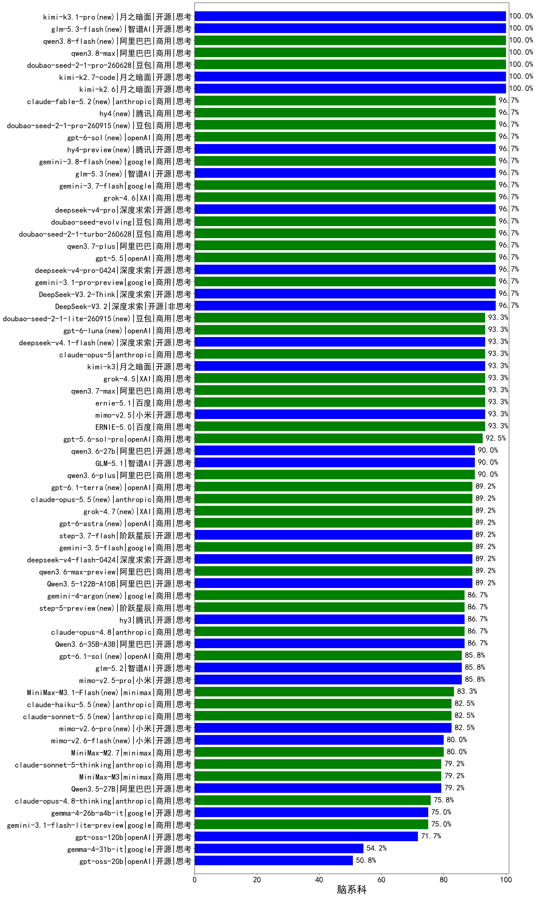

|类别|机构|大模型|【脑系科】准确率|平均耗时|平均消耗token|花费/千次（元）|排名（准确率）|
|---|---|-----|-------------------|-------|-----------|-----------|-----------|
|商用|豆包|doubao-seed-2-1-pro-260628|100.0%|196s|6776|200.6|1|
|商用|阿里巴巴|qwen3.8-flash|100.0%|60s|1249|3.1|2|
|开源|智谱AI|glm-5.3-flash|100.0%|76s|1319|3.5|3|
|商用|阿里巴巴|qwen3.8-max|100.0%|32s|1084|36.3|4|
|开源|月之暗面|kimi-k2.7-code|100.0%|27s|667|16.6|5|
|开源|月之暗面|kimi-k3.1-pro(new)|100.0%|47s|1487|92.9|6|
|开源|月之暗面|kimi-k2.6|100.0%|105s|1752|45.1|7|
|商用|openAI|gpt-6-sol|96.7%|228s|247|12.2|8|
|商用|google|gemini-3.7-flash|96.7%|5s|788|19.1|9|
|商用|XAI|grok-4.6|96.7%|31s|1484|54.6|10|
|商用|google|gemini-3.8-flash|96.7%|21s|835|40.6|11|
|商用|openAI|gpt-5.5|96.7%|10s|475|83.8|12|
|开源|深度求索|deepseek-v4-pro-0424|96.7%|32s|902|20.8|13|
|开源|腾讯|hy4-preview|96.7%|65s|3758|66.6|14|
|开源|深度求索|deepseek-v4-pro|96.7%|26s|759|17.8|15|
|开源|智谱AI|glm-5.3|96.7%|57s|1715|46.4|16|
|商用|阿里巴巴|qwen3.7-plus|96.7%|25s|1264|9.7|17|
|商用|豆包|doubao-seed-2-1-pro-260915(new)|96.7%|37s|1115|30.7|18|
|商用|豆包|doubao-seed-2-1-turbo-260628|96.7%|178s|7216|106.9|19|
|商用|腾讯|hy4(new)|96.7%|59s|3039|53.7|20|
|商用|anthropic|claude-fable-5.2(new)|96.7%|26s|613|145.3|21|
|商用|豆包|doubao-seed-evolving|96.7%|185s|7264|215.2|22|
|商用|openAI|gpt-6.2-astra(new)|96.7%|67s|209|37.9|23|
|商用|google|gemini-3.1-pro-preview|96.7%|39s|1690|138.6|24|
|开源|深度求索|DeepSeek-V3.2-Think|96.7%|116s|1237|3.6|25|
|开源|深度求索|DeepSeek-V3.2|96.7%|47s|389|1.1|26|
|商用|anthropic|claude-opus-5|93.3%|13s|784|121.0|27|
|商用|XAI|grok-4.5|93.3%|67s|1682|63.0|28|
|开源|深度求索|deepseek-v4.1-flash|93.3%|16s|1046|7.8|29|
|商用|阿里巴巴|qwen3.7-max|93.3%|26s|1182|40.7|30|
|商用|百度|ernie-5.1|93.3%|35s|977|16.6|31|
|开源|小米|mimo-v2.5|93.3%|23s|1363|15.5|32|
|商用|openAI|gpt-6-luna|93.3%|218s|455|1.3|33|
|商用|豆包|doubao-seed-2-1-lite-260915(new)|93.3%|23s|987|2.5|34|
|商用|腾讯|hy4-flash(new)|93.3%|19s|1376|2.6|35|
|商用|阿里巴巴|qwen4-max(new)|93.3%|15s|595|16.1|36|
|商用|百度|ERNIE-5.0|93.3%|127s|1990|46.6|37|
|开源|月之暗面|kimi-k3|93.3%|44s|565|44.7|38|
|商用|openAI|gpt-5.6-sol-pro|92.5%|35s|3232|245.0|39|
|商用|openAI|gpt-6.2-sol(new)|92.5%|4s|226|10.7|40|
|商用|google|gemini-4-carbon(new)|90.0%|43s|1152|149.8|41|
|商用|阿里巴巴|qwen3.6-plus|90.0%|45s|1717|19.9|42|
|开源|阿里巴巴|qwen3.6-27b|90.0%|31s|1854|32.2|43|
|开源|智谱AI|GLM-5.1|90.0%|155s|1865|43.4|44|
|商用|anthropic|claude-opus-5.5(new)|89.2%|31s|700|84.8|45|
|开源|阿里巴巴|Qwen3.5-122B-A10B|89.2%|301s|3072|19.2|46|
|商用|openAI|gpt-6.1-terra(new)|89.2%|6s|302|8.0|47|
|开源|阶跃星辰|step-3.7-flash|89.2%|27s|2270|17.9|48|
|商用|google|gemini-3.5-flash|89.2%|9s|1589|96.0|49|
|商用|openAI|gpt-6-astra|89.2%|11s|262|66.0|50|
|开源|深度求索|deepseek-v4-flash-0424|89.2%|29s|913|1.8|51|
|商用|XAI|grok-4.7|89.2%|70s|4574|155.4|52|
|商用|阿里巴巴|qwen3.6-max-preview|89.2%|49s|1632|84.8|53|
|商用|google|gemini-4-argon(new)|86.7%|20s|554|66.2|54|
|商用|阶跃星辰|step-5-preview(new)|86.7%|29s|1674|32.5|55|
|开源|腾讯|hy3|86.7%|47s|263|0.8|56|
|开源|阿里巴巴|Qwen3.6-35B-A3B|86.7%|79s|1753|18.3|57|
|商用|anthropic|claude-opus-4.8|86.7%|10s|598|88.4|58|
|开源|小米|mimo-v2.5-pro|85.8%|21s|1322|23.2|59|
|商用|openAI|gpt-6.1-sol(new)|85.8%|12s|253|12.6|60|
|开源|智谱AI|glm-5.2|85.8%|49s|1920|52.2|61|
|商用|minimax|MiniMax-M3.1-Flash(new)|83.3%|20s|1324|4.5|62|
|开源|小米|mimo-v2.6-pro|82.5%|38s|1213|7.0|63|
|商用|anthropic|claude-sonnet-5.5(new)|82.5%|8s|593|34.9|64|
|商用|anthropic|claude-haiku-5.5(new)|82.5%|9s|799|2.5|65|
|开源|小米|mimo-v2.6-flash|80.0%|161s|903|1.7|66|
|商用|minimax|MiniMax-M2.7|80.0%|50s|2020|16.3|67|
|商用|minimax|MiniMax-M3|79.2%|23s|639|7.7|68|
|开源|阿里巴巴|Qwen3.5-27B|79.2%|266s|3602|17.0|69|
|商用|anthropic|claude-sonnet-5-thinking|79.2%|15s|904|56.8|70|
|商用|anthropic|claude-opus-4.8-thinking|75.8%|11s|782|120.7|71|
|开源|google|gemma-4-26b-a4b-it|75.0%|54s|619|1.6|72|
|商用|google|gemini-3.1-flash-lite-preview|75.0%|7s|405|3.6|73|
|开源|openAI|gpt-oss-120b|71.7%|80s|653|1.8|74|
|开源|google|gemma-4-31b-it|54.2%|65s|581|1.5|75|
|开源|openAI|gpt-oss-20b|50.8%|8s|966|1.0|76|

