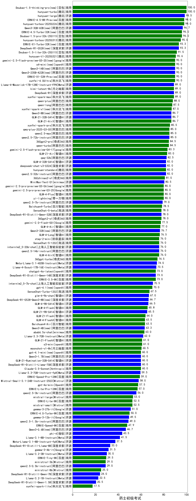

| 类别 | 大模型                         | 药士初级考试 | 排名 |
|-----|------------------------------|---------|----|
|商用|hunyuan-turbo|100.0|1|
|商用|Doubao-1.5-thinking-pro(new)|100.0|2|
|开源|hunyuan-large|98.5|3|
|商用|ERNIE-4.5-8K-Preview|98.0|4|
|商用|hunyuan-turbos-20250226|98.0|5|
|开源|Qwen3-30B-A3B|96.7|6|
|商用|Doubao-1.5-pro-32k-250115|96.0|7|
|商用|ERNIE-4.5-Turbo-32K(new)|96.0|8|
|商用|hunyuan-turbos-20250313|95.0|9|
|开源|DeepSeek-R1-0528(new)|93.3|10|
|商用|ERNIE-X1-Turbo-32K(new)|93.3|11|
|商用|Doubao-1.5-lite-32k-250115|91.5|12|
|商用|GLM-Z1-Air|91.5|13|
|商用|hunyuan-t1-20250321|90.6|14|
|商用|xunfei-4.0Ultra|90.0|15|
|开源|Qwen3-235B-A22B|90.0|16|
|开源|Qwen3-14B|90.0|17|
|商用|o4-mini(new)|90.0|18|
|商用|gemini-2.5-flash-preview-05-20(new)|90.0|19|
|商用|xunfei-spark-max|89.0|20|
|开源|Llama-4-Maverick-17B-128E-Instruct-FP8|89.0|21|
|商用|kimi-latest-8k|89.0|22|
|开源|DeepSeek-R1|89.0|23|
|商用|GLM-Z1-AirX|88.0|24|
|商用|qwen-plus|88.0|25|
|商用|qwen-long|87.5|26|
|商用|xunfei-spark-x1(new)|87.0|27|
|开源|Qwen3-8B|86.7|28|
|开源|GLM-Z1-32B-0414|86.7|29|
|商用|GLM-4-Plus|86.0|30|
|商用|xunfei-spark-pro|85.5|31|
|商用|qwen2.5-max|85.0|32|
|商用|qwq-plus-2025-03-05|85.0|33|
|开源|qwen2.5-72b-instruct|85.0|34|
|商用|qwen-turbo|84.5|35|
|商用|360gpt2-pro|84.5|36|
|商用|gemini-2.5-flash-preview-04-17|83.3|37|
|开源|qwq-32b|82.5|38|
|开源|GLM-4-32B-0414|82.0|39|
|商用|hunyuan-standard|82.0|40|
|开源|deepseek-chat-v3-0324|82.0|41|
|开源|qwen2.5-32b-instruct|82.0|42|
|商用|360zhinao2-o1|81.0|43|
|开源|MiniMax-Text-01|80.5|44|
|商用|claude-4-sonnet-thinking(new)|80.0|45|
|商用|yi-lightning|80.0|46|
|商用|gemini-2.5-pro-preview-03-25|80.0|47|
|商用|gemini-2.5-pro-preview-05-06(new)|80.0|48|
|开源|qwen2.5-7b-instruct|79.0|49|
|商用|Baichuan4-Turbo|78.5|50|
|商用|360gpt2-o1|78.0|51|
|商用|SenseChat-5-beta|78.0|52|
|开源|DeepSeek-R1-Distill-Qwen-32B|78.0|53|
|商用|GLM-4-Air|77.0|54|
|开源|Qwen3-32B|76.7|55|
|商用|GLM-4-Long|76.5|56|
|商用|step-2-mini|76.0|57|
|商用|GLM-4-AirX|76.0|58|
|商用|SenseChat-5-1202|76.0|59|
|开源|qwen2.5-14b-instruct|76.0|60|
|商用|360gpt-turbo|74.5|61|
|开源|Meta-Llama-3.1-405B-Instruct|74.0|62|
|开源|Llama-4-Scout-17B-16E-Instruct|73.5|63|
|开源|DeepSeek-R1-Distill-Qwen-14B|73.0|64|
|商用|chatgpt-4o-latest|73.0|65|
|商用|ERNIE-3.5-8K|73.0|66|
|开源|internlm2_5-7b-chat|70.5|67|
|商用|claude-4-sonnet(new)|70.0|68|
|商用|gpt-4.1(new)|70.0|69|
|商用|SenseChat-Turbo-1202|67.5|70|
|开源|DeepSeek-R1-0528-Qwen3-8B(new)|66.7|71|
|开源|GLM-4-9B-0414|66.5|72|
|商用|GLM-4-Flash|65.8|73|
|开源|GLM-Z1-9B-0414|65.5|74|
|商用|GLM-Z1-Flash|64.0|75|
|商用|Baichuan4-Air|63.5|76|
|商用|GLM-4-FlashX|63.5|77|
|开源|Qwen3-4B|63.3|78|
|开源|Llama-3.3-70B-Instruct|62.0|79|
|商用|GLM-Z1-FlashX|61.0|80|
|商用|moonshot-v1-8k|60.5|81|
|商用|gpt-4.1-mini(new)|60.0|82|
|商用|Claude-3.5-Sonnet|60.0|83|
|开源|GLM-Z1-Rumination-32B-0414|60.0|84|
|开源|DeepSeek-R1-Distill-Llama-70B|60.0|85|
|开源|Qwen3-1.7B|60.0|86|
|开源|Llama-3.3-70B-Instruct-fp8|59.5|87|
|商用|ERNIE-Speed-Pro-128K|59.0|88|
|开源|Mistral-Small-3.1-24B-Instruct-2503|58.0|89|
|商用|gpt-4o-mini|57.5|90|
|商用|ERNIE-Lite-Pro-128K|57.0|91|
|开源|qwen2.5-3b-instruct|56.0|92|
|商用|mistral-large|53.0|93|
|商用|mistral-small|52.5|94|
|商用|ERNIE-Lite-8K|52.5|95|
|开源|gemma-3-27b-it|51.0|96|
|开源|gemma-3-12b-it|49.5|97|
|开源|qwen2.5-1.5b-instruct|49.0|98|
|商用|ERNIE-Speed-8K|47.9|99|
|开源|Qwen3-0.6B|46.7|100|
|开源|phi-4|43.5|101|
|开源|Llama-3.1-8B-Instruct|41.5|102|
|开源|Meta-Llama-3.1-8B-Instruct-fp8|37.5|103|
|开源|DeepSeek-R1-Distill-Llama-8B|33.0|104|
|开源|gemma-3-4b-it|31.5|105|
|开源|Llama-3.2-3B-Instruct|30.0|106|
|商用|ERNIE-Tiny-8K|29.5|107|
|开源|qwen2.5-0.5b-instruct|29.0|108|
|商用|ministral-3b|29.0|109|
|商用|ministral-8b|25.0|110|
|开源|DeepSeek-R1-Distill-Qwen-7B|24.0|111|
|开源|Llama-3.2-1B-Instruct|22.5|112|
|商用|xunfei-spark-lite|17.5|113|

