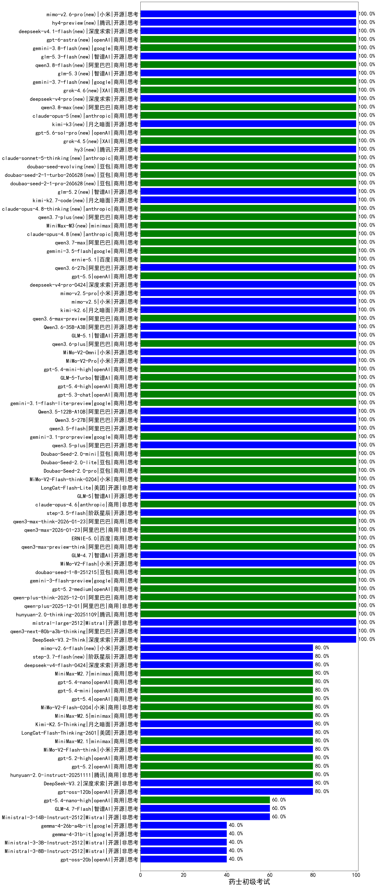

|类别|机构|大模型|【药士初级考试】准确率|平均耗时|平均消耗token|花费/千次（元）|排名（准确率）|
|---|---|-----|-------------------|-------|-----------|-----------|-----------|
|开源|月之暗面|kimi-k2.6|100.0%|33s|664|16.8|1|
|商用|anthropic|claude-opus-4.8|100.0%|10s|374|53.5|2|
|商用|豆包|doubao-seed-2-1-turbo-260628|100.0%|94s|2399|34.9|3|
|商用|豆包|doubao-seed-2-1-pro-260628|100.0%|191s|3063|89.6|4|
|开源|智谱AI|glm-5.2|100.0%|27s|899|24.0|5|
|开源|月之暗面|kimi-k2.7-code|100.0%|50s|481|11.9|6|
|商用|anthropic|claude-opus-4.8-thinking|100.0%|18s|537|82.1|7|
|商用|阿里巴巴|qwen3.7-plus|100.0%|19s|601|4.5|8|
|商用|minimax|MiniMax-M3|100.0%|18s|531|6.1|9|
|商用|阿里巴巴|qwen3.7-max|100.0%|14s|610|20.6|10|
|商用|anthropic|claude-sonnet-5-thinking|100.0%|19s|743|47.2|11|
|商用|google|gemini-3.5-flash|100.0%|6s|983|58.9|12|
|商用|百度|ernie-5.1|100.0%|30s|628|10.6|13|
|开源|阿里巴巴|qwen3.6-27b|100.0%|19s|1243|21.5|14|
|商用|openAI|gpt-5.5|100.0%|19s|229|35.7|15|
|开源|深度求索|deepseek-v4-pro-0424|100.0%|16s|371|8.3|16|
|开源|小米|mimo-v2.5-pro|100.0%|37s|854|13.7|17|
|开源|小米|mimo-v2.5|100.0%|37s|905|9.3|18|
|商用|豆包|doubao-seed-evolving|100.0%|119s|3813|112.1|19|
|开源|腾讯|hy3|100.0%|44s|159|0.5|20|
|开源|阿里巴巴|Qwen3.6-35B-A3B|100.0%|14s|1191|12.3|21|
|商用|阿里巴巴|qwen3.8-flash(new)|100.0%|17s|369|0.8|22|
|商用|openAI|gpt-6-luna(new)|100.0%|303s|207|0.5|23|
|开源|小米|mimo-v2.6-pro(new)|100.0%|14s|570|3.2|24|
|开源|腾讯|hy4-preview(new)|100.0%|12s|630|10.5|25|
|开源|深度求索|deepseek-v4.1-flash(new)|100.0%|2s|357|2.4|26|
|商用|openAI|gpt-6-astra(new)|100.0%|8s|187|45.5|27|
|商用|google|gemini-3.8-flash(new)|100.0%|16s|604|29.3|28|
|开源|智谱AI|glm-5.3-flash(new)|100.0%|19s|752|2.0|29|
|开源|智谱AI|glm-5.3(new)|100.0%|23s|637|16.6|30|
|商用|XAI|grok-4.5|100.0%|23s|748|24.3|31|
|商用|google|gemini-3.7-flash(new)|100.0%|5s|695|17.1|32|
|商用|XAI|grok-4.6(new)|100.0%|791s|725|23.3|33|
|开源|深度求索|deepseek-v4-pro(new)|100.0%|10s|346|7.0|34|
|商用|阿里巴巴|qwen3.8-max(new)|100.0%|8s|367|10.9|35|
|商用|anthropic|claude-opus-5(new)|100.0%|10s|498|75.2|36|
|开源|月之暗面|kimi-k3(new)|100.0%|19s|374|26.8|37|
|商用|openAI|gpt-5.6-sol-pro|100.0%|7s|2433|149.0|38|
|商用|阿里巴巴|qwen3.6-max-preview|100.0%|33s|1284|66.7|39|
|商用|openAI|gpt-6-sol(new)|100.0%|167s|161|7.3|40|
|开源|智谱AI|GLM-5.1|100.0%|123s|890|20.4|41|
|商用|google|gemini-3.1-flash-lite-preview|100.0%|17s|280|2.4|42|
|开源|阿里巴巴|Qwen3.5-27B|100.0%|233s|1489|6.9|43|
|商用|google|gemini-3.1-pro-preview|100.0%|16s|1012|82.2|44|
|开源|阿里巴巴|qwen3.5-plus|100.0%|22s|1745|8.1|45|
|商用|豆包|Doubao-Seed-2.0-mini|100.0%|205s|1014|1.9|46|
|商用|豆包|Doubao-Seed-2.0-lite|100.0%|127s|594|1.8|47|
|商用|豆包|Doubao-Seed-2.0-pro|100.0%|118s|600|8.3|48|
|商用|小米|MiMo-V2-Flash-think-0204|100.0%|701s|1233|2.5|49|
|开源|美团|LongCat-Flash-Lite|100.0%|107s|453|0.0|50|
|开源|智谱AI|GLM-5|100.0%|43s|1206|20.9|51|
|商用|anthropic|claude-opus-4.6|100.0%|10s|538|81.9|52|
|开源|阶跃星辰|step-3.5-flash|100.0%|16s|1270|2.6|53|
|商用|阿里巴巴|qwen3-max-think-2026-01-23|100.0%|44s|1295|12.5|54|
|商用|阿里巴巴|qwen3-max-2026-01-23|100.0%|40s|321|2.8|55|
|商用|百度|ERNIE-5.0|100.0%|170s|1629|38.3|56|
|开源|深度求索|DeepSeek-V3.2-Think|100.0%|181s|668|2.0|57|
|开源|阿里巴巴|Qwen3.5-122B-A10B|100.0%|111s|1711|10.6|58|
|开源|阿里巴巴|qwen3.5-flash|100.0%|283s|1995|3.9|59|
|商用|openAI|gpt-5.3-chat|100.0%|6s|317|25.0|60|
|商用|openAI|gpt-5.4-high|100.0%|7s|340|29.5|61|
|商用|智谱AI|GLM-5-Turbo|100.0%|16s|1077|22.8|62|
|商用|openAI|gpt-5.4-mini-high|100.0%|31s|587|16.6|63|
|商用|阿里巴巴|qwen3.6-plus|100.0%|29s|1257|14.5|64|
|开源|小米|MiMo-V2-Omni|100.0%|258s|905|9.3|65|
|开源|小米|MiMo-V2-Pro|100.0%|19s|905|14.8|66|
|商用|minimax|MiniMax-M2.7|80.0%|21s|878|6.8|67|
|开源|深度求索|DeepSeek-V3.2|80.0%|115s|286|0.8|68|
|开源|小米|mimo-v2.6-flash(new)|80.0%|46s|661|1.3|69|
|开源|深度求索|deepseek-v4-flash-0424|80.0%|14s|576|1.1|70|
|开源|月之暗面|Kimi-K2.5-Thinking|80.0%|258s|1415|28.8|71|
|商用|minimax|MiniMax-M2.5|80.0%|36s|1782|14.4|72|
|商用|openAI|gpt-5.4|80.0%|4s|242|19.2|73|
|商用|小米|MiMo-V2-Flash-0204|80.0%|257s|463|0.9|74|
|商用|openAI|gpt-5.4-nano|80.0%|6s|188|1.1|75|
|商用|openAI|gpt-5.4-mini|80.0%|3s|175|3.6|76|
|开源|阶跃星辰|step-3.7-flash|80.0%|15s|973|7.5|77|
|开源|openAI|gpt-oss-120b|80.0%|3s|579|1.6|78|
|商用|openAI|gpt-5.4-nano-high|60.0%|158s|620|4.9|79|
|开源|google|gemma-4-31b-it|40.0%|69s|459|1.2|80|
|开源|google|gemma-4-26b-a4b-it|40.0%|92s|571|1.5|81|
|开源|openAI|gpt-oss-20b|40.0%|7s|1384|1.5|82|

