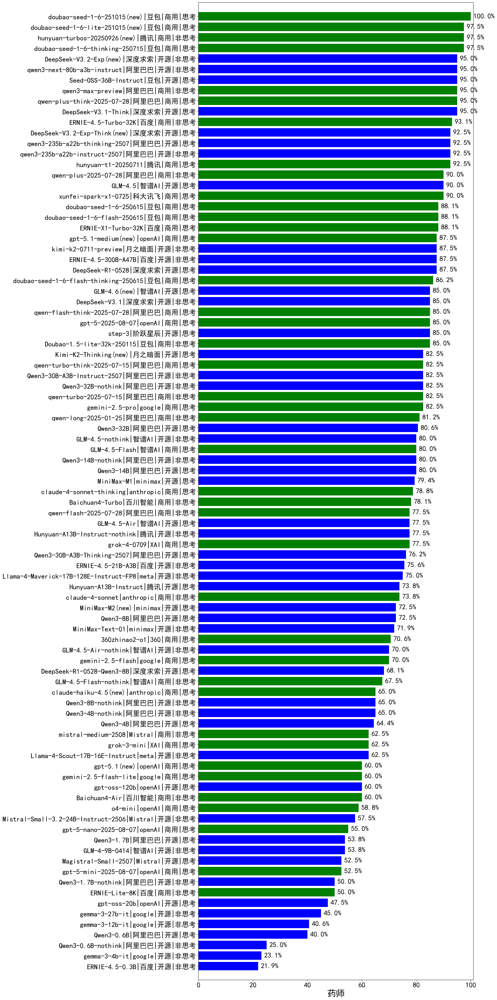

|类别|机构|大模型|【药师】准确率|平均耗时|平均消耗token|花费/千次（元）|排名（准确率）|
|---|---|-----|-------------------|-------|-----------|-----------|-----------|
|商用|豆包|doubao-seed-1-6-251015(new)|100.0%|31s|602|4.2|1|
|商用|豆包|doubao-seed-1-6-lite-251015(new)|97.5%|65s|599|1.3|2|
|商用|豆包|doubao-seed-1-6-thinking-250715|97.5%|28s|1123|8.6|3|
|商用|腾讯|hunyuan-turbos-20250926(new)|97.5%|12s|512|0.9|4|
|开源|豆包|Seed-OSS-36B-Instruct|95.0%|97s|1301|5.1|5|
|开源|阿里巴巴|qwen3-next-80b-a3b-instruct|95.0%|9s|460|1.7|6|
|开源|深度求索|DeepSeek-V3.1-Think|95.0%|45s|857|9.9|7|
|商用|阿里巴巴|qwen-plus-think-2025-07-28|95.0%|/|2260|17.6|8|
|商用|阿里巴巴|qwen3-max-preview|95.0%|9s|394|8.4|9|
|开源|深度求索|DeepSeek-V3.2-Exp(new)|95.0%|97s|289|0.8|10|
|商用|百度|ERNIE-4.5-Turbo-32K|93.1%|21s|532|1.6|11|
|开源|深度求索|DeepSeek-V3.2-Exp-Think(new)|92.5%|232s|864|2.5|12|
|开源|阿里巴巴|qwen3-235b-a22b-instruct-2507|92.5%|10s|423|3.0|13|
|商用|腾讯|hunyuan-t1-20250711|92.5%|22s|1313|5.0|14|
|开源|阿里巴巴|qwen3-235b-a22b-thinking-2507|92.5%|81s|2135|41.6|15|
|商用|阿里巴巴|qwen-plus-2025-07-28|90.0%|14s|468|0.9|16|
|商用|科大讯飞|xunfei-spark-x1-0725|90.0%|/|877|10.5|17|
|开源|智谱AI|GLM-4.5|90.0%|76s|1558|21.2|18|
|商用|百度|ERNIE-X1-Turbo-32K|88.1%|114s|1848|7.2|19|
|商用|豆包|doubao-seed-1-6-250615|88.1%|86s|409|2.6|20|
|商用|豆包|doubao-seed-1-6-flash-250615|88.1%|3s|315|0.4|21|
|开源|百度|ERNIE-4.5-300B-A47B|87.5%|20s|339|2.3|22|
|开源|月之暗面|kimi-k2-0711-preview|87.5%|26s|464|6.7|23|
|开源|深度求索|DeepSeek-R1-0528|87.5%|224s|1756|27.4|24|
|商用|豆包|doubao-seed-1-6-flash-thinking-250615|86.2%|5s|525|0.6|25|
|开源|阶跃星辰|step-3|85.0%|77s|1503|5.9|26|
|商用|openAI|gpt-5-2025-08-07|85.0%|25s|256|14.7|27|
|开源|深度求索|DeepSeek-V3.1|85.0%|18s|342|3.7|28|
|开源|智谱AI|GLM-4.6(new)|85.0%|50s|1982|27.1|29|
|商用|豆包|Doubao-1.5-lite-32k-250115|85.0%|4s|182|0.1|30|
|商用|阿里巴巴|qwen-flash-think-2025-07-28|85.0%|25s|2093|3.1|31|
|开源|阿里巴巴|Qwen3-30B-A3B-Instruct-2507|82.5%|4s|499|1.4|32|
|商用|google|gemini-2.5-pro|82.5%|31s|2089|147.5|33|
|开源|阿里巴巴|Qwen3-32B-nothink|82.5%|64s|466|1.7|34|
|商用|阿里巴巴|qwen-turbo-think-2025-07-15|82.5%|/|2028|5.9|35|
|商用|阿里巴巴|qwen-turbo-2025-07-15|82.5%|6s|296|0.2|36|
|开源|月之暗面|Kimi-K2-Thinking(new)|82.5%|93s|1214|18.8|37|
|商用|阿里巴巴|qwen-long-2025-01-25|81.2%|76s|276|0.5|38|
|开源|阿里巴巴|Qwen3-32B|80.6%|34s|1335|5.1|39|
|开源|阿里巴巴|Qwen3-14B-nothink|80.0%|14s|477|0.9|40|
|开源|智谱AI|GLM-4.5-nothink|80.0%|17s|609|7.9|41|
|商用|智谱AI|GLM-4.5-Flash|80.0%|23s|1297|0.0|42|
|开源|阿里巴巴|Qwen3-14B|80.0%|27s|1526|3.0|43|
|开源|minimax|MiniMax-M1|79.4%|146s|2304|15.3|44|
|商用|anthropic|claude-4-sonnet-thinking|78.8%|50s|1093|110.3|45|
|商用|百川智能|Baichuan4-Turbo|78.1%|/|/|/|46|
|商用|XAI|grok-4-0709|77.5%|222s|1313|136.8|47|
|开源|腾讯|Hunyuan-A13B-Instruct-nothink|77.5%|12s|333|1.2|48|
|开源|智谱AI|GLM-4.5-Air|77.5%|24s|1223|7.0|49|
|商用|阿里巴巴|qwen-flash-2025-07-28|77.5%|12s|451|0.6|50|
|开源|阿里巴巴|Qwen3-30B-A3B-Thinking-2507|76.2%|62s|2504|6.9|51|
|开源|百度|ERNIE-4.5-21B-A3B|75.6%|32s|326|0.0|52|
|开源|meta|Llama-4-Maverick-17B-128E-Instruct-FP8|75.0%|7s|461|1.8|53|
|商用|anthropic|claude-4-sonnet|73.8%|42s|502|46.0|54|
|开源|腾讯|Hunyuan-A13B-Instruct|73.8%|63s|1331|5.2|55|
|开源|阿里巴巴|Qwen3-8B|72.5%|198s|6813|0.0|56|
|开源|minimax|MiniMax-M2(new)|72.5%|49s|2633|21.6|57|
|开源|minimax|MiniMax-Text-01|71.9%|15s|865|6.9|58|
|商用|360|360zhinao2-o1|70.6%|/|/|/|59|
|商用|google|gemini-2.5-flash|70.0%|9s|1607|28.1|60|
|开源|智谱AI|GLM-4.5-Air-nothink|70.0%|15s|877|5.0|61|
|开源|深度求索|DeepSeek-R1-0528-Qwen3-8B|68.1%|246s|1639|0.0|62|
|商用|智谱AI|GLM-4.5-Flash-nothink|67.5%|18s|868|0.0|63|
|开源|阿里巴巴|Qwen3-8B-nothink|65.0%|39s|453|0.0|64|
|开源|阿里巴巴|Qwen3-4B-nothink|65.0%|14s|360|0.9|65|
|开源|阿里巴巴|Qwen3-4B|64.4%|23s|1753|5.1|66|
|开源|meta|Llama-4-Scout-17B-16E-Instruct|62.5%|9s|478|0.9|67|
|商用|Mistral|mistral-medium-2508|62.5%|36s|383|4.7|68|
|商用|XAI|grok-3-mini|62.5%|184s|1034|3.7|69|
|商用|google|gemini-2.5-flash-lite|60.0%|8s|2038|5.8|70|
|商用|openAI|gpt-5.1(new)|60.0%|170s|149|6.4|71|
|商用|百川智能|Baichuan4-Air|60.0%|/|/|/|72|
|开源|openAI|gpt-oss-120b|60.0%|41s|667|1.9|73|
|商用|openAI|o4-mini|58.8%|33s|1209|36.8|74|
|开源|Mistral|Mistral-Small-3.2-24B-Instruct-2506|57.5%|292s|409|0.8|75|
|商用|openAI|gpt-5-nano-2025-08-07|55.0%|56s|2096|5.9|76|
|开源|智谱AI|GLM-4-9B-0414|53.8%|8s|415|0.0|77|
|开源|阿里巴巴|Qwen3-1.7B|53.8%|23s|2233|6.5|78|
|商用|openAI|gpt-5-mini-2025-08-07|52.5%|56s|1015|13.9|79|
|开源|Mistral|Magistral-Small-2507|52.5%|337s|4532|48.8|80|
|开源|阿里巴巴|Qwen3-1.7B-nothink|50.0%|12s|413|1.1|81|
|商用|百度|ERNIE-Lite-8K|50.0%|/|/|/|82|
|开源|openAI|gpt-oss-20b|47.5%|11s|1946|2.2|83|
|开源|google|gemma-3-27b-it|45.0%|/|/|/|84|
|开源|google|gemma-3-12b-it|40.6%|/|/|/|85|
|开源|阿里巴巴|Qwen3-0.6B|40.0%|8s|1136|3.2|86|
|开源|阿里巴巴|Qwen3-0.6B-nothink|25.0%|9s|207|0.4|87|
|开源|google|gemma-3-4b-it|23.1%|/|/|/|88|
|开源|百度|ERNIE-4.5-0.3B|21.9%|29s|370|0.0|89|

