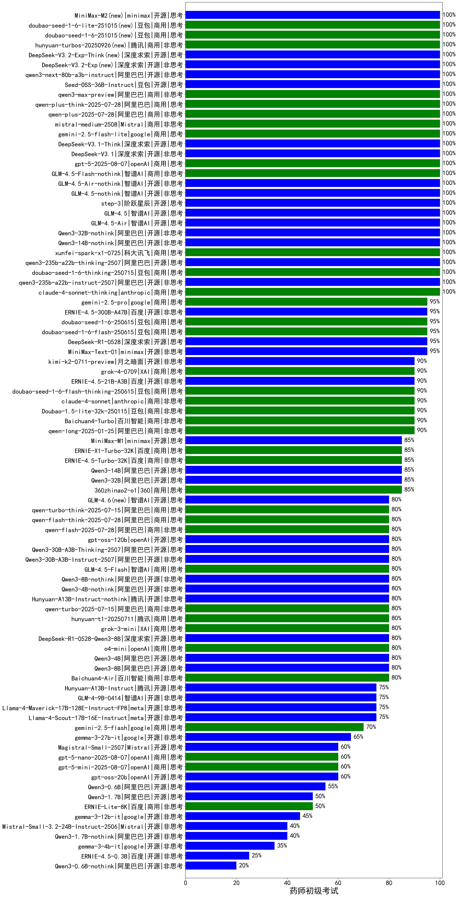

|类别|机构|大模型|【药师初级考试】准确率|平均耗时|平均消耗token|排名（准确率）|
|---|---|-----|-------------------|-------|-----------|------------|
|商用|腾讯|hunyuan-turbo|100.0%|19s|940|1|
|商用|豆包|Doubao-1.5-thinking-pro|100.0%|444s|645|2|
|商用|腾讯|hunyuan-t1-20250529|100.0%|57s|800|3|
|商用|anthropic|claude-4-sonnet-thinking|100.0%|48s|992|4|
|商用|google|gemini-2.5-pro(new)|100.0%|83s|2275|5|
|开源|腾讯|hunyuan-large|98.0%|13s|943|6|
|商用|豆包|doubao-seed-1-6-flash-250615(new)|95.0%|4s|336|7|
|商用|豆包|doubao-seed-1-6-thinking-250615(new)|95.0%|299s|878|8|
|商用|豆包|doubao-seed-1-6-250615(new)|95.0%|126s|360|9|
|开源|深度求索|DeepSeek-R1-0528|95.0%|213s|1682|10|
|商用|阿里巴巴|qwen-turbo-2025-04-28|95.0%|5s|388|11|
|开源|百度|ERNIE-4.5-300B-A47B(new)|95.0%|18s|322|12|
|商用|阿里巴巴|qwen-plus-think-2025-04-28|95.0%|210s|1899|13|
|商用|腾讯|hunyuan-turbos-20250604(new)|95.0%|146s|320|14|
|商用|豆包|Doubao-1.5-pro-32k-250115|93.5%|10s|353|15|
|商用|科大讯飞|xunfei-spark-max|91.0%|4s|137|16|
|开源|深度求索|deepseek-chat-v3-0324|90.0%|21s|279|17|
|开源|阿里巴巴|Qwen3-235B-A22B-nothink|90.0%|15s|452|18|
|商用|豆包|doubao-seed-1-6-flash-thinking-250615(new)|90.0%|6s|462|19|
|开源|阿里巴巴|Qwen3-235B-A22B|90.0%|53s|1855|20|
|开源|月之暗面|kimi-k2-0711-preview(new)|90.0%|31s|539|21|
|商用|anthropic|claude-4-sonnet|90.0%|44s|455|22|
|开源|百度|ERNIE-4.5-21B-A3B(new)|90.0%|5s|285|23|
|商用|XAI|grok-4-0709(new)|90.0%|322s|1097|24|
|商用|豆包|Doubao-1.5-lite-32k-250115|87.5%|4s|180|25|
|商用|月之暗面|kimi-latest-8k|86.0%|28s|461|26|
|商用|智谱AI|GLM-Z1-AirX|85.0%|28s|2424|27|
|商用|阿里巴巴|qwen-plus-2025-04-28|85.0%|203s|464|28|
|开源|阿里巴巴|Qwen3-14B|85.0%|27s|1717|29|
|开源|阿里巴巴|Qwen3-32B|85.0%|58s|1852|30|
|商用|google|gemini-2.5-flash-preview-05-20|85.0%|15s|1487|31|
|商用|百度|ERNIE-4.5-Turbo-32K|85.0%|21s|534|32|
|商用|百度|ERNIE-X1-Turbo-32K|85.0%|84s|1962|33|
|开源|minimax|MiniMax-M1(new)|85.0%|56s|1334|34|
|商用|阿里巴巴|qwen2.5-max|85.0%|24s|410|35|
|商用|阿里巴巴|qwen-turbo-think-2025-04-28|85.0%|200s|2968|36|
|商用|阿里巴巴|qwq-plus-2025-03-05|84.5%|48s|2075|37|
|开源|阿里巴巴|qwq-32b|83.5%|37s|1922|38|
|商用|腾讯|hunyuan-standard|83.5%|/|/|39|
|商用|百川智能|Baichuan4-Turbo|83.0%|/|/|40|
|商用|科大讯飞|xunfei-spark-pro|82.5%|/|/|41|
|开源|深度求索|DeepSeek-R1-Distill-Qwen-32B|82.0%|28s|643|42|
|商用|奇虎360|360gpt2-pro|82.0%|15s|218|43|
|开源|阿里巴巴|qwen2.5-32b-instruct|81.5%|12s|216|44|
|商用|智谱AI|GLM-4-Plus|81.0%|10s|269|45|
|开源|智谱AI|GLM-4-32B-0414|80.0%|11s|333|46|
|商用|智谱AI|GLM-4-Long|80.0%|22s|483|47|
|商用|科大讯飞|xunfei-4.0Ultra|80.0%|2s|110|48|
|商用|零一万物|yi-lightning|80.0%|/|/|49|
|开源|阿里巴巴|qwen2.5-72b-instruct|80.0%|14s|236|50|
|商用|openAI|gpt-4.1-mini|80.0%|9s|310|51|
|开源|阿里巴巴|Qwen3-4B|80.0%|21s|1075|52|
|商用|智谱AI|GLM-Z1-Air|80.0%|64s|1933|53|
|开源|meta|Llama-4-Scout-17B-16E-Instruct|80.0%|89s|451|54|
|开源|阿里巴巴|Qwen3-30B-A3B|80.0%|28s|1858|55|
|商用|openAI|gpt-4.1|80.0%|10s|264|56|
|开源|阿里巴巴|Qwen3-8B|80.0%|162s|4612|57|
|开源|深度求索|DeepSeek-R1-0528-Qwen3-8B|80.0%|202s|1577|58|
|商用|阶跃星辰|step-r1-v-mini|80.0%|50s|1366|59|
|商用|openAI|o4-mini|80.0%|42s|960|60|
|商用|google|gemini-2.5-pro-preview-05-06|80.0%|32s|1864|61|
|商用|google|gemini-2.5-flash-lite-preview-06-17(new)|80.0%|2s|392|62|
|商用|XAI|grok-3-mini(new)|80.0%|155s|1038|63|
|商用|阿里巴巴|qwen-long-2025-01-25|79.5%|185s|289|64|
|商用|商汤|SenseChat-5-beta|79.0%|17s|282|65|
|商用|智谱AI|GLM-4-AirX|76.7%|9s|296|66|
|商用|智谱AI|GLM-4-Air|76.7%|9s|293|67|
|开源|阿里巴巴|qwen2.5-14b-instruct|75.5%|7s|185|68|
|开源|minimax|MiniMax-Text-01|75.5%|17s|887|69|
|开源|腾讯|Hunyuan-A13B-Instruct(new)|75.0%|49s|910|70|
|开源|智谱AI|GLM-4-9B-0414|75.0%|6s|400|71|
|开源|智谱AI|GLM-Z1-32B-0414|75.0%|111s|1834|72|
|开源|meta|Llama-4-Maverick-17B-128E-Instruct-FP8|75.0%|9s|481|73|
|商用|智谱AI|GLM-Z1-FlashX|75.0%|61s|3642|74|
|商用|智谱AI|GLM-Z1-Flash|75.0%|17s|2075|75|
|商用|奇虎360|360gpt-turbo|74.5%|/|/|76|
|商用|商汤|SenseChat-5-1202|74.0%|/|/|77|
|商用|奇虎360|360zhinao2-o1|74.0%|/|/|78|
|开源|上海人工智能实验室|internlm2_5-7b-chat|74.0%|/|/|79|
|开源|阿里巴巴|qwen2.5-7b-instruct|73.5%|4s|181|80|
|商用|奇虎360|360gpt2-o1|73.0%|15s|319|81|
|商用|阶跃星辰|step-2-mini|72.5%|58s|313|82|
|开源|智谱AI|GLM-Z1-9B-0414|70.0%|68s|2757|83|
|商用|科大讯飞|xunfei-spark-x1|70.0%|42s|1248|84|
|商用|google|gemini-2.5-flash(new)|70.0%|7s|1299|85|
|开源|深度求索|DeepSeek-R1-Distill-Qwen-14B|70.0%|/|/|86|
|商用|百度|ERNIE-3.5-8K|66.0%|21s|339|87|
|商用|商汤|SenseChat-Turbo-1202|62.5%|/|/|88|
|商用|百川智能|Baichuan4-Air|62.5%|/|/|89|
|商用|智谱AI|GLM-4-FlashX|62.5%|43s|308|90|
|商用|openAI|chatgpt-4o-latest|62.0%|/|/|91|
|商用|智谱AI|GLM-4-Flash|60.8%|7s|329|92|
|商用|OpenAI|gpt-4o-mini|58.0%|/|/|93|
|商用|月之暗面|moonshot-v1-8k|57.0%|/|/|94|
|开源|阿里巴巴|qwen2.5-3b-instruct|57.0%|6s|214|95|
|开源|阿里巴巴|Qwen3-0.6B|55.0%|6s|992|96|
|开源|智谱AI|GLM-Z1-Rumination-32B-0414|55.0%|18s|995|97|
|开源|Mistral|Mistral-Small-3.1-24B-Instruct-2503|55.0%|/|/|98|
|商用|Mistral|mistral-large|51.5%|/|/|99|
|商用|百度|ERNIE-Lite-8K|50.5%|/|/|100|
|开源|Google|gemma-3-27b-it|50.5%|/|/|101|
|商用|Mistral|mistral-small|50.5%|/|/|102|
|开源|阿里巴巴|Qwen3-1.7B|50.0%|20s|2289|103|
|开源|阿里巴巴|qwen2.5-1.5b-instruct|49.0%|1s|84|104|
|商用|百度|ERNIE-Speed-8K|46.9%|/|/|105|
|开源|微软|phi-4|46.5%|/|/|106|
|开源|Google|gemma-3-12b-it|41.0%|/|/|107|
|开源|Google|gemma-3-4b-it|39.0%|/|/|108|
|商用|Mistral|ministral-8b|35.5%|/|/|109|
|开源|阿里巴巴|qwen2.5-0.5b-instruct|33.0%|16s|237|110|
|商用|百度|ERNIE-Tiny-8K|30.0%|/|/|111|
|商用|Mistral|ministral-3b|26.0%|/|/|112|
|商用|科大讯飞|xunfei-spark-lite|20.5%|/|/|113|
|开源|百度|ERNIE-4.5-0.3B(new)|20.0%|6s|377|114|

