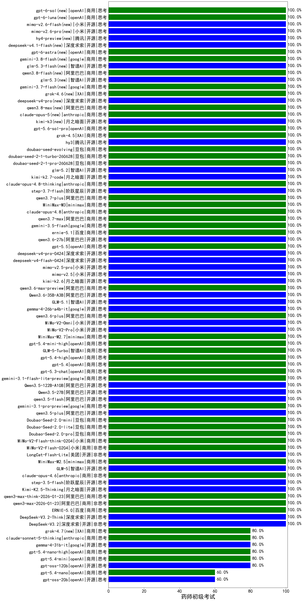

|类别|机构|大模型|【药师初级考试】准确率|平均耗时|平均消耗token|花费/千次（元）|排名（准确率）|
|---|---|-----|-------------------|-------|-----------|-----------|-----------|
|开源|腾讯|hy4-preview(new)|100.0%|36s|2165|38.1|1|
|开源|小米|MiMo-V2-Pro|100.0%|493s|1051|17.8|2|
|开源|月之暗面|kimi-k2.6|100.0%|50s|691|17.4|3|
|商用|阿里巴巴|qwen3.6-max-preview|100.0%|37s|1354|70.2|4|
|开源|阿里巴巴|Qwen3.6-35B-A3B|100.0%|8s|1506|15.7|5|
|开源|智谱AI|GLM-5.1|100.0%|144s|945|21.6|6|
|开源|google|gemma-4-26b-a4b-it|100.0%|31s|484|1.2|7|
|商用|anthropic|claude-opus-5(new)|100.0%|12s|543|82.8|8|
|商用|阿里巴巴|qwen3.6-plus|100.0%|46s|1309|15.1|9|
|开源|小米|MiMo-V2-Omni|100.0%|53s|957|10.0|10|
|商用|minimax|MiniMax-M2.7|100.0%|26s|1206|9.5|11|
|开源|阿里巴巴|Qwen3.5-122B-A10B|100.0%|208s|1334|8.2|12|
|商用|阿里巴巴|qwen3.8-max(new)|100.0%|10s|449|13.7|13|
|开源|深度求索|deepseek-v4-pro(new)|100.0%|533s|309|5.9|14|
|商用|openAI|gpt-5.4-mini-high|100.0%|125s|403|10.7|15|
|商用|XAI|grok-4.6(new)|100.0%|17s|890|30.1|16|
|商用|智谱AI|GLM-5-Turbo|100.0%|16s|946|19.8|17|
|商用|openAI|gpt-5.4-high|100.0%|21s|483|44.3|18|
|商用|openAI|gpt-5.4|100.0%|19s|278|22.7|19|
|商用|openAI|gpt-5.3-chat|100.0%|59s|346|27.6|20|
|开源|小米|mimo-v2.5|100.0%|38s|866|8.7|21|
|开源|小米|mimo-v2.5-pro|100.0%|18s|986|16.4|22|
|开源|深度求索|deepseek-v4-flash-0424|100.0%|36s|430|0.8|23|
|开源|深度求索|deepseek-v4-pro-0424|100.0%|14s|467|10.5|24|
|开源|腾讯|hy3(new)|100.0%|187s|186|0.6|25|
|开源|月之暗面|kimi-k3(new)|100.0%|22s|460|35.1|26|
|商用|豆包|doubao-seed-evolving(new)|100.0%|143s|2120|61.3|27|
|商用|豆包|doubao-seed-2-1-turbo-260628(new)|100.0%|36s|1624|23.2|28|
|商用|豆包|doubao-seed-2-1-pro-260628(new)|100.0%|63s|1934|55.7|29|
|开源|智谱AI|glm-5.2(new)|100.0%|27s|1152|30.9|30|
|开源|月之暗面|kimi-k2.7-code(new)|100.0%|11s|312|7.2|31|
|商用|anthropic|claude-opus-4.8-thinking(new)|100.0%|8s|532|80.9|32|
|开源|阶跃星辰|step-3.7-flash(new)|100.0%|18s|1225|9.5|33|
|商用|阿里巴巴|qwen3.7-plus(new)|100.0%|35s|614|4.5|34|
|商用|minimax|MiniMax-M3(new)|100.0%|23s|704|9.0|35|
|商用|anthropic|claude-opus-4.8(new)|100.0%|8s|480|71.8|36|
|商用|阿里巴巴|qwen3.7-max|100.0%|29s|661|22.2|37|
|商用|google|gemini-3.5-flash|100.0%|6s|828|49.2|38|
|商用|百度|ernie-5.1|100.0%|54s|718|12.2|39|
|开源|阿里巴巴|qwen3.6-27b|100.0%|21s|1410|24.4|40|
|商用|openAI|gpt-5.5|100.0%|6s|265|42.7|41|
|商用|google|gemini-3.1-flash-lite-preview|100.0%|4s|275|2.4|42|
|开源|阿里巴巴|Qwen3.5-27B|100.0%|280s|2112|9.9|43|
|商用|openAI|gpt-5.6-sol-pro(new)|100.0%|7s|2460|151.8|44|
|开源|智谱AI|glm-5.3-flash(new)|100.0%|378s|730|1.9|45|
|开源|小米|MiMo-V2-Flash-think|100.0%|17s|1310|0.0|46|
|开源|智谱AI|glm-5.3(new)|100.0%|23s|758|19.9|47|
|商用|豆包|doubao-seed-1-8-251215|100.0%|16s|537|3.6|48|
|商用|google|gemini-3-flash-preview|100.0%|74s|836|16.8|49|
|商用|阿里巴巴|qwen3.8-flash(new)|100.0%|8s|445|1.0|50|
|商用|openAI|gpt-5.2-high|100.0%|19s|733|66.5|51|
|商用|阿里巴巴|qwen-plus-think-2025-12-01|100.0%|35s|1422|10.9|52|
|商用|阿里巴巴|qwen-plus-2025-12-01|100.0%|18s|578|1.1|53|
|商用|腾讯|hunyuan-2.0-thinking-20251109|100.0%|7s|564|2.1|54|
|开源|阿里巴巴|qwen3.5-flash|100.0%|135s|2589|5.1|55|
|商用|腾讯|hunyuan-2.0-instruct-20251111|100.0%|8s|331|0.5|56|
|商用|google|gemini-3.8-flash(new)|100.0%|49s|465|22.1|57|
|商用|openAI|gpt-6-astra(new)|100.0%|14s|212|53.4|58|
|开源|深度求索|deepseek-v4.1-flash(new)|100.0%|4s|286|1.8|59|
|开源|Mistral|mistral-large-2512|100.0%|12s|454|4.3|60|
|开源|阿里巴巴|qwen3-next-80b-a3b-thinking|100.0%|135s|2110|8.2|61|
|开源|深度求索|DeepSeek-V3.2-Think|100.0%|160s|709|2.1|62|
|开源|深度求索|DeepSeek-V3.2|100.0%|8s|279|0.8|63|
|开源|智谱AI|GLM-4.7|100.0%|35s|1383|18.7|64|
|商用|minimax|MiniMax-M2.1|100.0%|110s|1050|8.2|65|
|商用|阿里巴巴|qwen3-max-preview-think|100.0%|167s|1362|31.5|66|
|商用|google|gemini-3.7-flash(new)|100.0%|7s|551|13.3|67|
|商用|google|gemini-3.1-pro-preview|100.0%|31s|1020|82.9|68|
|开源|阿里巴巴|qwen3.5-plus|100.0%|19s|1587|7.4|69|
|商用|豆包|Doubao-Seed-2.0-mini|100.0%|184s|798|1.4|70|
|商用|豆包|Doubao-Seed-2.0-lite|100.0%|85s|642|2.0|71|
|商用|豆包|Doubao-Seed-2.0-pro|100.0%|123s|617|8.6|72|
|商用|小米|MiMo-V2-Flash-think-0204|100.0%|382s|1016|2.0|73|
|商用|小米|MiMo-V2-Flash-0204|100.0%|221s|484|0.9|74|
|开源|美团|LongCat-Flash-Lite|100.0%|120s|485|0.0|75|
|商用|minimax|MiniMax-M2.5|100.0%|19s|1057|8.3|76|
|开源|智谱AI|GLM-5|100.0%|44s|1356|23.6|77|
|商用|anthropic|claude-opus-4.6|100.0%|11s|590|90.9|78|
|开源|阶跃星辰|step-3.5-flash|100.0%|8s|830|1.7|79|
|开源|月之暗面|Kimi-K2.5-Thinking|100.0%|197s|997|19.9|80|
|商用|阿里巴巴|qwen3-max-think-2026-01-23|100.0%|60s|1645|16.0|81|
|商用|阿里巴巴|qwen3-max-2026-01-23|100.0%|127s|380|3.3|82|
|商用|百度|ERNIE-5.0|100.0%|128s|1029|23.7|83|
|开源|美团|LongCat-Flash-Thinking-2601|100.0%|160s|1392|0.0|84|
|商用|XAI|grok-4.5(new)|100.0%|15s|953|32.8|85|
|开源|openAI|gpt-oss-120b|80.0%|226s|520|1.4|86|
|商用|anthropic|claude-sonnet-5-thinking(new)|80.0%|24s|492|29.6|87|
|开源|google|gemma-4-31b-it|80.0%|88s|535|1.4|88|
|商用|openAI|gpt-5.4-nano-high|80.0%|28s|469|3.6|89|
|开源|智谱AI|GLM-4.7-Flash|80.0%|265s|1200|0.0|90|
|开源|小米|MiMo-V2-Flash|80.0%|9s|339|0.0|91|
|商用|openAI|gpt-5.2-medium|80.0%|7s|336|26.9|92|
|商用|openAI|gpt-5.2|80.0%|4s|155|9.0|93|
|商用|openAI|gpt-5.4-mini|80.0%|13s|223|5.1|94|
|商用|openAI|gpt-5.4-nano|60.0%|133s|235|1.5|95|
|开源|openAI|gpt-oss-20b|60.0%|11s|2215|2.5|96|
|开源|Mistral|Ministral-3-8B-Instruct-2512|60.0%|3s|553|0.6|97|
|开源|Mistral|Ministral-3-3B-Instruct-2512|40.0%|4s|880|0.6|98|
|开源|Mistral|Ministral-3-14B-Instruct-2512|40.0%|11s|362|0.5|99|

