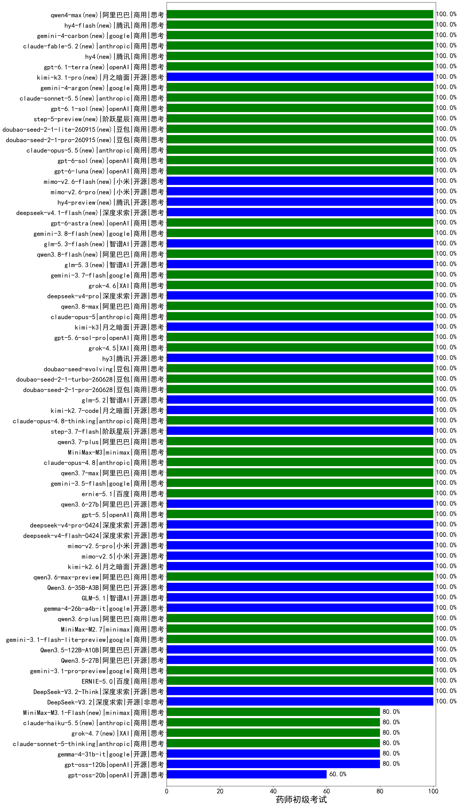

|类别|机构|大模型|【药师初级考试】准确率|平均耗时|平均消耗token|花费/千次（元）|排名（准确率）|
|---|---|-----|-------------------|-------|-----------|-----------|-----------|
|商用|XAI|grok-4.5|100.0%|15s|953|32.8|1|
|商用|阿里巴巴|qwen3.8-flash|100.0%|8s|445|1.0|2|
|开源|小米|mimo-v2.6-pro|100.0%|15s|635|3.6|3|
|开源|腾讯|hy4-preview|100.0%|36s|2165|38.1|4|
|开源|深度求索|deepseek-v4.1-flash|100.0%|4s|286|1.8|5|
|商用|openAI|gpt-6-astra|100.0%|14s|212|53.4|6|
|商用|google|gemini-3.8-flash|100.0%|49s|465|22.1|7|
|开源|智谱AI|glm-5.3-flash|100.0%|378s|730|1.9|8|
|开源|智谱AI|glm-5.3|100.0%|23s|758|19.9|9|
|商用|openAI|gpt-6-luna|100.0%|99s|245|0.7|10|
|商用|google|gemini-3.7-flash|100.0%|7s|551|13.3|11|
|商用|XAI|grok-4.6|100.0%|17s|890|30.1|12|
|开源|深度求索|deepseek-v4-pro|100.0%|533s|309|5.9|13|
|商用|阿里巴巴|qwen3.8-max|100.0%|10s|449|13.7|14|
|商用|anthropic|claude-opus-5|100.0%|12s|543|82.8|15|
|开源|月之暗面|kimi-k3|100.0%|22s|460|35.1|16|
|开源|小米|mimo-v2.6-flash|100.0%|292s|617|1.2|17|
|商用|openAI|gpt-6-sol|100.0%|743s|158|6.9|18|
|开源|腾讯|hy3|100.0%|187s|186|0.6|19|
|商用|openAI|gpt-6.1-terra(new)|100.0%|5s|214|5.4|20|
|商用|openAI|gpt-6.2-astra(new)|100.0%|5s|145|24.0|21|
|商用|阿里巴巴|qwen4-max(new)|100.0%|11s|466|12.5|22|
|商用|腾讯|hy4-flash(new)|100.0%|4s|360|0.6|23|
|商用|google|gemini-4-carbon(new)|100.0%|15s|668|84.1|24|
|商用|anthropic|claude-fable-5.2(new)|100.0%|18s|393|90.2|25|
|商用|腾讯|hy4(new)|100.0%|31s|1532|26.7|26|
|开源|月之暗面|kimi-k3.1-pro(new)|100.0%|17s|638|35.8|27|
|商用|anthropic|claude-opus-5.5(new)|100.0%|12s|546|66.5|28|
|商用|google|gemini-4-argon(new)|100.0%|21s|391|45.3|29|
|商用|anthropic|claude-sonnet-5.5(new)|100.0%|7s|427|24.9|30|
|商用|openAI|gpt-6.1-sol(new)|100.0%|370s|176|8.2|31|
|商用|阶跃星辰|step-5-preview(new)|100.0%|27s|702|13.2|32|
|商用|豆包|doubao-seed-2-1-lite-260915(new)|100.0%|82s|355|0.8|33|
|商用|豆包|doubao-seed-2-1-pro-260915(new)|100.0%|12s|461|11.5|34|
|商用|openAI|gpt-5.6-sol-pro|100.0%|7s|2460|151.8|35|
|商用|openAI|gpt-6.2-sol(new)|100.0%|4s|156|6.8|36|
|开源|小米|mimo-v2.5|100.0%|38s|866|8.7|37|
|开源|深度求索|deepseek-v4-pro-0424|100.0%|14s|467|10.5|38|
|商用|minimax|MiniMax-M2.7|100.0%|26s|1206|9.5|39|
|开源|阿里巴巴|Qwen3.5-27B|100.0%|280s|2112|9.9|40|
|商用|google|gemini-3.1-pro-preview|100.0%|31s|1020|82.9|41|
|商用|阿里巴巴|qwen3.6-plus|100.0%|46s|1309|15.1|42|
|商用|百度|ERNIE-5.0|100.0%|128s|1029|23.7|43|
|开源|google|gemma-4-26b-a4b-it|100.0%|31s|484|1.2|44|
|开源|智谱AI|GLM-5.1|100.0%|144s|945|21.6|45|
|开源|阿里巴巴|Qwen3.6-35B-A3B|100.0%|8s|1506|15.7|46|
|商用|阿里巴巴|qwen3.6-max-preview|100.0%|37s|1354|70.2|47|
|开源|月之暗面|kimi-k2.6|100.0%|50s|691|17.4|48|
|开源|深度求索|DeepSeek-V3.2-Think|100.0%|160s|709|2.1|49|
|商用|豆包|doubao-seed-evolving|100.0%|143s|2120|61.3|50|
|开源|小米|mimo-v2.5-pro|100.0%|18s|986|16.4|51|
|开源|深度求索|deepseek-v4-flash-0424|100.0%|36s|430|0.8|52|
|商用|openAI|gpt-5.5|100.0%|6s|265|42.7|53|
|开源|阿里巴巴|Qwen3.5-122B-A10B|100.0%|208s|1334|8.2|54|
|开源|阿里巴巴|qwen3.6-27b|100.0%|21s|1410|24.4|55|
|商用|百度|ernie-5.1|100.0%|54s|718|12.2|56|
|商用|google|gemini-3.5-flash|100.0%|6s|828|49.2|57|
|商用|阿里巴巴|qwen3.7-max|100.0%|29s|661|22.2|58|
|商用|anthropic|claude-opus-4.8|100.0%|8s|480|71.8|59|
|商用|minimax|MiniMax-M3|100.0%|23s|704|9.0|60|
|商用|阿里巴巴|qwen3.7-plus|100.0%|35s|614|4.5|61|
|开源|阶跃星辰|step-3.7-flash|100.0%|18s|1225|9.5|62|
|商用|anthropic|claude-opus-4.8-thinking|100.0%|8s|532|80.9|63|
|开源|月之暗面|kimi-k2.7-code|100.0%|11s|312|7.2|64|
|开源|智谱AI|glm-5.2|100.0%|27s|1152|30.9|65|
|商用|豆包|doubao-seed-2-1-pro-260628|100.0%|63s|1934|55.7|66|
|商用|豆包|doubao-seed-2-1-turbo-260628|100.0%|36s|1624|23.2|67|
|开源|深度求索|DeepSeek-V3.2|100.0%|8s|279|0.8|68|
|商用|google|gemini-3.1-flash-lite-preview|100.0%|4s|275|2.4|69|
|商用|anthropic|claude-sonnet-5-thinking|80.0%|24s|492|29.6|70|
|商用|minimax|MiniMax-M3.1-Flash(new)|80.0%|9s|487|1.2|71|
|商用|anthropic|claude-haiku-5.5(new)|80.0%|5s|545|1.7|72|
|开源|google|gemma-4-31b-it|80.0%|88s|535|1.4|73|
|商用|XAI|grok-4.7|80.0%|29s|3194|97.9|74|
|开源|openAI|gpt-oss-120b|80.0%|226s|520|1.4|75|
|开源|openAI|gpt-oss-20b|60.0%|11s|2215|2.5|76|

