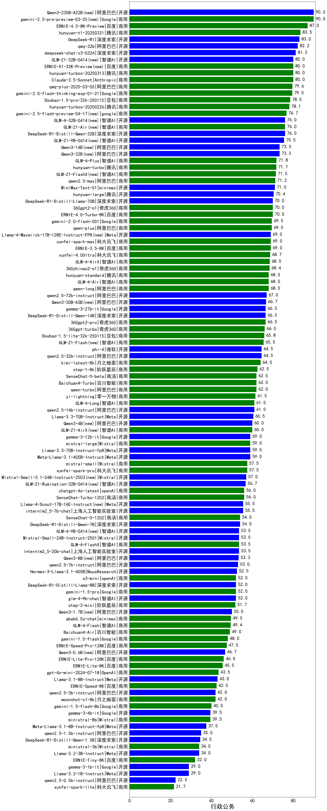

| 类别 | 大模型                         | 行政公务 | 排名 |
|-----|------------------------------|---------|----|
|商用|ERNIE-X1-Turbo-32K(new)|96.7%|1|
|开源|DeepSeek-R1-0528(new)|96.7%|2|
|商用|GLM-4-Plus|96.1%|3|
|商用|claude-4-sonnet(new)|90.0%|4|
|开源|Qwen3-235B-A22B|90.0%|5|
|商用|o4-mini|90.0%|6|
|商用|qwen-turbo-think-2025-04-28(new)|90.0%|7|
|商用|doubao-seed-1-6-thinking-250615(new)|90.0%|8|
|商用|step-r1-v-mini(new)|90.0%|9|
|商用|gemini-2.5-pro-preview-05-06(new)|90.0%|10|
|商用|hunyuan-t1-20250321|88.5%|11|
|开源|qwq-32b|88.1%|12|
|商用|doubao-seed-1-6-250615(new)|86.7%|13|
|商用|qwq-plus-2025-03-05|85.2%|14|
|开源|DeepSeek-R1|84.7%|15|
|商用|hunyuan-turbos-20250313|84.5%|16|
|商用|xunfei-spark-x1|83.7%|17|
|商用|qwen-plus-2025-04-28(new)|83.3%|18|
|开源|deepseek-chat-v3-0324|82.4%|19|
|商用|GLM-Z1-AirX|82.0%|20|
|开源|GLM-4-32B-0414|80.1%|21|
|开源|GLM-Z1-9B-0414|80.1%|22|
|商用|qwen-plus-think-2025-04-28(new)|80.0%|23|
|商用|Doubao-1.5-thinking-pro|80.0%|24|
|商用|gemini-2.5-flash-preview-05-20(new)|80.0%|25|
|商用|gpt-4.1-mini|80.0%|26|
|商用|claude-4-sonnet-thinking(new)|80.0%|27|
|开源|MiniMax-M1(new)|80.0%|28|
|商用|Doubao-1.5-pro-32k-250115|80.0%|29|
|开源|GLM-Z1-32B-0414|80.0%|30|
|商用|doubao-seed-1-6-flash-thinking-250615(new)|80.0%|31|
|开源|DeepSeek-R1-Distill-Qwen-32B|77.6%|32|
|开源|DeepSeek-R1-0528-Qwen3-8B(new)|76.7%|33|
|开源|MiniMax-Text-01|75.1%|34|
|商用|qwen-plus-2025-01-25|75.1%|35|
|商用|ERNIE-4.5-Turbo-32K(new)|74.0%|36|
|商用|ERNIE-3.5-8K|73.5%|37|
|商用|hunyuan-turbo|73.5%|38|
|商用|GLM-Z1-FlashX|73.3%|39|
|开源|Qwen3-32B|73.3%|40|
|商用|360zhinao2-o1|73.3%|41|
|开源|Qwen3-14B|73.3%|42|
|商用|qwen-long-2025-01-25|72.4%|43|
|商用|qwen2.5-max|72.2%|44|
|开源|hunyuan-large|72.1%|45|
|商用|360gpt2-pro|71.8%|46|
|开源|DeepSeek-R1-Distill-Llama-70B|71.4%|47|
|商用|360gpt-turbo|71.3%|48|
|开源|Llama-4-Maverick-17B-128E-Instruct-FP8|70.4%|49|
|商用|xunfei-spark-max|70.4%|50|
|商用|360gpt2-o1|70.4%|51|
|商用|xunfei-4.0Ultra|70.1%|52|
|商用|GLM-Z1-Air|70.0%|53|
|商用|hunyuan-turbos-20250604(new)|70.0%|54|
|商用|hunyuan-t1-20250529(new)|70.0%|55|
|开源|gemma-3-27b-it|69.6%|56|
|商用|GLM-Z1-Flash|69.6%|57|
|开源|DeepSeek-R1-Distill-Qwen-14B|69.6%|58|
|开源|qwen2.5-32b-instruct|69.1%|59|
|开源|qwen2.5-72b-instruct|68.4%|60|
|开源|phi-4|68.0%|61|
|商用|hunyuan-standard|68.0%|62|
|商用|Baichuan4-Turbo|68.0%|63|
|商用|Doubao-1.5-lite-32k-250115|67.5%|64|
|商用|qwen-turbo-2025-02-11|67.4%|65|
|开源|Qwen3-30B-A3B|66.7%|66|
|开源|qwen2.5-14b-instruct|65.7%|67|
|商用|kimi-latest-8k|65.3%|68|
|商用|yi-lightning|65.2%|69|
|商用|SenseChat-5-beta|63.3%|70|
|商用|xunfei-spark-pro|61.9%|71|
|开源|gemma-3-12b-it|61.9%|72|
|开源|Mistral-Small-3.1-24B-Instruct-2503|61.3%|73|
|商用|mistral-small|60.8%|74|
|商用|mistral-large|60.2%|75|
|开源|internlm2_5-7b-chat|60.2%|76|
|商用|gpt-4.1|60.0%|77|
|商用|GLM-4-Air|60.0%|78|
|开源|Qwen3-4B|60.0%|79|
|商用|SenseChat-Turbo-1202|59.1%|80|
|开源|Llama-4-Scout-17B-16E-Instruct|58.0%|81|
|开源|GLM-4-9B-0414|57.5%|82|
|商用|GLM-4-FlashX|57.5%|83|
|商用|chatgpt-4o-latest|57.1%|84|
|商用|GLM-4-AirX|56.7%|85|
|开源|GLM-Z1-Rumination-32B-0414|56.7%|86|
|商用|doubao-seed-1-6-flash-250615(new)|56.7%|87|
|商用|qwen-turbo-2025-04-28(new)|56.7%|88|
|开源|DeepSeek-R1-Distill-Qwen-7B|56.4%|89|
|开源|qwen2.5-7b-instruct|55.8%|90|
|商用|SenseChat-5-1202|55.1%|91|
|开源|DeepSeek-R1-Distill-Llama-8B|54.7%|92|
|开源|Qwen3-8B|53.3%|93|
|商用|step-2-mini|52.9%|94|
|商用|Baichuan4-Air|51.9%|95|
|商用|GLM-4-Flash|50.7%|96|
|开源|Qwen3-1.7B|50.0%|97|
|商用|ERNIE-Lite-8K|48.1%|98|
|商用|gpt-4o-mini|47.5%|99|
|开源|Qwen3-0.6B|46.7%|100|
|商用|ERNIE-Speed-8K|43.1%|101|
|开源|qwen2.5-3b-instruct|42.5%|102|
|商用|moonshot-v1-8k|42.0%|103|
|开源|gemma-3-4b-it|42.0%|104|
|商用|ministral-8b|40.3%|105|
|商用|GLM-4-Long|36.7%|106|
|商用|ministral-3b|35.9%|107|
|开源|qwen2.5-1.5b-instruct|34.3%|108|
|商用|ERNIE-Tiny-8K|32.6%|109|
|开源|qwen2.5-0.5b-instruct|21.5%|110|
|商用|xunfei-spark-lite|21.4%|111|

