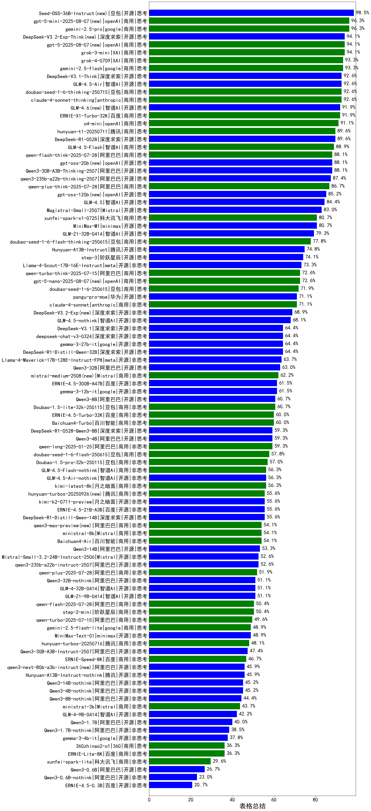

|类别|机构|大模型|【表格总结】准确率|平均耗时|平均消耗token|花费/千次（元）|排名（准确率）|
|---|---|-----|-------------------|-------|-----------|-----------|-----------|
|商用|openAI|gpt-5-mini-high(new)|100.0%|106s|7663|93.7|1|
|开源|豆包|Seed-OSS-36B-Instruct|98.5%|161s|4143|12.5|2|
|商用|openAI|gpt-5.1-medium(new)|97.8%|272s|2537|94.7|3|
|商用|openAI|gpt-5-mini-2025-08-07|96.3%|45s|3587|34.6|4|
|商用|google|gemini-2.5-pro|96.3%|60s|3908|178.1|5|
|开源|深度求索|DeepSeek-V3.2-Exp-Think(new)|94.1%|614s|3753|10.0|6|
|商用|openAI|gpt-5-2025-08-07|94.1%|60s|2816|117.1|7|
|商用|豆包|doubao-seed-1-6-lite-251015(new)|94.1%|363s|3088|3.9|8|
|商用|XAI|grok-3-mini|94.1%|41s|2591|7.5|9|
|商用|豆包|doubao-seed-1-6-251015(new)|93.3%|16s|3243|14.0|10|
|商用|google|gemini-2.5-flash|93.3%|42s|3571|38.3|11|
|商用|XAI|grok-4-0709|93.3%|56s|2346|143.7|12|
|商用|anthropic|claude-4-sonnet-thinking|92.6%|41s|2251|116.0|13|
|开源|深度求索|DeepSeek-V3.1-Think|92.6%|100s|3375|30.1|14|
|商用|豆包|doubao-seed-1-6-thinking-250715|92.6%|/|3778|18.5|15|
|商用|openAI|gpt-5.1-high(new)|92.6%|183s|4473|232.1|16|
|开源|智谱AI|GLM-4.5-Air|92.6%|60s|4015|17.2|17|
|商用|XAI|grok-4-1-fast-reasoning(new)|92.6%|16s|2784|6.8|18|
|商用|百度|ERNIE-X1-Turbo-32K|91.9%|104s|4434|12.9|19|
|开源|智谱AI|GLM-4.6(new)|91.9%|59s|3673|36.8|20|
|商用|openAI|o4-mini|91.1%|44s|3297|72.4|21|
|开源|月之暗面|Kimi-K2-Thinking(new)|91.1%|218s|4226|52.2|22|
|商用|百度|ERNIE-5.0-Thinking-Preview(new)|91.1%|240s|4510|79.2|23|
|开源|深度求索|DeepSeek-R1-0528|89.6%|79s|3684|43.4|24|
|商用|腾讯|hunyuan-t1-20250711|89.6%|59s|3725|10.0|25|
|商用|智谱AI|GLM-4.5-Flash|88.9%|74s|3938|0.0|26|
|开源|阿里巴巴|Qwen3-30B-A3B-Thinking-2507|88.1%|77s|4913|10.4|27|
|商用|anthropic|claude-haiku-4.5-thinking(new)|88.1%|54s|5933|168.5|28|
|商用|阿里巴巴|qwen-flash-think-2025-07-28|88.1%|64s|4953|5.3|29|
|商用|google|gemini-3-pro-preview(new)|88.1%|52s|4599|273.9|30|
|商用|anthropic|claude-sonnet-4.5-thinking(new)|88.1%|16s|2540|137.7|31|
|商用|百度|ERNIE-X1.1-Preview(new)|88.1%|217s|4251|12.2|32|
|开源|openAI|gpt-oss-20b|88.1%|43s|4181|3.6|33|
|开源|阿里巴巴|qwen3-235b-a22b-thinking-2507|87.4%|298s|5944|47.5|34|
|商用|anthropic|claude-opus-4.5(new)|87.4%|20s|1761|90.7|35|
|商用|阿里巴巴|qwen-plus-think-2025-07-28|86.7%|/|5470|32.3|36|
|开源|openAI|gpt-oss-120b|85.2%|36s|2732|5.1|37|
|开源|智谱AI|GLM-4.5|84.4%|140s|4034|41.9|38|
|开源|minimax|MiniMax-M2(new)|84.4%|87s|4909|33.0|39|
|开源|Mistral|Magistral-Small-2507|83.0%|89s|8731|82.5|40|
|开源|minimax|MiniMax-M1|80.7%|426s|9079|56.4|41|
|商用|科大讯飞|xunfei-spark-x1-0725|80.7%|51s|2982|35.8|42|
|商用|豆包|doubao-seed-1-6-flash-thinking-250615|77.8%|/|2325|1.2|43|
|商用|openAI|gpt-5-nano-high(new)|76.3%|1270s|17288|46.6|44|
|开源|腾讯|Hunyuan-A13B-Instruct|74.8%|97s|5592|17.6|45|
|商用|anthropic|claude-sonnet-4.5(new)|74.8%|4s|1734|52.6|46|
|开源|阶跃星辰|step-3|74.1%|184s|4598|15.1|47|
|商用|openAI|gpt-5.1(new)|73.3%|129s|1576|26.4|48|
|开源|meta|Llama-4-Scout-17B-16E-Instruct|73.3%|27s|1568|1.5|49|
|商用|openAI|gpt-5-nano-2025-08-07|72.6%|67s|7623|18.6|50|
|商用|阿里巴巴|qwen-turbo-think-2025-07-15|72.6%|/|3899|7.4|51|
|商用|豆包|doubao-seed-1-6-250615|71.9%|/|1839|2.8|52|
|商用|anthropic|claude-4-sonnet|71.1%|34s|1706|56.8|53|
|商用|XAI|grok-4-1-fast-non-reasoning(new)|70.4%|123s|1578|2.5|54|
|开源|深度求索|DeepSeek-V3.2-Exp(new)|68.9%|528s|1447|3.0|55|
|开源|智谱AI|GLM-4.5-nothink|68.1%|36s|1506|6.4|56|
|开源|深度求索|DeepSeek-V3.1|64.4%|35s|1459|7.1|57|
|开源|google|gemma-3-27b-it|64.4%|32s|1869|1.5|58|
|开源|meta|Llama-4-Maverick-17B-128E-Instruct-FP8|63.7%|28s|1556|2.9|59|
|开源|阿里巴巴|Qwen3-32B|63.0%|132s|5111|15.7|60|
|商用|Mistral|mistral-medium-2508|62.2%|15s|2009|9.2|61|
|开源|百度|ERNIE-4.5-300B-A47B|61.5%|34s|1678|4.3|62|
|开源|google|gemma-3-12b-it|61.5%|33s|1897|0.8|63|
|商用|anthropic|claude-haiku-4.5(new)|60.7%|67s|1800|19.5|64|
|开源|阿里巴巴|Qwen3-8B|60.7%|/|/|/|65|
|商用|豆包|Doubao-1.5-lite-32k-250115|60.7%|34s|1853|0.6|66|
|商用|百川智能|Baichuan4-Turbo|60.0%|43s|1818|27.3|67|
|商用|百度|ERNIE-4.5-Turbo-32K|60.0%|34s|1772|1.8|68|
|开源|深度求索|DeepSeek-R1-0528-Qwen3-8B|59.3%|/|/|/|69|
|商用|阿里巴巴|qwen-long-2025-01-25|59.3%|41s|1761|1.1|70|
|开源|阿里巴巴|Qwen3-4B|59.3%|115s|5341|11.7|71|
|商用|豆包|doubao-seed-1-6-flash-250615|57.8%|/|1783|0.5|72|
|商用|智谱AI|GLM-4.5-Flash-nothink|56.3%|5s|1488|0.0|73|
|开源|智谱AI|GLM-4.5-Air-nothink|56.3%|34s|1479|1.9|74|
|开源|百度|ERNIE-4.5-21B-A3B|55.6%|30s|1996|1.5|75|
|开源|月之暗面|kimi-k2-0711-preview|55.6%|16s|1427|7.5|76|
|商用|腾讯|hunyuan-turbos-20250926(new)|55.6%|7s|1842|1.7|77|
|商用|阿里巴巴|qwen3-max-preview|54.1%|5s|1771|13.9|78|
|商用|百川智能|Baichuan4-Air|54.1%|40s|1814|1.8|79|
|开源|阿里巴巴|Qwen3-14B|53.3%|85s|5569|8.8|80|
|开源|阿里巴巴|qwen3-235b-a22b-instruct-2507|52.6%|36s|1762|4.6|81|
|开源|Mistral|Mistral-Small-3.2-24B-Instruct-2506|52.6%|38s|1941|1.7|82|
|商用|阿里巴巴|qwen-plus-2025-07-28|51.9%|6s|1766|1.6|83|
|开源|阿里巴巴|Qwen3-32B-nothink|51.1%|44s|1779|2.3|84|
|商用|阿里巴巴|qwen-flash-2025-07-28|50.4%|35s|1807|0.6|85|
|商用|阿里巴巴|qwen-turbo-2025-07-15|49.6%|36s|1760|0.6|86|
|商用|google|gemini-2.5-flash-lite|48.9%|23s|1811|1.6|87|
|开源|minimax|MiniMax-Text-01|48.9%|39s|2039|3.6|88|
|商用|阿里巴巴|qwen3-max-2025-09-23(new)|48.1%|192s|1769|13.8|89|
|开源|月之暗面|kimi-k2-0905(new)|47.4%|47s|1446|7.5|90|
|开源|阿里巴巴|Qwen3-30B-A3B-Instruct-2507|47.4%|40s|1816|1.7|91|
|开源|腾讯|Hunyuan-A13B-Instruct-nothink|45.9%|42s|1783|2.4|92|
|开源|阿里巴巴|qwen3-next-80b-a3b-instruct|45.9%|9s|1811|2.5|93|
|开源|阿里巴巴|Qwen3-4B-nothink|45.2%|39s|1789|1.1|94|
|开源|阿里巴巴|Qwen3-14B-nothink|45.2%|59s|1774|1.2|95|
|开源|阿里巴巴|Qwen3-8B-nothink|44.4%|/|/|/|96|
|开源|智谱AI|GLM-4-9B-0414|42.2%|/|/|/|97|
|开源|阿里巴巴|Qwen3-1.7B|40.0%|66s|4359|8.8|98|
|开源|阿里巴巴|Qwen3-1.7B-nothink|38.5%|40s|1911|1.4|99|
|开源|google|gemma-3-4b-it|37.8%|27s|1951|0.3|100|
|商用|360|360zhinao2-o1|36.3%|166s|9993|90.4|101|
|商用|百度|ERNIE-Lite-8K|36.3%|32s|2033|0.0|102|
|开源|阿里巴巴|Qwen3-0.6B|26.7%|40s|2513|3.2|103|
|开源|阿里巴巴|Qwen3-0.6B-nothink|23.0%|33s|1838|1.2|104|
|开源|百度|ERNIE-4.5-0.3B|20.7%|32s|2601|0.5|105|

