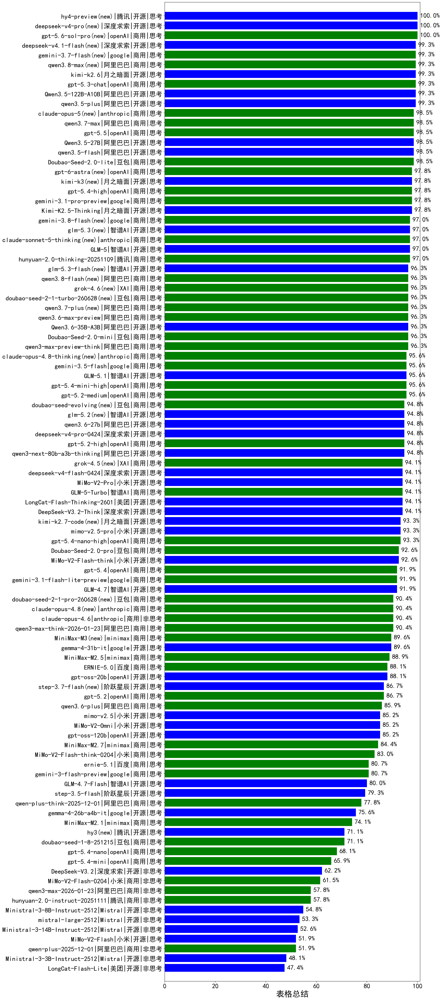

|类别|机构|大模型|【表格总结】准确率|平均耗时|平均消耗token|花费/千次（元）|排名（准确率）|
|---|---|-----|-------------------|-------|-----------|-----------|-----------|
|开源|腾讯|hy4-preview(new)|100.0%|157s|14062|237.4|1|
|开源|深度求索|deepseek-v4-pro(new)|100.0%|170s|7035|165.2|2|
|商用|openAI|gpt-5.6-sol-pro(new)|100.0%|26s|10118|647.5|3|
|开源|深度求索|deepseek-v4.1-flash(new)|99.3%|67s|7179|49.5|4|
|开源|月之暗面|kimi-k2.6|99.3%|175s|5296|116.7|5|
|商用|openAI|gpt-5.3-chat|99.3%|6s|1869|65.2|6|
|开源|阿里巴巴|Qwen3.5-122B-A10B|99.3%|716s|8546|45.6|7|
|开源|阿里巴巴|qwen3.5-plus|99.3%|91s|8790|35.7|8|
|商用|google|gemini-3.7-flash(new)|99.3%|6s|3177|48.5|9|
|商用|阿里巴巴|qwen3.8-max(new)|99.3%|104s|6590|197.4|10|
|商用|openAI|gpt-5.5|98.5%|11s|2173|215.6|11|
|开源|阿里巴巴|Qwen3.5-27B|98.5%|191s|8598|34.5|12|
|开源|阿里巴巴|qwen3.5-flash|98.5%|736s|9069|15.2|13|
|商用|豆包|Doubao-Seed-2.0-lite|98.5%|434s|3478|7.5|14|
|商用|anthropic|claude-opus-5(new)|98.5%|16s|2492|202.0|15|
|商用|阿里巴巴|qwen3.7-max|98.5%|75s|5578|161.9|16|
|商用|google|gemini-3.1-pro-preview|97.8%|52s|5319|335.2|17|
|开源|月之暗面|kimi-k3(new)|97.8%|96s|3510|242.2|18|
|商用|openAI|gpt-5.4-high|97.8%|28s|3335|229.8|19|
|商用|openAI|gpt-6-astra(new)|97.8%|19s|1775|236.2|20|
|开源|月之暗面|Kimi-K2.5-Thinking|97.8%|700s|4753|78.0|21|
|商用|anthropic|claude-sonnet-5-thinking(new)|97.0%|16s|2922|110.9|22|
|开源|智谱AI|GLM-5|97.0%|127s|5265|76.4|23|
|开源|智谱AI|glm-5.3(new)|97.0%|239s|3705|77.0|24|
|商用|腾讯|hunyuan-2.0-thinking-20251109|97.0%|33s|4107|12.6|25|
|商用|google|gemini-3.8-flash(new)|97.0%|19s|4503|166.6|26|
|商用|豆包|Doubao-Seed-2.0-mini|96.3%|684s|4687|6.4|27|
|商用|阿里巴巴|qwen3.6-max-preview|96.3%|145s|6504|278.3|28|
|商用|豆包|doubao-seed-2-1-turbo-260628(new)|96.3%|239s|15444|211.7|29|
|商用|阿里巴巴|qwen3.7-plus(new)|96.3%|75s|5588|35.0|30|
|商用|阿里巴巴|qwen3.8-flash(new)|96.3%|96s|8178|18.9|31|
|开源|智谱AI|glm-5.3-flash(new)|96.3%|65s|4159|9.0|32|
|开源|阿里巴巴|Qwen3.6-35B-A3B|96.3%|21s|6224|52.6|33|
|商用|阿里巴巴|qwen3-max-preview-think|96.3%|100s|6044|116.4|34|
|商用|XAI|grok-4.6(new)|96.3%|63s|4497|145.1|35|
|开源|智谱AI|GLM-5.1|95.6%|111s|4176|76.3|36|
|商用|anthropic|claude-opus-4.8-thinking(new)|95.6%|9s|2410|187.6|37|
|商用|openAI|gpt-5.4-mini-high|95.6%|24s|4852|116.7|38|
|商用|google|gemini-3.5-flash|95.6%|16s|5316|247.7|39|
|商用|openAI|gpt-5.2-medium|95.6%|12s|1976|76.7|40|
|商用|openAI|gpt-5.2-high|94.8%|21s|2268|105.8|41|
|开源|智谱AI|glm-5.2(new)|94.8%|65s|4117|88.5|42|
|开源|阿里巴巴|qwen3-next-80b-a3b-thinking|94.8%|58s|7323|24.5|43|
|商用|豆包|doubao-seed-evolving(new)|94.8%|294s|12104|323.1|44|
|开源|深度求索|deepseek-v4-pro-0424|94.8%|71s|2693|49.1|45|
|开源|阿里巴巴|qwen3.6-27b|94.8%|71s|6542|93.4|46|
|开源|深度求索|deepseek-v4-flash-0424|94.1%|41s|2444|3.6|47|
|商用|XAI|grok-4.5(new)|94.1%|64s|4456|143.3|48|
|商用|智谱AI|GLM-5-Turbo|94.1%|67s|4297|71.9|49|
|开源|美团|LongCat-Flash-Thinking-2601|94.1%|310s|6316|0.0|50|
|开源|深度求索|DeepSeek-V3.2-Think|94.1%|46s|2751|7.0|51|
|开源|小米|MiMo-V2-Pro|94.1%|22s|3317|44.0|52|
|开源|小米|mimo-v2.5-pro|93.3%|28s|3483|47.4|53|
|商用|openAI|gpt-5.4-nano-high|93.3%|138s|3105|17.1|54|
|开源|月之暗面|kimi-k2.7-code(new)|93.3%|56s|3357|64.4|55|
|商用|豆包|Doubao-Seed-2.0-pro|92.6%|513s|3889|40.9|56|
|开源|小米|MiMo-V2-Flash-think|92.6%|46s|6063|0.0|57|
|商用|openAI|gpt-5.4|91.9%|4s|1562|43.7|58|
|开源|智谱AI|GLM-4.7|91.9%|85s|6407|75.1|59|
|商用|google|gemini-3.1-flash-lite-preview|91.9%|3s|1853|4.9|60|
|商用|anthropic|claude-opus-4.8(new)|90.4%|5s|1928|103.3|61|
|商用|豆包|doubao-seed-2-1-pro-260628(new)|90.4%|235s|13377|361.3|62|
|商用|anthropic|claude-opus-4.6|90.4%|19s|1822|100.0|63|
|商用|阿里巴巴|qwen3-max-think-2026-01-23|90.4%|343s|6828|56.3|64|
|开源|google|gemma-4-31b-it|89.6%|93s|1832|2.1|65|
|商用|minimax|MiniMax-M3(new)|89.6%|39s|2837|29.5|66|
|商用|minimax|MiniMax-M2.5|88.9%|38s|3142|18.2|67|
|开源|openAI|gpt-oss-20b|88.1%|43s|4181|3.6|68|
|商用|百度|ERNIE-5.0|88.1%|258s|4630|82.1|69|
|开源|阶跃星辰|step-3.7-flash(new)|86.7%|88s|4490|27.5|70|
|商用|openAI|gpt-5.2|86.7%|11s|1575|36.8|71|
|商用|阿里巴巴|qwen3.6-plus|85.9%|84s|6905|66.7|72|
|开源|openAI|gpt-oss-120b|85.2%|36s|2732|5.1|73|
|开源|小米|MiMo-V2-Omni|85.2%|338s|2899|20.0|74|
|开源|小米|mimo-v2.5|85.2%|14s|2677|17.0|75|
|商用|minimax|MiniMax-M2.7|84.4%|114s|7025|50.8|76|
|商用|小米|MiMo-V2-Flash-think-0204|83.0%|863s|6568|11.5|77|
|商用|百度|ernie-5.1|80.7%|57s|3676|42.7|78|
|商用|google|gemini-3-flash-preview|80.7%|125s|3501|45.1|79|
|开源|智谱AI|GLM-4.7-Flash|80.0%|948s|5171|0.0|80|
|开源|阶跃星辰|step-3.5-flash|79.3%|35s|4261|7.1|81|
|商用|阿里巴巴|qwen-plus-think-2025-12-01|77.8%|93s|6025|36.7|82|
|开源|google|gemma-4-26b-a4b-it|75.6%|22s|1842|2.0|83|
|商用|minimax|MiniMax-M2.1|74.1%|101s|2087|9.3|84|
|开源|腾讯|hy3(new)|71.1%|47s|1598|2.5|85|
|商用|豆包|doubao-seed-1-8-251215|71.1%|37s|2624|9.0|86|
|商用|openAI|gpt-5.4-nano|68.1%|3s|1643|4.3|87|
|商用|openAI|gpt-5.4-mini|65.9%|23s|1573|13.4|88|
|开源|深度求索|DeepSeek-V3.2|62.2%|8s|1451|3.1|89|
|商用|小米|MiMo-V2-Flash-0204|61.5%|108s|1801|1.5|90|
|商用|阿里巴巴|qwen3-max-2026-01-23|57.8%|104s|1770|5.8|91|
|商用|腾讯|hunyuan-2.0-instruct-20251111|57.8%|6s|1546|1.5|92|
|开源|Mistral|Ministral-3-8B-Instruct-2512|54.8%|12s|2049|2.2|93|
|开源|Mistral|mistral-large-2512|53.3%|9s|2029|9.4|94|
|开源|Mistral|Ministral-3-14B-Instruct-2512|52.6%|15s|2133|3.0|95|
|开源|小米|MiMo-V2-Flash|51.9%|10s|1880|0.0|96|
|商用|阿里巴巴|qwen-plus-2025-12-01|51.9%|10s|1868|1.8|97|
|开源|Mistral|Ministral-3-3B-Instruct-2512|48.1%|13s|2185|1.6|98|
|开源|美团|LongCat-Flash-Lite|47.4%|31s|1794|0.0|99|

