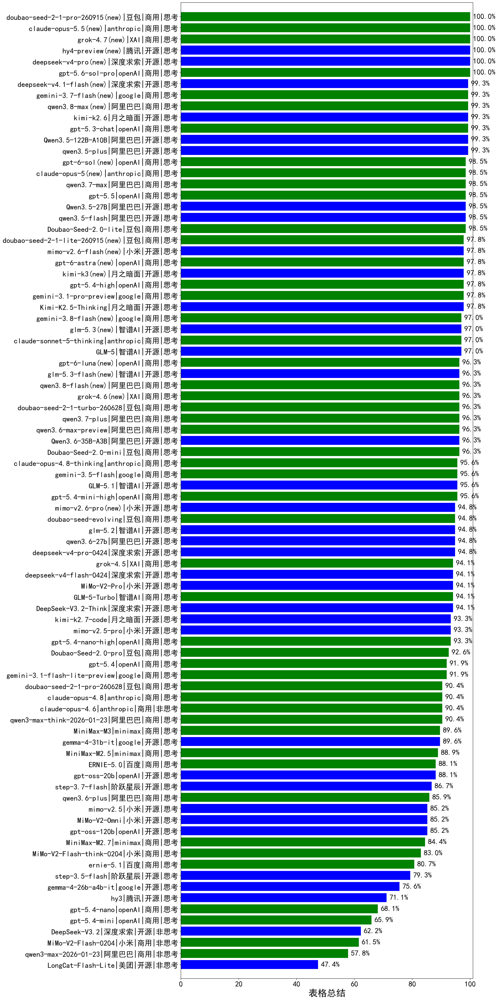

|类别|机构|大模型|【表格总结】准确率|平均耗时|平均消耗token|花费/千次（元）|排名（准确率）|
|---|---|-----|-------------------|-------|-----------|-----------|-----------|
|开源|深度求索|deepseek-v4-pro(new)|100.0%|170s|7035|165.2|1|
|商用|豆包|doubao-seed-2-1-pro-260915(new)|100.0%|155s|8280|208.4|2|
|商用|anthropic|claude-opus-5.5(new)|100.0%|16s|2481|159.7|3|
|商用|XAI|grok-4.7(new)|100.0%|54s|6010|179.6|4|
|商用|openAI|gpt-5.6-sol-pro|100.0%|26s|10118|647.5|5|
|开源|腾讯|hy4-preview(new)|100.0%|157s|14062|237.4|6|
|商用|openAI|gpt-5.3-chat|99.3%|6s|1869|65.2|7|
|开源|阿里巴巴|qwen3.5-plus|99.3%|91s|8790|35.7|8|
|商用|google|gemini-3.7-flash(new)|99.3%|6s|3177|48.5|9|
|开源|月之暗面|kimi-k2.6|99.3%|175s|5296|116.7|10|
|开源|阿里巴巴|Qwen3.5-122B-A10B|99.3%|716s|8546|45.6|11|
|开源|深度求索|deepseek-v4.1-flash(new)|99.3%|67s|7179|49.5|12|
|商用|阿里巴巴|qwen3.8-max(new)|99.3%|104s|6590|197.4|13|
|开源|阿里巴巴|qwen3.5-flash|98.5%|736s|9069|15.2|14|
|商用|豆包|Doubao-Seed-2.0-lite|98.5%|434s|3478|7.5|15|
|商用|anthropic|claude-opus-5(new)|98.5%|16s|2492|202.0|16|
|商用|阿里巴巴|qwen3.7-max|98.5%|75s|5578|161.9|17|
|商用|openAI|gpt-6-sol(new)|98.5%|57s|1824|50.7|18|
|商用|openAI|gpt-5.5|98.5%|11s|2173|215.6|19|
|开源|阿里巴巴|Qwen3.5-27B|98.5%|191s|8598|34.5|20|
|开源|月之暗面|kimi-k3(new)|97.8%|96s|3510|242.2|21|
|商用|openAI|gpt-5.4-high|97.8%|28s|3335|229.8|22|
|商用|豆包|doubao-seed-2-1-lite-260915(new)|97.8%|142s|8996|21.2|23|
|开源|小米|mimo-v2.6-flash(new)|97.8%|263s|3626|5.7|24|
|商用|google|gemini-3.1-pro-preview|97.8%|52s|5319|335.2|25|
|开源|月之暗面|Kimi-K2.5-Thinking|97.8%|700s|4753|78.0|26|
|商用|openAI|gpt-6-astra(new)|97.8%|19s|1775|236.2|27|
|开源|智谱AI|GLM-5|97.0%|127s|5265|76.4|28|
|开源|智谱AI|glm-5.3(new)|97.0%|239s|3705|77.0|29|
|商用|anthropic|claude-sonnet-5-thinking|97.0%|16s|2922|110.9|30|
|商用|google|gemini-3.8-flash(new)|97.0%|19s|4503|166.6|31|
|商用|阿里巴巴|qwen3.7-plus|96.3%|75s|5588|35.0|32|
|商用|豆包|doubao-seed-2-1-turbo-260628|96.3%|239s|15444|211.7|33|
|商用|openAI|gpt-6-luna(new)|96.3%|122s|2094|3.5|34|
|商用|阿里巴巴|qwen3.6-max-preview|96.3%|145s|6504|278.3|35|
|开源|阿里巴巴|Qwen3.6-35B-A3B|96.3%|21s|6224|52.6|36|
|开源|智谱AI|glm-5.3-flash(new)|96.3%|65s|4159|9.0|37|
|商用|XAI|grok-4.6(new)|96.3%|63s|4497|145.1|38|
|商用|豆包|Doubao-Seed-2.0-mini|96.3%|684s|4687|6.4|39|
|商用|阿里巴巴|qwen3.8-flash(new)|96.3%|96s|8178|18.9|40|
|商用|google|gemini-3.5-flash|95.6%|16s|5316|247.7|41|
|开源|智谱AI|GLM-5.1|95.6%|111s|4176|76.3|42|
|商用|openAI|gpt-5.4-mini-high|95.6%|24s|4852|116.7|43|
|商用|anthropic|claude-opus-4.8-thinking|95.6%|9s|2410|187.6|44|
|开源|小米|mimo-v2.6-pro(new)|94.8%|63s|4177|20.3|45|
|开源|智谱AI|glm-5.2|94.8%|65s|4117|88.5|46|
|开源|深度求索|deepseek-v4-pro-0424|94.8%|71s|2693|49.1|47|
|开源|阿里巴巴|qwen3.6-27b|94.8%|71s|6542|93.4|48|
|商用|豆包|doubao-seed-evolving|94.8%|294s|12104|323.1|49|
|商用|智谱AI|GLM-5-Turbo|94.1%|67s|4297|71.9|50|
|开源|深度求索|deepseek-v4-flash-0424|94.1%|41s|2444|3.6|51|
|商用|XAI|grok-4.5|94.1%|64s|4456|143.3|52|
|开源|小米|MiMo-V2-Pro|94.1%|22s|3317|44.0|53|
|开源|深度求索|DeepSeek-V3.2-Think|94.1%|46s|2751|7.0|54|
|开源|月之暗面|kimi-k2.7-code|93.3%|56s|3357|64.4|55|
|开源|小米|mimo-v2.5-pro|93.3%|28s|3483|47.4|56|
|商用|openAI|gpt-5.4-nano-high|93.3%|138s|3105|17.1|57|
|商用|豆包|Doubao-Seed-2.0-pro|92.6%|513s|3889|40.9|58|
|商用|google|gemini-3.1-flash-lite-preview|91.9%|3s|1853|4.9|59|
|商用|openAI|gpt-5.4|91.9%|4s|1562|43.7|60|
|商用|豆包|doubao-seed-2-1-pro-260628|90.4%|235s|13377|361.3|61|
|商用|anthropic|claude-opus-4.8|90.4%|5s|1928|103.3|62|
|商用|阿里巴巴|qwen3-max-think-2026-01-23|90.4%|343s|6828|56.3|63|
|商用|anthropic|claude-opus-4.6|90.4%|19s|1822|100.0|64|
|商用|minimax|MiniMax-M3|89.6%|39s|2837|29.5|65|
|开源|google|gemma-4-31b-it|89.6%|93s|1832|2.1|66|
|商用|minimax|MiniMax-M2.5|88.9%|38s|3142|18.2|67|
|商用|百度|ERNIE-5.0|88.1%|258s|4630|82.1|68|
|开源|openAI|gpt-oss-20b|88.1%|43s|4181|3.6|69|
|开源|阶跃星辰|step-3.7-flash|86.7%|88s|4490|27.5|70|
|商用|阿里巴巴|qwen3.6-plus|85.9%|84s|6905|66.7|71|
|开源|openAI|gpt-oss-120b|85.2%|36s|2732|5.1|72|
|开源|小米|MiMo-V2-Omni|85.2%|338s|2899|20.0|73|
|开源|小米|mimo-v2.5|85.2%|14s|2677|17.0|74|
|商用|minimax|MiniMax-M2.7|84.4%|114s|7025|50.8|75|
|商用|小米|MiMo-V2-Flash-think-0204|83.0%|863s|6568|11.5|76|
|商用|百度|ernie-5.1|80.7%|57s|3676|42.7|77|
|开源|阶跃星辰|step-3.5-flash|79.3%|35s|4261|7.1|78|
|开源|google|gemma-4-26b-a4b-it|75.6%|22s|1842|2.0|79|
|开源|腾讯|hy3|71.1%|47s|1598|2.5|80|
|商用|openAI|gpt-5.4-nano|68.1%|3s|1643|4.3|81|
|商用|openAI|gpt-5.4-mini|65.9%|23s|1573|13.4|82|
|开源|深度求索|DeepSeek-V3.2|62.2%|8s|1451|3.1|83|
|商用|小米|MiMo-V2-Flash-0204|61.5%|108s|1801|1.5|84|
|商用|阿里巴巴|qwen3-max-2026-01-23|57.8%|104s|1770|5.8|85|
|开源|美团|LongCat-Flash-Lite|47.4%|31s|1794|0.0|86|

