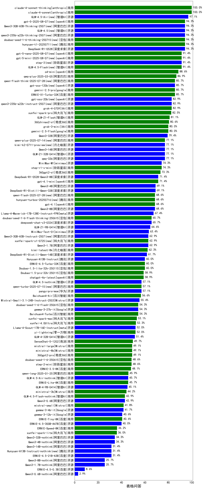

|类别|机构|大模型|【表格问答】准确率|平均耗时|平均消耗token|花费/千次（元）|排名（准确率）|
|---|---|-----|-------------------|-------|-----------|-----------|-----------|
|商用|anthropic|claude-4-sonnet-thinking|100.0%|40s|580|43.3|1|
|商用|anthropic|claude-4-sonnet|100.0%|35s|361|19.5|2|
|开源|智谱AI|GLM-4.5-Air(new)|97.1%|60s|5394|23.2|3|
|开源|阿里巴巴|qwen3-235b-a22b-thinking-2507(new)|94.3%|53s|4817|55.8|4|
|商用|豆包|doubao-seed-1-6-thinking-250715(new)|94.3%|3s|4734|21.5|5|
|开源|智谱AI|GLM-4.5(new)|94.3%|123s|5468|57.2|6|
|开源|深度求索|DeepSeek-R1-0528|94.3%|270s|5327|65.5|7|
|商用|腾讯|hunyuan-t1-20250711(new)|94.3%|50s|5204|14.0|8|
|开源|阿里巴巴|Qwen3-30B-A3B-Thinking-2507(new)|94.3%|55s|4821|8.8|9|
|商用|智谱AI|GLM-4.5-Flash(new)|91.4%|76s|6011|0.0|10|
|开源|阶跃星辰|step-3(new)|91.4%|198s|5457|17.7|11|
|商用|openAI|o4-mini|88.6%|22s|2657|45.1|12|
|商用|阿里巴巴|qwq-plus-2025-03-05|86.9%|57s|4004|12.4|13|
|商用|百度|ERNIE-X1-Turbo-32K|85.7%|145s|4093|9.6|14|
|商用|google|gemini-2.5-pro|85.7%|18s|4046|148.7|15|
|开源|阿里巴巴|Qwen3-30B-A3B|84.0%|49s|3985|8.0|16|
|商用|阿里巴巴|qwen-plus-think-2025-04-28|82.9%|31s|4557|20.2|17|
|开源|阿里巴巴|qwen3-235b-a22b-instruct-2507(new)|82.9%|17s|2985|10.4|18|
|商用|XAI|grok-4-0709|82.9%|132s|4777|375.5|19|
|商用|科大讯飞|xunfei-spark-pro|82.5%|/|/|/|20|
|商用|智谱AI|GLM-Z1-Flash|81.1%|21s|3147|0.0|21|
|商用|智谱AI|GLM-Z1-AirX|81.1%|16s|2860|14.3|22|
|商用|奇虎360|360zhinao2-o1|80.6%|51s|7006|51.6|23|
|商用|阿里巴巴|qwen-turbo-think-2025-04-28|80.0%|56s|4718|8.1|24|
|商用|XAI|grok-3-mini|80.0%|174s|3047|8.6|25|
|商用|google|gemini-2.5-flash|80.0%|7s|3539|27.8|26|
|开源|阿里巴巴|Qwen3-235B-A22B|79.4%|258s|5829|44.0|27|
|开源|阿里巴巴|Qwen3-32B|79.4%|94s|4566|13.7|28|
|开源|阿里巴巴|qwq-32b|77.1%|72s|5796|28.7|29|
|开源|智谱AI|GLM-Z1-32B-0414|77.1%|56s|3570|10.7|30|
|开源|阿里巴巴|Qwen3-14B|77.1%|44s|4158|6.0|31|
|开源|月之暗面|kimi-k2-0711-preview(new)|77.1%|47s|2344|17.7|32|
|商用|阿里巴巴|qwen-plus-2025-07-14(new)|77.1%|17s|3328|4.0|33|
|开源|minimax|MiniMax-M1|74.3%|90s|5407|30.7|34|
|商用|阶跃星辰|step-r1-v-mini|74.3%|98s|4449|23.1|35|
|商用|智谱AI|GLM-Z1-Air|74.3%|57s|3746|1.9|36|
|商用|奇虎360|360gpt2-o1|73.3%|30s|3587|128.6|37|
|开源|深度求索|DeepSeek-R1-0528-Qwen3-8B|71.4%|316s|6914|0.0|38|
|商用|openAI|gpt-4.1-mini|71.4%|12s|2074|9.6|39|
|开源|深度求索|DeepSeek-R1-Distill-Qwen-32B|69.1%|49s|2535|3.2|40|
|开源|阿里巴巴|Qwen3-4B|69.1%|23s|3170|5.4|41|
|商用|openAI|gpt-4.1|68.6%|12s|2094|49.3|42|
|开源|阿里巴巴|Qwen3-8B|68.6%|118s|4394|0.0|43|
|开源|meta|Llama-4-Maverick-17B-128E-Instruct-FP8|67.4%|5s|1426|3.0|44|
|商用|豆包|doubao-seed-1-6-flash-thinking-250615|65.7%|4s|4270|3.3|45|
|开源|深度求索|deepseek-chat-v3-0324|65.7%|103s|262|1.1|46|
|开源|智谱AI|GLM-Z1-9B-0414|64.6%|40s|3632|0.0|47|
|商用|阿里巴巴|qwen2.5-max|63.4%|9s|1770|6.0|48|
|开源|minimax|MiniMax-Text-01|63.4%|9s|1943|15.6|49|
|开源|阿里巴巴|Qwen3-1.7B|62.9%|20s|3703|7.0|50|
|商用|科大讯飞|xunfei-spark-x1-0725(new)|62.9%|/|4382|52.6|51|
|开源|阿里巴巴|Qwen3-30B-A3B-Instruct-2507(new)|62.9%|8s|2984|3.9|52|
|商用|月之暗面|kimi-latest-8k|62.3%|10s|1843|22.1|53|
|开源|深度求索|DeepSeek-R1-Distill-Qwen-14B|61.7%|45s|5373|3.8|54|
|商用|豆包|Doubao-1.5-lite-32k-250115|60.0%|4s|1774|0.6|55|
|商用|智谱AI|GLM-Z1-FlashX|60.0%|31s|4265|0.4|56|
|开源|腾讯|Hunyuan-A13B-Instruct|60.0%|63s|4755|12.3|57|
|商用|百度|ERNIE-4.5-Turbo-32K|60.0%|32s|2581|2.8|58|
|商用|豆包|Doubao-1.5-pro-32k-250115|58.9%|13s|2006|2.2|59|
|商用|openAI|chatgpt-4o-latest|58.9%|6s|2571|63.8|60|
|开源|智谱AI|GLM-Z1-Rumination-32B-0414|58.9%|47s|3872|10.7|61|
|商用|阿里巴巴|qwen-turbo-2025-07-15(new)|57.1%|10s|2717|1.0|62|
|商用|腾讯|hunyuan-turbos-20250604|57.1%|131s|3234|3.7|63|
|开源|华为|pangu-pro-moe(new)|57.1%|95s|2972|8.3|64|
|商用|百川智能|Baichuan4-Air|56.6%|13s|3527|3.5|65|
|开源|Mistral|Mistral-Small-3.1-24B-Instruct-2503|55.4%|8s|3753|3.7|66|
|开源|Google|gemma-3-27b-it|54.3%|14s|3520|2.8|67|
|商用|百川智能|Baichuan4-Turbo|54.3%|12s|3502|52.5|68|
|商用|豆包|doubao-seed-1-6-flash-250615|54.3%|2s|2920|1.3|69|
|开源|腾讯|hunyuan-large|53.7%|7s|1777|8.9|70|
|商用|科大讯飞|xunfei-spark-max|53.1%|9s|1803|54.1|71|
|开源|阿里巴巴|qwen2.5-14b-instruct|52.6%|7s|3117|4.1|72|
|商用|OpenAI|gpt-4o-mini|52.4%|7s|2621|4.1|73|
|商用|科大讯飞|xunfei-4.0Ultra|52.3%|18s|4021|281.5|74|
|商用|零一万物|yi-lightning|52.0%|13s|3708|3.7|75|
|开源|meta|Llama-4-Scout-17B-16E-Instruct|52.0%|17s|2364|2.4|76|
|开源|微软|phi-4|51.5%|13s|2843|1.7|77|
|开源|智谱AI|GLM-4-32B-0414|51.4%|6s|1461|2.8|78|
|商用|google|gemini-2.5-flash-lite-preview-06-17|51.4%|2s|2792|3.1|79|
|商用|商汤|SenseChat-5-1202|49.7%|27s|3491|33.0|80|
|商用|腾讯|hunyuan-standard|49.7%|7s|3742|3.6|81|
|商用|Mistral|mistral-large|49.1%|15s|3788|72.6|82|
|商用|Mistral|ministral-8b|49.1%|74s|3671|2.6|83|
|商用|智谱AI|GLM-4-Plus|49.1%|33s|2437|12.2|84|
|商用|奇虎360|360gpt2-pro|49.1%|5s|1860|4.4|85|
|商用|豆包|doubao-seed-1-6-250615|48.6%|99s|2845|6.1|86|
|商用|阶跃星辰|step-2-mini|48.6%|6s|2998|3.4|87|
|商用|百度|ERNIE-3.5-8K|48.1%|16s|2898|2.7|88|
|开源|阿里巴巴|qwen2.5-72b-instruct|47.4%|29s|2987|14.9|89|
|商用|阿里巴巴|qwen-long-2025-01-25|45.9%|130s|327|0.4|90|
|商用|百度|ERNIE-Lite-8K|45.7%|7s|3390|0.0|91|
|商用|智谱AI|GLM-4-FlashX|45.1%|6s|2296|0.2|92|
|开源|智谱AI|GLM-4-9B-0414|45.1%|5s|1350|0.0|93|
|商用|Mistral|ministral-3b|44.2%|80s|3746|1.1|94|
|商用|奇虎360|360gpt-turbo|44.2%|11s|3650|4.2|95|
|开源|阿里巴巴|Qwen3-0.6B|42.9%|15s|3009|4.9|96|
|商用|Mistral|mistral-small|41.8%|10s|3771|3.7|97|
|开源|Google|gemma-3-4b-it|41.7%|5s|3637|0.0|98|
|开源|阿里巴巴|qwen2.5-7b-instruct|41.1%|13s|2966|1.7|99|
|开源|上海人工智能实验室|internlm2_5-7b-chat|41.1%|5s|2629|0.0|100|
|商用|百度|ERNIE-Tiny-8K|40.6%|1s|3285|0.0|101|
|开源|Google|gemma-3-12b-it|40.6%|17s|3519|0.0|102|
|开源|百度|ERNIE-4.5-300B-A47B|40.0%|17s|2541|6.7|103|
|开源|阿里巴巴|Qwen3-235B-A22B-nothink|40.0%|22s|2712|10.2|104|
|开源|阿里巴巴|qwen2.5-32b-instruct|40.0%|29s|2829|6.5|105|
|开源|阿里巴巴|qwen2.5-3b-instruct|37.1%|17s|3213|1.3|106|
|开源|阿里巴巴|qwen2.5-0.5b-instruct|36.6%|42s|3281|0.0|107|
|商用|百度|ERNIE-Speed-8K|36.2%|14s|3252|0.0|108|
|商用|科大讯飞|xunfei-spark-lite|36.0%|19s|3692|0.0|109|
|开源|阿里巴巴|Qwen3-30B-A3B-nothink|34.3%|22s|2898|3.4|110|
|开源|阿里巴巴|Qwen3-32B-nothink|34.3%|61s|2869|4.7|111|
|开源|阿里巴巴|Qwen3-4B-nothink|34.3%|18s|2705|2.0|112|
|开源|阿里巴巴|qwen2.5-1.5b-instruct|31.4%|15s|2906|0.0|113|
|开源|阿里巴巴|Qwen3-14B-nothink|31.4%|14s|2811|2.2|114|
|开源|腾讯|Hunyuan-A13B-Instruct-nothink(new)|31.4%|949s|2809|4.5|115|
|开源|百度|ERNIE-4.5-21B-A3B|31.4%|41s|2634|0.0|116|
|商用|智谱AI|GLM-4-AirX|26.7%|7s|1871|18.7|117|
|开源|阿里巴巴|Qwen3-8B-nothink|25.7%|46s|2799|0.0|118|
|开源|阿里巴巴|Qwen3-1.7B-nothink|25.7%|11s|2740|2.1|119|
|商用|智谱AI|GLM-4-Long|20.0%|9s|1843|1.8|120|
|开源|百度|ERNIE-4.5-0.3B|8.6%|32s|2876|0.0|121|
|开源|阿里巴巴|Qwen3-0.6B-nothink|2.9%|9s|2767|2.2|122|

