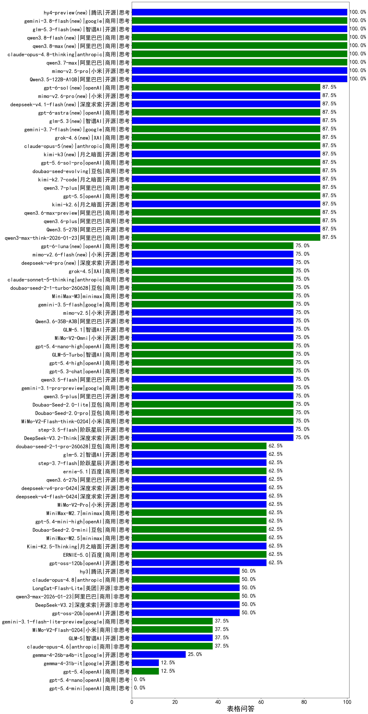

|类别|机构|大模型|【表格问答】准确率|平均耗时|平均消耗token|花费/千次（元）|排名（准确率）|
|---|---|-----|-------------------|-------|-----------|-----------|-----------|
|商用|阿里巴巴|qwen3.8-max(new)|100.0%|108s|8829|243.0|1|
|开源|小米|mimo-v2.5-pro|100.0%|60s|7327|107.9|2|
|开源|腾讯|hy4-preview(new)|100.0%|143s|14448|233.3|3|
|开源|阿里巴巴|Qwen3.5-122B-A10B|100.0%|378s|8040|34.2|4|
|商用|google|gemini-3.8-flash(new)|100.0%|16s|5595|164.4|5|
|开源|智谱AI|glm-5.3-flash(new)|100.0%|176s|5358|10.2|6|
|商用|阿里巴巴|qwen3.8-flash(new)|100.0%|82s|8689|17.5|7|
|商用|阿里巴巴|qwen3.7-max|100.0%|60s|6829|171.9|8|
|商用|anthropic|claude-opus-4.8-thinking|100.0%|34s|4561|410.1|9|
|商用|openAI|gpt-5.6-sol-pro|87.5%|39s|14450|871.7|10|
|商用|openAI|gpt-5.5|87.5%|23s|3408|326.3|11|
|商用|阿里巴巴|qwen3.7-plus|87.5%|136s|10512|65.6|12|
|开源|月之暗面|kimi-k2.7-code|87.5%|70s|4668|80.5|13|
|商用|豆包|doubao-seed-evolving|87.5%|462s|25772|698.3|14|
|开源|月之暗面|kimi-k2.6|87.5%|329s|8309|178.8|15|
|开源|月之暗面|kimi-k3(new)|87.5%|166s|7290|545.2|16|
|商用|anthropic|claude-opus-5(new)|87.5%|22s|4408|383.3|17|
|商用|阿里巴巴|qwen3.6-plus|87.5%|72s|7584|60.2|18|
|商用|XAI|grok-4.6(new)|87.5%|69s|6717|214.3|19|
|商用|google|gemini-3.7-flash(new)|87.5%|32s|4897|63.9|20|
|开源|智谱AI|glm-5.3(new)|87.5%|-365s|5507|106.7|21|
|商用|openAI|gpt-6-astra(new)|87.5%|18s|2630|297.4|22|
|开源|深度求索|deepseek-v4.1-flash(new)|87.5%|38s|6271|36.7|23|
|开源|小米|mimo-v2.6-pro(new)|87.5%|84s|9824|49.8|24|
|商用|阿里巴巴|qwen3.6-max-preview|87.5%|112s|7146|247.2|25|
|商用|openAI|gpt-6-sol(new)|87.5%|272s|2647|60.7|26|
|商用|阿里巴巴|qwen3-max-think-2026-01-23|87.5%|222s|10968|86.9|27|
|开源|阿里巴巴|Qwen3.5-27B|87.5%|502s|9759|33.9|28|
|商用|openAI|gpt-5.4-high|75.0%|31s|3743|198.4|29|
|开源|小米|mimo-v2.5|75.0%|33s|6120|49.0|30|
|开源|阿里巴巴|qwen3.5-plus|75.0%|63s|8542|28.7|31|
|商用|智谱AI|GLM-5-Turbo|75.0%|100s|5270|75.6|32|
|商用|google|gemini-3.1-pro-preview|75.0%|57s|6287|317.0|33|
|商用|minimax|MiniMax-M3|75.0%|75s|4958|53.3|34|
|商用|豆包|doubao-seed-2-1-turbo-260628|75.0%|280s|18673|242.7|35|
|开源|阿里巴巴|qwen3.5-flash|75.0%|271s|8091|10.6|36|
|商用|google|gemini-3.5-flash|75.0%|22s|7073|283.9|37|
|商用|豆包|Doubao-Seed-2.0-lite|75.0%|726s|6155|12.8|38|
|商用|anthropic|claude-sonnet-5-thinking|75.0%|22s|4793|180.3|39|
|商用|XAI|grok-4.5|75.0%|110s|5474|162.1|40|
|商用|豆包|Doubao-Seed-2.0-pro|75.0%|540s|5695|51.2|41|
|商用|小米|MiMo-V2-Flash-think-0204|75.0%|1325s|9283|15.2|42|
|开源|深度求索|deepseek-v4-pro(new)|75.0%|172s|7839|170.3|43|
|商用|openAI|gpt-5.3-chat|75.0%|10s|3075|110.5|44|
|开源|阿里巴巴|Qwen3.6-35B-A3B|75.0%|28s|7270|50.8|45|
|开源|智谱AI|GLM-5.1|75.0%|202s|7513|137.6|46|
|开源|阶跃星辰|step-3.5-flash|75.0%|42s|8593|14.9|47|
|开源|小米|MiMo-V2-Omni|75.0%|106s|6486|54.1|48|
|商用|openAI|gpt-5.4-nano-high|75.0%|24s|3998|18.6|49|
|开源|深度求索|DeepSeek-V3.2-Think|75.0%|79s|4713|11.9|50|
|开源|小米|mimo-v2.6-flash(new)|75.0%|51s|5634|8.2|51|
|商用|openAI|gpt-6-luna(new)|75.0%|579s|2805|3.6|52|
|开源|智谱AI|glm-5.2|62.5%|95s|6553|135.9|53|
|商用|minimax|MiniMax-M2.5|62.5%|85s|7513|48.9|54|
|开源|月之暗面|Kimi-K2.5-Thinking|62.5%|330s|6901|107.2|55|
|商用|百度|ERNIE-5.0|62.5%|240s|8906|158.6|56|
|商用|豆包|doubao-seed-2-1-pro-260628|62.5%|412s|22469|599.3|57|
|开源|阶跃星辰|step-3.7-flash|62.5%|46s|10050|66.4|58|
|商用|豆包|Doubao-Seed-2.0-mini|62.5%|695s|8588|11.6|59|
|开源|深度求索|deepseek-v4-flash-0424|62.5%|55s|4583|6.9|60|
|商用|openAI|gpt-5.4-mini-high|62.5%|69s|4258|75.7|61|
|商用|minimax|MiniMax-M2.7|62.5%|232s|14432|107.1|62|
|开源|小米|MiMo-V2-Pro|62.5%|414s|4719|53.2|63|
|开源|openAI|gpt-oss-120b|62.5%|5s|2724|4.4|64|
|开源|深度求索|deepseek-v4-pro-0424|62.5%|127s|4810|86.7|65|
|商用|百度|ernie-5.1|62.5%|86s|6965|82.3|66|
|开源|阿里巴巴|qwen3.6-27b|62.5%|58s|7194|83.3|67|
|开源|腾讯|hy3|50.0%|102s|3082|5.7|68|
|开源|美团|LongCat-Flash-Lite|50.0%|132s|4157|0.0|69|
|开源|openAI|gpt-oss-20b|50.0%|240s|3131|2.1|70|
|开源|深度求索|DeepSeek-V3.2|50.0%|30s|2995|6.8|71|
|商用|anthropic|claude-opus-4.8|50.0%|9s|3338|196.0|72|
|商用|阿里巴巴|qwen3-max-2026-01-23|50.0%|69s|4929|26.5|73|
|开源|智谱AI|GLM-5|37.5%|269s|8274|115.7|74|
|商用|google|gemini-3.1-flash-lite-preview|37.5%|5s|3619|11.0|75|
|商用|anthropic|claude-opus-4.6|37.5%|17s|3551|235.0|76|
|商用|小米|MiMo-V2-Flash-0204|37.5%|445s|3698|3.5|77|
|开源|google|gemma-4-26b-a4b-it|25.0%|68s|3608|4.3|78|
|开源|google|gemma-4-31b-it|12.5%|76s|3604|4.5|79|
|商用|openAI|gpt-5.4|12.5%|7s|2501|68.0|80|
|商用|openAI|gpt-5.4-nano|0.0%|3s|2521|5.7|81|
|商用|openAI|gpt-5.4-mini|0.0%|27s|2459|19.1|82|

