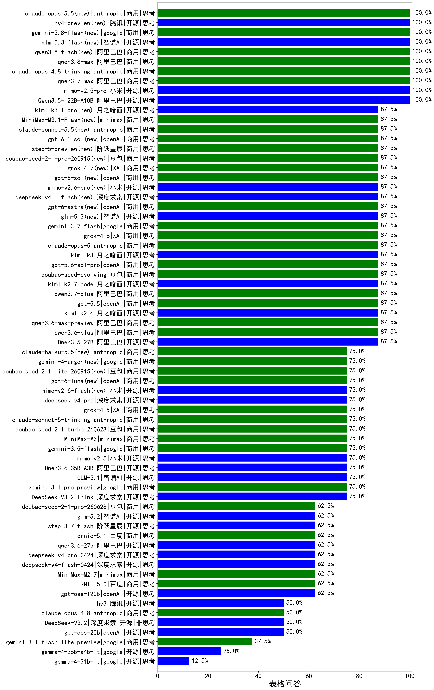

|类别|机构|大模型|【表格问答】准确率|平均耗时|平均消耗token|花费/千次（元）|排名（准确率）|
|---|---|-----|-------------------|-------|-----------|-----------|-----------|
|商用|阿里巴巴|qwen3.7-max|100.0%|60s|6829|171.9|1|
|开源|小米|mimo-v2.5-pro|100.0%|60s|7327|107.9|2|
|开源|智谱AI|glm-5.3-flash(new)|100.0%|176s|5358|10.2|3|
|商用|阿里巴巴|qwen3.8-flash(new)|100.0%|82s|8689|17.5|4|
|商用|阿里巴巴|qwen3.8-max|100.0%|108s|8829|243.0|5|
|开源|腾讯|hy4-preview(new)|100.0%|143s|14448|233.3|6|
|商用|anthropic|claude-opus-4.8-thinking|100.0%|34s|4561|410.1|7|
|商用|anthropic|claude-opus-5.5(new)|100.0%|19s|3997|248.8|8|
|商用|google|gemini-3.8-flash(new)|100.0%|16s|5595|164.4|9|
|开源|阿里巴巴|Qwen3.5-122B-A10B|100.0%|378s|8040|34.2|10|
|商用|openAI|gpt-6.1-sol(new)|87.5%|9s|2570|55.3|11|
|商用|openAI|gpt-6-astra(new)|87.5%|18s|2630|297.4|12|
|开源|智谱AI|glm-5.3(new)|87.5%|-365s|5507|106.7|13|
|商用|google|gemini-3.7-flash|87.5%|32s|4897|63.9|14|
|商用|XAI|grok-4.6|87.5%|69s|6717|214.3|15|
|商用|anthropic|claude-opus-5|87.5%|22s|4408|383.3|16|
|开源|月之暗面|kimi-k3|87.5%|166s|7290|545.2|17|
|商用|openAI|gpt-5.6-sol-pro|87.5%|39s|14450|871.7|18|
|开源|深度求索|deepseek-v4.1-flash(new)|87.5%|38s|6271|36.7|19|
|商用|豆包|doubao-seed-evolving|87.5%|462s|25772|698.3|20|
|开源|小米|mimo-v2.6-pro(new)|87.5%|84s|9824|49.8|21|
|开源|月之暗面|kimi-k2.7-code|87.5%|70s|4668|80.5|22|
|开源|阿里巴巴|Qwen3.5-27B|87.5%|502s|9759|33.9|23|
|商用|阿里巴巴|qwen3.6-plus|87.5%|72s|7584|60.2|24|
|商用|阿里巴巴|qwen3.7-plus|87.5%|136s|10512|65.6|25|
|商用|minimax|MiniMax-M3.1-Flash(new)|87.5%|30s|4507|10.8|26|
|商用|openAI|gpt-6-sol(new)|87.5%|272s|2647|60.7|27|
|商用|XAI|grok-4.7(new)|87.5%|63s|7532|222.5|28|
|商用|openAI|gpt-5.5|87.5%|23s|3408|326.3|29|
|商用|豆包|doubao-seed-2-1-pro-260915(new)|87.5%|204s|13163|320.1|30|
|商用|阶跃星辰|step-5-preview(new)|87.5%|49s|5556|82.2|31|
|商用|anthropic|claude-sonnet-5.5(new)|87.5%|9s|3792|110.0|32|
|开源|月之暗面|kimi-k2.6|87.5%|329s|8309|178.8|33|
|商用|阿里巴巴|qwen3.6-max-preview|87.5%|112s|7146|247.2|34|
|商用|openAI|gpt-6-luna(new)|75.0%|579s|2805|3.6|35|
|商用|google|gemini-4-argon(new)|75.0%|14s|3645|162.8|36|
|商用|anthropic|claude-haiku-5.5(new)|75.0%|8s|4376|7.5|37|
|开源|深度求索|DeepSeek-V3.2-Think|75.0%|79s|4713|11.9|38|
|商用|豆包|doubao-seed-2-1-lite-260915(new)|75.0%|180s|9798|20.6|39|
|开源|智谱AI|GLM-5.1|75.0%|202s|7513|137.6|40|
|开源|深度求索|deepseek-v4-pro|75.0%|172s|7839|170.3|41|
|商用|XAI|grok-4.5|75.0%|110s|5474|162.1|42|
|开源|阿里巴巴|Qwen3.6-35B-A3B|75.0%|28s|7270|50.8|43|
|商用|minimax|MiniMax-M3|75.0%|75s|4958|53.3|44|
|开源|小米|mimo-v2.5|75.0%|33s|6120|49.0|45|
|商用|anthropic|claude-sonnet-5-thinking|75.0%|22s|4793|180.3|46|
|商用|豆包|doubao-seed-2-1-turbo-260628|75.0%|280s|18673|242.7|47|
|商用|google|gemini-3.1-pro-preview|75.0%|57s|6287|317.0|48|
|商用|google|gemini-3.5-flash|75.0%|22s|7073|283.9|49|
|开源|小米|mimo-v2.6-flash(new)|75.0%|51s|5634|8.2|50|
|开源|openAI|gpt-oss-120b|62.5%|5s|2724|4.4|51|
|开源|智谱AI|glm-5.2|62.5%|95s|6553|135.9|52|
|开源|阶跃星辰|step-3.7-flash|62.5%|46s|10050|66.4|53|
|商用|百度|ernie-5.1|62.5%|86s|6965|82.3|54|
|开源|阿里巴巴|qwen3.6-27b|62.5%|58s|7194|83.3|55|
|开源|深度求索|deepseek-v4-pro-0424|62.5%|127s|4810|86.7|56|
|开源|深度求索|deepseek-v4-flash-0424|62.5%|55s|4583|6.9|57|
|商用|minimax|MiniMax-M2.7|62.5%|232s|14432|107.1|58|
|商用|百度|ERNIE-5.0|62.5%|240s|8906|158.6|59|
|商用|豆包|doubao-seed-2-1-pro-260628|62.5%|412s|22469|599.3|60|
|开源|腾讯|hy3|50.0%|102s|3082|5.7|61|
|开源|openAI|gpt-oss-20b|50.0%|240s|3131|2.1|62|
|商用|anthropic|claude-opus-4.8|50.0%|9s|3338|196.0|63|
|开源|深度求索|DeepSeek-V3.2|50.0%|30s|2995|6.8|64|
|商用|google|gemini-3.1-flash-lite-preview|37.5%|5s|3619|11.0|65|
|开源|google|gemma-4-26b-a4b-it|25.0%|68s|3608|4.3|66|
|开源|google|gemma-4-31b-it|12.5%|76s|3604|4.5|67|

