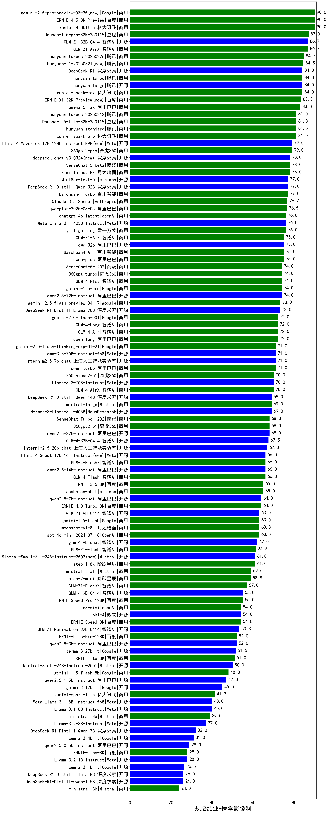

|类别|机构|大模型|【规培结业-医学影像科】准确率|平均耗时|平均消耗token|花费/千次（元）|排名（准确率）|
|---|---|-----|-------------------|-------|-----------|-----------|-----------|
|开源|阿里巴巴|qwen3-235b-a22b-instruct-2507|100.0%|12s|507|3.7|1|
|开源|智谱AI|GLM-4.5|100.0%|53s|1734|23.7|2|
|商用|阿里巴巴|qwen-turbo-think-2025-07-15|100.0%|/|1818|5.3|3|
|开源|深度求索|DeepSeek-V3.1-Think|100.0%|88s|1619|19.0|4|
|开源|深度求索|DeepSeek-V3.1|100.0%|16s|296|3.1|5|
|商用|XAI|grok-3-mini|100.0%|441s|1128|4.0|6|
|商用|google|gemini-2.5-pro|100.0%|25s|2212|155.7|7|
|开源|阿里巴巴|Qwen3-32B|100.0%|30s|858|3.2|8|
|开源|智谱AI|GLM-4.5-Air|100.0%|54s|2284|13.4|9|
|商用|google|gemini-2.5-flash-lite|100.0%|7s|709|1.9|10|
|开源|深度求索|DeepSeek-V3.2-Exp-Think(new)|100.0%|73s|1375|4.1|11|
|开源|月之暗面|kimi-k2-0711-preview|100.0%|81s|851|12.8|12|
|开源|阿里巴巴|Qwen3-30B-A3B-Thinking-2507|100.0%|54s|2404|6.6|13|
|开源|阶跃星辰|step-3|100.0%|118s|2245|8.8|14|
|开源|minimax|MiniMax-M2(new)|100.0%|56s|2010|16.3|15|
|开源|智谱AI|GLM-4.5-nothink|100.0%|17s|457|5.7|16|
|商用|openAI|gpt-5-mini-2025-08-07|100.0%|28s|760|10.1|17|
|商用|阿里巴巴|qwen-plus-think-2025-07-28|100.0%|/|2299|18.0|18|
|商用|阿里巴巴|qwen-plus-2025-07-28|100.0%|13s|392|0.7|19|
|商用|豆包|doubao-seed-1-6-flash-thinking-250615|100.0%|13s|607|0.7|20|
|商用|google|gemini-2.5-flash|95.0%|9s|1537|26.7|21|
|开源|腾讯|Hunyuan-A13B-Instruct|95.0%|28s|970|3.7|22|
|开源|百度|ERNIE-4.5-300B-A47B|95.0%|23s|335|2.2|23|
|商用|百度|ERNIE-4.5-Turbo-32K|95.0%|22s|558|1.6|24|
|开源|阿里巴巴|Qwen3-4B|95.0%|12s|1053|2.9|25|
|商用|anthropic|claude-4-sonnet|90.0%|44s|601|55.1|26|
|开源|阿里巴巴|Qwen3-14B|90.0%|27s|1681|3.2|27|
|商用|豆包|doubao-seed-1-6-flash-250615|90.0%|3s|297|0.3|28|
|商用|百度|ERNIE-X1-Turbo-32K|90.0%|220s|1957|7.6|29|
|商用|豆包|doubao-seed-1-6-250615|90.0%|160s|443|2.8|30|
|开源|深度求索|DeepSeek-R1-0528|90.0%|234s|1704|26.5|31|
|商用|XAI|grok-4-0709|90.0%|135s|2033|214.3|32|
|开源|minimax|MiniMax-M1|85.0%|200s|2042|13.2|33|
|开源|minimax|MiniMax-Text-01|85.0%|7s|880|7.1|34|
|商用|openAI|gpt-5-2025-08-07|80.0%|25s|438|27.7|35|
|商用|百川智能|Baichuan4-Air|80.0%|/|/|/|36|
|商用|阿里巴巴|qwen-flash-think-2025-07-28|80.0%|33s|3523|5.2|37|
|开源|阿里巴巴|Qwen3-32B-nothink|80.0%|17s|450|1.6|38|
|商用|智谱AI|GLM-4.5-Flash|80.0%|36s|2135|0.0|39|
|开源|阿里巴巴|Qwen3-4B-nothink|80.0%|25s|436|1.1|40|
|商用|Mistral|mistral-medium-2508|80.0%|23s|429|5.3|41|
|开源|阿里巴巴|qwen3-235b-a22b-thinking-2507|80.0%|51s|2257|44.1|42|
|商用|科大讯飞|xunfei-spark-x1-0725|80.0%|/|878|10.5|43|
|开源|百度|ERNIE-4.5-21B-A3B|80.0%|6s|308|0.0|44|
|商用|豆包|doubao-seed-1-6-thinking-250715|80.0%|17s|1020|7.7|45|
|商用|阿里巴巴|qwen-turbo-2025-07-15|80.0%|7s|287|0.2|46|
|商用|openAI|gpt-5.1(new)|80.0%|76s|220|11.2|47|
|开源|月之暗面|Kimi-K2-Thinking(new)|80.0%|209s|2329|36.6|48|
|商用|豆包|Doubao-1.5-lite-32k-250115|80.0%|6s|188|0.1|49|
|商用|豆包|doubao-seed-1-6-lite-251015(new)|80.0%|16s|747|1.6|50|
|商用|豆包|doubao-seed-1-6-251015(new)|80.0%|14s|616|4.3|51|
|开源|智谱AI|GLM-4.6(new)|80.0%|68s|2089|28.6|52|
|商用|腾讯|hunyuan-turbos-20250926(new)|80.0%|12s|514|0.9|53|
|开源|深度求索|DeepSeek-V3.2-Exp(new)|80.0%|13s|270|0.8|54|
|开源|阿里巴巴|Qwen3-8B|80.0%|600s|15395|0.0|55|
|开源|阿里巴巴|qwen3-next-80b-a3b-instruct|80.0%|11s|481|1.7|56|
|开源|豆包|Seed-OSS-36B-Instruct|80.0%|185s|3056|12.1|57|
|商用|openAI|o4-mini|80.0%|27s|767|22.3|58|
|商用|阿里巴巴|qwen3-max-preview|80.0%|10s|474|10.3|59|
|商用|anthropic|claude-4-sonnet-thinking|80.0%|56s|1225|123.0|60|
|开源|openAI|gpt-oss-20b|80.0%|6s|756|0.8|61|
|开源|openAI|gpt-oss-120b|80.0%|8s|523|1.4|62|
|商用|阿里巴巴|qwen-long-2025-01-25|75.0%|144s|289|0.5|63|
|开源|meta|Llama-4-Scout-17B-16E-Instruct|75.0%|13s|629|1.3|64|
|开源|meta|Llama-4-Maverick-17B-128E-Instruct-FP8|75.0%|8s|554|2.2|65|
|开源|深度求索|DeepSeek-R1-0528-Qwen3-8B|75.0%|296s|1543|0.0|66|
|商用|百川智能|Baichuan4-Turbo|70.0%|/|/|/|67|
|商用|360|360zhinao2-o1|65.0%|/|/|/|68|
|开源|阿里巴巴|Qwen3-1.7B|65.0%|19s|2131|6.2|69|
|商用|智谱AI|GLM-4.5-Flash-nothink|60.0%|17s|922|0.0|70|
|商用|腾讯|hunyuan-t1-20250711|60.0%|37s|2128|8.2|71|
|开源|google|gemma-3-27b-it|60.0%|/|/|/|72|
|开源|智谱AI|GLM-4-9B-0414|60.0%|8s|445|0.0|73|
|开源|阿里巴巴|Qwen3-0.6B|60.0%|7s|1110|3.1|74|
|开源|智谱AI|GLM-4.5-Air-nothink|60.0%|13s|882|5.0|75|
|商用|openAI|gpt-5.1-medium(new)|60.0%|191s|498|31.0|76|
|开源|腾讯|Hunyuan-A13B-Instruct-nothink|60.0%|14s|307|1.1|77|
|开源|Mistral|Magistral-Small-2507|60.0%|597s|4084|43.9|78|
|开源|阿里巴巴|Qwen3-14B-nothink|60.0%|20s|577|1.1|79|
|开源|阿里巴巴|Qwen3-30B-A3B-Instruct-2507|60.0%|3s|377|1.0|80|
|商用|阿里巴巴|qwen-flash-2025-07-28|60.0%|7s|481|0.6|81|
|商用|openAI|gpt-5-nano-2025-08-07|60.0%|38s|1896|5.3|82|
|商用|百度|ERNIE-Lite-8K|55.0%|/|/|/|83|
|开源|google|gemma-3-12b-it|45.0%|/|/|/|84|
|开源|Mistral|Mistral-Small-3.2-24B-Instruct-2506|40.0%|232s|402|0.8|85|
|开源|阿里巴巴|Qwen3-0.6B-nothink|40.0%|6s|186|0.4|86|
|开源|阿里巴巴|Qwen3-8B-nothink|40.0%|19s|428|0.0|87|
|开源|google|gemma-3-4b-it|35.0%|/|/|/|88|
|开源|百度|ERNIE-4.5-0.3B|35.0%|5s|400|0.0|89|
|开源|阿里巴巴|Qwen3-1.7B-nothink|20.0%|10s|396|1.0|90|

