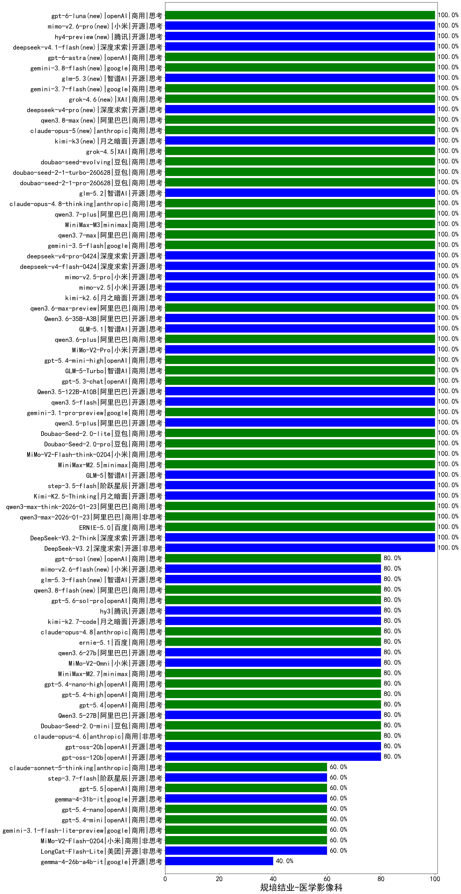

|类别|机构|大模型|【规培结业-医学影像科】准确率|平均耗时|平均消耗token|花费/千次（元）|排名（准确率）|
|---|---|-----|-------------------|-------|-----------|-----------|-----------|
|商用|智谱AI|GLM-5-Turbo|100.0%|38s|1199|25.4|1|
|商用|豆包|Doubao-Seed-2.0-lite|100.0%|129s|651|2.0|2|
|开源|深度求索|deepseek-v4-pro-0424|100.0%|29s|817|19.0|3|
|开源|深度求索|deepseek-v4-flash-0424|100.0%|27s|485|0.9|4|
|开源|小米|mimo-v2.5-pro|100.0%|15s|1037|17.5|5|
|开源|小米|mimo-v2.5|100.0%|11s|1366|15.8|6|
|开源|月之暗面|kimi-k2.6|100.0%|95s|1385|36.3|7|
|商用|阿里巴巴|qwen3.6-max-preview|100.0%|38s|1375|71.6|8|
|开源|阿里巴巴|Qwen3.6-35B-A3B|100.0%|12s|1953|20.6|9|
|开源|智谱AI|GLM-5.1|100.0%|199s|1674|39.2|10|
|商用|阿里巴巴|qwen3.6-plus|100.0%|20s|1349|15.6|11|
|开源|小米|MiMo-V2-Pro|100.0%|13s|1007|16.9|12|
|商用|openAI|gpt-5.4-mini-high|100.0%|14s|956|28.3|13|
|商用|openAI|gpt-5.3-chat|100.0%|36s|325|25.9|14|
|开源|阿里巴巴|Qwen3.5-122B-A10B|100.0%|196s|3618|22.8|15|
|开源|阿里巴巴|qwen3.5-flash|100.0%|208s|2627|5.1|16|
|商用|google|gemini-3.1-pro-preview|100.0%|24s|1132|92.5|17|
|商用|google|gemini-3.5-flash|100.0%|12s|1510|92.2|18|
|商用|阿里巴巴|qwen3.7-max|100.0%|20s|994|34.4|19|
|商用|minimax|MiniMax-M3(new)|100.0%|20s|543|6.3|20|
|商用|anthropic|claude-opus-5(new)|100.0%|14s|716|113.5|21|
|商用|google|gemini-3.8-flash(new)|100.0%|9s|633|30.9|22|
|开源|智谱AI|glm-5.3(new)|100.0%|61s|2461|67.7|23|
|商用|google|gemini-3.7-flash(new)|100.0%|4s|631|15.4|24|
|商用|XAI|grok-4.6(new)|100.0%|40s|1947|74.6|25|
|开源|深度求索|deepseek-v4-pro(new)|100.0%|375s|1821|46.8|26|
|商用|阿里巴巴|qwen3.8-max(new)|100.0%|15s|671|21.8|27|
|开源|月之暗面|kimi-k3(new)|100.0%|87s|775|66.9|28|
|商用|阿里巴巴|qwen3.7-plus(new)|100.0%|41s|2123|16.6|29|
|商用|XAI|grok-4.5(new)|100.0%|59s|1106|39.2|30|
|商用|豆包|doubao-seed-evolving(new)|100.0%|248s|8836|262.8|31|
|商用|豆包|doubao-seed-2-1-turbo-260628(new)|100.0%|238s|7670|113.9|32|
|商用|豆包|doubao-seed-2-1-pro-260628(new)|100.0%|376s|8479|252.1|33|
|开源|智谱AI|glm-5.2(new)|100.0%|40s|1784|48.7|34|
|商用|anthropic|claude-opus-4.8-thinking(new)|100.0%|10s|555|85.3|35|
|开源|阿里巴巴|qwen3.5-plus|100.0%|35s|2297|10.8|36|
|商用|openAI|gpt-6-astra(new)|100.0%|17s|322|93.2|37|
|商用|豆包|Doubao-Seed-2.0-pro|100.0%|207s|921|13.5|38|
|商用|阿里巴巴|qwen-plus-2025-12-01|100.0%|19s|812|1.6|39|
|商用|豆包|doubao-seed-1-8-251215|100.0%|17s|591|4.0|40|
|商用|minimax|MiniMax-M2.1|100.0%|139s|1962|15.9|41|
|商用|阿里巴巴|qwen3-max-preview-think|100.0%|182s|1680|39.2|42|
|开源|美团|LongCat-Flash-Thinking-2601|100.0%|258s|2871|0.0|43|
|商用|百度|ERNIE-5.0|100.0%|101s|2196|51.9|44|
|商用|阿里巴巴|qwen3-max-2026-01-23|100.0%|98s|344|3.0|45|
|商用|阿里巴巴|qwen3-max-think-2026-01-23|100.0%|312s|2824|27.8|46|
|商用|openAI|gpt-5.2-medium|100.0%|9s|293|23.0|47|
|开源|月之暗面|Kimi-K2.5-Thinking|100.0%|334s|1474|30.0|48|
|商用|openAI|gpt-5.2-high|100.0%|11s|493|42.9|49|
|开源|阶跃星辰|step-3.5-flash|100.0%|24s|2934|6.1|50|
|开源|小米|MiMo-V2-Flash-think|100.0%|26s|2306|0.0|51|
|开源|深度求索|DeepSeek-V3.2-Think|100.0%|81s|2339|7.0|52|
|商用|minimax|MiniMax-M2.5|100.0%|25s|907|7.1|53|
|商用|小米|MiMo-V2-Flash-think-0204|100.0%|600s|2797|5.8|54|
|开源|深度求索|DeepSeek-V3.2|100.0%|99s|307|0.9|55|
|开源|阿里巴巴|qwen3-next-80b-a3b-thinking|100.0%|140s|3274|12.9|56|
|开源|智谱AI|GLM-5|100.0%|69s|2188|38.6|57|
|商用|anthropic|claude-opus-4.8(new)|80.0%|8s|482|72.6|58|
|开源|智谱AI|glm-5.3-flash(new)|80.0%|60s|2407|6.6|59|
|商用|google|gemini-3-flash-preview|80.0%|12s|1061|21.6|60|
|商用|阿里巴巴|qwen3.8-flash(new)|80.0%|172s|3971|10.5|61|
|开源|腾讯|hy3(new)|80.0%|6s|183|0.6|62|
|商用|腾讯|hunyuan-2.0-thinking-20251109|80.0%|16s|948|3.6|63|
|开源|月之暗面|kimi-k2.7-code(new)|80.0%|103s|3847|102.8|64|
|开源|Mistral|mistral-large-2512|80.0%|13s|498|4.8|65|
|商用|腾讯|hunyuan-2.0-instruct-20251111|80.0%|19s|417|0.7|66|
|商用|openAI|gpt-5.6-sol-pro(new)|80.0%|17s|3623|312.5|67|
|商用|百度|ernie-5.1|80.0%|30s|1243|21.6|68|
|商用|阿里巴巴|qwen-plus-think-2025-12-01|80.0%|65s|2438|19.1|69|
|开源|openAI|gpt-oss-120b|80.0%|8s|523|1.4|70|
|开源|阿里巴巴|qwen3.6-27b|80.0%|23s|1346|23.4|71|
|开源|openAI|gpt-oss-20b|80.0%|6s|756|0.8|72|
|商用|豆包|Doubao-Seed-2.0-mini|80.0%|697s|3777|7.4|73|
|开源|智谱AI|GLM-4.7|80.0%|51s|1928|26.4|74|
|开源|阿里巴巴|Qwen3.5-27B|80.0%|379s|3326|15.7|75|
|开源|小米|MiMo-V2-Omni|80.0%|271s|1474|17.3|76|
|商用|minimax|MiniMax-M2.7|80.0%|48s|1902|15.4|77|
|商用|openAI|gpt-5.4-nano-high|80.0%|63s|611|4.8|78|
|商用|openAI|gpt-5.4|80.0%|3s|210|16.0|79|
|商用|openAI|gpt-5.4-high|80.0%|17s|624|59.4|80|
|商用|anthropic|claude-opus-4.6|80.0%|24s|527|80.4|81|
|商用|小米|MiMo-V2-Flash-0204|60.0%|177s|477|0.9|82|
|开源|美团|LongCat-Flash-Lite|60.0%|93s|307|0.0|83|
|商用|google|gemini-3.1-flash-lite-preview|60.0%|5s|358|3.3|84|
|开源|Mistral|Ministral-3-14B-Instruct-2512|60.0%|4s|443|0.6|85|
|开源|Mistral|Ministral-3-8B-Instruct-2512|60.0%|10s|401|0.4|86|
|商用|openAI|gpt-5.4-nano|60.0%|3s|235|1.5|87|
|商用|openAI|gpt-5.4-mini|60.0%|22s|193|4.2|88|
|开源|小米|MiMo-V2-Flash|60.0%|10s|366|0.0|89|
|商用|anthropic|claude-sonnet-5-thinking(new)|60.0%|12s|646|40.5|90|
|商用|openAI|gpt-5.2|60.0%|8s|167|10.5|91|
|开源|google|gemma-4-31b-it|60.0%|82s|461|1.2|92|
|开源|阶跃星辰|step-3.7-flash(new)|60.0%|62s|5493|44.1|93|
|商用|openAI|gpt-5.5|60.0%|11s|592|112.1|94|
|开源|Mistral|Ministral-3-3B-Instruct-2512|40.0%|12s|661|0.5|95|
|开源|google|gemma-4-26b-a4b-it|40.0%|92s|543|1.4|96|
|开源|智谱AI|GLM-4.7-Flash|20.0%|1493s|1953|0.0|97|

