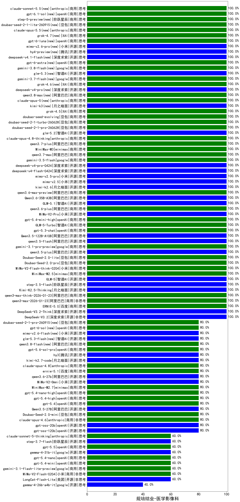

|类别|机构|大模型|【规培结业-医学影像科】准确率|平均耗时|平均消耗token|花费/千次（元）|排名（准确率）|
|---|---|-----|-------------------|-------|-----------|-----------|-----------|
|商用|豆包|doubao-seed-2-1-turbo-260628|100.0%|238s|7670|113.9|1|
|商用|google|gemini-3.8-flash(new)|100.0%|9s|633|30.9|2|
|开源|智谱AI|glm-5.2|100.0%|40s|1784|48.7|3|
|商用|豆包|doubao-seed-2-1-pro-260628|100.0%|376s|8479|252.1|4|
|商用|豆包|doubao-seed-evolving|100.0%|248s|8836|262.8|5|
|商用|XAI|grok-4.5|100.0%|59s|1106|39.2|6|
|开源|月之暗面|kimi-k3|100.0%|87s|775|66.9|7|
|商用|anthropic|claude-opus-5|100.0%|14s|716|113.5|8|
|商用|阿里巴巴|qwen3.8-max|100.0%|15s|671|21.8|9|
|开源|深度求索|deepseek-v4-pro|100.0%|375s|1821|46.8|10|
|商用|XAI|grok-4.6|100.0%|40s|1947|74.6|11|
|商用|google|gemini-3.7-flash|100.0%|4s|631|15.4|12|
|开源|智谱AI|glm-5.3(new)|100.0%|61s|2461|67.7|13|
|商用|openAI|gpt-6-astra(new)|100.0%|17s|322|93.2|14|
|商用|阿里巴巴|qwen3.7-plus|100.0%|41s|2123|16.6|15|
|开源|深度求索|deepseek-v4.1-flash(new)|100.0%|17s|1149|8.7|16|
|开源|腾讯|hy4-preview(new)|100.0%|109s|5511|98.4|17|
|开源|小米|mimo-v2.6-pro(new)|100.0%|28s|890|5.2|18|
|商用|openAI|gpt-6-luna(new)|100.0%|116s|459|1.4|19|
|商用|XAI|grok-4.7(new)|100.0%|122s|10294|396.1|20|
|商用|anthropic|claude-opus-5.5(new)|100.0%|15s|594|73.6|21|
|商用|豆包|doubao-seed-2-1-lite-260915(new)|100.0%|35s|1527|4.0|22|
|商用|阶跃星辰|step-5-preview(new)|100.0%|54s|3154|62.3|23|
|商用|openAI|gpt-6.1-sol(new)|100.0%|7s|258|14.1|24|
|商用|anthropic|claude-sonnet-5.5(new)|100.0%|6s|459|27.4|25|
|商用|minimax|MiniMax-M3.1-Flash(new)|100.0%|21s|1702|6.1|26|
|商用|anthropic|claude-opus-4.8-thinking|100.0%|10s|555|85.3|27|
|开源|月之暗面|kimi-k3.1-pro(new)|100.0%|72s|2279|147.7|28|
|商用|minimax|MiniMax-M3|100.0%|20s|543|6.3|29|
|商用|阿里巴巴|qwen3.6-plus|100.0%|20s|1349|15.6|30|
|开源|阿里巴巴|Qwen3.6-35B-A3B|100.0%|12s|1953|20.6|31|
|商用|阿里巴巴|qwen3.6-max-preview|100.0%|38s|1375|71.6|32|
|开源|月之暗面|kimi-k2.6|100.0%|95s|1385|36.3|33|
|开源|小米|mimo-v2.5|100.0%|11s|1366|15.8|34|
|开源|小米|mimo-v2.5-pro|100.0%|15s|1037|17.5|35|
|开源|深度求索|deepseek-v4-flash-0424|100.0%|27s|485|0.9|36|
|开源|深度求索|deepseek-v4-pro-0424|100.0%|29s|817|19.0|37|
|开源|阿里巴巴|Qwen3.5-122B-A10B|100.0%|196s|3618|22.8|38|
|商用|google|gemini-3.1-pro-preview|100.0%|24s|1132|92.5|39|
|商用|百度|ERNIE-5.0|100.0%|101s|2196|51.9|40|
|开源|深度求索|DeepSeek-V3.2-Think|100.0%|81s|2339|7.0|41|
|商用|google|gemini-3.5-flash|100.0%|12s|1510|92.2|42|
|商用|阿里巴巴|qwen3.7-max|100.0%|20s|994|34.4|43|
|开源|深度求索|DeepSeek-V3.2|100.0%|99s|307|0.9|44|
|开源|智谱AI|GLM-5.1|100.0%|199s|1674|39.2|45|
|商用|豆包|doubao-seed-2-1-pro-260915(new)|80.0%|42s|1301|36.7|46|
|开源|阿里巴巴|Qwen3.5-27B|80.0%|379s|3326|15.7|47|
|商用|openAI|gpt-6-sol(new)|80.0%|99s|266|14.7|48|
|商用|google|gemini-4-argon(new)|80.0%|11s|288|31.1|49|
|商用|minimax|MiniMax-M2.7|80.0%|48s|1902|15.4|50|
|开源|小米|mimo-v2.6-flash(new)|80.0%|32s|1255|2.5|51|
|开源|智谱AI|glm-5.3-flash(new)|80.0%|60s|2407|6.6|52|
|商用|阿里巴巴|qwen3.8-flash(new)|80.0%|172s|3971|10.5|53|
|商用|openAI|gpt-5.6-sol-pro|80.0%|17s|3623|312.5|54|
|开源|阿里巴巴|qwen3.6-27b|80.0%|23s|1346|23.4|55|
|开源|腾讯|hy3|80.0%|6s|183|0.6|56|
|商用|百度|ernie-5.1|80.0%|30s|1243|21.6|57|
|开源|openAI|gpt-oss-20b|80.0%|6s|756|0.8|58|
|开源|月之暗面|kimi-k2.7-code|80.0%|103s|3847|102.8|59|
|商用|anthropic|claude-opus-4.8|80.0%|8s|482|72.6|60|
|开源|openAI|gpt-oss-120b|80.0%|8s|523|1.4|61|
|开源|google|gemma-4-31b-it|60.0%|82s|461|1.2|62|
|开源|阶跃星辰|step-3.7-flash|60.0%|62s|5493|44.1|63|
|商用|openAI|gpt-5.5|60.0%|11s|592|112.1|64|
|商用|google|gemini-3.1-flash-lite-preview|60.0%|5s|358|3.3|65|
|商用|anthropic|claude-sonnet-5-thinking|60.0%|12s|646|40.5|66|
|商用|anthropic|claude-haiku-5.5(new)|60.0%|44s|685|2.2|67|
|开源|google|gemma-4-26b-a4b-it|40.0%|92s|543|1.4|68|

