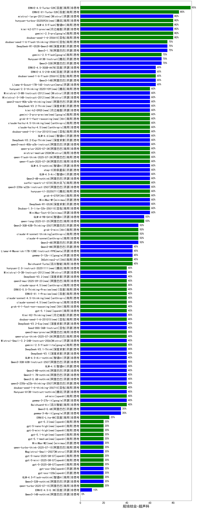

|类别|机构|大模型|【规培结业-超声科】准确率|平均耗时|平均消耗token|花费/千次（元）|排名（准确率）|
|---|---|-----|-------------------|-------|-----------|-----------|-----------|
|商用|百度|ERNIE-4.5-Turbo-32K|95.0%|24s|582|1.7|1|
|商用|百度|ERNIE-X1-Turbo-32K|85.0%|113s|2133|8.3|2|
|开源|月之暗面|kimi-k2-0711-preview|80.0%|41s|728|10.6|3|
|商用|google|gemini-2.5-pro|80.0%|51s|2887|203.1|4|
|商用|豆包|doubao-seed-1-6-250615|80.0%|138s|553|3.6|5|
|商用|腾讯|hunyuan-turbos-20250926(new)|80.0%|18s|711|1.3|6|
|开源|Mistral|mistral-large-2512(new)|80.0%|13s|558|5.2|7|
|商用|智谱AI|GLM-4.5-Flash|80.0%|31s|1792|0.0|8|
|商用|豆包|doubao-seed-1-6-flash-thinking-250615|75.0%|6s|554|0.7|9|
|开源|深度求索|DeepSeek-R1-0528-Qwen3-8B|75.0%|326s|1817|0.0|10|
|开源|阿里巴巴|Qwen3-1.7B|75.0%|23s|1649|4.7|11|
|开源|腾讯|Hunyuan-A13B-Instruct|70.0%|75s|1085|4.1|12|
|商用|google|gemini-2.5-flash|70.0%|11s|1952|33.8|13|
|开源|阿里巴巴|Qwen3-32B|70.0%|34s|1281|4.8|14|
|商用|豆包|doubao-seed-1-6-flash-250615|65.0%|3s|323|0.4|15|
|开源|百度|ERNIE-4.5-300B-A47B|65.0%|14s|347|2.2|16|
|开源|百度|ERNIE-4.5-21B-A3B|65.0%|3s|307|0.0|17|
|开源|阿里巴巴|Qwen3-14B|65.0%|30s|1035|1.9|18|
|开源|meta|Llama-4-Scout-17B-16E-Instruct|65.0%|11s|595|1.2|19|
|开源|阿里巴巴|qwen3-next-80b-a3b-instruct|60.0%|14s|561|2.0|20|
|商用|XAI|grok-4-0709|60.0%|144s|1435|146.8|21|
|商用|腾讯|hunyuan-t1-20250711|60.0%|37s|2131|8.2|22|
|商用|阿里巴巴|qwen-plus-2025-07-28|60.0%|14s|529|1.0|23|
|商用|Mistral|mistral-medium-2508|60.0%|27s|651|8.3|24|
|开源|阿里巴巴|qwen3-235b-a22b-instruct-2507|60.0%|13s|531|3.8|25|
|商用|阿里巴巴|qwen-flash-think-2025-07-28|60.0%|34s|3444|5.1|26|
|商用|阿里巴巴|qwen-flash-2025-07-28|60.0%|45s|704|0.9|27|
|商用|科大讯飞|xunfei-spark-x1-0725|60.0%|/|1003|12.0|28|
|开源|阶跃星辰|step-3|60.0%|79s|1650|6.4|29|
|开源|智谱AI|GLM-4.5-Air|60.0%|46s|2159|12.6|30|
|开源|智谱AI|GLM-4.5-nothink|60.0%|30s|677|8.6|31|
|开源|智谱AI|GLM-4.6(new)|60.0%|70s|2659|36.4|32|
|开源|深度求索|DeepSeek-V3.2-Exp-Think(new)|60.0%|490s|1405|4.1|33|
|开源|深度求索|DeepSeek-V3.2-Think(new)|60.0%|212s|1993|5.9|34|
|商用|腾讯|hunyuan-2.0-thinking-20251109(new)|60.0%|19s|1083|4.2|35|
|开源|minimax|MiniMax-Text-01|60.0%|10s|953|7.6|36|
|开源|Mistral|Ministral-3-8B-Instruct-2512(new)|60.0%|12s|736|0.8|37|
|商用|豆包|Doubao-1.5-lite-32k-250115|60.0%|7s|215|0.1|38|
|开源|Mistral|Ministral-3-14B-Instruct-2512(new)|60.0%|13s|823|1.2|39|
|开源|阿里巴巴|qwen3-next-80b-a3b-thinking(new)|60.0%|71s|3278|12.9|40|
|开源|月之暗面|kimi-k2-0905(new)|60.0%|105s|327|4.2|41|
|开源|minimax|MiniMax-M1|60.0%|439s|5579|41.4|42|
|商用|google|gemini-3-pro-preview(new)|60.0%|59s|1947|160.6|43|
|商用|XAI|grok-4-1-fast-reasoning(new)|60.0%|90s|1504|4.8|44|
|商用|anthropic|claude-haiku-4.5-thinking(new)|60.0%|46s|2443|84.1|45|
|商用|anthropic|claude-haiku-4.5(new)|60.0%|10s|749|23.6|46|
|商用|豆包|doubao-seed-1-6-lite-251015(new)|60.0%|39s|916|2.0|47|
|开源|深度求索|DeepSeek-R1-0528|60.0%|222s|1942|30.1|48|
|开源|阿里巴巴|Qwen3-4B-nothink|60.0%|27s|562|1.5|49|
|商用|阿里巴巴|qwen-long-2025-01-25|55.0%|11s|472|0.8|50|
|开源|智谱AI|GLM-4-9B-0414|55.0%|13s|494|0.0|51|
|商用|anthropic|claude-4-sonnet|50.0%|46s|660|57.6|52|
|商用|XAI|grok-3-mini|50.0%|155s|1366|4.8|53|
|商用|anthropic|claude-4-sonnet-thinking|50.0%|51s|1228|119.3|54|
|开源|阿里巴巴|Qwen3-30B-A3B-Thinking-2507|50.0%|75s|3218|8.8|55|
|开源|阿里巴巴|Qwen3-4B|50.0%|28s|2619|7.6|56|
|开源|阿里巴巴|Qwen3-8B|45.0%|477s|7962|0.0|57|
|商用|360|360zhinao2-o1|45.0%|/|/|/|58|
|商用|百川智能|Baichuan4-Turbo|45.0%|/|/|/|59|
|开源|google|gemma-3-12b-it|45.0%|/|/|/|60|
|开源|meta|Llama-4-Maverick-17B-128E-Instruct-FP8|45.0%|13s|631|2.5|61|
|商用|XAI|grok-4-1-fast-non-reasoning(new)|40.0%|6s|674|1.9|62|
|商用|百度|ERNIE-5.0-Thinking-Preview(new)|40.0%|291s|2470|58.2|63|
|商用|openAI|gpt-5.1(new)|40.0%|528s|183|7.5|64|
|开源|月之暗面|Kimi-K2-Thinking(new)|40.0%|108s|1671|25.9|65|
|商用|anthropic|claude-opus-4.5(new)|40.0%|15s|679|105.4|66|
|商用|openAI|o4-mini|40.0%|44s|987|28.6|67|
|商用|豆包|doubao-seed-1-6-251015(new)|40.0%|8s|801|5.7|68|
|商用|anthropic|claude-sonnet-4.5(new)|40.0%|14s|633|59.4|69|
|开源|深度求索|DeepSeek-V3.2(new)|40.0%|12s|388|1.1|70|
|开源|深度求索|DeepSeek-V3.2-Exp(new)|40.0%|22s|422|1.2|71|
|商用|anthropic|claude-sonnet-4.5-thinking(new)|40.0%|24s|1616|163.9|72|
|开源|豆包|Seed-OSS-36B-Instruct|40.0%|136s|2488|9.8|73|
|商用|阿里巴巴|qwen3-max-preview|40.0%|12s|491|10.4|74|
|商用|阿里巴巴|qwen3-max-2025-09-23(new)|40.0%|775s|517|11.0|75|
|商用|阿里巴巴|qwen-plus-think-2025-07-28|40.0%|/|2990|23.4|76|
|开源|Mistral|Ministral-3-3B-Instruct-2512(new)|40.0%|13s|499|0.4|77|
|开源|Mistral|Mistral-Small-3.2-24B-Instruct-2506|40.0%|15s|511|1.0|78|
|开源|阿里巴巴|Qwen3-8B-nothink|40.0%|23s|568|0.0|79|
|开源|阿里巴巴|Qwen3-1.7B-nothink|40.0%|14s|543|1.4|80|
|开源|智谱AI|GLM-4.5|40.0%|58s|1631|22.1|81|
|开源|阿里巴巴|Qwen3-30B-A3B-Instruct-2507|40.0%|6s|641|1.7|82|
|开源|阿里巴巴|Qwen3-0.6B-nothink|40.0%|2s|254|0.5|83|
|商用|百川智能|Baichuan4-Air|40.0%|/|/|/|84|
|开源|智谱AI|GLM-4.5-Air-nothink|40.0%|16s|1061|6.0|85|
|商用|腾讯|hunyuan-2.0-instruct-20251111(new)|40.0%|15s|497|0.9|86|
|商用|百度|ERNIE-X1.1-Preview(new)|40.0%|171s|1221|4.7|87|
|开源|阿里巴巴|qwen3-235b-a22b-thinking-2507|40.0%|32s|2293|44.4|88|
|商用|豆包|doubao-seed-1-6-thinking-250715|40.0%|24s|1521|11.7|89|
|开源|深度求索|DeepSeek-V3.1|40.0%|27s|434|4.7|90|
|开源|深度求索|DeepSeek-V3.1-Think|40.0%|43s|859|9.8|91|
|商用|google|gemini-2.5-flash-lite|40.0%|3s|607|1.6|92|
|开源|腾讯|Hunyuan-A13B-Instruct-nothink|40.0%|17s|461|1.6|93|
|开源|google|gemma-3-27b-it|40.0%|/|/|/|94|
|开源|阿里巴巴|Qwen3-0.6B|35.0%|6s|1298|3.6|95|
|开源|google|gemma-3-4b-it|35.0%|/|/|/|96|
|商用|百度|ERNIE-Lite-8K|25.0%|/|/|/|97|
|商用|openAI|gpt-5-mini-high(new)|20.0%|1019s|1964|27.4|98|
|商用|openAI|gpt-5.2(new)|20.0%|6s|208|13.0|99|
|商用|openAI|gpt-5-nano-high(new)|20.0%|696s|5186|14.8|100|
|商用|openAI|gpt-5.2(new)|20.0%|6s|208|13.0|101|
|商用|openAI|gpt-5.1-high(new)|20.0%|34s|1061|69.8|102|
|商用|openAI|gpt-5.1-medium(new)|20.0%|158s|512|30.9|103|
|开源|minimax|MiniMax-M2(new)|20.0%|26s|1802|14.5|104|
|开源|阿里巴巴|Qwen3-32B-nothink|20.0%|26s|684|2.5|105|
|商用|阿里巴巴|qwen-turbo-think-2025-07-15|20.0%|/|4014|11.8|106|
|商用|阿里巴巴|qwen-turbo-2025-07-15|20.0%|10s|492|0.3|107|
|开源|Mistral|Magistral-Small-2507|20.0%|68s|6034|64.9|108|
|商用|openAI|gpt-5-nano-2025-08-07|20.0%|125s|2398|6.7|109|
|商用|openAI|gpt-5-mini-2025-08-07|20.0%|46s|987|13.2|110|
|商用|openAI|gpt-5-2025-08-07|20.0%|22s|361|20.9|111|
|开源|openAI|gpt-oss-20b|20.0%|11s|959|1.0|112|
|开源|openAI|gpt-oss-120b|20.0%|11s|775|2.2|113|
|商用|智谱AI|GLM-4.5-Flash-nothink|20.0%|19s|985|0.0|114|
|开源|百度|ERNIE-4.5-0.3B|10.0%|3s|404|0.0|115|
|开源|阿里巴巴|Qwen3-14B-nothink|/%|23s|721|1.3|116|

