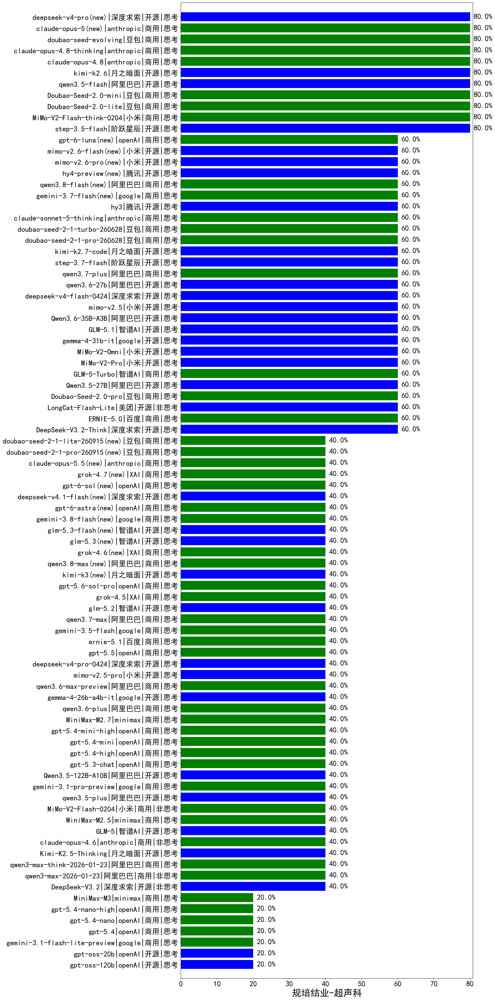

|类别|机构|大模型|【规培结业-超声科】准确率|平均耗时|平均消耗token|花费/千次（元）|排名（准确率）|
|---|---|-----|-------------------|-------|-----------|-----------|-----------|
|商用|anthropic|claude-opus-4.8|80.0%|8s|525|77.0|1|
|商用|豆包|Doubao-Seed-2.0-lite|80.0%|270s|1125|3.7|2|
|商用|anthropic|claude-opus-4.8-thinking|80.0%|13s|855|134.9|3|
|商用|anthropic|claude-opus-5(new)|80.0%|15s|769|119.7|4|
|开源|阿里巴巴|qwen3.5-flash|80.0%|362s|3535|6.9|5|
|开源|阶跃星辰|step-3.5-flash|80.0%|28s|3191|6.6|6|
|开源|月之暗面|kimi-k2.6|80.0%|124s|1977|52.0|7|
|商用|豆包|doubao-seed-evolving|80.0%|347s|13024|388.2|8|
|开源|深度求索|deepseek-v4-pro(new)|80.0%|26s|1027|25.1|9|
|商用|小米|MiMo-V2-Flash-think-0204|80.0%|1189s|2328|4.8|10|
|商用|豆包|Doubao-Seed-2.0-mini|80.0%|610s|2506|4.8|11|
|商用|智谱AI|GLM-5-Turbo|60.0%|33s|1653|35.2|12|
|开源|小米|MiMo-V2-Pro|60.0%|482s|1374|24.4|13|
|开源|小米|MiMo-V2-Omni|60.0%|7s|1111|12.0|14|
|开源|腾讯|hy3|60.0%|87s|268|0.9|15|
|开源|google|gemma-4-31b-it|60.0%|444s|643|1.6|16|
|开源|小米|mimo-v2.5|60.0%|14s|1710|20.4|17|
|商用|anthropic|claude-sonnet-5-thinking|60.0%|14s|748|46.4|18|
|开源|阿里巴巴|Qwen3.6-35B-A3B|60.0%|116s|2432|25.6|19|
|商用|豆包|doubao-seed-2-1-turbo-260628|60.0%|234s|9544|141.9|20|
|商用|豆包|doubao-seed-2-1-pro-260628|60.0%|254s|11409|339.7|21|
|开源|深度求索|deepseek-v4-flash-0424|60.0%|74s|1329|2.6|22|
|开源|月之暗面|kimi-k2.7-code|60.0%|68s|2042|53.8|23|
|开源|阿里巴巴|qwen3.6-27b|60.0%|30s|1910|33.3|24|
|开源|阶跃星辰|step-3.7-flash|60.0%|32s|3505|27.9|25|
|开源|智谱AI|GLM-5.1|60.0%|244s|1992|46.5|26|
|商用|阿里巴巴|qwen3.7-plus|60.0%|40s|2115|16.5|27|
|商用|google|gemini-3.7-flash(new)|60.0%|43s|835|20.4|28|
|商用|豆包|Doubao-Seed-2.0-pro|60.0%|461s|2083|32.0|29|
|开源|深度求索|DeepSeek-V3.2-Think|60.0%|212s|1993|5.9|30|
|商用|百度|ERNIE-5.0|60.0%|121s|2330|54.9|31|
|商用|openAI|gpt-6-luna(new)|60.0%|323s|433|1.3|32|
|开源|小米|mimo-v2.6-flash(new)|60.0%|40s|880|1.7|33|
|开源|小米|mimo-v2.6-pro(new)|60.0%|26s|1094|6.3|34|
|开源|腾讯|hy4-preview(new)|60.0%|58s|3642|64.6|35|
|开源|美团|LongCat-Flash-Lite|60.0%|93s|514|0.0|36|
|开源|阿里巴巴|Qwen3.5-27B|60.0%|252s|3546|16.7|37|
|商用|阿里巴巴|qwen3.8-flash(new)|60.0%|23s|665|1.6|38|
|商用|google|gemini-3.8-flash(new)|40.0%|15s|860|42.1|39|
|开源|智谱AI|glm-5.3-flash(new)|40.0%|90s|3131|8.6|40|
|商用|openAI|gpt-6-astra(new)|40.0%|14s|306|82.4|41|
|商用|阿里巴巴|qwen3.8-max(new)|40.0%|55s|2090|72.6|42|
|开源|深度求索|deepseek-v4.1-flash(new)|40.0%|6s|884|6.5|43|
|商用|XAI|grok-4.5|40.0%|79s|1599|59.6|44|
|商用|openAI|gpt-5.6-sol-pro|40.0%|12s|3362|262.2|45|
|开源|智谱AI|glm-5.2|40.0%|57s|2240|61.2|46|
|商用|openAI|gpt-6-sol(new)|40.0%|898s|357|20.1|47|
|开源|月之暗面|kimi-k3(new)|40.0%|36s|770|65.4|48|
|开源|智谱AI|glm-5.3(new)|40.0%|789s|1424|38.3|49|
|商用|XAI|grok-4.7(new)|40.0%|73s|5612|199.1|50|
|商用|XAI|grok-4.6(new)|40.0%|45s|1948|74.2|51|
|商用|anthropic|claude-opus-5.5(new)|40.0%|16s|773|96.2|52|
|商用|openAI|gpt-5.4-high|40.0%|13s|660|61.6|53|
|商用|阿里巴巴|qwen3-max-think-2026-01-23|40.0%|295s|2943|28.8|54|
|商用|小米|MiMo-V2-Flash-0204|40.0%|313s|659|1.2|55|
|开源|阿里巴巴|qwen3.5-plus|40.0%|33s|2588|12.1|56|
|商用|google|gemini-3.1-pro-preview|40.0%|39s|1565|128.2|57|
|开源|阿里巴巴|Qwen3.5-122B-A10B|40.0%|352s|3370|21.2|58|
|商用|anthropic|claude-opus-4.6|40.0%|24s|673|102.7|59|
|商用|openAI|gpt-5.3-chat|40.0%|52s|363|28.0|60|
|开源|月之暗面|Kimi-K2.5-Thinking|40.0%|397s|1961|40.0|61|
|商用|阿里巴巴|qwen3.7-max|40.0%|33s|1351|46.9|62|
|商用|openAI|gpt-5.4-mini|40.0%|14s|312|7.5|63|
|商用|openAI|gpt-5.4-mini-high|40.0%|176s|1957|59.3|64|
|商用|阿里巴巴|qwen3-max-2026-01-23|40.0%|45s|481|4.2|65|
|开源|智谱AI|GLM-5|40.0%|68s|2073|36.3|66|
|商用|minimax|MiniMax-M2.7|40.0%|38s|1448|11.5|67|
|商用|阿里巴巴|qwen3.6-plus|40.0%|30s|1684|19.5|68|
|开源|google|gemma-4-26b-a4b-it|40.0%|72s|700|1.8|69|
|商用|阿里巴巴|qwen3.6-max-preview|40.0%|57s|1815|94.7|70|
|开源|深度求索|DeepSeek-V3.2|40.0%|12s|388|1.1|71|
|开源|小米|mimo-v2.5-pro|40.0%|25s|1580|28.7|72|
|开源|深度求索|deepseek-v4-pro-0424|40.0%|64s|2575|61.0|73|
|商用|openAI|gpt-5.5|40.0%|8s|472|83.7|74|
|商用|百度|ernie-5.1|40.0%|78s|1467|25.5|75|
|商用|google|gemini-3.5-flash|40.0%|9s|1538|93.0|76|
|商用|minimax|MiniMax-M2.5|40.0%|40s|1722|13.8|77|
|商用|minimax|MiniMax-M3|20.0%|21s|687|8.6|78|
|商用|google|gemini-3.1-flash-lite-preview|20.0%|5s|509|4.7|79|
|商用|openAI|gpt-5.4|20.0%|7s|371|31.2|80|
|商用|openAI|gpt-5.4-nano|20.0%|149s|302|2.0|81|
|商用|openAI|gpt-5.4-nano-high|20.0%|14s|679|5.3|82|
|开源|openAI|gpt-oss-20b|20.0%|11s|959|1.0|83|
|开源|openAI|gpt-oss-120b|20.0%|11s|775|2.2|84|

