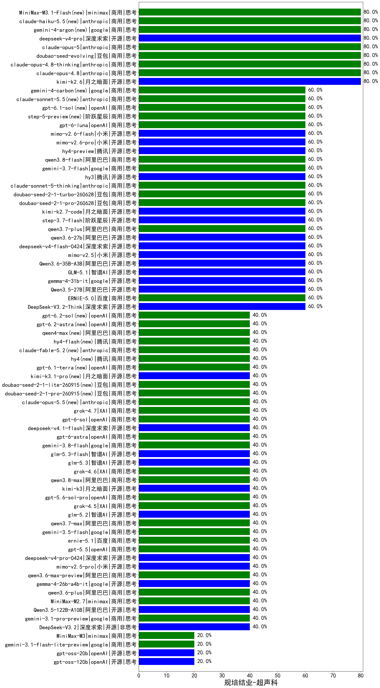

|类别|机构|大模型|【规培结业-超声科】准确率|平均耗时|平均消耗token|花费/千次（元）|排名（准确率）|
|---|---|-----|-------------------|-------|-----------|-----------|-----------|
|商用|minimax|MiniMax-M3.1-Flash(new)|80.0%|19s|1215|4.1|1|
|开源|深度求索|deepseek-v4-pro|80.0%|26s|1027|25.1|2|
|商用|google|gemini-4-argon(new)|80.0%|21s|488|57.2|3|
|商用|豆包|doubao-seed-evolving|80.0%|347s|13024|388.2|4|
|开源|月之暗面|kimi-k2.6|80.0%|124s|1977|52.0|5|
|商用|anthropic|claude-opus-4.8-thinking|80.0%|13s|855|134.9|6|
|商用|anthropic|claude-haiku-5.5(new)|80.0%|7s|1000|3.2|7|
|商用|anthropic|claude-opus-4.8|80.0%|8s|525|77.0|8|
|商用|anthropic|claude-opus-5|80.0%|15s|769|119.7|9|
|开源|阿里巴巴|qwen3.6-27b|60.0%|30s|1910|33.3|10|
|商用|anthropic|claude-sonnet-5.5(new)|60.0%|368s|638|38.6|11|
|商用|openAI|gpt-6.1-sol(new)|60.0%|7s|274|14.2|12|
|商用|阶跃星辰|step-5-preview(new)|60.0%|45s|3177|62.6|13|
|开源|阶跃星辰|step-3.7-flash|60.0%|32s|3505|27.9|14|
|开源|月之暗面|kimi-k2.7-code|60.0%|68s|2042|53.8|15|
|商用|豆包|doubao-seed-2-1-pro-260628|60.0%|254s|11409|339.7|16|
|商用|豆包|doubao-seed-2-1-turbo-260628|60.0%|234s|9544|141.9|17|
|商用|anthropic|claude-sonnet-5-thinking|60.0%|14s|748|46.4|18|
|商用|阿里巴巴|qwen3.7-plus|60.0%|40s|2115|16.5|19|
|开源|深度求索|deepseek-v4-flash-0424|60.0%|74s|1329|2.6|20|
|商用|google|gemini-4-carbon(new)|60.0%|38s|2137|288.1|21|
|开源|小米|mimo-v2.5|60.0%|14s|1710|20.4|22|
|开源|腾讯|hy4-preview|60.0%|58s|3642|64.6|23|
|开源|深度求索|DeepSeek-V3.2-Think|60.0%|212s|1993|5.9|24|
|商用|百度|ERNIE-5.0|60.0%|121s|2330|54.9|25|
|商用|阿里巴巴|qwen3.8-flash|60.0%|23s|665|1.6|26|
|开源|阿里巴巴|Qwen3.5-27B|60.0%|252s|3546|16.7|27|
|开源|小米|mimo-v2.6-pro|60.0%|26s|1094|6.3|28|
|开源|腾讯|hy3|60.0%|87s|268|0.9|29|
|商用|google|gemini-3.7-flash|60.0%|43s|835|20.4|30|
|开源|小米|mimo-v2.6-flash|60.0%|40s|880|1.7|31|
|开源|google|gemma-4-31b-it|60.0%|444s|643|1.6|32|
|开源|智谱AI|GLM-5.1|60.0%|244s|1992|46.5|33|
|开源|阿里巴巴|Qwen3.6-35B-A3B|60.0%|116s|2432|25.6|34|
|商用|openAI|gpt-6-luna|60.0%|323s|433|1.3|35|
|商用|openAI|gpt-6-sol|40.0%|898s|357|20.1|36|
|商用|XAI|grok-4.7|40.0%|73s|5612|199.1|37|
|商用|anthropic|claude-opus-5.5(new)|40.0%|16s|773|96.2|38|
|商用|XAI|grok-4.5|40.0%|79s|1599|59.6|39|
|商用|豆包|doubao-seed-2-1-pro-260915(new)|40.0%|141s|2104|60.6|40|
|商用|豆包|doubao-seed-2-1-lite-260915(new)|40.0%|59s|2546|6.7|41|
|商用|openAI|gpt-6-astra|40.0%|14s|306|82.4|42|
|开源|月之暗面|kimi-k3.1-pro(new)|40.0%|45s|1277|78.8|43|
|商用|openAI|gpt-6.1-terra(new)|40.0%|13s|313|8.5|44|
|商用|腾讯|hy4(new)|40.0%|98s|4778|85.0|45|
|商用|anthropic|claude-fable-5.2(new)|40.0%|40s|692|169.5|46|
|商用|腾讯|hy4-flash(new)|40.0%|9s|1338|2.6|47|
|商用|阿里巴巴|qwen4-max(new)|40.0%|16s|581|15.7|48|
|商用|openAI|gpt-6.2-astra(new)|40.0%|6s|210|38.9|49|
|开源|深度求索|deepseek-v4.1-flash|40.0%|6s|884|6.5|50|
|商用|openAI|gpt-6.2-sol(new)|40.0%|5s|214|10.1|51|
|商用|google|gemini-3.8-flash|40.0%|15s|860|42.1|52|
|开源|智谱AI|glm-5.3-flash|40.0%|90s|3131|8.6|53|
|开源|深度求索|DeepSeek-V3.2|40.0%|12s|388|1.1|54|
|商用|google|gemini-3.1-pro-preview|40.0%|39s|1565|128.2|55|
|开源|阿里巴巴|Qwen3.5-122B-A10B|40.0%|352s|3370|21.2|56|
|商用|minimax|MiniMax-M2.7|40.0%|38s|1448|11.5|57|
|商用|阿里巴巴|qwen3.6-plus|40.0%|30s|1684|19.5|58|
|开源|google|gemma-4-26b-a4b-it|40.0%|72s|700|1.8|59|
|商用|阿里巴巴|qwen3.6-max-preview|40.0%|57s|1815|94.7|60|
|开源|小米|mimo-v2.5-pro|40.0%|25s|1580|28.7|61|
|开源|深度求索|deepseek-v4-pro-0424|40.0%|64s|2575|61.0|62|
|商用|openAI|gpt-5.5|40.0%|8s|472|83.7|63|
|商用|百度|ernie-5.1|40.0%|78s|1467|25.5|64|
|商用|google|gemini-3.5-flash|40.0%|9s|1538|93.0|65|
|商用|阿里巴巴|qwen3.7-max|40.0%|33s|1351|46.9|66|
|开源|智谱AI|glm-5.2|40.0%|57s|2240|61.2|67|
|商用|openAI|gpt-5.6-sol-pro|40.0%|12s|3362|262.2|68|
|开源|月之暗面|kimi-k3|40.0%|36s|770|65.4|69|
|商用|阿里巴巴|qwen3.8-max|40.0%|55s|2090|72.6|70|
|商用|XAI|grok-4.6|40.0%|45s|1948|74.2|71|
|开源|智谱AI|glm-5.3|40.0%|789s|1424|38.3|72|
|商用|minimax|MiniMax-M3|20.0%|21s|687|8.6|73|
|开源|openAI|gpt-oss-20b|20.0%|11s|959|1.0|74|
|商用|google|gemini-3.1-flash-lite-preview|20.0%|5s|509|4.7|75|
|开源|openAI|gpt-oss-120b|20.0%|11s|775|2.2|76|

