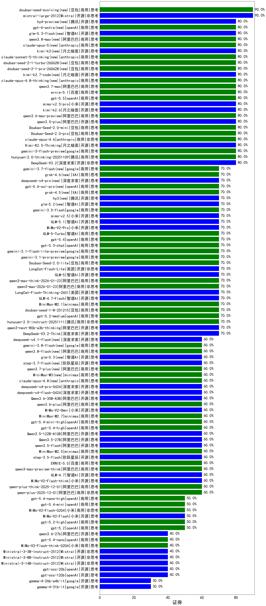

|类别|机构|大模型|【证券】准确率|平均耗时|平均消耗token|花费/千次（元）|排名（准确率）|
|---|---|-----|-------------------|-------|-----------|-----------|-----------|
|商用|豆包|doubao-seed-evolving|90.0%|232s|8542|253.8|1|
|开源|月之暗面|kimi-k2.6|80.0%|57s|1160|30.2|2|
|开源|小米|mimo-v2.5-pro|80.0%|18s|852|13.6|3|
|开源|智谱AI|glm-5.3-flash(new)|80.0%|29s|1050|2.8|4|
|商用|anthropic|claude-opus-4.8-thinking|80.0%|11s|537|80.9|5|
|商用|阿里巴巴|qwen3.8-max(new)|80.0%|19s|723|23.7|6|
|商用|anthropic|claude-opus-5(new)|80.0%|10s|545|82.3|7|
|开源|月之暗面|kimi-k3(new)|80.0%|70s|875|76.7|8|
|商用|阿里巴巴|qwen3.6-max-preview|80.0%|50s|1319|68.5|9|
|商用|anthropic|claude-sonnet-5-thinking|80.0%|10s|532|32.0|10|
|开源|阿里巴巴|qwen3.5-plus|80.0%|34s|2781|13.1|11|
|商用|openAI|gpt-5.5|80.0%|8s|395|71.0|12|
|商用|豆包|doubao-seed-2-1-turbo-260628|80.0%|163s|6491|96.1|13|
|商用|百度|ernie-5.1|80.0%|27s|709|12.0|14|
|商用|阿里巴巴|qwen3.7-max|80.0%|18s|860|29.5|15|
|商用|豆包|doubao-seed-2-1-pro-260628|80.0%|244s|10623|316.2|16|
|商用|openAI|gpt-6-astra(new)|80.0%|10s|202|51.6|17|
|开源|月之暗面|kimi-k2.7-code|80.0%|19s|553|13.8|18|
|商用|豆包|Doubao-Seed-2.0-mini|80.0%|392s|2705|5.2|19|
|商用|豆包|Doubao-Seed-2.0-pro|80.0%|215s|1021|15.0|20|
|商用|anthropic|claude-opus-4.6|80.0%|8s|461|67.5|21|
|开源|月之暗面|Kimi-K2.5-Thinking|80.0%|244s|1218|24.6|22|
|开源|腾讯|hy4-preview(new)|80.0%|29s|1868|32.8|23|
|开源|深度求索|DeepSeek-V3.2|80.0%|14s|204|0.6|24|
|商用|google|gemini-3.5-flash|70.0%|7s|1234|74.7|25|
|商用|openAI|gpt-6-sol(new)|70.0%|277s|196|9.8|26|
|商用|阿里巴巴|qwen3-max-2026-01-23|70.0%|84s|328|2.8|27|
|开源|深度求索|DeepSeek-V3.2-Think|70.0%|27s|829|2.4|28|
|商用|openAI|gpt-5.6-sol-pro|70.0%|12s|2893|210.5|29|
|商用|阿里巴巴|qwen3-max-think-2026-01-23|70.0%|97s|2202|21.5|30|
|开源|智谱AI|glm-5.2|70.0%|63s|1457|39.5|31|
|开源|小米|mimo-v2.5|70.0%|389s|1363|15.7|32|
|开源|腾讯|hy3|70.0%|52s|183|0.5|33|
|开源|智谱AI|GLM-5|70.0%|73s|1851|32.5|34|
|商用|XAI|grok-4.5|70.0%|88s|1223|44.0|35|
|开源|智谱AI|GLM-5.1|70.0%|86s|1085|25.0|36|
|商用|智谱AI|GLM-5-Turbo|70.0%|42s|1088|23.0|37|
|商用|google|gemini-3.1-pro-preview|70.0%|26s|1202|98.2|38|
|开源|小米|mimo-v2.6-pro(new)|70.0%|22s|827|4.8|39|
|开源|小米|MiMo-V2-Pro|70.0%|476s|928|15.2|40|
|开源|深度求索|deepseek-v4-pro(new)|70.0%|27s|994|24.4|41|
|商用|XAI|grok-4.6(new)|70.0%|24s|1238|44.7|42|
|商用|google|gemini-3.7-flash(new)|70.0%|4s|709|17.4|43|
|开源|美团|LongCat-Flash-Lite|70.0%|109s|288|0.0|44|
|商用|豆包|Doubao-Seed-2.0-lite|70.0%|165s|787|2.5|45|
|商用|openAI|gpt-5.4|70.0%|3s|192|14.2|46|
|商用|openAI|gpt-5.3-chat|70.0%|23s|301|23.5|47|
|商用|google|gemini-3.1-flash-lite-preview|70.0%|38s|311|2.7|48|
|商用|google|gemini-3.8-flash(new)|60.0%|19s|896|44.6|49|
|开源|深度求索|deepseek-v4.1-flash(new)|60.0%|39s|1133|8.6|50|
|开源|智谱AI|glm-5.3(new)|60.0%|35s|1063|28.5|51|
|商用|阿里巴巴|qwen3.8-flash(new)|60.0%|18s|1022|2.5|52|
|商用|openAI|gpt-6-luna(new)|60.0%|155s|434|1.3|53|
|开源|小米|mimo-v2.6-flash(new)|60.0%|22s|617|1.2|54|
|商用|XAI|grok-4.7(new)|60.0%|32s|3274|101.2|55|
|开源|阶跃星辰|step-3.7-flash|60.0%|22s|2780|22.1|56|
|开源|阿里巴巴|Qwen3.5-122B-A10B|60.0%|338s|2657|16.7|57|
|开源|阿里巴巴|Qwen3.5-27B|60.0%|232s|2503|11.8|58|
|商用|openAI|gpt-5.4-mini-high|60.0%|17s|702|20.3|59|
|开源|阿里巴巴|qwen3.5-flash|60.0%|273s|3502|6.9|60|
|商用|阿里巴巴|qwen3.7-plus|60.0%|17s|883|6.7|61|
|商用|minimax|MiniMax-M2.7|60.0%|27s|1086|8.6|62|
|开源|小米|MiMo-V2-Omni|60.0%|5s|975|10.2|63|
|商用|阿里巴巴|qwen3.6-plus|60.0%|41s|1449|16.8|64|
|商用|minimax|MiniMax-M2.5|60.0%|25s|1007|7.9|65|
|开源|阿里巴巴|Qwen3.6-35B-A3B|60.0%|58s|1402|14.6|66|
|开源|阶跃星辰|step-3.5-flash|60.0%|24s|1813|3.7|67|
|开源|深度求索|deepseek-v4-flash-0424|60.0%|30s|798|1.5|68|
|开源|深度求索|deepseek-v4-pro-0424|60.0%|39s|648|14.9|69|
|商用|百度|ERNIE-5.0|60.0%|130s|1861|43.8|70|
|商用|anthropic|claude-opus-4.8|60.0%|12s|426|61.6|71|
|商用|minimax|MiniMax-M3|60.0%|22s|652|8.2|72|
|商用|openAI|gpt-5.4-high|60.0%|14s|690|66.5|73|
|商用|小米|MiMo-V2-Flash-0204|50.0%|290s|424|0.8|74|
|商用|openAI|gpt-5.4-nano-high|50.0%|68s|360|2.6|75|
|商用|openAI|gpt-5.4-mini|50.0%|8s|181|3.9|76|
|商用|openAI|gpt-5.4-nano|40.0%|8s|161|0.9|77|
|商用|小米|MiMo-V2-Flash-think-0204|40.0%|706s|1511|3.1|78|
|开源|openAI|gpt-oss-20b|40.0%|94s|685|0.7|79|
|开源|阿里巴巴|qwen3.6-27b|40.0%|21s|1359|23.5|80|
|开源|openAI|gpt-oss-120b|40.0%|30s|507|1.3|81|
|开源|google|gemma-4-31b-it|30.0%|59s|432|1.1|82|
|开源|google|gemma-4-26b-a4b-it|30.0%|43s|515|1.3|83|

