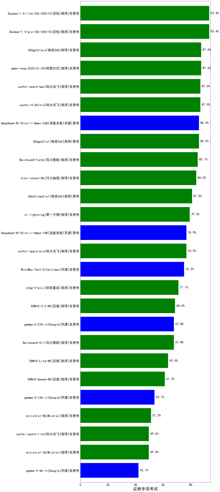

| 类别 | 大模型                         | 证券专项考试 | 排名 |
|-----|------------------------------|---------|----|
|商用|hunyuan-turbos-20250226|97.5|1|
|开源|hunyuan-large|96.7|2|
|商用|hunyuan-turbos-20250313|95.0|3|
|商用|ERNIE-4.5-8K-Preview|94.0|4|
|商用|Doubao-1.5-pro-32k-250115|93.4|5|
|商用|Doubao-1.5-lite-32k-250115|93.4|6|
|商用|hunyuan-turbo|93.0|7|
|商用|Claude-3.5-Sonnet|90.0|8|
|商用|qwen-plus|88.4|9|
|商用|hunyuan-standard|87.6|10|
|商用|360gpt2-pro|87.6|11|
|商用|qwen-long|87.6|12|
|开源|qwen2.5-72b-instruct|87.0|13|
|商用|xunfei-spark-max|87.0|14|
|商用|xunfei-4.0Ultra|87.0|15|
|商用|qwen2.5-max|86.8|16|
|商用|360gpt2-o1|86.0|17|
|开源|DeepSeek-R1-Distill-Qwen-32B|86.0|18|
|开源|DeepSeek-R1|86.0|19|
|商用|Baichuan4-Turbo|85.1|20|
|商用|GLM-4-Air|85.1|21|
|商用|GLM-4-AirX|84.3|22|
|商用|360gpt-turbo|84.3|23|
|商用|SenseChat-5-beta|84.0|24|
|商用|kimi-latest-8k|84.0|25|
|开源|qwq-32b|84.0|26|
|商用|SenseChat-5-1202|83.0|27|
|商用|qwq-plus-2025-03-05|82.0|28|
|商用|qwen-turbo|81.8|29|
|开源|internlm2_5-7b-chat|81.0|30|
|商用|360zhinao2-o1|81.0|31|
|商用|GLM-4-Plus|81.0|32|
|开源|qwen2.5-32b-instruct|80.2|33|
|商用|yi-lightning|79.3|34|
|开源|qwen2.5-14b-instruct|79.3|35|
|商用|GLM-4-Long|79.3|36|
|商用|mistral-large|78.0|37|
|开源|qwen2.5-7b-instruct|77.7|38|
|商用|gemini-2.0-flash-001|77.7|39|
|商用|SenseChat-Turbo-1202|77.7|40|
|开源|deepseek-chat-v3-0324|77.6|41|
|商用|hunyuan-t1-20250321|77.6|42|
|商用|o3-mini|77.0|43|
|商用|chatgpt-4o-latest|77.0|44|
|开源|internlm2_5-20b-chat|76.9|45|
|开源|DeepSeek-R1-Distill-Qwen-14B|76.9|46|
|商用|xunfei-spark-pro|76.9|47|
|开源|MiniMax-Text-01|75.2|48|
|商用|GLM-4-Flash|74.4|49|
|商用|ERNIE-4.0-Turbo-8K|74.0|50|
|商用|GLM-4-FlashX|73.6|51|
|开源|glm-4-9b-chat|72.7|52|
|商用|mistral-small|72.7|53|
|商用|step-2-mini|71.1|54|
|开源|DeepSeek-R1-Distill-Llama-70B|71.0|55|
|商用|abab6.5s-chat|70.2|56|
|商用|moonshot-v1-8k|68.6|57|
|开源|Meta-Llama-3.1-405B-Instruct|68.6|58|
|商用|ERNIE-3.5-8K|68.6|59|
|商用|gpt-4o-mini|67.8|60|
|商用|Baichuan4-Air|67.8|61|
|开源|gemma-3-27b-it|67.8|62|
|开源|phi-4|66.1|63|
|开源|qwen2.5-3b-instruct|63.6|64|
|商用|ERNIE-Lite-8K|63.6|65|
|商用|ERNIE-Speed-Pro-128K|62.8|66|
|开源|Llama-3.3-70B-Instruct|62.8|67|
|商用|ERNIE-Speed-8K|61.2|68|
|开源|Llama-3.3-70B-Instruct-fp8|60.3|69|
|开源|DeepSeek-R1-Distill-Qwen-7B|60.3|70|
|商用|ERNIE-Lite-Pro-128K|59.5|71|
|开源|qwen2.5-1.5b-instruct|55.4|72|
|开源|gemma-3-12b-it|53.7|73|
|商用|ministral-8b|51.2|74|
|商用|ministral-3b|49.6|75|
|商用|xunfei-spark-lite|49.6|76|
|开源|DeepSeek-R1-Distill-Llama-8B|46.3|77|
|开源|qwen2.5-0.5b-instruct|43.8|78|
|开源|Meta-Llama-3.1-8B-Instruct-fp8|43.0|79|
|开源|Llama-3.1-8B-Instruct|42.1|80|
|开源|gemma-3-4b-it|42.1|81|
|开源|DeepSeek-R1-Distill-Qwen-1.5B|40.5|82|
|商用|ERNIE-Tiny-8K|35.5|83|
|开源|Llama-3.2-3B-Instruct|33.9|84|
|开源|Llama-3.2-1B-Instruct|28.9|85|
|开源|Llama-4-Scout-17B-16E-Instruct|/|86|
|开源|Llama-4-Maverick-17B-128E-Instruct-FP8|/|87|
|商用|ERNIE-X1-32K-Preview|/|88|
|开源|Mistral-Small-3.1-24B-Instruct-2503|/|89|
|商用|gemini-2.5-pro-preview-03-25|/|90|
|商用|gemini-2.5-flash-preview-04-17|/|91|
|商用|GLM-Z1-Flash|/|92|
|商用|GLM-Z1-FlashX|/|93|
|商用|GLM-Z1-Air|/|94|
|商用|GLM-Z1-AirX|/|95|
|开源|GLM-4-9B-0414|/|96|
|开源|GLM-Z1-9B-0414|/|97|
|开源|GLM-4-32B-0414|/|98|
|开源|GLM-Z1-32B-0414|/|99|
|开源|GLM-Z1-Rumination-32B-0414|/|100|
|开源|Qwen3-235B-A22B(new)|/|101|
|开源|Qwen3-32B(new)|/|102|
|开源|Qwen3-30B-A3B(new)|/|103|
|开源|Qwen3-14B(new)|/|104|
|开源|Qwen3-8B(new)|/|105|
|开源|Qwen3-4B(new)|/|106|
|开源|Qwen3-1.7B(new)|/|107|
|开源|Qwen3-0.6B(new)|/|108|
|商用|xunfei-spark-x1(new)|/|109|
|商用|Doubao-1.5-thinking-pro(new)|nan|110|
|商用|gpt-4.1(new)|nan|111|
|商用|gpt-4.1-mini(new)|nan|112|
|商用|o4-mini(new)|nan|113|
|开源|DeepSeek-R1-0528(new)|nan|114|
|商用|ERNIE-4.5-Turbo-32K(new)|nan|115|
|商用|ERNIE-X1-Turbo-32K(new)|nan|116|
|商用|gemini-2.5-flash-preview-05-20(new)|nan|117|
|商用|gemini-2.5-pro-preview-05-06(new)|nan|118|
|开源|DeepSeek-R1-0528-Qwen3-8B(new)|nan|119|

