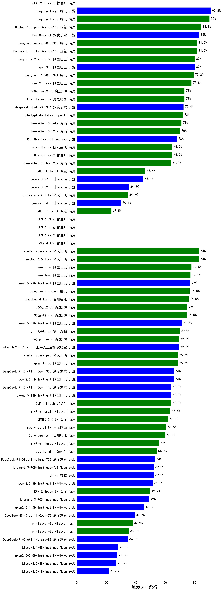

|类别|机构|大模型|【证券从业资格】准确率|平均耗时|平均消耗token|排名（准确率）|
|---|---|-----|-------------------|-------|-----------|------------|
|开源|腾讯|hunyuan-large|90.8%|12s|1033|1|
|商用|腾讯|hunyuan-turbo|90.0%|17s|989|2|
|商用|豆包|Doubao-1.5-pro-32k-250115|84.3%|10s|339|3|
|商用|科大讯飞|xunfei-4.0Ultra|83.0%|8s|158|4|
|商用|科大讯飞|xunfei-spark-max|83.0%|8s|158|5|
|商用|豆包|Doubao-1.5-lite-32k-250115|81.7%|6s|215|6|
|开源|阿里巴巴|qwq-32b|80.0%|73s|1790|7|
|商用|阿里巴巴|qwq-plus-2025-03-05|80.0%|52s|2224|8|
|商用|阿里巴巴|qwen2.5-max|77.8%|17s|364|9|
|商用|阿里巴巴|qwen-long-2025-01-25|77.1%|66s|234|10|
|开源|阿里巴巴|qwen2.5-72b-instruct|77.0%|13s|248|11|
|商用|腾讯|hunyuan-standard|76.5%|/|/|12|
|商用|百川智能|Baichuan4-Turbo|75.8%|/|/|13|
|商用|奇虎360|360gpt2-o1|75.0%|16s|333|14|
|商用|奇虎360|360gpt2-pro|74.5%|13s|215|15|
|商用|月之暗面|kimi-latest-8k|73.0%|22s|415|16|
|商用|奇虎360|360zhinao2-o1|73.0%|/|/|17|
|商用|openAI|chatgpt-4o-latest|72.0%|/|/|18|
|开源|阿里巴巴|qwen2.5-32b-instruct|71.2%|10s|236|19|
|商用|商汤|SenseChat-5-beta|71.0%|15s|270|20|
|商用|商汤|SenseChat-5-1202|70.0%|/|/|21|
|商用|零一万物|yi-lightning|69.9%|/|/|22|
|商用|奇虎360|360gpt-turbo|69.3%|/|/|23|
|开源|上海人工智能实验室|internlm2_5-7b-chat|69.3%|/|/|24|
|商用|科大讯飞|xunfei-spark-pro|68.6%|/|/|25|
|开源|minimax|MiniMax-Text-01|68.0%|12s|869|26|
|开源|阿里巴巴|qwen2.5-7b-instruct|66.0%|6s|236|27|
|开源|深度求索|DeepSeek-R1-Distill-Qwen-32B|66.0%|40s|869|28|
|商用|阶跃星辰|step-2-mini|64.7%|3s|294|29|
|商用|智谱AI|GLM-4-FlashX|64.7%|30s|215|30|
|商用|智谱AI|GLM-4-Flash|64.1%|11s|232|31|
|开源|深度求索|DeepSeek-R1-Distill-Qwen-14B|64.1%|/|/|32|
|商用|商汤|SenseChat-Turbo-1202|64.1%|/|/|33|
|开源|阿里巴巴|qwen2.5-14b-instruct|64.1%|2s|240|34|
|商用|Mistral|mistral-small|63.4%|/|/|35|
|商用|百度|ERNIE-3.5-8K|62.1%|22s|369|36|
|商用|月之暗面|moonshot-v1-8k|60.8%|/|/|37|
|商用|百川智能|Baichuan4-Air|60.1%|/|/|38|
|商用|Mistral|mistral-large|56.0%|/|/|39|
|商用|OpenAI|gpt-4o-mini|54.2%|/|/|40|
|开源|微软|phi-4|52.3%|/|/|41|
|开源|阿里巴巴|qwen2.5-3b-instruct|51.6%|8s|215|42|
|商用|百度|ERNIE-Speed-8K|49.7%|/|/|43|
|商用|百度|ERNIE-Lite-8K|46.4%|/|/|44|
|开源|阿里巴巴|qwen2.5-1.5b-instruct|45.8%|4s|173|45|
|开源|Google|gemma-3-27b-it|45.1%|/|/|46|
|商用|Mistral|ministral-8b|37.9%|/|/|47|
|开源|Google|gemma-3-12b-it|35.3%|/|/|48|
|商用|Mistral|ministral-3b|35.3%|/|/|49|
|商用|科大讯飞|xunfei-spark-lite|34.6%|/|/|50|
|开源|Google|gemma-3-4b-it|30.1%|/|/|51|
|开源|阿里巴巴|qwen2.5-0.5b-instruct|27.5%|11s|234|52|
|商用|百度|ERNIE-Tiny-8K|23.5%|/|/|53|
|商用|智谱AI|GLM-4-Air|nan%|12s|207|54|
|商用|智谱AI|GLM-4-AirX|nan%|13s|211|55|
|商用|智谱AI|GLM-4-Long|nan%|16s|215|56|
|商用|智谱AI|GLM-4-Plus|nan%|12s|251|57|
|开源|深度求索|deepseek-chat-v3-0324|nan%|155s|195|58|
|开源|meta|Llama-4-Scout-17B-16E-Instruct|nan%|93s|414|59|
|开源|meta|Llama-4-Maverick-17B-128E-Instruct-FP8|nan%|15s|540|60|
|开源|Mistral|Mistral-Small-3.1-24B-Instruct-2503|nan%|/|/|61|
|商用|智谱AI|GLM-Z1-Flash|nan%|47s|2912|62|
|商用|智谱AI|GLM-Z1-FlashX|nan%|62s|3858|63|
|商用|智谱AI|GLM-Z1-Air|nan%|78s|2609|64|
|商用|智谱AI|GLM-Z1-AirX|nan%|15s|2931|65|
|开源|智谱AI|GLM-4-9B-0414|nan%|9s|364|66|
|开源|智谱AI|GLM-Z1-9B-0414|nan%|173s|2936|67|
|开源|智谱AI|GLM-4-32B-0414|nan%|39s|325|68|
|开源|智谱AI|GLM-Z1-32B-0414|nan%|117s|2211|69|
|开源|智谱AI|GLM-Z1-Rumination-32B-0414|nan%|15s|956|70|
|开源|阿里巴巴|Qwen3-235B-A22B|nan%|56s|1776|71|
|开源|阿里巴巴|Qwen3-32B|nan%|26s|995|72|
|开源|阿里巴巴|Qwen3-30B-A3B|nan%|25s|1265|73|
|开源|阿里巴巴|Qwen3-14B|nan%|26s|926|74|
|开源|阿里巴巴|Qwen3-8B|nan%|189s|5321|75|
|开源|阿里巴巴|Qwen3-4B|nan%|22s|1194|76|
|开源|阿里巴巴|Qwen3-1.7B|nan%|17s|2109|77|
|开源|阿里巴巴|Qwen3-0.6B|nan%|16s|1228|78|
|商用|科大讯飞|xunfei-spark-x1|nan%|40s|1219|79|
|商用|豆包|Doubao-1.5-thinking-pro|nan%|329s|787|80|
|商用|openAI|gpt-4.1|nan%|12s|204|81|
|商用|openAI|gpt-4.1-mini|nan%|7s|212|82|
|商用|openAI|o4-mini|nan%|45s|1065|83|
|开源|深度求索|DeepSeek-R1-0528|nan%|217s|1606|84|
|商用|百度|ERNIE-4.5-Turbo-32K|nan%|29s|452|85|
|商用|百度|ERNIE-X1-Turbo-32K|nan%|91s|1616|86|
|商用|google|gemini-2.5-flash-preview-05-20|nan%|35s|1899|87|
|商用|google|gemini-2.5-pro-preview-05-06|nan%|51s|1979|88|
|开源|深度求索|DeepSeek-R1-0528-Qwen3-8B|nan%|315s|1898|89|
|商用|anthropic|claude-4-sonnet|nan%|40s|456|90|
|商用|anthropic|claude-4-sonnet-thinking|nan%|48s|959|91|
|商用|阶跃星辰|step-r1-v-mini|nan%|169s|1361|92|
|商用|腾讯|hunyuan-turbos-20250604(new)|nan%|47s|281|93|
|商用|腾讯|hunyuan-t1-20250529|nan%|72s|1005|94|
|商用|豆包|doubao-seed-1-6-flash-250615(new)|nan%|2s|229|95|
|商用|豆包|doubao-seed-1-6-flash-thinking-250615(new)|nan%|6s|438|96|
|商用|豆包|doubao-seed-1-6-250615(new)|nan%|114s|263|97|
|商用|豆包|doubao-seed-1-6-thinking-250615(new)|nan%|252s|1164|98|
|商用|阿里巴巴|qwen-plus-2025-04-28|nan%|7s|291|99|
|商用|阿里巴巴|qwen-plus-think-2025-04-28|nan%|72s|1118|100|
|商用|阿里巴巴|qwen-turbo-2025-04-28|nan%|5s|304|101|
|商用|阿里巴巴|qwen-turbo-think-2025-04-28|nan%|216s|2439|102|
|开源|minimax|MiniMax-M1(new)|nan%|160s|3848|103|
|开源|百度|ERNIE-4.5-0.3B(new)|nan%|62s|307|104|
|开源|百度|ERNIE-4.5-21B-A3B(new)|nan%|32s|323|105|
|开源|百度|ERNIE-4.5-300B-A47B(new)|nan%|27s|379|106|
|开源|腾讯|Hunyuan-A13B-Instruct(new)|nan%|50s|863|107|
|商用|google|gemini-2.5-flash(new)|nan%|9s|1628|108|
|商用|google|gemini-2.5-flash-lite-preview-06-17(new)|nan%|4s|581|109|
|商用|XAI|grok-4-0709(new)|nan%|290s|1050|110|
|商用|XAI|grok-3-mini(new)|nan%|160s|841|111|
|商用|google|gemini-2.5-pro(new)|nan%|68s|1839|112|
|开源|月之暗面|kimi-k2-0711-preview(new)|nan%|10s|209|113|
|开源|阿里巴巴|Qwen3-235B-A22B-nothink|nan%|12s|310|114|

