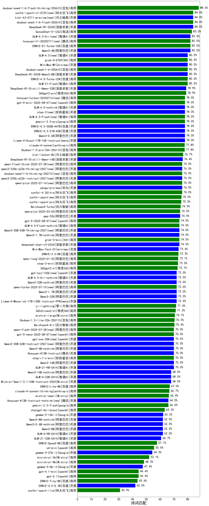

|类别|机构|大模型|【诗词匹配】准确率|平均耗时|平均消耗token|花费/千次（元）|排名（准确率）|
|---|---|-----|-------------------|-------|-----------|-----------|-----------|
|商用|智谱AI|GLM-4-Plus|97.8%|6s|252|1.3|1|
|商用|豆包|doubao-seed-1-6-flash-thinking-250615|88.0%|6s|535|0.7|2|
|开源|月之暗面|kimi-k2-0711-preview(new)|84.0%|53s|841|12.8|3|
|商用|豆包|doubao-seed-1-6-flash-250615|84.0%|3s|280|0.3|4|
|开源|深度求索|DeepSeek-R1-0528|84.0%|128s|2007|31.4|5|
|商用|科大讯飞|xunfei-spark-x1-0725(new)|84.0%|/|766|9.2|6|
|商用|商汤|SenseChat-5-1202|83.0%|/|/|/|7|
|开源|阿里巴巴|Qwen3-4B|82.0%|43s|1553|4.5|8|
|开源|智谱AI|GLM-4.5-Air(new)|82.0%|47s|2310|13.5|9|
|商用|百度|ERNIE-X1-Turbo-32K|82.0%|220s|1598|6.2|10|
|商用|腾讯|hunyuan-t1-20250711(new)|82.0%|22s|1265|4.8|11|
|商用|智谱AI|GLM-Z1-AirX|80.9%|34s|1777|9.1|12|
|开源|minimax|MiniMax-M1|80.0%|143s|1496|10.9|13|
|商用|豆包|doubao-seed-1-6-250615|80.0%|112s|364|2.3|14|
|商用|XAI|grok-4-0709|80.0%|436s|2271|241.4|15|
|开源|智谱AI|GLM-4.5(new)|80.0%|94s|2265|31.1|16|
|商用|百度|ERNIE-4.5-Turbo-32K|80.0%|34s|317|0.9|17|
|开源|深度求索|DeepSeek-R1-0528-Qwen3-8B|80.0%|326s|1650|0.0|18|
|商用|智谱AI|GLM-Z1-Flash|80.0%|17s|1429|0.0|19|
|开源|深度求索|DeepSeek-R1-Distill-Qwen-32B|78.9%|38s|686|0.9|20|
|商用|奇虎360|360gpt2-pro|78.9%|3s|145|0.5|21|
|开源|meta|Llama-4-Scout-17B-16E-Instruct|78.0%|9s|557|1.1|22|
|商用|腾讯|hunyuan-turbos-20250604|78.0%|41s|314|0.5|23|
|开源|阿里巴巴|Qwen3-0.6B|78.0%|22s|787|2.2|24|
|商用|google|gemini-2.5-pro|78.0%|32s|2313|163.6|25|
|开源|百度|ERNIE-4.5-21B-A3B|78.0%|60s|300|0.0|26|
|商用|智谱AI|GLM-4.5-Flash(new)|78.0%|40s|2429|0.0|27|
|开源|阶跃星辰|step-3(new)|78.0%|113s|2206|8.7|28|
|开源|百度|ERNIE-4.5-300B-A47B|78.0%|12s|252|1.6|29|
|商用|anthropic|claude-4-sonnet|77.8%|47s|468|42.9|30|
|商用|智谱AI|GLM-4-FlashX|77.8%|2s|137|0.0|31|
|商用|豆包|Doubao-1.5-pro-32k-250115|77.8%|8s|386|0.7|32|
|商用|月之暗面|kimi-latest-8k|76.7%|20s|475|5.7|33|
|商用|阿里巴巴|qwen2.5-max|76.6%|5s|146|0.9|34|
|开源|阿里巴巴|qwen2.5-32b-instruct|76.4%|2s|153|0.7|35|
|开源|深度求索|DeepSeek-R1-Distill-Qwen-14B|76.4%|/|/|/|36|
|开源|阿里巴巴|Qwen3-30B-A3B|76.0%|119s|2069|5.7|37|
|商用|豆包|doubao-seed-1-6-thinking-250715(new)|76.0%|41s|1025|7.8|38|
|开源|阿里巴巴|qwen3-235b-a22b-instruct-2507(new)|76.0%|17s|637|4.7|39|
|开源|阿里巴巴|qwen3-235b-a22b-thinking-2507(new)|76.0%|81s|3451|67.9|40|
|商用|阿里巴巴|qwen-plus-2025-07-14(new)|76.0%|12s|660|1.2|41|
|开源|华为|pangu-pro-moe(new)|76.0%|57s|1091|4.2|42|
|商用|科大讯飞|xunfei-4.0Ultra|76.0%|2s|110|7.7|43|
|开源|阿里巴巴|qwen2.5-14b-instruct|75.8%|6s|237|0.6|44|
|商用|科大讯飞|xunfei-spark-max|75.5%|2s|118|3.5|45|
|商用|科大讯飞|xunfei-spark-pro|75.3%|/|/|/|46|
|商用|百川智能|Baichuan4-Turbo|74.9%|/|/|/|47|
|商用|阿里巴巴|qwq-plus-2025-03-05|74.5%|30s|1485|5.8|48|
|开源|阿里巴巴|qwq-32b|74.5%|27s|1463|8.5|49|
|商用|阿里巴巴|qwen-turbo-think-2025-04-28|74.0%|73s|1838|5.3|50|
|开源|阿里巴巴|Qwen3-30B-A3B-Thinking-2507(new)|74.0%|65s|2756|7.6|51|
|开源|深度求索|deepseek-chat-v3-0324|74.0%|120s|307|2.2|52|
|开源|阿里巴巴|qwen2.5-72b-instruct|74.0%|3s|154|1.3|53|
|商用|智谱AI|GLM-Z1-Air|74.0%|39s|1090|0.6|54|
|商用|XAI|grok-3-mini|74.0%|140s|1204|4.3|55|
|开源|阿里巴巴|Qwen3-1.7B-nothink|74.0%|9s|458|1.2|56|
|开源|阿里巴巴|Qwen3-235B-A22B-nothink|74.0%|19s|512|4.6|57|
|开源|minimax|MiniMax-Text-01|73.4%|8s|893|7.2|58|
|商用|百度|ERNIE-3.5-8K|73.3%|22s|411|0.8|59|
|商用|智谱AI|GLM-4-AirX|73.3%|1s|161|1.6|60|
|商用|阿里巴巴|qwen-long-2025-01-25|73.1%|43s|341|0.6|61|
|商用|阶跃星辰|step-2-mini|73.0%|5s|329|0.6|62|
|商用|奇虎360|360gpt2-o1|72.7%|29s|855|40.5|63|
|商用|奇虎360|360gpt-turbo|72.3%|/|/|/|64|
|商用|阿里巴巴|qwen-turbo-2025-07-15(new)|72.0%|9s|418|0.2|65|
|开源|阿里巴巴|Qwen3-1.7B|72.0%|38s|1532|4.4|66|
|开源|meta|Llama-4-Maverick-17B-128E-Instruct-FP8|72.0%|7s|525|2.1|67|
|开源|阿里巴巴|Qwen3-32B-nothink|72.0%|66s|513|1.9|68|
|开源|阿里巴巴|Qwen3-235B-A22B|72.0%|85s|1753|17.1|69|
|开源|阿里巴巴|Qwen3-32B|72.0%|72s|1227|4.7|70|
|商用|零一万物|yi-lightning|71.6%|/|/|/|71|
|商用|奇虎360|360zhinao2-o1|71.3%|/|/|/|72|
|商用|Mistral|mistral-large|70.7%|/|/|/|73|
|商用|豆包|Doubao-1.5-lite-32k-250115|70.5%|4s|228|0.1|74|
|商用|百川智能|Baichuan4-Air|70.4%|/|/|/|75|
|开源|阿里巴巴|Qwen3-4B-nothink|70.0%|14s|440|1.1|76|
|开源|阿里巴巴|Qwen3-14B|70.0%|90s|1782|3.5|77|
|开源|智谱AI|GLM-Z1-9B-0414|70.0%|127s|1399|0.0|78|
|商用|阶跃星辰|step-r1-v-mini|70.0%|136s|1473|11.4|79|
|开源|腾讯|Hunyuan-A13B-Instruct|70.0%|86s|852|3.2|80|
|开源|阿里巴巴|Qwen3-30B-A3B-Instruct-2507(new)|70.0%|8s|717|2.0|81|
|商用|阿里巴巴|qwen-plus-think-2025-04-28|70.0%|204s|1520|11.7|82|
|开源|阿里巴巴|qwen2.5-7b-instruct|69.6%|2s|132|0.1|83|
|开源|上海人工智能实验室|internlm2_5-7b-chat|68.5%|/|/|/|84|
|开源|阿里巴巴|Qwen3-14B-nothink|68.0%|12s|548|1.0|85|
|开源|智谱AI|GLM-4-32B-0414|68.0%|7s|227|0.4|86|
|开源|Mistral|Mistral-Small-3.1-24B-Instruct-2503|68.0%|/|/|/|87|
|商用|百度|ERNIE-Lite-8K|67.0%|/|/|/|88|
|开源|微软|phi-4|66.9%|/|/|/|89|
|商用|anthropic|claude-4-sonnet-thinking|66.7%|52s|1040|105.1|90|
|商用|Mistral|mistral-small|66.4%|/|/|/|91|
|开源|腾讯|hunyuan-large|66.3%|8s|1126|6.9|92|
|商用|google|gemini-2.5-flash|66.0%|12s|1553|27.1|93|
|开源|腾讯|Hunyuan-A13B-Instruct-nothink(new)|66.0%|665s|395|1.4|94|
|开源|阿里巴巴|qwen2.5-3b-instruct|64.7%|3s|153|0.1|95|
|开源|阿里巴巴|Qwen3-30B-A3B-nothink|64.0%|14s|431|1.1|96|
|商用|openAI|chatgpt-4o-latest|63.3%|/|/|/|97|
|商用|智谱AI|GLM-Z1-FlashX|63.3%|43s|1426|0.1|98|
|开源|Google|gemma-3-12b-it|62.2%|/|/|/|99|
|开源|阿里巴巴|Qwen3-0.6B-nothink|62.0%|6s|213|0.5|100|
|开源|智谱AI|GLM-4-9B-0414|62.0%|11s|366|0.0|101|
|开源|阿里巴巴|Qwen3-8B|62.0%|77s|2094|0.0|102|
|开源|阿里巴巴|Qwen3-8B-nothink|62.0%|21s|440|0.0|103|
|商用|google|gemini-2.5-flash-lite-preview-06-17|62.0%|1s|386|1.0|104|
|商用|OpenAI|gpt-4o-mini|61.0%|/|/|/|105|
|开源|阿里巴巴|qwen2.5-1.5b-instruct|60.7%|1s|92|0.0|106|
|开源|智谱AI|GLM-Z1-32B-0414|60.7%|199s|1557|6.1|107|
|商用|腾讯|hunyuan-standard|58.8%|/|/|/|108|
|商用|百度|ERNIE-Speed-8K|57.7%|/|/|/|109|
|开源|智谱AI|GLM-Z1-Rumination-32B-0414|57.1%|22s|1094|2.8|110|
|商用|openAI|o4-mini|55.6%|33s|846|25.5|111|
|开源|Google|gemma-3-27b-it|54.3%|/|/|/|112|
|商用|Mistral|ministral-3b|52.1%|/|/|/|113|
|商用|Mistral|ministral-8b|48.3%|/|/|/|114|
|开源|Google|gemma-3-4b-it|47.4%|/|/|/|115|
|商用|智谱AI|GLM-4-Long|46.7%|2s|136|0.2|116|
|商用|openAI|gpt-4.1-mini|44.4%|8s|362|3.6|117|
|商用|openAI|gpt-4.1|44.4%|12s|335|16.6|118|
|商用|百度|ERNIE-Tiny-8K|43.6%|/|/|/|119|
|开源|百度|ERNIE-4.5-0.3B|42.0%|63s|274|0.0|120|
|开源|阿里巴巴|qwen2.5-0.5b-instruct|40.1%|1s|257|0.0|121|
|商用|科大讯飞|xunfei-spark-lite|30.9%|/|/|/|122|

