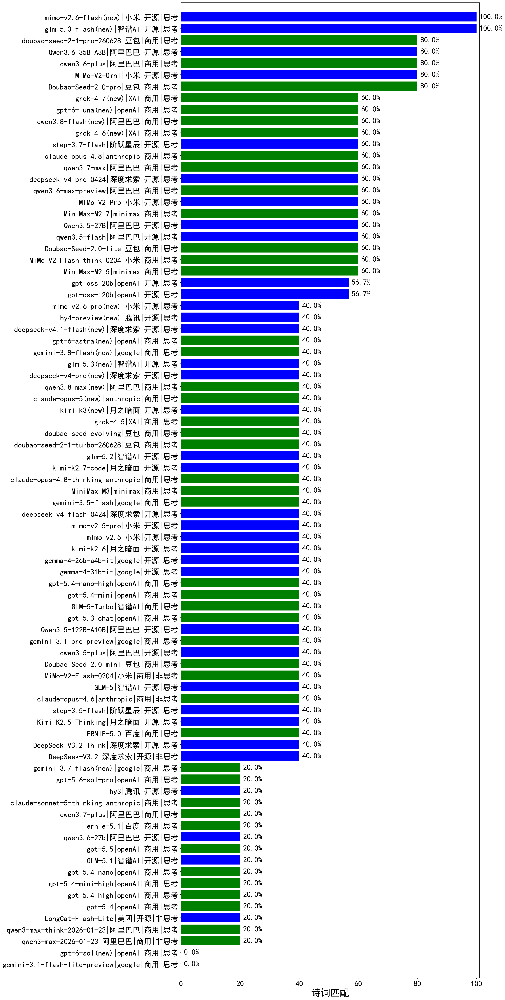

|类别|机构|大模型|【诗词匹配】准确率|平均耗时|平均消耗token|花费/千次（元）|排名（准确率）|
|---|---|-----|-------------------|-------|-----------|-----------|-----------|
|开源|小米|mimo-v2.6-flash(new)|100.0%|177s|1310|2.6|1|
|开源|智谱AI|glm-5.3-flash(new)|100.0%|330s|10543|29.4|2|
|开源|阿里巴巴|Qwen3.6-35B-A3B|80.0%|112s|2610|27.7|3|
|商用|阿里巴巴|qwen3.6-plus|80.0%|46s|3374|39.9|4|
|开源|小米|MiMo-V2-Omni|80.0%|163s|2320|29.1|5|
|商用|豆包|doubao-seed-2-1-pro-260628|80.0%|408s|18180|543.1|6|
|商用|豆包|Doubao-Seed-2.0-pro|80.0%|426s|1926|29.6|7|
|开源|阿里巴巴|Qwen3.5-27B|60.0%|417s|4898|23.3|8|
|商用|豆包|Doubao-Seed-2.0-lite|60.0%|487s|2155|7.5|9|
|商用|阿里巴巴|qwen3.6-max-preview|60.0%|79s|2344|123.9|10|
|商用|阿里巴巴|qwen3.7-max|60.0%|108s|6966|249.4|11|
|商用|anthropic|claude-opus-4.8|60.0%|8s|465|69.8|12|
|开源|小米|MiMo-V2-Pro|60.0%|174s|2406|46.4|13|
|商用|minimax|MiniMax-M2.7|60.0%|97s|3460|28.5|14|
|开源|阶跃星辰|step-3.7-flash|60.0%|24s|1586|12.4|15|
|开源|阿里巴巴|qwen3.5-flash|60.0%|260s|4712|9.3|16|
|开源|深度求索|deepseek-v4-pro-0424|60.0%|81s|2591|61.6|17|
|商用|小米|MiMo-V2-Flash-think-0204|60.0%|1272s|2493|5.1|18|
|商用|openAI|gpt-6-luna(new)|60.0%|133s|1067|3.6|19|
|商用|XAI|grok-4.6(new)|60.0%|163s|4058|163.2|20|
|商用|阿里巴巴|qwen3.8-flash(new)|60.0%|76s|4140|11.0|21|
|商用|minimax|MiniMax-M2.5|60.0%|28s|1370|10.9|22|
|开源|openAI|gpt-oss-120b|56.7%|142s|541|1.4|23|
|开源|openAI|gpt-oss-20b|56.7%|20s|972|1.0|24|
|商用|minimax|MiniMax-M3|40.0%|92s|2669|42.0|25|
|开源|小米|mimo-v2.6-pro(new)|40.0%|52s|1953|11.6|26|
|商用|google|gemini-3.5-flash|40.0%|23s|4266|265.8|27|
|开源|腾讯|hy4-preview(new)|40.0%|319s|17955|322.3|28|
|开源|深度求索|deepseek-v4.1-flash(new)|40.0%|36s|6757|53.6|29|
|商用|openAI|gpt-6-astra(new)|40.0%|23s|408|125.4|30|
|商用|google|gemini-3.8-flash(new)|40.0%|29s|2738|141.4|31|
|开源|深度求索|deepseek-v4-pro(new)|40.0%|231s|8649|231.2|32|
|商用|阿里巴巴|qwen3.8-max(new)|40.0%|96s|4178|148.1|33|
|商用|anthropic|claude-opus-4.8-thinking|40.0%|49s|3474|596.5|34|
|开源|月之暗面|kimi-k2.7-code|40.0%|101s|3798|101.5|35|
|开源|智谱AI|glm-5.2|40.0%|669s|31173|871.6|36|
|商用|豆包|doubao-seed-2-1-turbo-260628|40.0%|276s|10345|154.1|37|
|商用|豆包|doubao-seed-evolving|40.0%|399s|14253|425.3|38|
|商用|XAI|grok-4.5|40.0%|158s|3268|130.0|39|
|开源|月之暗面|kimi-k3(new)|40.0%|173s|4555|445.0|40|
|开源|深度求索|deepseek-v4-flash-0424|40.0%|27s|1273|2.5|41|
|商用|anthropic|claude-opus-5(new)|40.0%|18s|962|156.9|42|
|开源|智谱AI|glm-5.3(new)|40.0%|1421s|28700|802.4|43|
|开源|月之暗面|kimi-k2.6|40.0%|124s|2523|67.0|44|
|开源|小米|mimo-v2.5-pro|40.0%|75s|3920|78.1|45|
|商用|openAI|gpt-5.3-chat|40.0%|47s|437|37.5|46|
|商用|百度|ERNIE-5.0|40.0%|174s|3774|89.6|47|
|开源|月之暗面|Kimi-K2.5-Thinking|40.0%|344s|5128|106.8|48|
|开源|阶跃星辰|step-3.5-flash|40.0%|150s|11251|23.5|49|
|商用|anthropic|claude-opus-4.6|40.0%|30s|681|107.4|50|
|开源|智谱AI|GLM-5|40.0%|411s|3952|70.4|51|
|商用|小米|MiMo-V2-Flash-0204|40.0%|388s|395|0.7|52|
|商用|豆包|Doubao-Seed-2.0-mini|40.0%|594s|2958|5.7|53|
|开源|阿里巴巴|qwen3.5-plus|40.0%|60s|4504|21.4|54|
|商用|google|gemini-3.1-pro-preview|40.0%|213s|14212|1206.9|55|
|开源|阿里巴巴|Qwen3.5-122B-A10B|40.0%|501s|6222|39.5|56|
|开源|小米|mimo-v2.5|40.0%|19s|1216|13.7|57|
|开源|深度求索|DeepSeek-V3.2|40.0%|64s|455|1.3|58|
|开源|深度求索|DeepSeek-V3.2-Think|40.0%|217s|2399|7.1|59|
|开源|google|gemma-4-31b-it|40.0%|46s|437|1.1|60|
|商用|智谱AI|GLM-5-Turbo|40.0%|42s|2558|55.4|61|
|商用|openAI|gpt-5.4-mini|40.0%|4s|182|4.1|62|
|商用|openAI|gpt-5.4-nano-high|40.0%|10s|351|2.6|63|
|开源|google|gemma-4-26b-a4b-it|40.0%|55s|491|1.2|64|
|开源|美团|LongCat-Flash-Lite|20.0%|456s|511|0.0|65|
|商用|openAI|gpt-5.5|20.0%|10s|538|102.1|66|
|商用|阿里巴巴|qwen3-max-2026-01-23|20.0%|111s|531|4.9|67|
|商用|阿里巴巴|qwen3-max-think-2026-01-23|20.0%|365s|5199|51.6|68|
|开源|阿里巴巴|qwen3.6-27b|20.0%|72s|3914|69.6|69|
|商用|百度|ernie-5.1|20.0%|38s|1557|27.3|70|
|开源|智谱AI|GLM-5.1|20.0%|498s|8194|195.7|71|
|商用|openAI|gpt-5.4|20.0%|19s|238|19.6|72|
|商用|google|gemini-3.7-flash(new)|20.0%|7s|1128|28.4|73|
|商用|openAI|gpt-5.4-high|20.0%|33s|1257|126.8|74|
|商用|阿里巴巴|qwen3.7-plus|20.0%|84s|4381|34.7|75|
|商用|openAI|gpt-5.4-nano|20.0%|28s|183|1.1|76|
|商用|openAI|gpt-5.4-mini-high|20.0%|26s|1595|48.6|77|
|商用|openAI|gpt-5.6-sol-pro|20.0%|19s|3544|296.5|78|
|商用|anthropic|claude-sonnet-5-thinking|20.0%|27s|994|64.9|79|
|开源|腾讯|hy3|20.0%|57s|237|0.8|80|
|商用|google|gemini-3.1-flash-lite-preview|0.0%|36s|360|3.3|81|
|商用|openAI|gpt-6-sol(new)|0.0%|95s|343|20.6|82|

